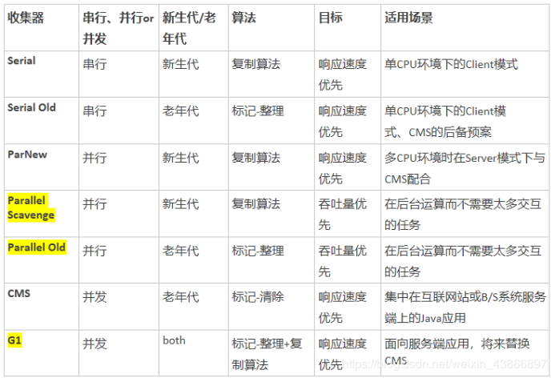
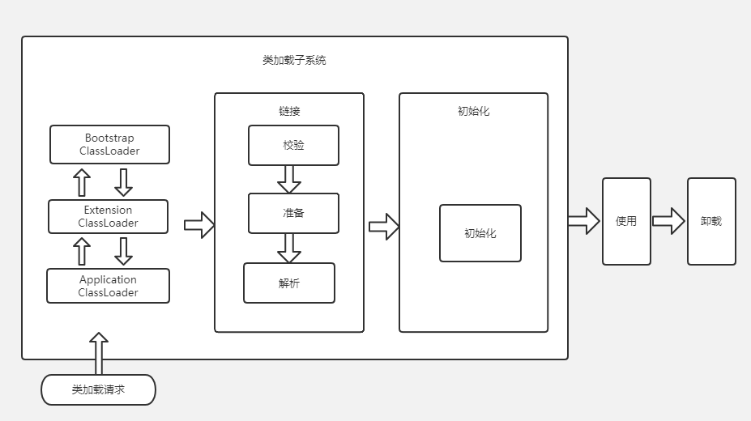

# Java基础

## 面向对象和面向过程的区别

- **面向过程** ：**面向过程性能比面向对象高。** 因为类调用时需要实例化，开销比较大，比较消耗资源，所以当性能是最重要的考量因素的时候，比如单片机、嵌入式开发、Linux/Unix 等一般采用面向过程开发。但是，**面向过程没有面向对象易维护、易复用、易扩展。**
- **面向对象** ：**面向对象易维护、易复用、易扩展。** 因为面向对象有封装、继承、多态性的特性，所以可以设计出低耦合的系统，使系统更加灵活、更加易于维护。但是，**面向对象性能比面向过程低**。

## JVM、 JDK 和 JRE 

JRE 是 Java 运行时环境。它是运行已编译 Java 程序所需的所有内容的集合，**包括 Java 虚拟机**（JVM），Java 类库，java 命令和其他的一些基础构件。但是，它**不能用于创建新程序**。

JDK 是 Java Development Kit，它是功能齐全的 Java SDK。它拥有 JRE 所拥有的一切。**能够创建和编译程序**。

## 重载和重写的区别

> 重载就是同样的一个方法能够根据输入数据的不同，做出不同的处理
>
> 重写就是当子类继承自父类的相同方法，输入数据一样，但要做出有别于父类的响应时，你就要覆盖父类方法

**重载**

发生在同一个类中，方法名必须相同，参数类型不同、个数不同、顺序不同，方法返回值和访问修饰符可以不同。

**重写**

重写发生在运行期，是子类对父类的允许访问的方法的实现过程进行重新编写。

1. 返回值类型、方法名、参数列表必须相同，抛出的异常范围小于等于父类，访问修饰符范围大于等于父类。
2. 如果父类方法访问修饰符为 private/final/static 则子类就不能重写该方法，但是被 static 修饰的方法能够被再次声明。
3. 构造方法无法被重写

## 修饰符

|                        | public（all） | protected（包、子类） | default（包） | private（自己） |
| :--------------------: | :-----------: | :-------------------: | :-----------: | :-------------: |
|   同一个类（我自己）   |       √       |           √           |       √       |        √        |
|   同一个包（我邻居）   |       √       |           √           |       √       |        ×        |
|  不同包子类（私生子）  |       √       |           √           |       ×       |        ×        |
| 不同包非子类（陌生人） |       √       |           ×           |       ×       |        ×        |

## **一个Java文件只能有一个public类**

一个Java文件可以包含多个类，但只能有一个public类，且该public类名称必须与java文件名相同。public类不是必须的，java文件中可以没有public类。

## Java 面向对象编程三大特性: 封装 继承 多态

### 封装

是指隐藏对象的属性和实现细节（用private修饰），仅对外提供公共访问方式。类中提供了方法（用public修饰），常用的是get、set方法，可以操作这些被隐藏的属性，其他类可以通过调用这些方法，改变隐藏属性的值！

### 继承

在定义和实现一个类的时候，可以在一个已经存在的类的基础之上来进行，使用extends关键字实现继承；

### 多态

多态就是在声明时使用父类，在实现或调用时使用具体的子类；即不修改程序代码就可以改变程序运行时所绑定的具体代码，让程序可以选择多个运行状态。

## String、StringBuffer 和 StringBuilder 的区别是什么?

**可变性**

String 类中使用 final 关键字修饰字符数组来保存字符串，`private final char value[]`，所以 String 对象是不可变的。

在 Java 9 之后，String 类的实现改用 byte 数组存储字符串 `private final byte[] value`;

而 StringBuilder 与 StringBuffer 都继承自 AbstractStringBuilder 类，在 AbstractStringBuilder 中也是使用字符数组保存字符串`char[]value` 但是没有用 final 关键字修饰，所以这两种对象都是可变的。

**线程安全性**

String 中的对象是不可变的，也就可以理解为常量，线程安全。

StringBuffer 对方法加了同步锁或者对调用的方法加了同步锁，所以是线程安全的。

StringBuilder 并没有对方法进行加同步锁，所以是非线程安全的。

**性能**

StringBuffer >StringBuilder >String 

## 自动装箱与自动拆箱

装箱就是自动将基本数据类型转换为包装器类型；拆箱就是自动将包装器类型转换为基本数据类型。

```java
Integer i = 10; //装箱
int n = i; //拆箱 
```

在装箱的时候自动调用的是Integer的valueOf(int)方法。而在拆箱的时候自动调用的是Integer的intValue()方法

**面试点(valueOf)**

```java
public class Main {
   public static void main(String[] args) {
    
    Integer i1 = 100;
    Integer i2 = 100;
    Integer i3 = 200;
    Integer i4 = 200;
    
    System.out.println(i1==i2);
    System.out.println(i3==i4);
  }
}
//打印：
//true
//false
```

在通过valueOf方法创建Integer对象的时候，如果数值在[-128,127]之间，便返回指向IntegerCache.cache中已经存在的对象的引用；否则创建一个新的Integer对象。

上面的代码中i1和i2的数值为100，因此会直接从cache中取已经存在的对象，所以i1和i2指向的是同一个对象，而i3和i4则是分别指向不同的对象。

```java
public class Main {
   public static void main(String[] args) {
    
    Double  i1 = 100.0;
    Double  i2 = 100.0;
    Double  i3 = 200.0;
    Double  i4 = 200.0;
    
    System.out.println(i1==i2);
    System.out.println(i3==i4);
  }
}
//打印：
//false
//false
```

浮点数的valueOf()不支持上述实现，直接创建一个新的Double对象，因为在某个范围内的整型数值的个数是有限的，而浮点数却不是。

==Integer、Short、Byte、Character、Long这几个类的valueOf方法的实现是类似的。Double、Float 浮点数则不同==

```java
public class Main {
   public static void main(String[] args) {
    
    Boolean   i1 = false;
    Boolean   i2 = false;
    Boolean   i3 = true;
    Boolean   i4 = true;
    
    System.out.println(i1==i2);
    System.out.println(i3==i4);
  }
}
//打印：
//true
//true
public static final Boolean TRUE = new Boolean(true);
public static final Boolean FALSE = new Boolean(false);

public static Boolean valueOf(boolean b) {
        return (b ? TRUE : FALSE); 
}
```

Boolean的valueOf()返回类变量TRUE 或 FALSE，i1 i2指向的地址都一样

## 成员变量与局部变量区别

**声明位置**

**修饰符**

局部变量：只能由final修饰

成员变量：public,private,protected,static,final

**存储位置**

- 局部变量：栈
- 实例变量：堆
- 类变量：方法区

**生命周期**

- 局部变量：每一个线程，每一次调用执行都是新的生命周期
- 实例变量：随着对象的创建而初始化，随着对象的被回收而消亡，每一个对象的实例变量是独立的
- 类变量：随着类的初始化而初始化，随着类的卸载二消亡，该类的所有对象的类变量是共享的

**初始化值**

## 关键名词

### 重写

**继承与重写**

父类中私有方法不能被重写（方法用private修饰，隐式的默认为final 不能被重写）

子类重写父类方法时，访问权限不能更低。

**多态与重写**

## 关键字

### Static

static修饰的变量、方法、代码块都在方法区，随类加载时只加载一次。

静态static方法中不能调用非静态non-static方法，准确地说是不能直接调用non-static方法。但是可以通过将一个对象的引用传入static方法中，再去调用该对象的non-static方法。因为在类加载时，被static修饰方法会被首先载入，此时non-static方法还未载入，直接调用时报错。

可以在没有创建任何对象的前提下，仅仅通过类本身来调用static方法

### final

1. final类，表明这个类不能被继承。final类中的所有成员方法隐式的指定为final方法，成员变量不受影响
2. final方法，表明这个方法不能被重写（类中private方法会隐式的指定为final方法，不能被重写）
3. final变量，若是基本数据类型，一旦初始化不能更改；若是引用变量，初始化后不可指向其他对象，但对象内容可变。
4. final变量，局部变量声明即赋值，成员变量可在声明和构造方法中赋值。

### this与super

|                                            | this                                       | super                                       |
| ------------------------------------------ | ------------------------------------------ | ------------------------------------------- |
| 直接使用                                   | 指向当前对象本身，可用this.xxx引用本类成员 | 指向当前对象父类，可用super.xxx引用父类成员 |
| 在构造方法内使用（需放在构造方法内第一行） | this（参数）调用本类具有相同形参的构造方法 | super（参数）调用父类具有相同形参的构造方法 |


## 接口与抽象类

**抽象类**

1. abstract修饰类为抽象类，无法实例化
2. abstract修饰方法为抽象方法，方法不能有方法体
3. 有抽象方法的类一定是抽象类，但抽象类不一定有抽象方法
4. 若要实例化抽象类子类，该子类必须为父类中所有抽象方法提供定义，否则子类也是抽象类

**接口**

1. 接口中所有属性默认 public static final ，必须赋初值
2. 接口中所有方法默认为 public abstract

**区别**

|                | 接口                   | 抽象类                             |
| -------------- | ---------------------- | ---------------------------------- |
| **可定义方法** | 只能定义抽象方法       | 既能定义抽象方法，也能定义具体方法 |
| **实现/继承**  | 接口可以实现多个       | 类只能继承1个                      |
| **强调**       | 强调行为（方法）的组合 | 强调类的继承关系                   |

## ==与equals

==：对于基本类型比较值，对于引用数据类型比较内存地址

equals()：

1. 当类没有重写equals()方法，等价于“==”
2. 当类重写了equals()方法，一般是比较内容上的相等，如String类

## hashCode 与 equals 

散列表判断时，先hashCode()后equals()，因为前者效率更高。

equals()相等的两对象，hashCode()一定相等

hashCode()相等的两对象，equals()不一定相等


**重写equals()时，必须重写hashCode()**

equals()默认比较内存地址，hashCode()默认计算内存地址（存疑，见具体实现）

equals()重写后仅要求内容上的相等，内存地址可以不同

若不重写hashCode()，造成equals()为true，hashCode()为false的情况

## Java中只有值传递

有些看起来很像传递引用，但实则是传递值

```java
... ...  
class person {  
public static String name = "Jack";  
... ...  
}  
... ...  
//定义一个改变对象属性的方法  
public static void changeName(Person p) {  
p.name = "Rose";  
}  
... ...  
public static void main(String[] args) {  
Person person = new Person();  
System.out.println(person.name);  
changeName(person);  
System.out.println(person.name);  
}  

第一次显示：“Jack”
第二次显示：“Rose”
```

看似传递person引用 在changeName()方法中通过引用p(person)改变对象

实则是在栈上开辟了一块内存空间p，将person引用中的值（指向person对象在堆上的地址），复制给p，

此时p和person共同指向person对象在堆上的地址，所以p可以对person对象进行更改

but p和person是两个东西  依然是传递值

## 深拷贝与浅拷贝

深拷贝和浅拷贝最根本的区别在于是否真正获取一个对象的复制实体，而不是引用。

假设B复制了A，修改A的时候，看B是否发生变化：

如果B跟着**也变了**，说明是浅拷贝，拿人手短！只是增加了一个指针指向已存在的内存地址，AB引用指向堆中同一位置

如果B**没有改变**，说明是深拷贝，自食其力！增加指针的同时，在堆上开辟了新的空间，AB引用指向不同位置

## 动态绑定与静态绑定

在java中，绑定分为静态绑定和动态绑定。也叫作前期绑定和后期绑定。

动态绑定：在执行期间（非编译期）判断所引用对象的实际类型，根据其实际的类型调用其相应的方法。

静态绑定：在程序执行以前（编译期）已经被绑定（即在编译过程中就已经知道这个方法到底是哪个类中的方法）


java当中的方法只有final、static、private修饰的的方法和构造方法是静态绑定的。

private修饰的方法：private修饰的方法是不能被继承的，因此子类无法访问父类中private修饰的方法。

final修饰的方法：可以被子类继承，但是不能被子类重写（覆盖），所以在子类中调用的实际是父类中定义的final方法。

static修饰的方法：可以被子类继承，但是不能被子类重写（覆盖），但是可以被子类隐藏。（若子类中定义了相同的方法，则会调用子类中定义的方法，but **当子类对象向上类型转换为父类对象时，不论子类中有没有定义这个静态方法，该对象都会使用父类中的静态方法**）

举个栗子，当子类和父类存在同一个方法时，子类重写父类方法时，程序在运行时调用的方法时，是调用父类（的方法呢？还是调用子类的方法呢？动态绑定的调用子类，静态绑定的调用父类。

```java
public class Parent {
    String name;
    public static void shout(){
        System.out.println("我是父类shout静态方法");
    }

    public void say(){
        System.out.println("我是父类say方法");
    }
}
public class Son extends Parent {
    String name;
    @Override
    public static void shout(){
        System.out.println("我是子类shout静态方法");
	}	
    public void say() {
        System.out.println("我是子类say方法");
    }
}
public class MainTest {
    public static void main(String[] args) {
        Parent parent = new Parent();
        Parent son = new Son();
        parent.say();
        son.say();
        parent.shout();
        son.shout();
    }
}
//我是父类say方法
//我是子类say方法
//我是父类shout静态方法
//我是父类shout静态方法
```


java当中的方法只有final、static、private修饰的的方法和构造方法是静态绑定的。


# JVM

## 内存区域

1. Java文件经过编译后变成 .class 字节码文件
2. 字节码文件通过类加载器被搬运到 JVM 虚拟机的方法区中

**线程私有的：**

- 程序计数器
- 虚拟机栈
- 本地方法栈

**线程共享的：**

- 堆
- 方法区

### 程序计数器

程序计数器是一块较小的内存空间，可以看作是当前线程所执行的字节码的行号指示器。**字节码解释器工作时通过改变这个计数器的值来选取下一条需要执行的字节码指令，分支、循环、跳转、异常处理、线程恢复等功能都需要依赖这个计数器来完成。**

另外，**为了线程切换后能恢复到正确的执行位置，每条线程都需要有一个独立的程序计数器，各线程之间计数器互不影响，独立存储，我们称这类内存区域为“线程私有”的内存。**

**从上面的介绍中我们知道程序计数器主要有两个作用：**

1. 字节码解释器通过改变程序计数器来依次读取指令，从而实现代码的流程控制，如：顺序执行、选择、循环、异常处理。
2. 在多线程的情况下，程序计数器用于记录当前线程执行的位置，从而当线程被切换回来的时候能够知道该线程上次运行到哪儿了。

**注意：程序计数器是唯一一个不会出现 OutOfMemoryError 的内存区域，它的生命周期随着线程的创建而创建，随着线程的结束而死亡。**

### Java 虚拟机栈

**与程序计数器一样，Java 虚拟机栈也是线程私有的，它的生命周期和线程相同，描述的是 Java 方法执行的内存模型，每次方法调用的数据都是通过栈传递的。**

**局部变量表主要存放了编译器可知的8种数据类型**（boolean、byte、char、short、int、float、long、double）、**对象引用**（reference 类型，它不同于对象本身，可能是一个指向对象起始地址的引用指针，也可能是指向一个代表对象的句柄或其他与此对象相关的位置）。

**Java 虚拟机栈会出现两种错误：StackOverFlowError 和 OutOfMemoryError。**

- **StackOverFlowError：** 若 Java 虚拟机栈的内存大小不允许动态扩展，那么当线程请求栈的深度超过当前 Java 虚拟机栈的最大深度的时候，就抛出 StackOverFlowError 错误。
- **OutOfMemoryError：** 若 Java 虚拟机栈的内存大小允许动态扩展，且当线程请求栈时内存用完了，无法再动态扩展了，此时抛出 OutOfMemoryError 错误。

### 本地方法栈

和虚拟机栈所发挥的作用非常相似，区别是： **虚拟机栈为虚拟机执行 Java 方法 （也就是字节码）服务，而本地方法栈则为虚拟机使用到的 Native 方法服务。** 在 HotSpot 虚拟机中和 Java 虚拟机栈合二为一。

### 堆

Java 虚拟机所管理的内存中最大的一块，Java 堆是所有线程共享的一块内存区域，在虚拟机启动时创建。**此内存区域的唯一目的就是存放对象实例，几乎所有的对象实例以及数组都在这里分配内存。**

### 方法区

用于存储已被虚拟机加载的类信息、常量（final）、静态变量（static）、即时编译器编译后的代码等数据。

**永久代和元空间都是方法区的具体实现**

#### 为什么要将永久代 (PermGen) 替换为元空间 (MetaSpace) 呢?

整个永久代有一个 JVM 本身设置固定大小上限，无法进行调整，而元空间使用的是直接内存，受本机可用内存的限制，虽然元空间仍旧可能溢出，但是比原来出现的几率会更小。

## 垃圾回收

### 对象存活判断

**引用计数**：每个对象有一个引用计数属性，新增一个引用时计数加1，引用释放时计数减1，计数为0时可以回收。此方法简单，**无法解决对象相互循环引用**的问题。

**可达性分析**（Reachability Analysis）：从GC Roots开始向下搜索，搜索所走过的路径称为引用链。当一个对象到GC Roots没有任何引用链相连时，则证明此对象是不可用的。不可达对象。

java中可作为GC Root的对象有：

1. 虚拟机栈中引用的对象（方法中的局部对象）
2. 方法区中静态属性引用的对象（static对象）
3. 方法区中常量引用的对象（final对象）
4. 本地方法栈中引用的对象（Native对象）

### 辣鸡收集算法

  **标记-清除**（Mark-Sweep）算法，如它的名字一样，算法分为“标记”和“清除”两个阶段：首先标记出所有需要回收的对象，在标记完成后统一回收掉所有被标记的对象。之所以说它是最基础的收集算法，是因为后续的收集算法都是基于这种思路并对其缺点进行改进而得到的。

它的主要缺点有两个：一个是效率问题，标记和清除过程的效率都不高；另外一个是空间问题，标记清除之后会产生大量不连续的内存碎片，**空间碎片太多**可能会导致，当程序在以后的运行过程中需要分配较大对象时无法找到足够的连续内存而不得不提前触发另一次垃圾收集动作。


 

**复制**（Copying）算法，它将可用内存按容量划分为两块，每次只使用其中的一块。当这一块的内存用完了，就将还存活着的对象复制到另外一块上面，然后再把已使用过的内存空间一次清理掉。

这样使得每次都是对其中的一块进行内存回收，内存分配时也就不用考虑内存碎片等复杂情况，只要移动堆顶指针，按顺序分配内存即可，实现简单，运行高效。只是这种算法的代价持续复制长生存期的对象则导致效率降低。

实践中会将新生代内存分为一块较大的Eden空间和两块较小的Survivor空间 ，每次使用Eden和其中一块Survivor。当回收时，将Eden和Survivor中还存活着的对象一次地复制到另外一块Survivor空间上，最后清理掉Eden和刚才用过的Survivor空间。**HotSpot虚拟机默认Eden和Survivor的大小比例是 8:1:1**，也就是每次新生代中可用内存空间为整个新生代容量的90% ( 80%+10% )，只有10% 的内存会被“浪费”。

​								 

根据老年代的特点，有人提出了另外一种“**标记-整理**”（Mark-Compact）算法，标记过程仍然与“标记-清除”算法一样，但后续步骤不是直接对可回收对象进行清理，而是让所有存活的对象都向一端移动，然后直接清理掉端边界以外的内存


“**分代收集**”（Generational Collection）算法，把Java堆分为新生代和老年代，这样就可以根据各个年代的特点采用最适当的收集算法。在新生代中，每次垃圾收集时都发现有大批对象死去，只有少量存活，那就选用复制算法，只需要付出少量存活对象的复制成本就可以完成收集。而老年代中因为对象存活率高、没有额外空间对它进行分配担保，就必须使用“标记-清理”或“标记-整理”算法来进行回收。

### 辣鸡收集器



新生代算法均为复制算法，老年代算法除了CMS均为标记整理算法。

到jdk8为止，默认的垃圾收集器是Parallel Scavenge 和 Parallel Old 

从jdk9开始，G1收集器成为默认的垃圾收集器

#### **CMS工作原理**

CMS收集器（Concurrent Mark Sweep）是基于“**标记-清除**”算法实现的

整个过程分为4个步骤，包括：

**初始标记（CMS initial mark）**

会Stop The World停止工作线程,标记GC Roots(局部变量和类的静态变量)引用的对象。初始标记仅仅只是标记一下GC Roots能直接关联到的对象，速度很快，

**并发标记（CMS concurrent mark）**

并发进行，系统一边工作，一边进行垃圾回收，对系统的所有对象进行GC Root追踪，看有没有最终被GC Root的对象引用，这个过程很耗时。但是不影响系统的工作，系统工作期间会继续有对象进入老年代，这些对象有可能变成垃圾或被引用，在下一个阶段进行处理。

**重新标记（CMS remark）**

会Stop The World，为了修正并发标记期间，因用户程序继续运作而导致标记产生变动的那一部分对象的标记记录。速度很快。

**并发清除（CMS concurrent sweep）**

这个阶段很耗时，和系统并发运行，不影响系统工作。清理掉被标记的垃圾对象，并进行对象移动整理，减少内存碎片。

## 类加载

### 类加载过程



#### 加载

1. 通过类的.class文件获取二进制字节流
2. 将其转化为**方法区**的运行时数据结构
3. 内存中生成**class类对象**（非实例对象）

相对于类加载的其他阶段而言，加载阶段（准确地说，是加载阶段获取类的二进制字节流的动作）是可控性最强的阶段，开发人员既可以使用系统提供的类加载器来完成加载，也可以自定义自己的类加载器来完成加载。

通过使用不同的类加载器，可以从不同来源加载类的二进制数据，二进制数据通常有如下几种来源：

（1）从本地系统中直接加载

（2）通过网络下载.class文件

（3）从zip，jar等归档文件中加载.class文件

（4）从专用数据库中提取.class文件

（5）将java源文件动态编译为.class文件

#### 验证

确保class文件中字节流信息符合虚拟机要求。

#### 准备

当完成字节码文件的校验之后，JVM 便会开始为**类变量（static变量）**分配内存（方法区）并初始化。**这里不会为实例变量分配初始化**，类变量会分配在方法区中，而实例变量是会随着对象一起分配到Java堆中。

**初始化时，类变量初始值是数据类型的零值**

**若类变量同时被final修饰，初始化时，则赋予用户想要的值。**

#### 解析

解析阶段主要是虚拟机将常量池中的符号引用转化为直接引用的过程。

#### 初始化

到了初始化阶段，才开始执行Java程序代码（字节码）

**为类变量赋予正确的初始值**


### 类加载器

对任意类，需要类本身和加载它的类加载器一同确立在Java虚拟机中的唯一性

**当两个类源于同一Class文件，若类加载器相同，两类相等。类加载器不相同，两类不相等**


JVM 中内置了三个重要的 ClassLoader，除了 BootstrapClassLoader 其他类加载器均由 Java 实现且全部继承自`java.lang.ClassLoader`：

1. **BootstrapClassLoader(启动类加载器)** ：最顶层的加载类，由C++实现，负责加载 `%JAVA_HOME%/lib`目录下的jar包和类或者或被 `-Xbootclasspath`参数指定的路径中的所有类。
2. **ExtensionClassLoader(扩展类加载器)** ：主要负责加载目录 `%JRE_HOME%/lib/ext` 目录下的jar包和类，或被 `java.ext.dirs` 系统变量所指定的路径下的jar包。
3. **AppClassLoader(应用程序类加载器)** :面向我们用户的加载器，负责加载当前应用classpath下的所有jar包和类。开发者可以直接使用这个类加载器，若没有定义过自己的类加载器，这就是默认的底层类加载器。

除此以外，还可以定义自己的类加载器

### 双亲委派模型

每一个类都有一个对应它的类加载器。系统中的 ClassLoder 在协同工作的时候会默认使用 **双亲委派模型** 。即在类加载的时候，系统会首先判断当前类是否被加载过。已经被加载的类会直接返回，否则才会尝试加载。加载的时候，它是不会先自己去尝试加载的，而是委派给父类去完成，当父类加载器为null时，会使用启动类加载器 `BootstrapClassLoader` 作为父类加载器，因此所有的请求最终都应该传送到顶层的启动类加载器 `BootstrapClassLoader` 中。

在`BootstrapClassLoader`中的加载过程：

1. 在`BootstrapClassLoader`指定路径下查找并加载该类

2. 若`BootstrapClassLoader`不能找到该类，则让子类加载

3. 若最底层加载器也无法找到该类，则抛出ClassNotFundException异常

   

**优点**：**避免重复加载 + 避免核心类篡改**