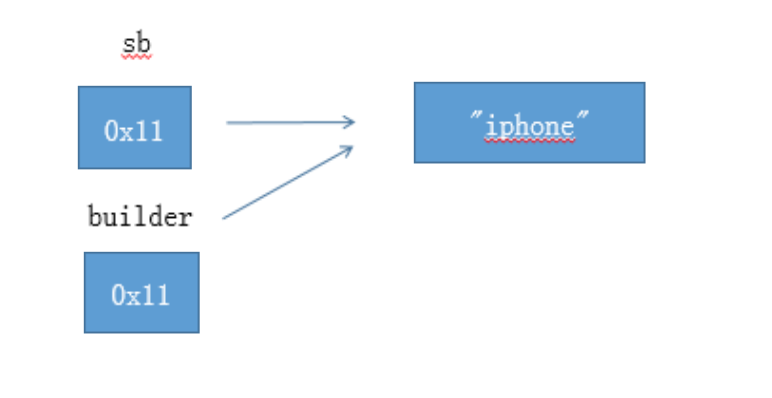
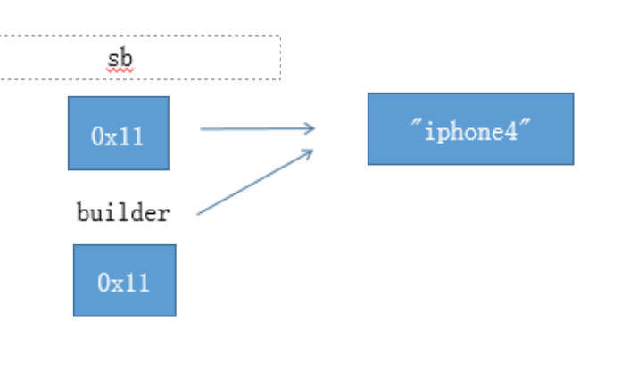
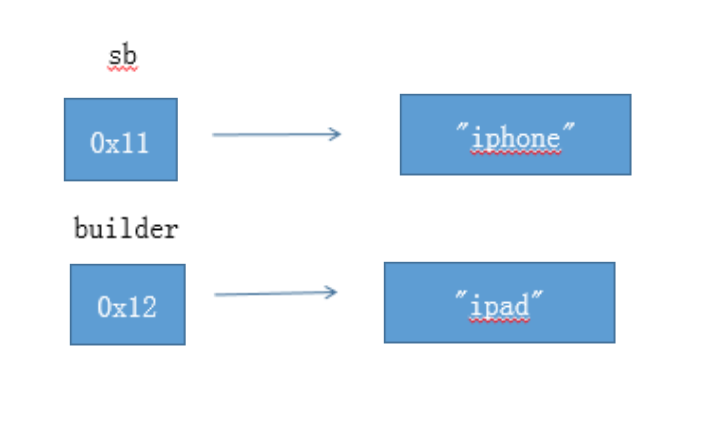
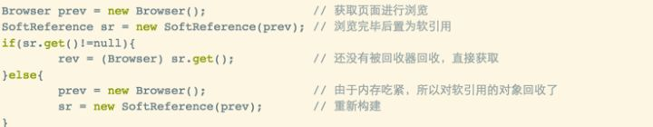
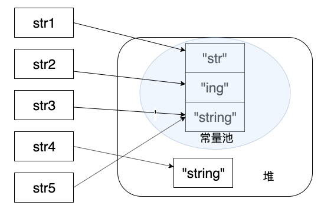
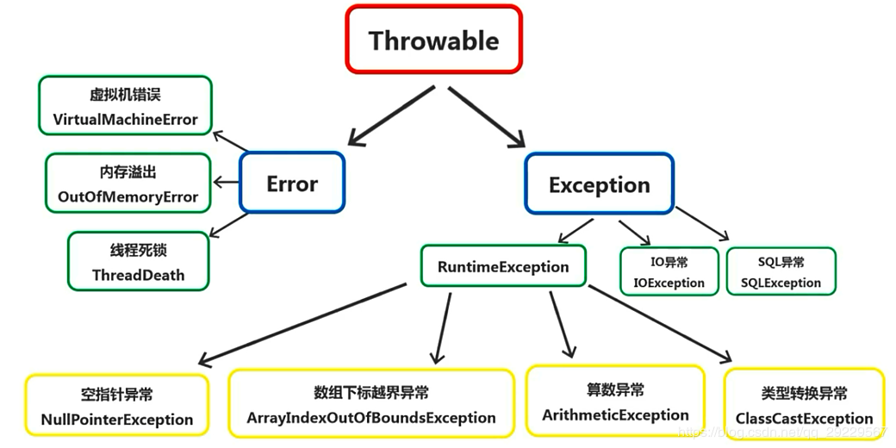
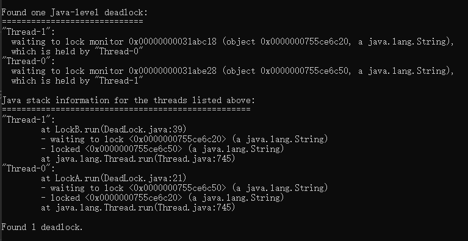
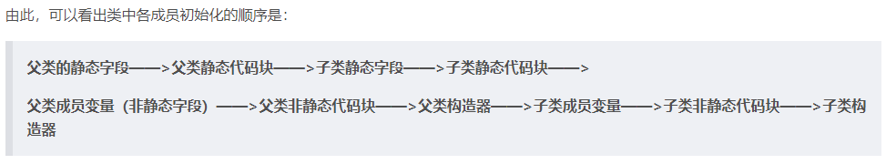
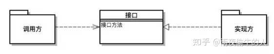

# Java基础

## 面向对象和面向过程的区别

- **面向过程** ：**面向过程性能比面向对象高。** 因为类调用时需要实例化，开销比较大，比较消耗资源，所以当性能是最重要的考量因素的时候，比如单片机、嵌入式开发、Linux/Unix 等一般采用面向过程开发。但是，**面向过程没有面向对象易维护、易复用、易扩展。**
- **面向对象** ：**面向对象易维护、易复用、易扩展。** 因为面向对象有封装、继承、多态性的特性，所以可以设计出低耦合的系统，使系统更加灵活、更加易于维护。但是，**面向对象性能比面向过程低**。

## JVM、 JDK 和 JRE 

JRE(Java Runtime Environment) 是 Java 运行时环境。它是运行已编译 Java 程序所需的所有内容的集合，**包括 Java 虚拟机**（JVM），Java 类库，java 命令和其他的一些基础构件。但是，它**不能用于创建新程序**。

JDK(Java Development Kit)，它是功能齐全的 Java SDK。它拥有 JRE 所拥有的一切。**能够创建和编译程序**。

## 基本类型及其取值范围

**bit (位)**    **Byte(字节)**

8 bit = 1 Byte 

英文字符 = 1 Byte 

中文字符 = 2 Byte

| 类型    | 字节数 | 范围                                                         |
| ------- | ------ | ------------------------------------------------------------ |
| byte    | 1      | -128~127 （-2的7次方到2的7次方-1）                           |
| short   | 2      | -32768~32767（-2的15次方到2的15次方-1）                      |
| int     | 4      | -2147483648~2147483647（-2的31次方到2的31次方-1）            |
| float   | 4      |                                                              |
| double  | 8      | 最高位即63位为符号位，62-52位为指数位，51-0位为尾数，或者称有效数字位。 |
| long    | 8      | （-2的63次方到2的63次方-1）                                  |
| char    | 2      |                                                              |
| boolean | 不定   | true 、 false                                                |

## 重载和重写的区别

> 重载就是同样的一个方法能够根据输入数据的不同，做出不同的处理
>
> 重写就是当子类继承自父类的相同方法，输入数据一样，但要做出有别于父类的响应时，你就要覆盖父类方法

**重载**

发生在同一个类中，方法名必须相同，参数类型不同、个数不同、顺序不同，方法返回值和访问修饰符可以不同。

**重写**

重写发生在运行期，是子类对父类的允许访问的方法的实现过程进行重新编写。

1. 返回值类型、方法名、参数列表必须相同，抛出的异常范围小于等于父类，访问修饰符范围大于等于父类。
2. 如果父类方法访问修饰符为 private/final/static 则子类就不能重写该方法，但是被 static 修饰的方法能够被再次声明。
3. 构造方法无法被重写

## 修饰符

|                        | public（all） | protected（包、子类） | default（包） | private（自己） |
| :--------------------: | :-----------: | :-------------------: | :-----------: | :-------------: |
|   同一个类（我自己）   |       √       |           √           |       √       |        √        |
|   同一个包（我邻居）   |       √       |           √           |       √       |        ×        |
|  不同包子类（私生子）  |       √       |           √           |       ×       |        ×        |
| 不同包非子类（陌生人） |       √       |           ×           |       ×       |        ×        |

**default**

Java8新特性，default可以修饰接口中方法，使接口中方法也可以拥有方法体。

这样实现类若重写了该方法就使用重写后的方法，若未重写则使用接口默认的方法体。

## 一个Java文件只能有一个public类

一个Java文件可以包含多个类，但只能有一个public类，且该public类名称必须与java文件名相同。public类不是必须的，java文件中可以没有public类。

## Java 面向对象编程三大特性: 封装 继承 多态

### 封装

是指隐藏对象的属性和实现细节（用private修饰），仅对外提供公共访问方式。类中提供了方法（用public修饰），常用的是get、set方法，可以操作这些被隐藏的属性，其他类可以通过调用这些方法，改变隐藏属性的值！

### 继承

在定义和实现一个类的时候，可以在一个已经存在的类的基础之上来进行，使用extends关键字实现继承；

### 多态

多态就是在声明时使用父类，在实现或调用时使用具体的子类；即不修改程序代码就可以改变程序运行时所绑定的具体代码，让程序可以选择多个运行状态。

## String、StringBuffer 和 StringBuilder 的区别是什么?

**可变性**

String 类中使用 final 关键字修饰字符数组来保存字符串，`private final char value[]`，所以 String 对象是不可变的。

在 Java 9 之后，String 类的实现改用 byte 数组存储字符串 `private final byte[] value`;

而 StringBuilder 与 StringBuffer 都继承自 AbstractStringBuilder 类，在 AbstractStringBuilder 中也是使用字符数组保存字符串`char[]value` 但是没有用 final 关键字修饰，所以这两种对象都是可变的。

**线程安全性**

String 中的对象是不可变的，也就可以理解为常量，线程安全。

StringBuffer 对方法加了同步锁或者对调用的方法加了同步锁，所以是线程安全的。

StringBuilder 并没有对方法进行加同步锁，所以是非线程安全的。

**性能**

StringBuilder >StringBuffer >String 

## 自动装箱与自动拆箱

装箱就是自动将基本数据类型转换为包装器类型；拆箱就是自动将包装器类型转换为基本数据类型。

```java
Integer i = 10; //装箱
int n = i; //拆箱 
```

在装箱的时候自动调用的是Integer的valueOf(int)方法。而在拆箱的时候自动调用的是Integer的intValue()方法

**面试点(valueOf)**

```java
public class Main {
   public static void main(String[] args) {
    
    Integer i1 = 100;
    Integer i2 = 100;
    Integer i3 = 200;
    Integer i4 = 200;
    
    System.out.println(i1==i2);
    System.out.println(i3==i4);
  }
}
//打印：
//true
//false
```

在通过valueOf方法创建Integer对象的时候，如果数值在[-128,127]之间，便返回指向IntegerCache.cache中已经存在的对象的引用；否则创建一个新的Integer对象。（见**常量池**一章）

上面的代码中i1和i2的数值为100，因此会直接从cache中取已经存在的对象，所以i1和i2指向的是同一个对象，而i3和i4则是分别指向不同的对象。

```java
public class Main {
   public static void main(String[] args) {
    
    Double  i1 = 100.0;
    Double  i2 = 100.0;
    Double  i3 = 200.0;
    Double  i4 = 200.0;
    
    System.out.println(i1==i2);
    System.out.println(i3==i4);
  }
}
//打印：
//false
//false
```

浮点数的valueOf()不支持上述实现，直接创建一个新的Double对象，因为在某个范围内的整型数值的个数是有限的，而浮点数却不是。

==Integer、Short、Byte、Character、Long这几个类的valueOf方法的实现是类似的。Double、Float 浮点数则不同==

```java
public class Main {
   public static void main(String[] args) {
    
    Boolean   i1 = false;
    Boolean   i2 = false;
    Boolean   i3 = true;
    Boolean   i4 = true;
    
    System.out.println(i1==i2);
    System.out.println(i3==i4);
  }
}
//打印：
//true
//true
public static final Boolean TRUE = new Boolean(true);
public static final Boolean FALSE = new Boolean(false);

public static Boolean valueOf(boolean b) {
        return (b ? TRUE : FALSE); 
}
```

Boolean的valueOf()返回类变量TRUE 或 FALSE，i1 i2指向的地址都一样

## 成员变量与局部变量区别

**声明位置**

**修饰符**

局部变量：只能由final修饰

成员变量：public,private,protected,static,final

**存储位置**

- 局部变量：栈
- 实例变量：堆
- 类变量：方法区

**生命周期**

- 局部变量：每一个线程，每一次调用执行都是新的生命周期
- 实例变量：随着对象的创建而初始化，随着对象的被回收而消亡，每一个对象的实例变量是独立的
- 类变量：随着类的初始化而初始化，随着类的卸载二消亡，该类的所有对象的类变量是共享的

**初始化值**

## 关键名词

### 重写

**继承与重写**

父类中私有方法不能被重写（方法用private修饰，隐式的默认为final 不能被重写）

子类重写父类方法时，访问权限不能更低。

**多态与重写**

## 关键字

### Static

static修饰的变量、方法、代码块都在方法区，随类加载时只加载一次。

静态static方法中不能调用非静态non-static方法，准确地说是不能直接调用non-static方法。但是可以通过将一个对象的引用传入static方法中，再去调用该对象的non-static方法。因为在类加载时，被static修饰方法会被首先载入，此时non-static方法还未载入，直接调用时报错。

可以在没有创建任何对象的前提下，仅仅通过类本身来调用static方法

### final

1. final类，表明这个类不能被继承。final类中的所有成员方法隐式的指定为final方法，成员变量不受影响
2. final方法，表明这个方法不能被重写（类中private方法会隐式的指定为final方法，不能被重写）
3. final变量，若是基本数据类型，一旦初始化不能更改；若是引用变量，初始化后不可指向其他对象，但对象内容可变。
4. final变量，局部变量声明即赋值，成员变量可在声明和构造方法中赋值。

### this与super

|                                            | this                                       | super                                       |
| ------------------------------------------ | ------------------------------------------ | ------------------------------------------- |
| 直接使用                                   | 指向当前对象本身，可用this.xxx引用本类成员 | 指向当前对象父类，可用super.xxx引用父类成员 |
| 在构造方法内使用（需放在构造方法内第一行） | this（参数）调用本类具有相同形参的构造方法 | super（参数）调用父类具有相同形参的构造方法 |


## 接口与抽象类

**抽象类**

1. abstract修饰类为抽象类，无法实例化
2. abstract修饰方法为抽象方法，方法不能有方法体
3. 有抽象方法的类一定是抽象类，但抽象类不一定有抽象方法
4. 若要实例化抽象类子类，该子类必须为父类中所有抽象方法提供定义，否则子类也是抽象类

**接口**

1. 接口中所有属性默认 public static final ，必须赋初值
2. 接口中所有方法默认为 public abstract

**区别**

|                | 接口                   | 抽象类                             |
| -------------- | ---------------------- | ---------------------------------- |
| **可定义方法** | 只能定义抽象方法       | 既能定义抽象方法，也能定义具体方法 |
| **实现/继承**  | 接口可以实现多个       | 类只能继承1个                      |
| **强调**       | 强调行为（方法）的组合 | 强调类的继承关系                   |

## ==与equals

==：对于基本类型比较值，对于引用数据类型比较内存地址

equals()：

1. 当类没有重写equals()方法，等价于“==”
2. 当类重写了equals()方法，一般是比较内容上的相等，如String类

## hashCode 与 equals 

散列表判断时，先hashCode()后equals()，因为前者效率更高。

equals()相等的两对象，hashCode()一定相等

hashCode()相等的两对象，equals()不一定相等


**重写equals()时，必须重写hashCode()**

确保equals()为true，hashcode()也为true

equals()默认比较内存地址，hashCode()默认计算内存地址（存疑，见具体实现）

equals()重写后仅要求内容上的相等，内存地址可以不同

若不重写hashCode()，造成equals()为true，hashCode()为false的情况

## Java中只有值传递

如果参数是基本类型，传递的是基本类型的字面量值的拷贝。
如果参数是引用类型，传递的是该参数所引用的对象在堆中地址值的拷贝。


参数是引用类型时，会复制一个对象的地址，此时有两个地址指向同一对象。

```java
num = 20;
str = "java";

第一个例子：基本类型
void foo(int value) {
    value = 100;
}
foo(num); // num 没有被改变

第二个例子：没有提供改变自身方法的引用类型
void foo(String text) {
    text = "windows";
}
foo(str); // str 也没有被改变

第三个例子：提供了改变自身方法的引用类型
StringBuilder sb = new StringBuilder("iphone");
void foo(StringBuilder builder) {
    builder.append("4");
}
foo(sb); // sb 被改变了，变成了"iphone4"。

第四个例子：提供了改变自身方法的引用类型，但是不使用，而是使用赋值运算符。
StringBuilder sb = new StringBuilder("iphone");
void foo(StringBuilder builder) {
    builder = new StringBuilder("ipad");
}
foo(sb); // sb 没有被改变，还是 "iphone"。
```

下面是第三个例子的图解：

!

builder.append("4")之后



下面是第四个例子的图解：


builder = new StringBuilder("ipad"); 之后




## 深拷贝与浅拷贝

**浅拷贝**：创建一个新对象，如果对象是基本数据类型的，直接将属性值赋值给新的对象，其中一个对象修改该值，不会影响另外一个；如果对象是引用类型的话，则复制引用但不复制引用的对象。因此，原始对象及其副本引用同一个对象。

**深拷贝**：创建一个新对象，无论对象是基本数据类型的还是引用类型，开辟新的内存空间赋值。当你修改其中一个对象的任何内容时，都不会影响另一个对象的内容。


**clone()**：

被复制的类实现Clonenable接口，覆盖clone()方法，方法中调用super.clone()方法得到需要的复制对象。

该方法也分为深克隆和浅克隆，区别在于克隆对象本身持有其他对象的引用时，是否对持有对象也进行克隆。

在浅克隆中，对象的成员变量是基本数据类型的则复制值，是引用类型的则复制引用对象的地址。

在深克隆中，对象的成员变量无论何种类型，都是复制值的深拷贝。

## 动态绑定与静态绑定

在java中，绑定分为静态绑定和动态绑定。也叫作前期绑定和后期绑定。

动态绑定：在执行期间判断所引用对象的实际类型，根据其实际的类型调用其相应的方法。

静态绑定：在程序执行以前已经被绑定（即在编译过程中就已经知道这个方法到底是哪个类中的方法）


java当中的**方法**只有final、static、private修饰的的方法和构造方法是静态绑定的。

private修饰的方法：private修饰的方法是不能被继承的，因此子类无法访问父类中private修饰的方法。

final修饰的方法：可以被子类继承，但是不能被子类重写（覆盖），所以在子类中调用的实际是父类中定义的final方法。

static修饰的方法：可以被子类继承，但是不能被子类重写（覆盖）（若子类中定义了相同的方法，则会调用子类中定义的方法，but **当子类对象向上类型转换为父类对象时，不论子类中有没有定义这个静态方法，该对象都会使用父类中的静态方法**,不能形成多态）

举个栗子，当子类和父类存在同一个方法时，子类重写父类方法时，程序在运行时调用的方法时，是调用父类（的方法呢？还是调用子类的方法呢？动态绑定的调用子类，静态绑定的调用父类。

```java
public class Parent {
    String name;
    public static void shout(){
        System.out.println("我是父类shout静态方法");
    }

    public void say(){
        System.out.println("我是父类say方法");
    }
}
public class Son extends Parent {
    String name;
    @Override
    public static void shout(){
        System.out.println("我是子类shout静态方法");
	}	
    public void say() {
        System.out.println("我是子类say方法");
    }
}
public class MainTest {
    public static void main(String[] args) {
        Parent parent = new Parent();
        Parent son = new Son();
        parent.say();
        son.say();
        parent.shout();
        son.shout();
    }
}
//我是父类say方法
//我是子类say方法
//我是父类shout静态方法
//我是父类shout静态方法
```

## 同步异步、阻塞非阻塞

同步和异步是描述的是进程间的协作方式（两个对象之间的关系)

阻塞和非阻塞描述调用者等待调用结果时的状态（是一个对象的状态）


同步和异步有很多种理解：消息的通知机制、进程间的协作方式

**同步和异步**

- **同步** ：调用者依赖被调用者的返回，同步调用中被调用者未处理完请求之前，调用不返回，调用者会一直等待结果的返回。
- **异步**： 两个异步的任务完全独立的，一方的执行不需要等待另外一方的执行。再换句话说，异步调用种一调用就返回结果不需要等待结果返回，当结果返回的时候通过回调函数或者其他方式拿着结果再做相关事情，

**阻塞和非阻塞**

- **阻塞：** 阻塞就是发起一个请求，调用者一直等待请求结果返回，也就是当前线程会被挂起，无法从事其他任务，只有当条件就绪才能继续。
- **非阻塞：** 非阻塞就是发起一个请求，调用者不用一直等着结果返回，可以先去干其他事情。

## BIO 、NIO、AIO、IO多路复用

我们创建一个socket,通过系统调用会返回一个文件描述符，那么剩下对socket的操作就会转化为对这个描述符的操作。即通常所说的fd，一个fd就是一个整数。

**BIO（同步阻塞）**

server新建一个socket对象，使用accept()方法，接收client的连接请求，建立连接后，server立刻调用read()方法接收数据。server的accept()、read()和write()是**阻塞方法**

**单线程**：建立连接后，server立刻调用read()方法并阻塞等待数据到来，若client连接上后迟迟不发送信息，server就一直在read()阻塞，其他client想连也连不上，无法处理并发。

**多线程：**主线程一直while循环accept()，当连接上client后则新开一个子线程，在子线程中去read，继续while循环accept()。使用多线程在高并发情况下，开销过大。


**NIO（同步非阻塞）**

鱿鱼accept()和read()是**阻塞方法**，才导致单线程无法处理并发。如果这两个方法是非阻塞方法，是不是就能单线程处理并发了呢？

server新建一个serversocketChannel对象，并设置其为非阻塞，此时server的accept()和read()是**非阻塞方法**，程序while循环accept()，有人连接就将Channel连接放到容器中，for循环（轮询）容器中的Channel是否有read到数据，继续while循环accept()。无人连接则for循环（轮询）容器中的Channel是否有read到数据，继续while循环accept()。

```java
while(true){
	socketChannel = accept();
    if(socketChannel==null){
        for(socketChannel channel:list){
            channel.read();
        }
    }else{
        list.add(socketChannel);
        for(socketChannel channel:list){
            channel.read();
        }        
    }
}
```

同步是指代码流程依然是线性的串行的 先accept 后read，如果read到东西还是要立即对read返回值进行处理。

非阻塞是指 read() accept() 方法不会读不到东西就卡住了，浅尝辄止，读不到就下一个。

**AIO（异步非阻塞）**

同步如果read到东西，程序会卡在read过程，等待方法的返回结果

异步则在执行方法后让后台去处理程序，自己则直接返回，当后台处理完成，操作系统会通知相应的线程进行后续的操作。


**IO多路复用(事件驱动)**

IO多路复用即 很多client（多路），共用（复用）几个甚至一个server

(1)select==>时间复杂度O(n)

它仅仅知道了，有I/O事件发生了，却并不知道是哪那几个流（可能有一个，多个，甚至全部），我们只能无差别轮询所有流，找出能读出数据，或者写入数据的流，对他们进行操作。所以**select具有O(n)的无差别轮询复杂度**，同时处理的流越多，无差别轮询时间就越长。

(2)poll==>时间复杂度O(n)

poll本质上和select没有区别，它将用户传入的数组拷贝到内核空间，然后查询每个fd对应的设备状态， **但是它没有最大连接数的限制**，原因是它是基于链表来存储的.

(3)epoll==>时间复杂度O(1)

**epoll可以理解为event poll**，不同于忙轮询和无差别轮询，epoll会把哪个流发生了怎样的I/O事件通知我们。所以我们说epoll实际上是**事件驱动（每个事件关联上fd）**的，此时我们对这些流的操作都是有意义的。**（复杂度降低到了O(1)）**

~~select，poll，epoll都是IO多路复用的机制。I/O多路复用就通过一种机制，可以监视多个描述符，一旦某个描述符就绪（一般是读就绪或者写就绪），能够通知程序进行相应的读写操作。**但select，poll，epoll本质上都是同步I/O，因为他们都需要在读写事件就绪后自己负责进行读写，也就是说这个读写过程是阻塞的**，而异步I/O则无需自己负责进行读写，异步I/O的实现会负责把数据从内核拷贝到用户空间。~~ 


## 反射

程序运行前，我们通过代码中new一个对象，将类加载进JVM中。

程序运行中，突然用到某个未加载进JVM的类，通过反射动态的加载进JVM。

一般情况下我们使用反射获取一个对象的步骤：

```java
//获取类
Class clz = Class.forName("com.zhenai.api.Apple");//获取类的类对象实例
Constructor appleConstructor = clz.getConstructor();//根据类对象实例获取 Constructor 对象
Object appleObj = appleConstructor.newInstance();//使用 Constructor对象获取反射类对象

//调用类的方法
Method setPriceMethod = clz.getMethod("setPrice", int.class);//获取方法的 Method 对象
setPriceMethod.invoke(appleObj, 14);//利用 invoke 方法调用方法
```

我们经常使用的 Spring 配置中，经常会有相关 Bean 的配置：

```
<bean class="com.chenshuyi.Apple">
</bean>
```

当我们在 XML 文件中配置了上面这段配置之后，Spring 便会在启动的时候利用反射去加载对应的 Apple 类。

从这里可以看出，我们平常很多框架都使用了反射，容器是建立在反射上的。


## 超线程

**物理CPU：**插在主机上的真实的CPU硬件

**逻辑CPU：**假如物理CPU不支持超线程的，那么逻辑CPU的数量等于核心数的数量；如果物理CPU支持超线程，那么逻辑CPU的数目是核心数数目的两倍。

利用超线程技术，在一个物理CPU中模拟出的两个逻辑CPU，同一时刻一个物理CPU的资源可以由两个线程共享。

即4核8线程的处理器，可以同时运行8个线程。

但超线程并没有增加处理器的绝对性能，但是由于现实中绝大多数程序不能完全占满一个核心的所有资源，所以，通过多增加一个线程，让别的任务挤占进来，以充分利用核心的闲置资源。在大部分情况下，超线程能带来20%-30%的实际性能提升。


## JDBC

```java
package jdbc;
 
import java.sql.Connection;
import java.sql.DriverManager;
import java.sql.SQLException;
import java.sql.Statement;
 
public class TestJDBC {
    public static void main(String[] args) {
        try {
            //1. 初始化驱动
            Class.forName("com.mysql.jdbc.Driver");
			//2. 建立连接
            Connection c = DriverManager.getConnection("jdbc:mysql://127.0.0.1:3306/how2java?characterEncoding=UTF-8", "root",
                    "admin");
 			//3. 创建Statement运行对象
            Statement s = c.createStatement();
 			//4. 执行SQL语句
            ResultSet rs = s.executeQuery("SELECT age FROM imooc_goddess");
            //5. 处理运行结果
            while(rs.next()){
                System.out.println( "年龄：" +rs.getInt("age"));
             }            
        } catch (SQLException e) {
        } finally {
            //6. 释放资源
            ···
        }
    }
}
```

## 四种引用类型

所以在 JDK.1.2 之后，Java 对引用的概念进行了扩充，将引用分为了：强引用（Strong Reference）、软引用（Soft Reference）、弱引用（Weak Reference）、虚引用（Phantom Reference）4 种，这 4 种引用的强度依次减弱。

### **强引用**

Java中默认声明的就是强引用，比如：

```
Object obj = new Object(); //只要obj还指向Object对象，Object对象就不会被回收
obj = null;  //手动置null
```

**只要强引用存在，垃圾回收器将永远不会回收被引用的对象，哪怕内存不足时，JVM也会直接抛出OutOfMemoryError**，不会去回收。如果想中断强引用与对象之间的联系，可以显示的将强引用赋值为null，这样一来，JVM就可以适时的回收对象了

### **软引用**

软引用是用来描述一些非必需但仍有用的对象。**在内存足够的时候，软引用对象不会被回收，只有在内存不足时，系统则会回收软引用对象，如果回收了软引用对象之后仍然没有足够的内存，才会抛出内存溢出异常。**
在 JDK1.2 之后，用java.lang.ref.SoftReference类来表示软引用。这个特性很适合用来实现缓存：比如网页缓存、图片缓存等。



### **弱引用**

弱引用的引用强度比软引用要更弱一些，**无论内存是否足够，只要 JVM 开始进行垃圾回收，那些被弱引用关联的对象都会被回收**。在 JDK1.2 之后，用 java.lang.ref.WeakReference 来表示弱引用。

### **虚引用**

虚引用是最弱的一种引用关系，如果一个对象仅持有虚引用，那么它就和没有任何引用一样，它随时可能会被回收。

## Object类中方法

```java
getClass()    //返回此 Object 的运行类。
hashCode()    //用于获取对象的哈希值。
equals(Object obj)     //用于确认两个对象是否“相同”。
clone()    //创建并返回此对象的一个副本。 
toString()   //返回该对象的字符串表示。   
wait()    //用于让当前线程失去操作权限，当前线程进入等待序列
notify()    //唤醒在此对象监视器上等待的单个线程。   
notifyAll()     //唤醒在此对象监视器上等待的所有线程。   
finalize()    //当垃圾回收器确定不存在对该对象的更多引用时，由对象的垃圾回收器调用此方法。
```

## 序列化

https://zhuanlan.zhihu.com/p/149252373

序列化将Java对象变换为二进制的字节序列

**作用**

1. 持久化到磁盘
2. 便于网络传输

**使用**

序列化的类需要实现 Serializable 接口，但 Serializable 是个空接口，仅仅用来作为可序列化的标志

```java
//用来实现序列化的demo类
public class SerializeDemo
{
    //序列化
    public static void serialize() throws IOException {

        Student student = new Student();
        student.setName("CodeSheep");
        student.setAge( 18 );
        student.setScore( 1000 );

        ObjectOutputStream objectOutputStream = 
           new ObjectOutputStream( new FileOutputStream( new File("student.txt") ) );
        objectOutputStream.writeObject( student );
        objectOutputStream.close();

        System.out.println("序列化成功！已经生成student.txt文件");
        System.out.println("==============================================");
    }
    //反序列化
    public static void deserialize() throws IOException, ClassNotFoundException {
        ObjectInputStream objectInputStream = 
            new ObjectInputStream( new FileInputStream( new File("student.txt") ) );
        Student student = (Student) objectInputStream.readObject();
        objectInputStream.close();

        System.out.println("反序列化结果为：");
        System.out.println( student );
    }
}
```

**serialVersionUID**

序列化ID是序列化前后的唯一标识符，是序列化类的属性。

一般显式的定义，若没有显示定义则默认根据类文件的类名、属性、参数等信息生成64位Hash值。

服务器端对类A序列化生成序列化文件，发送给客户端，客户端使用类A2.0（新添加了属性的类A）来反序列化文件。

若显示定义序列化ID，序列化ID前后一致，序列化正常，但是客户端增加的字段丢失。

若隐式定义序列化ID，通过Hash后的两个类的序列化ID不一致，序列化失败。

**特殊情况**

- 不被`static`修饰的**字段**是不会被序列化的

- 凡是被`transient`修饰符修饰的**字段**也是不会被序列化的

  反序列化后值为null

# JVM

## 内存区域

**线程私有的：**

- 程序计数器
- 虚拟机栈
- 本地方法栈

**线程共享的：**

- 堆
- 方法区

### 程序计数器

程序计数器是一块较小的内存空间，可以看作是**当前线程所执行的字节码的行号指示器**。字节码解释器工作时通过改变这个计数器的值来选取下一条需要执行的字节码指令，分支、循环、跳转、异常处理、线程恢复等功能都需要依赖这个计数器来完成。

另外，为了线程切换后能恢复到正确的执行位置，每条线程都需要有一个独立的程序计数器，各线程之间计数器互不影响，独立存储，我们称这类内存区域为“线程私有”的内存。

从上面的介绍中我们知道程序计数器主要有两个作用：

1. ==字节码解释器通过改变程序计数器来依次读取指令，从而实现代码的流程控制，如：顺序执行、选择、循环、异常处理==。
2. ==在多线程的情况下，程序计数器用于记录当前线程执行的位置，从而当线程被切换回来的时候能够知道该线程上次运行到哪儿了。==

**注意：程序计数器是唯一一个不会出现 OutOfMemoryError 的内存区域，它的生命周期随着线程的创建而创建，随着线程的结束而死亡。**

### Java 虚拟机栈

虚拟机栈是线程私有的，每创建一个线程，虚拟机就会为这个线程创建一个虚拟机栈，虚拟机栈表示Java方法执行的内存模型，每调用一个方法就会为每个方法生成一个栈帧（Stack Frame），用来存储局部变量表、操作数栈、动态链接、方法出口等信息。每个方法被调用和完成的过程，都对应一个栈帧从虚拟机栈上入栈和出栈的过程。虚拟机栈的生命周期和线程是相同的。

**局部变量表主要存放了编译器可知的8种数据类型**（boolean、byte、char、short、int、float、long、double）、**对象引用**（reference 类型，它不同于对象本身，可能是一个指向对象起始地址的引用指针，也可能是指向一个代表对象的句柄或其他与此对象相关的位置）。

**Java 虚拟机栈会出现两种错误：StackOverFlowError 和 OutOfMemoryError。**

- **StackOverFlowError：** 若 Java 虚拟机栈的内存大小不允许动态扩展，那么当线程请求栈的深度超过当前 Java 虚拟机栈的最大深度的时候，就抛出 StackOverFlowError 错误。
- **OutOfMemoryError：** 若 Java 虚拟机栈的内存大小允许动态扩展，且当线程请求栈时内存用完了，无法再动态扩展了，此时抛出 OutOfMemoryError 错误。

### 本地方法栈

和虚拟机栈所发挥的作用非常相似，区别是： **虚拟机栈为虚拟机执行 Java 方法 （也就是字节码）服务，而本地方法栈则为虚拟机使用到的 Native 方法服务。** 在 HotSpot 虚拟机中和 Java 虚拟机栈合二为一。

### 堆

Java 虚拟机所管理的内存中最大的一块，Java 堆是所有线程共享的一块内存区域，在虚拟机启动时创建。**此内存区域的唯一目的就是存放对象实例，几乎所有的对象实例以及数组都在这里分配内存。**

### 方法区

用于存储已被虚拟机加载的类信息、常量（final）、静态变量（static）、即时编译器编译后的代码等数据。

**永久代和元空间都是方法区的具体实现**

**JDK1.8 将永久代 (PermGen) 替换为元空间 (MetaSpace) **

整个永久代有一个 JVM 本身设置固定大小上限，无法进行调整，而元空间使用的是直接内存，受本机可用内存的限制，虽然元空间仍旧可能溢出，但是比原来出现的几率会更小。

#### 常量池

**运行时常量池**

==在方法区==

**基本类型常量池**

Java 基本类型的包装类的大部分都实现了常量池技术，即 Byte,Short,Integer,Long,Character,Boolean；前面 4 种包装类默认创建了数值[-128，127] 的相应类型的缓存数据，Character创建了数值在[0,127]范围的缓存数据，Boolean 直接返回True Or False。如果超出对应范围仍然会去创建新的对象。 

**字符串常量池**

==在堆里面==

String对象创建方法

1. 使用双引号声明。先判断常量池中有无对应字符串，若没有则创建一个，若有则直接拿过来用。
2. 使用new关键字创建。在堆内存空间创建一个新的对象。(也要先在常量池中创建字面量对象)
3. 使用String.intern()创建。String.intern() 是一个 Native 方法，先判断常量池中有无对应字符串，若没有则创建一个，若有则直接拿过来用。

```java
String str1 = "abcd";//先检查字符串常量池中有没有"abcd"，如果字符串常量池中没有，则创建一个，然后 str1 指向字符串常量池中的对象，如果有，则直接将 str1 指向"abcd""；
String str2 = new String("abcd");//堆中创建一个新的对象
String str3 = new String("abcd");//堆中创建一个新的对象
System.out.println(str1==str2);//false
System.out.println(str2==str3);//false

String s1 = new String("计算机");
String s2 = s1.intern();
String s3 = "计算机";
System.out.println(s2);//计算机
System.out.println(s1 == s2);//false，因为一个是堆内存中的 String 对象一个是常量池中的 String 对象，
System.out.println(s3 == s2);//true，因为两个都是常量池中的 String 对象
```

String s1 = new String("abc");这句话创建了几个字符串对象？

将创建 1 或 2 个字符串。如果池中已存在字符串常量“abc”，则只会在堆空间创建一个字符串常量“abc”。如果池中没有字符串常量“abc”，那么它将首先在池中创建，然后在堆空间中创建，因此将创建总共 2 个字符串对象。


字符串拼接

```java
String str1 = "str";
String str2 = "ing";
String str3 = "str" + "ing";//常量池中的对象
String str4 = str1 + str2; //在堆上创建的新的对象      
String str5 = "string";//常量池中的对象

System.out.println(str3 == str4);//false
System.out.println(str3 == str5);//true
ystem.out.println(str4 == str5);//false
```



## 垃圾回收

### 对象存活判断

**引用计数**：每个对象有一个引用计数属性，新增一个引用时计数加1，引用释放时计数减1，计数为0时可以回收。此方法简单，**无法解决对象相互循环引用**的问题。

**可达性分析**（Reachability Analysis）：从GC Roots开始向下搜索，搜索所走过的路径称为引用链。当一个对象到GC Roots没有任何引用链相连时，则证明此对象是不可用的。

java中可作为GC Root的对象有：

1. 虚拟机栈中引用的对象（方法中的局部对象）
2. 方法区中静态属性引用的对象（static对象）
3. 方法区中常量引用的对象（final对象）
4. 本地方法栈中引用的对象（Native对象）

### 辣鸡收集算法

  **标记-清除**（Mark-Sweep）算法，如它的名字一样，算法分为“标记”和“清除”两个阶段：首先标记出所有需要回收的对象，在标记完成后统一回收掉所有被标记的对象。

它的主要缺点有两个：一个是效率问题，标记和清除过程的效率都不高；另外一个是空间问题，标记清除之后会产生大量不连续的内存碎片，**空间碎片太多**可能会导致，当程序在以后的运行过程中需要分配较大对象时无法找到足够的连续内存而不得不提前触发另一次垃圾收集动作。


 

**复制**（Copying）算法，它将可用内存按容量划分为两块，每次只使用其中的一块。当这一块的内存用完了，就将还存活着的对象复制到另外一块上面，然后再把已使用过的内存空间一次清理掉。

实践中会将新生代内存分为一块较大的Eden空间和两块较小的Survivor空间 ，每次使用Eden和其中一块Survivor。当回收时，将Eden和Survivor中还存活着的对象一次地复制到另外一块Survivor空间上，最后清理掉Eden和刚才用过的Survivor空间。**HotSpot虚拟机默认Eden和Survivor的大小比例是 8:1:1**，也就是每次新生代中可用内存空间为整个新生代容量的90% ( 80%+10% )，只有10% 的内存会被“浪费”。

​								 

根据老年代的特点，有人提出了另外一种“**标记-整理**”（Mark-Compact）算法，标记过程仍然与“标记-清除”算法一样，但后续步骤不是直接对可回收对象进行清理，而是让所有存活的对象都向一端移动，然后直接清理掉端边界以外的内存


“**分代收集**”（Generational Collection）算法，把Java堆分为新生代和老年代，这样就可以根据各个年代的特点采用最适当的收集算法。在新生代中，每次垃圾收集时都发现有大批对象死去，只有少量存活，那就选用复制算法，只需要付出少量存活对象的复制成本就可以完成收集。而老年代中因为对象存活率高、没有额外空间对它进行分配担保，就必须使用“标记-清理”或“标记-整理”算法来进行回收。

### 辣鸡收集器


新生代算法均为复制算法，老年代算法除了CMS均为标记整理算法。

到jdk8为止，默认的垃圾收集器是Parallel Scavenge 和 Parallel Old  

吞吐量：运行代码时间/运行代码时间+垃圾收集时间

从jdk9开始，G1收集器成为默认的垃圾收集器

#### **CMS工作原理**

CMS收集器（Concurrent Mark Sweep）是基于“**标记-清除**”算法实现的

整个过程分为4个步骤，包括：

1. **初始标记**：仅仅只是标记一下 GC Roots 能直接关联到的对象，速度很快，需要停顿。
2. **并发标记**：进行 GC Roots Tracing 的过程，它在整个回收过程中耗时最长，不需要停顿。
3. **重新标记**：为了修正并发标记期间因用户程序继续运作而导致标记产生变动的那一部分对象的标记记录，需要停顿。
4. **并发清除**：回收在标记阶段被鉴定为不可达的对象。不需要停顿。

**缺点**：

1. 采用标记清除算法，会产生大量的内存碎片
2. 吞吐量低， 低停顿时间是以牺牲吞吐量为代价的，导致 CPU 利用率不够高。


#### G1工作原理

G1 最大的特点是引入分块（Region）的思路，每个Region是逻辑连续的一段内存。


### Young GC & Full GC

**空间分配担保**

因为新生代采用复制收集算法，假如大量对象在Young GC后仍然存活（最极端情况为内存回收后新生代中所有对象均存活），而Survivor空间是比较小的，这时就需要老年代进行分配担保，把Survivor无法容纳的对象放到老年代。

在发生Young GC之前，虚拟机会检查老年代最大可用的连续空间是否大于新生代所有对象的总空间，

- 如果大于，则此次Minor GC是安全的

- 如果小于，则虚拟机会判断是否允许担保失败。若允许担保失败，那么会继续检查老年代最大可用连续空间是否大于历次晋升到老年代的对象的平均大小，如果大于，则尝试进行一次young  GC，但这次young GC依然是有风险的；如果小于或者不允许担保失败，则改为进行一次Full GC。

- 如果出现了分配担保失败，就只能在失败后重新发起一次Full GC

  

**对象进入老年代情况**

1. YGC时，To Survivor区不足以存放存活的对象，对象会直接进入到老年代。
2. 经过多次YGC后，如果存活对象的年龄达到了设定阈值，则会晋升到老年代中。
3. 大对象：由-XX:PretenureSizeThreshold启动参数控制，若对象大小大于此值，就会绕过新生代, 直接在老年代中分配。


**触发 Young GC**

1. 当young gen中的eden区分配满的时候触发。注意young GC中有部分存活对象会晋升到old gen，所以young GC后old gen的占用量通常会有所升高。

**触发 Full GC**

1. 老年代的内存使用率达到了一定阈值，直接触发full GC。
2. 空间分配担保，老年代最大可用的连续空间小于新生代所有对象的总空间。若不允许担保失败，直接触发Full GC；若允许担保失败，但老年代最大可用连续空间小于历次晋升到老年代的对象的平均大小，同样触发Full GC。
3. Metaspace（元空间）在空间不足时会进行扩容，当扩容到了-XX:MetaspaceSize 参数的指定值时，也会触发Full GC。
4. System.gc() 或者Runtime.gc() 被显式调用时，触发Full GC。


**减少Full GC 次数**

如果是一次Full GC后，剩余对象不多。那么说明你eden区设置太小，导致短生命周期的对象进入了old区。或者程序产生了很多短期存活的大对象。

如果一次Full GC后，old区回收率不大，那么说明old区太小。需要增加老年代大小

## JVM调优

### 异常和错误



**异常和错误的区别**：异常能被程序本身可以处理，错误是JVM出现的问题 无法被程序本身处理。

**OOM(OutOfMemoryError)**

1. java.lang.OutOfMemoryError: Java heap space —— > java 堆内存溢出

   出现原因：此种情况最常见，一般由于内存泄露或者内存溢出（堆的大小设置不当）引起。

   解决办法：对于内存泄露，需要通过内存监控软件查找程序中的泄露代码，而堆大小可以通过虚拟机参数-Xms、-Xmx等修改。

2. java.lang.OutOfMemoryError: Metaspace —— > java 元空间溢出 ，即方法区溢出了

   出现原因：一般出现于加载大量Class ，因为上述情况会产生大量的Class信息存储于方法区。另外，**过多的常量~~，尤其是字符串，~~也会导致方法区溢出**。

   解决办法：此种情况可以通过更改方法区的大小来解决，使用类似-XX:MetaspaceSize=256m 

   -XX:MaxMetaspaceSize=256m 的形式修改。

**SOF(StackOverflowError)**

1. java.lang.StackOverflowError ------> java 栈内存溢出

   出现原因：JAVA虚拟机栈溢出，一般是由于**程序中存在死循环**或者**深度递归调用造成的，栈大小设置太小**也会出现此种溢出。

   解决办法 ：可以通过虚拟机参数 -Xss 来设置栈的大小。

### 参数

|             参数             |                   含义                    |
| :--------------------------: | :---------------------------------------: |
|             -Xms             |                初始堆大小                 |
|             -Xmx             |                最大堆大小                 |
|             -Xmn             |              设置新生代大小               |
|      -XX:SurvivorRatio       | 设置新生代eden空间和from/to空间的比例关系 |
|  ~~-XX:PermSize(1.8移除)~~   |            ~~永久代初始大小~~             |
| ~~-XX:MaxPermSize(1.8移除)~~ |            ~~永久代最大大小~~             |
|      -XX:MetaspaceSize       |          元空间GC阈值（JDK1.8）           |
|     -XX:MaxMetaspaceSize     |         最大元空间大小（JDK1.8）          |
|             -Xss             |                  栈大小                   |

### 调优

一般调整参数也就 -Xms  -Xmx -Xmn  -GC算法  在1.9使用G1算法后，后两者存在感也越来越低了

主要的目的是减少GC的频率和Full GC的次数。

## 小工具

### jps（JVM Process Status Tool）

**查看运行的Java进程**，进入到jdk的bin目录下使用 jps

前为进程号 后为类名

```sh
C:\Program Files\Java\jdk1.8.0_91\bin>jps
10736 KotlinCompileDaemon
14852 RemoteMavenServer36
15044 ThreadPool
20484 Jps
10168 Launcher
15560
7336 Launcher
```

### jstack

**分析线程状态**

```sh
C:\Program Files\Java\jdk1.8.0_91\bin>jstack 15044
```

通过进程号 找到ThreadPool类的执行过程  可以发现死锁产生的位置



### jmap

**分析内存状态**，解决内存溢出问题

通过命令生成heap日志以供分析

```
jmap -dump:live,format=b,file=myjmapfile.txt 19570
```

## 类加载

### 类加载过程


虚拟机规范严格规定了**有且只有5种情况**必须立即对类进行“初始化”（加载、验证、准备等阶段在此之前开始）。

1. 遇到new、getstatic、putstatic、invokestatic等4条字节码指令时。生成这4条指令的常见场景是：
   - 使用new关键字实例化对象时。
   - 读取或设置一个类的静态字段（被final修饰、已在编译期把结果放入常量池的静态字段除外）时。
   - 调用一个类的静态方法时。
2. 使用java.lang.reflect包的方法对类进行反射调用时。
3. 准备初始化一个类时发现其父类还没进行初始化，则先对父类进行初始化。
4. 虚拟机启动时会先初始化用户所指定的要执行的主类（即包含main方法的那个类）。
5. 当使用JDK 1.7 的动态语言支持时，如果一个java.lang.invoke.MethodHandle 实例最后解析结果为REF_getStatic、REF_putStatic、REF_invokeStatic的方法句柄，并且这个方法句柄对应类没有初始化时，必须触发其初始化。


#### 加载

1. 通过类的.class文件获取二进制字节流
2. 将其转化为**方法区**的运行时数据结构
3. 内存中生成**class类对象**（非实例对象）

相对于类加载的其他阶段而言，加载阶段（准确地说，是加载阶段获取类的二进制字节流的动作）是可控性最强的阶段，开发人员既可以使用系统提供的类加载器来完成加载，也可以自定义自己的类加载器来完成加载。

通过使用不同的类加载器，可以从不同来源加载类的二进制数据，二进制数据通常有如下几种来源：

（1）从本地系统中直接加载

（2）通过网络下载.class文件

（3）从zip，jar等归档文件中加载.class文件

（4）从专用数据库中提取.class文件

（5）将java源文件动态编译为.class文件

#### 验证

确保class文件中字节流信息符合虚拟机要求。

#### 准备

当完成字节码文件的校验之后，JVM 便会开始为**类变量（static变量）**分配内存（方法区）并初始化。**这里不会为实例变量分配初始化**，类变量会分配在方法区中，而实例变量是会随着对象一起分配到Java堆中。

**初始化时，类变量初始值是数据类型的零值**

**若类变量同时被final修饰，初始化时，则赋予用户想要的值。**

#### 解析

解析阶段主要是虚拟机将常量池中的符号引用转化为直接引用的过程。

#### 初始化

到了初始化阶段，才开始执行Java程序代码（字节码）

**为类变量赋予正确的初始值**





### 类加载器

对任意类，需要类本身和加载它的类加载器一同确立在Java虚拟机中的唯一性

**当两个类源于同一Class文件，若类加载器相同，两类相等。类加载器不相同，两类不相等**


JVM 中内置了三个重要的 ClassLoader，除了 BootstrapClassLoader 其他类加载器均由 Java 实现且全部继承自`java.lang.ClassLoader`：

1. **BootstrapClassLoader(启动类加载器)** ：最顶层的加载类，由C++实现，负责加载 `%JAVA_HOME%/lib`目录下的jar包和类或者或被 `-Xbootclasspath`参数指定的路径中的所有类。
2. **ExtensionClassLoader(扩展类加载器)** ：主要负责加载目录 `%JRE_HOME%/lib/ext` 目录下的jar包和类，或被 `java.ext.dirs` 系统变量所指定的路径下的jar包。
3. **AppClassLoader(应用程序类加载器)** :面向我们用户的加载器，负责加载当前应用classpath下的所有jar包和类。开发者可以直接使用这个类加载器，若没有定义过自己的类加载器，这就是默认的底层类加载器。

除此以外，还可以定义自己的类加载器，只需继承ClassLoader类并重写findClass方法即可。

### 双亲委派模型

每一个类都有一个对应它的类加载器。系统中的 ClassLoder 在协同工作的时候会默认使用 **双亲委派模型** 。即在类加载的时候，系统会首先判断当前类是否被加载过。已经被加载的类会直接返回，否则才会尝试加载。加载的时候，它是不会先自己去尝试加载的，而是委派给父类去完成，当父类加载器为null时，会使用启动类加载器 `BootstrapClassLoader` 作为父类加载器，因此所有的请求最终都应该传送到顶层的启动类加载器 `BootstrapClassLoader` 中。

在`BootstrapClassLoader`中的加载过程：

1. 在`BootstrapClassLoader`指定路径下查找并加载该类

2. 若`BootstrapClassLoader`不能找到该类，则让子类加载

3. 若最底层加载器也无法找到该类，则抛出ClassNotFundException异常


**优点**：**避免重复加载 + 避免核心类篡改**


#### 破坏双亲委派机制

破坏原因: 因为类加载器受到加载范围的限制，在某些情况下父类加载器无法加载到需要的文件，需要委托子类加载器去加载class文件。

破坏双亲委派机制场景有SPI机制

**SPI（Service Provider Interface）**



Java 在核心类库中定义了许多接口，并且还给出了针对这些接口的调用逻辑，然而并未给出实现。供应商要做的就是定制一个实现类，以供核心类库使用。这样JDK提供接口，供应商提供服务。开发人员编码时面向接口编程，然后JDK能够自动找到合适的实现。

这样一个场景下，BootStrap类加载器需要加载具体的实现类，明显BootStrap类加载器工作路径下是找不到这些实现类的。需要我们在启动类加载器中有方法获取应用程序类加载器，然后通过它去加载。这就是所谓的线程上下文加载器


以JDBC的SPI机制为例,只需要通过下面一句就可以创建数据库的连接：

```java
Connection con = DriverManager.getConnection(url , username , password ) ; 

//DriverManager就根据"jdbc:mysql"这个提示去找具体实现去了。从META-INF/services/java.sql.Driver文件中获取具体的实现类名“com.mysql.jdbc.Driver”
//再通过class.forName("com.mysql.jdbc.Driver")来加载。
```

JDBC的Driver接口定义在JDK中，其实现由各个数据库的服务商来提供，比如MySQL驱动包。DriverManager 类中要加载各个实现了Driver接口的类，然后进行管理，但是DriverManager位于 $JAVA_HOME中jre/lib/rt.jar 包，由BootStrap类加载器加载，而其Driver接口的实现类是位于服务商提供的 Jar 包，**根据类加载机制，当被加载的类引用了另外一个类的时候，虚拟机就会使用加载第一个类的类加载器加载被引用的类**。也就是说BootStrap类加载器还要去加载jar包中的Driver接口的实现类。我们知道，BootStrap类加载器默认只负责加载 $JAVA_HOME中jre/lib/rt.jar 里所有的class，是加载不到服务商提供的 class的。这就是双亲委派模型的局限性了，父级加载器无法加载子级类加载器路径中的类。

按照目前情况来分析，这个mysql的drvier只有应用类加载器能加载，那么我们只要在启动类加载器中有方法获取应用程序类加载器，然后通过它去加载就可以了。这就是所谓的线程上下文加载器（Thread Context ClassLoader）。

**很明显，线程上下文类加载器让父级类加载器能通过调用子级类加载器来加载类，这打破了双亲委派模型的原则**