# 容器

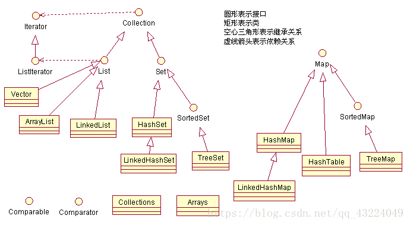

**迭代器**

迭代器是一种设计模式，他的工作方法是遍历并选择集合中的对象，只要拿到这个集合,使用迭代器就可以遍历这个集合，即我们无需关心该集合的底层结构是什么样子的。

Iterator接口：包含三个方法：hasNext，next，remove、remove一般很少用到

```java
public interface Iterator<E> {

    boolean hasNext();    //每次next之前，先调用此方法探测是否迭代到终点
    E next();            //返回当前迭代元素 ，同时，迭代游标后移
    void remove()
```


## List

### Arraylist 源码解析

**[https://www.jianshu.com/p/f863791e77fe]**

**扩容机制**

add操作时，判断当前size+1是否大于数组容量，若大于则grow扩容。

```java
    public boolean add(E e) {
        ensureCapacityInternal(size + 1);  // Increments modCount!!
        elementData[size++] = e;
        return true;
    }
```

```cpp
    private void ensureCapacityInternal(int minCapacity) {
        if (elementData == DEFAULTCAPACITY_EMPTY_ELEMENTDATA) {
            minCapacity = Math.max(DEFAULT_CAPACITY, minCapacity);
        }

        ensureExplicitCapacity(minCapacity);
    }
```

```cpp
    private void ensureExplicitCapacity(int minCapacity) {
        modCount++;

        // overflow-conscious code
        if (minCapacity - elementData.length > 0)
            grow(minCapacity);
    }
```

```cpp
    private void grow(int minCapacity) {
        // 1.首先获取到elementData数组的长度，作为原容量
        int oldCapacity = elementData.length;
        // 2.新容量 = 原容量 + 原容量/2；   1.5倍扩容
        int newCapacity = oldCapacity + (oldCapacity >> 1);
    
        if (newCapacity - minCapacity < 0)
            // 3.若1.5倍扩容后还不够，则将最小容量作为新容量
            newCapacity = minCapacity;
        if (newCapacity - MAX_ARRAY_SIZE > 0)
            // 4.限制最大容量
            newCapacity = hugeCapacity(minCapacity);
        // 5.进行原有数据元素copy处理
        elementData = Arrays.copyOf(elementData, newCapacity);
    }
```

### LinkedList源码解析

**[https://www.jianshu.com/p/6a9cb631b2ef]**

**[https://www.jianshu.com/p/6bda2c1e6ee0]**

增

```java
public boolean add(E e) {
    linkLast(e);
    return true;
}
//默认加在尾巴上
void linkLast(E e) {
    final Node<E> l = last;
    //新建节点 前节点为last 本身值为e 后节点为null
    final Node<E> newNode = new Node<>(l, e, null);
    last = newNode;
    //原本为空链表 加入第一个节点
    if (l == null)
        first = newNode;
    else
        l.next = newNode;
    size++;
    modCount++;
}
```

```java
//指定位置插入
public void add(int index, E element) {
    checkPositionIndex(index);

    if (index == size)
        linkLast(element);
    else
        linkBefore(element, node(index));
}
void linkBefore(E e, Node<E> succ) {
    // assert succ != null;
    final Node<E> pred = succ.prev;
    //新建节点 前节点为pre 本身值为e 后节点为succ
    final Node<E> newNode = new Node<>(pred, e, succ);
    succ.prev = newNode;
    if (pred == null)
        first = newNode;
    else
        pred.next = newNode;
    size++;
    modCount++;
}
```

查/改

```java
public E get(int index) {
    checkElementIndex(index);
    return node(index).item;
}
public E set(int index, E element) {
	checkElementIndex(index);
	Node<E> x = node(index);
	E oldVal = x.item;
	x.item = element;
	return oldVal;
}
Node<E> node(int index) {
    // index在链表的前边还是后边，size>>1 即取中点
    if (index < (size >> 1)) {
        Node<E> x = first;
        for (int i = 0; i < index; i++)
            x = x.next;
        return x;
    } else {
        Node<E> x = last;
        for (int i = size - 1; i > index; i--)
            x = x.prev;
        return x;
    }
}
```

删

```csharp
    public E remove(int index) {
        checkElementIndex(index);
        return unlink(node(index));
    }

    /**
     * Unlinks non-null node x.
     */
    E unlink(Node<E> x) {
        // assert x != null;
        // 1.获取到待删除结点的数据域和地址域
        final E element = x.item;
        final Node<E> next = x.next;
        final Node<E> prev = x.prev;

        // 2.判断prev 是否为null
        if (prev == null) {
            // prev == null，则说明当前待删除的结点为头结点，需要将next结点的内存地址赋值给first  删除完毕后，next结点作为头结点
            first = next;
        } else {
            // 将next结点的内存地址赋值给prev.next 并将删除结点的prev置为null          相当于“断开”双向链表的前一端
            prev.next = next;
            x.prev = null;
        }
   
        // 3.判断next是否为null
        if (next == null) {
            // next == null，则说明当前待删除的结点为尾结点，需要将prev结点的内存地址赋值给last  删除完毕后，prev结点作为尾结点
            last = prev;
        } else {
            // 将prev结点的内存地址赋值给next.prev 并将删除结点的next置为null          相当于“断开”双向链表的后一端
            next.prev = prev;
            x.next = null;
        }

        // 4.将删除结点的数据域置为null
        x.item = null;
        // 5.size自减1
        size--;
        modCount++;
        return element;
    }
```

### Arraylist 与 LinkedList 区别?

- **1. 是否保证线程安全：** `ArrayList` 和 `LinkedList` 都是不同步的，也就是不保证线程安全；

- **2. 底层数据结构：** `Arraylist` 底层使用的是 **`Object` 数组**；`LinkedList` 底层使用的是 **双向链表** 数据结构（JDK1.6之前为循环链表，JDK1.7取消了循环。注意双向链表和双向循环链表的区别，下面有介绍到！）

- **3. 插入和删除是否受元素位置的影响：** 

  ① `ArrayList` 采用数组存储，所以插入和删除元素的时间复杂度受元素位置的影响。 比如：执行`add(E e)`方法的时候， `ArrayList` 会默认在将指定的元素追加到此列表的末尾，这种情况时间复杂度就是O(1)。但是如果要在指定位置 i 插入和删除元素的话（`add(int index, E element)`）时间复杂度就为 O(n-i)。因为在进行上述操作的时候集合中第 i 和第 i 个元素之后的(n-i)个元素都要执行向后位/向前移一位的操作。 

  ② `LinkedList` 采用链表存储，所以对于`add(E e)`方法的插入，删除元素时间复杂度不受元素位置的影响，近似 O(1)(因其内部维护有存储表头表尾地址的变量)，如果是要在指定位置`i`插入和删除元素的话（`add(int index, E element`） 时间复杂度近似为O(n)因为需要先移动到指定位置再插入。

- **4. 是否支持快速随机访问：** `LinkedList` 不支持高效的随机元素访问，而 `ArrayList` 支持。快速随机访问就是通过元素的序号快速获取元素对象(对应于`get(int index)`方法)。

- **5. 内存空间占用：** ArrayList的空 间浪费主要体现在在list列表的结尾会预留一定的容量空间，而LinkedList的空间花费则体现在它的每一个元素都需要消耗比ArrayList更多的空间（因为要存放直接后继和直接前驱以及数据）。

  

  ==对于随机访问get和set，ArrayList优于LinkedList，因为LinkedList要移动指针。 
   对于新增和删除操作add和remove，LinedList比较占优势，因为ArrayList要移动数据。==

  虽然新增和删除操作下，LinkedList由于需要访问到index所以时间复杂度退化到O(n)，但实际操作下来，访问到index的速度还是比 Arraylist 元素向后位/向前移一位的操作 要快的。


## Set

### HashSet

底层由HashMap来实现。

构造方法

```java
private transient HashMap<E,Object> map;
//默认构造器
public HashSet() {
    map = new HashMap<>();
}
```

add方法通过HashMap的put方法实现，HashSet添加的元素是存放在HashMap的key位置上，而value取了默认常量PRESENT，是一个空对象。

```java
private static final Object PRESENT = new Object();

public boolean add(E e) {
    return map.put(e, PRESENT)==null;
}
```

contains方法

```java
public boolean contains(Object o) {
    return map.containsKey(o);
}
```

### HashSet、LinkedSet和TreeSet使用场景

|               | 有序性     | 实现及效率                        | 线程安全 |
| ------------- | ---------- | --------------------------------- | -------- |
| HashMap       | 无序       | 基于HashMap，时间复杂度O(1)       | 不安全   |
| LinkedHashMap | 按插入顺序 | 基于LinkedHashMap，时间复杂度同上 | 不安全   |
| TreeMap       | 按key顺序  | 基于红黑树，时间复杂度O(log n)    |          |

### LinkedHashSet

LinkedHashSet继承自HashSet

狗仔方法

```java
    // 使用默认容量16, 默认装载因子0.75
    public LinkedHashSet() {
        super(16, .75f, true);
    }
```

HashSet对应方法

```java
    // HashSet的构造方法
    HashSet(int initialCapacity, float loadFactor, boolean dummy) {
        map = new LinkedHashMap<>(initialCapacity, loadFactor);
    }
```

LinkedHashSet继承自HashSet，它的添加、删除、查询等方法都是直接用的HashSet的方法，和HashSet唯一的不同就是它使用LinkedHashMap存储元素。

## Map

### **HashMap 的数据结构**

HashMap的主干是一个Node数组。Node是HashMap的基本组成单元，每一个Node包含一个key-value键值对。

简单来说，**HashMap由数组+链表+红黑树组成的**，数组是HashMap的主体，链表则是主要为了解决哈希冲突而存在的，当链表长度大于8，则转化为红黑树

```java
static class Node<K,V> implements Map.Entry<K,V> {
   final int hash;
   final K key;
   V value;
   Node<K,V> next;
```

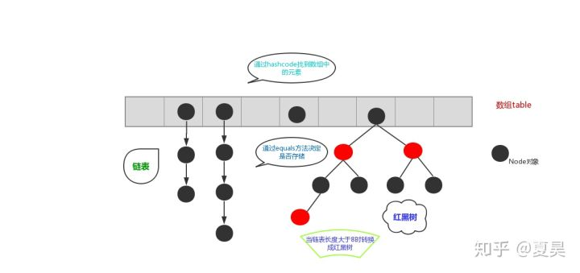

### JDK1.8后HashMap所做优化

|          | JDK1.7    | JDK1.8           |
| -------- | --------- | ---------------- |
| 数据结构 | 数组+链表 | 数组+链表+红黑树 |
| hash算法 |           |                  |
| 寻址算法 |           |                  |
|          | 头插法    | 尾插法           |


### JDK1.8后的hash算法和寻址算法

**hash算法优化**

```java
//重新计算哈希值
static final int hash(Object key) {
	int h;
    //key如果是null,新hashcode是0,否则,新的hashcode为原hashcode无符号右移16位后与原hashcode做异或运算
	return (key == null) ? 0 : (h = key.hashCode()) ^ (h >>> 16);
}
```

**寻址算法优化**

```java
index = hash&(length-1) //key的hash值和数组长度-1的32位二进制数进行与运算
```

先有的寻址算法优化再有的hash算法优化。

==古老的寻址方法是hash对数组长度取模，优化后的寻址算法能达到同样的效果且性能更好。==

而为什么要hashcode高低16位进行异或呢？因为当node数组长度比较小，而hashcode的值比较大的时候，直接hashcode & (node数组长度 - 1）运算，hashcode的高16位是不会参加运算的，因为node数组长度 - 1的高16位都是0。所以hashcode的高低16位进行异或，就达到了高16位和低16位都参与运算的效果，让hash算法更加均匀。

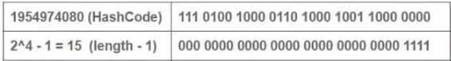

==综合低16位与高16的影响，减少hash碰撞==

### 扩容机制（为什么扩容是2的n次幂）

hashmap默认长度是16，负载因子是 0.75f，threshold =0.75*16=12，也就是说，插入 12 个键值对就会扩容。

**hashmap维护的node数组的长度永远是2的n次方**，在扩容时，会扩大到原来的两倍，因为使用的是**2的次幂扩展**，那么元素的位置要么保持不变，要么在原位置上偏移2的次幂。这里用到寻址算法优化

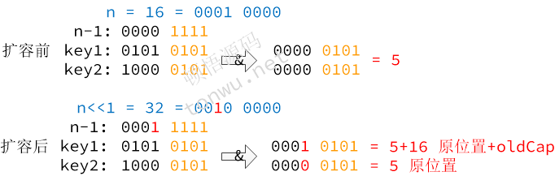

上图可以看到，扩大2倍，相当于 n 左移一位，那么 n-1 在高位就多出了一个 1，此时与原散列值进行与运算，就多参与了一位，这个比特位要么是 0，要么是 1:

- 0 的话索引不变
- 1 的话索引就变成"原索引+oldCap"

==扩容时，利用 2 的次幂数值的二进制特点，既省去重新计算 hash 的时间，又把之前冲突的节点散列到了其他位置==

### hashmap的get/put过程

***知道hashmap中put元素的过程是什么样么?***

对key的hashCode()做hash运算，计算index; 如果没碰撞直接放到bucket里； 如果碰撞了，以链表的形式存在buckets后； 如果碰撞导致链表过长(大于等于TREEIFY_THRESHOLD)，就把链表转换成红黑树(JDK1.8中的改动)； 如果节点已经存在就替换old value(保证key的唯一性) 如果bucket满了(超过load factor*current capacity)，就要resize。

***知道hashmap中get元素的过程是什么样么?***

对key的hashCode()做hash运算，计算index; 如果在bucket里的第一个节点里直接命中，则直接返回； 如果有冲突，则通过key.equals(k)去查找对应的Node;

- 若为树，则在树中通过key.equals(k)查找，O(logn)；
- 若为链表，则在链表中通过key.equals(k)查找，O(n)。

***你还知道哪些hash算法？***

MD5 SHA-1

***说说String中hashcode的实现?(此题频率很高)***

```java
public int hashCode() {
    int h = hash;
    if (h == 0 && value.length > 0) {//value为将字符串截成的字符数组  
        char val[] = value;

        for (int i = 0; i < value.length; i++) {
            h = 31 * h + val[i];
        }
        hash = h;
    }
    return h;
}
```

String类中的hashCode计算方法还是比较简单的，就是以31为权，每一位为字符的ASCII值进行运算，用自然溢出来等效取模。

例如String msg = "abcd";  // 此时value[] = {'a','b','c','d'}  因此

for循环会执行4次

第一次：h = 31*0 + a = 97 

第二次：h = 31*97 + b = 3105 

第三次：h = 31*3105 + c = 96354 

第四次：h = 31*96354 + d = 2987074 

由以上代码计算可以算出 msg 的hashcode = 2987074  

哈希计算公式可以计为`s[0]*31^(n-1) + s[1]*31^(n-2) + ... + s[n-1]`

那为什么以31为质数呢?

主要是因为31是一个奇质数，所以`31*i=32*i-i=(i<<5)-i`，这种位移与减法结合的计算相比一般的运算快很多。

### 红黑树

***为什么在解决hash冲突的时候，不直接用红黑树?而选择先用链表，再转红黑树?***

 因为红黑树需要进行左旋，右旋，变色这些操作来保持平衡，而单链表不需要。 当元素小于8个当时候，此时做查询操作，链表结构已经能保证查询性能。如果一开始就用红黑树结构，无疑这是浪费性能的。

***我不用红黑树，用二叉查找树可以么?*** 

可以。但是二叉查找树在特殊情况下会变成一条线性结构，遍历查找会非常慢。

***红黑树和二叉平衡树（AVL）之间的区别***

二叉平衡树（AVL）要求严格平衡，所有结点的左右子树高度差不超过1。不管我们是执行插入还是删除操作，只要不满足上面的条件，就要通过旋转来保存平衡，可能发生大量旋转所以非常耗时，由此我们可以知道AVL树适合用于插入与删除次数比较少，但查找多的情况。AVL更平衡，树高度更低，查找效率更高。

红黑树确保没有一条路径会比其他路径长出两倍，相对于要求严格的AVL树来说，它的旋转次数少，插入最多两次旋转，删除最多三次旋转，所以对于插入，删除操作较多的情况下，我们就用红黑树。


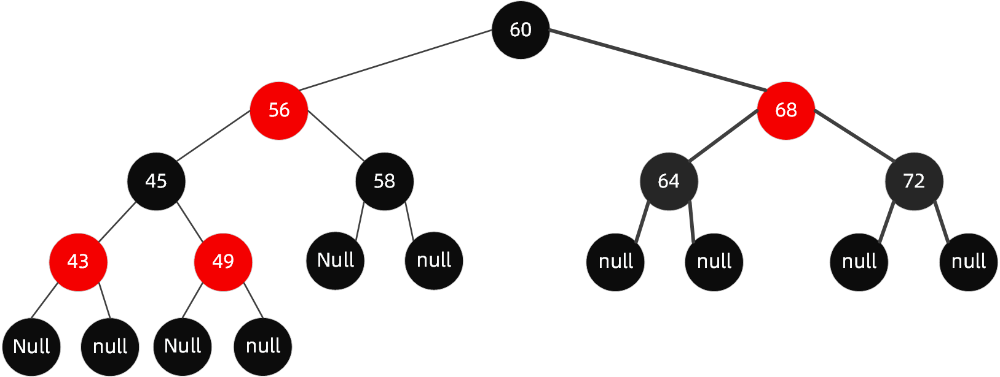


**红黑树定义**

1. 根节点是黑色

2. 叶子节点都为黑色，且为null

3. 新加入到红黑树的节点为红色节点

4. 红黑树不会出现相邻的红色节点（红色节点的父节点和子节点都为黑色）

5. 从任意节点出发，到其每个叶子节点的路径中包含相同数量的黑色节点

   

**性质**

从根节点到叶子节点的最长路径不大于最短路径的2倍


变色

左旋转

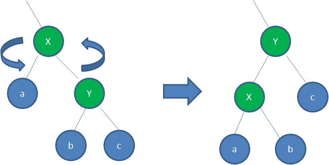


右旋转


**直接插入：**

新插入的节点父节点是黑色

**仅变色：**

1. 新插入的节点是根节点，红变黑
2. 新插入的节点父节点是红色，叔节点也是红色，那么将父与叔节点标记为黑色，祖节点为红色（祖节点变色原因是保证每个叶子节点的路径中包含相同数量的黑色节点），然后把祖节点当作新插入的节点递归重复这一判断。

**变色加旋转：**

**[https://www.cnblogs.com/LiaHon/p/11203229.html]**

新插入的节点父节点是红色，叔节点也是黑色或者为null

1. 左左节点旋转(/)       这种情况下，父节点和插入的节点都是左节点

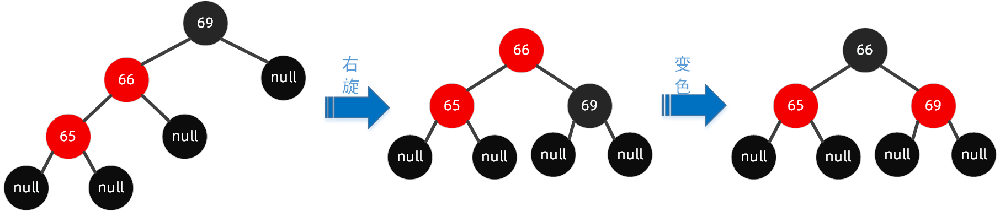


2. 右右节点旋转(\\)    这种情况下，父节点和插入的节点都是右节点


3 左右节点旋转(<)   这种情况下，父节点是左节点，插入的节点是右节点

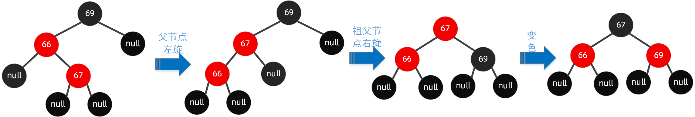

4 右左节点旋转(>)  这种情况下，父节点是右节点，插入的节点是左节点


### HashMap 和 Hashtable 的区别

1. **线程是否安全：** HashMap 是非线程安全的，HashTable 是线程安全的；HashTable 内部的方法基本都经过`synchronized` 修饰。（如果你要保证线程安全的话就使用 ConcurrentHashMap 吧！）；

2. **效率：** 因为线程安全的问题，HashMap 要比 HashTable 效率高一点。另外，HashTable 基本被淘汰，不要在代码中使用它；

3. **对Null key 和Null value的支持：** HashMap 中，null 可以作为键，这样的键只有一个，可以有一个或多个键所对应的值为 null。但是在 HashTable 中 put 进的键值只要有一个 null，直接抛出 NullPointerException。

4. **初始容量大小和每次扩充容量大小的不同 ：** 

   ①创建时如果不指定容量初始值，Hashtable 默认的初始大小为11，之后每次扩充，容量变为原来的2n+1。HashMap 默认的初始化大小为16。之后每次扩充，容量变为原来的2倍。

   ②创建时如果给定了容量初始值，那么 Hashtable 会直接使用你给定的大小，而 HashMap 会将其扩充为2的幂次方大小（HashMap 中的`tableSizeFor()`方法保证）。也就是说 HashMap 总是使用2的幂作为哈希表的大小。

5. **底层数据结构：** JDK1.8 以后的 HashMap 在解决哈希冲突时有了较大的变化，当链表长度大于阈值（默认为8）（将链表转换成红黑树前会判断，如果当前数组的长度小于 64，那么会选择先进行数组扩容，而不是转换为红黑树）时，将链表转化为红黑树，以减少搜索时间。Hashtable 没有这样的机制。

### HashMap 高并发下导致死循环问题

死循环问题在JDK1.7扩容时发生

JDK1.7采用头插法 **[https://www.cnblogs.com/mr-wuxiansheng/p/12865080.html]**

链表头插法的会颠倒原来一个散列桶里面链表的顺序。在并发的时候原来的顺序被另外一个线程a颠倒了，而被挂起线程b恢复后拿扩容前的节点和顺序继续完成第一次循环后，又遵循a线程扩容后的链表顺序重新排列链表中的顺序，最终形成了环。

JDK1.8以后采用尾插法，不会造成死循环问题，不过还是会有并发问题。原因在于其内部操作不是原子的，譬如++size之类的操作依然会产生并发问题。

### HashMap、LinkedHashMap和TreeMap使用场景

|               | 有序性     | 实现及效率                                           | 线程安全 |
| ------------- | ---------- | ---------------------------------------------------- | -------- |
| HashMap       | 无序       | 基于散列表，无冲突时间复杂度O(1)，冲突时间复杂度O(n) | 不安全   |
| LinkedHashMap | 按插入顺序 | 基于HashMap和双向链表，时间复杂度同上                | 不安全   |
| TreeMap       | 按key顺序  | 基于红黑树，时间复杂度O(log n)                       | 不安全   |

### LinkedHashMap

LinkedHashMap继承了HashMap

其节点Entry`继承自`HashMap.Node，通过before、after维护了一个按插入顺序的双向链表。这里要和next区分开，next是指发生hash碰撞时生成链表的下一个。

```java
static class Entry<K,V> extends HashMap.Node<K,V> {
    Entry<K,V> before, after;
    Entry(int hash, K key, V value, Node<K,V> next) {
        super(hash, key, value, next);
    }
}
```
put操作时，相比HashMap，多了一个操作，即将put的新节点加到双向链表的尾端（LinkedHashMap内部两个成员变量`head tail`,分别指向内部双向链表的表头、表尾。）

```java
private void linkNodeLast(LinkedHashMap.Entry<K,V> p) {
    LinkedHashMap.Entry<K,V> last = tail;
    tail = p;
    if (last == null)
        head = p;
    else {
        p.before = last;
        last.after = p;
    }
}
```


### ConcurrentHashMap 

不管是1.7的HashEntry 还是1.8的Node，对其中的共享变量（val、next）都使用`volatile`关键字，保证多线程操作时，变量的可见性。`volatile`不保证原子性，所以put 操作时仍然需要加锁处理。


JDK1.8以前：采用分段锁 。ConcurrentHashMap 在存储方面是一个 Segment 数组，Segment 里维护了一个 HashEntry 数组，其中 Segment 继承自 ReentrantLock（可重入）。

put和 get **两次Hash**到达指定的HashEntry，第一次hash到达Segment,第二次hash到达Segment里面的HashEntry ,然后在遍历HashEntry 链表。

put方法先到达Segment先尝试获取锁，成功则找到HashEntry。失败则自旋获取锁，大于最大重试次数则阻塞获取锁。

get 方法就比较简单了，因为不涉及增、删、改操作，所以不存在并发故障问题。


JDK1.8以后：并发控制使用CAS和Synchronized来操作。

put方法若该位置第一次插入元素则使用CAS插入元素，如果存在hash冲突，则使用Synchronized对该Node加锁再进行链表元素的修改或添加。

get 方法就比较简单了，因为不涉及增、删、改操作，所以不存在并发故障问题。

### ConcurrentHashMap 和 Hashtable 的区别

ConcurrentHashMap 和 Hashtable 的区别主要体现在实现线程安全的方式上不同。

- **底层数据结构：** 

  JDK1.7的 ConcurrentHashMap 底层采用 分段的数组+链表 实现，JDK1.8 采用的数据结构跟HashMap1.8的结构一样，数组+链表+红黑树。

  Hashtable 和 JDK1.8 之前的 HashMap 的底层数据结构类似都是采用 数组+链表 的形式。

- **实现线程安全的方式（重要）：**

  ① **在JDK1.7的时候，ConcurrentHashMap（分段锁）** 对整个桶数组进行了分割分段(Segment)，每一把锁只锁容器其中一部分数据，多线程访问容器里不同数据段的数据，就不会存在锁竞争，提高并发访问率。 **到了 JDK1.8 的时候已经摒弃了Segment的概念，而是直接用 Node 数组+链表+红黑树的数据结构来实现，并发控制使用 CAS 和synchronized 来操作。** 

  ② **Hashtable(同一把锁)** :使用 synchronized 来保证线程安全，效率非常低下。当一个线程访问同步方法时，其他线程也访问同步方法，可能会进入阻塞或轮询状态，如使用 put 添加元素，另一个线程不能使用 put 添加元素，也不能使用 get，竞争会越来越激烈效率越低。


# 并发

## 基本方法

### **Object.java**

==wait(), notify()和notifyAll()  需在上锁的方法/代码块中使用==

wait()：是让当前线程进入等待状态，同时**会让当前线程释放立刻它所持有的锁**。

notify()：唤醒在此对象锁上等待的单个线程，**等线程结束后再释放锁。**
notifyAll()：唤醒在此对象锁上等待的所有线程，**等线程结束后再释放锁。**

### **Thread.java**

==join(),sleep(),yield()==

join(): 把指定的线程添加到当前线程中，主线程等待join线程结束后再执行。

sleep():让出cpu给其他线程, 在一定时间内不参与cpu调度，**不释放锁**。

yield(): 让出cpu给其他线程, 并处于就绪状态。

## 基本概念

### 线程的生命周期和状态

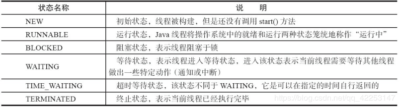

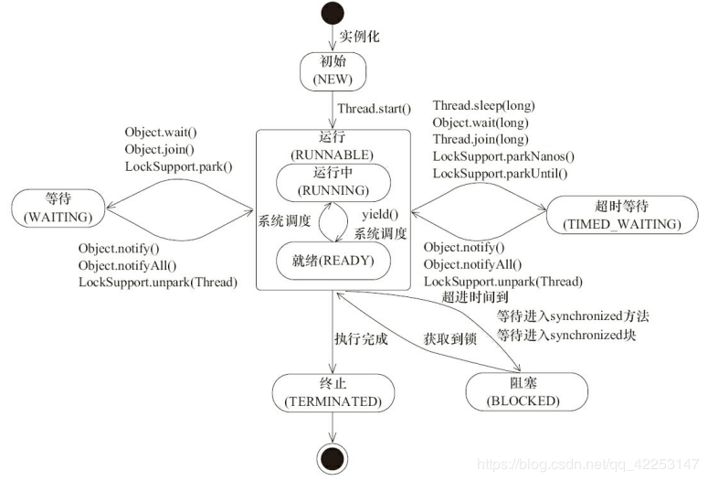


### 线程与进程的区别

**进程**是程序的一次执行过程，是系统运行程序的基本单位。**是资源分配的最小单位**

**线程**与进程相似，但线程是一个比进程更小的执行单位。一个进程在其执行的过程中可以产生多个线程。**是CPU调度的最小单位**

线程和进程最大的不同在于基本上各进程是独立的，而各线程则不一定，因为同一进程中的线程极有可能会相互影响。

### 死锁

多个并发进程因争夺系统资源而产生相互等待的现象。

形成死锁的4个条件

1. 互斥条件：某种资源一次只允许一个进程访问，即该资源一旦分配给某个进程，其他进程就不能再访问，直到该进程访问结束。

2. 请求和保持条件：当进程因请求资源而阻塞时，对已获得的资源保持不放。

3. 不剥夺条件：进程已获得的资源在未使用完之前，不能剥夺，只能在使用完时由自己释放。

4. 环路等待条件：在发生死锁时，必然存在一个进程--资源的环形链。

   

**避免死锁**只要破坏产生死锁的四个条件中的其中一个

1. 资源一次性分配：一次性分配所有资源，这样就不会再有请求了：（破坏请求条件）
2. 可剥夺资源：即当某进程获得了部分资源，但得不到其它资源，则释放已占有的资源（破坏不可剥夺条件）
3. 资源有序分配法：系统给每类资源赋予一个编号，每一个进程按编号递增的顺序请求资源，释放则相反（破坏环路等待条件）

### 实现多线程的方法

1. 继承Thread类，重写run方法
2. 实现Runnable接口，重写run方法，实现Runnable接口的实现类的实例对象作为Thread构造函数的target
3. 通过Callable和FutureTask创建线程
4. 通过线程池创建线程 


**Thread和Runnable区别**

`Thread` 和 `Runnable` 实际上是一种静态代理的实现方式，`thread.start()` 方法会调用native方法需要系统调用来控制时间分片。

```java
class Thread implements Runnable { //Thread实现了Runnable接口
    private Runnable target;
    
    public Thread(Runnable target) {//有参构造方法传入Runnable对象
        init(null, target, "Thread-" + nextThreadNum(), 0);
        ····
        this.target = target;
    }
    
    public void run() {//执行重写后的run方法
        if (target != null) {
            target.run();
        }
    }    
}

```

```java
@FunctionalInterface //函数式接口 使用Lambda 表达式
public interface Runnable {
    public abstract void run(); //只有这一个抽象方法
}
```

实现Runnable接口比继承Thread类所具有的优势：

1. 可以避免java中的单继承的限制

   如果你想写一个类C，但这个类C已经继承了一个类A，此时，你又想让C实现多线程。用继承Thread类的方式不行了。（因为单继承的局限性），此时，只能用Runnable接口，

2. 有利于程序的健壮性，代码能够被多个线程共享，代码与数据是独立的。


## JMM-Java内存模型

方法中的基本类型本地变量将直接存储在工作内存的栈帧结构中；（虚拟机栈）

引用类型的本地变量：引用存储在工作内存（虚拟机栈），实际存储在主内存；（堆）

成员变量、静态变量、类信息均会被存储在主内存中；（堆）


 Java内存模型是围绕着并发编程中**原子性**、**可见性**、**有序性**这三个特征来建立的

### ~~内存交互~~

- ~~lock   （锁定）：作用于主内存的变量，把一个变量标识为线程独占状态~~

- ~~unlock （解锁）：作用于主内存的变量，它把一个处于锁定状态的变量释放出来，释放后的变量才可以被其他线程锁定~~

- ~~read  （读取）：作用于主内存变量，它把一个变量的值从主内存传输到线程的工作内存中，以便随后的load动作使用~~

- ~~load   （载入）：作用于工作内存的变量，它把read操作从主存中变量放入工作内存中~~

- ~~use   （使用）：作用于工作内存中的变量，它把工作内存中的变量传输给执行引擎，每当虚拟机遇到一个需要使用到变量的值，就会使用到这个指令~~

- ~~assign （赋值）：作用于工作内存中的变量，它把一个从执行引擎中接受到的值放入工作内存的变量副本中~~

- ~~store  （存储）：作用于主内存中的变量，它把一个从工作内存中一个变量的值传送到主内存中，以便后续的write使用~~

- ~~write 　（写入）：作用于主内存中的变量，它把store操作从工作内存中得到的变量的值放入主内存的变量中~~

### 内存模型三大特性

**原子性：**例如上面八项操作，在操作系统里面是不可分割的单元。被synchronized关键字或其他锁包裹起来的操作也可以认为是原子的。从一个线程观察另外一个线程的时候，看到的都是一个个原子性的操作。

**可见性：**每个工作线程都有自己的工作内存，所以当某个线程修改完某个变量之后，在其他的线程中，未必能观察到该变量已经被修改。volatile关键字要求被修改之后的变量要求立即更新到主内存，每次使用前从主内存处进行读取。因此volatile可以保证可见性。除了volatile以外，synchronized和final也能实现可见性。synchronized保证unlock之前必须先把变量刷新回主内存。final修饰的字段在构造器中一旦完成初始化，并且构造器没有this逸出，那么其他线程就能看到final字段的值。

**有序性：**java的有序性跟线程相关。如果在线程内部观察，会发现当前线程的一切操作都是有序的。如果在线程的外部来观察的话，会发现线程的所有操作都是无序的。因为JMM的工作内存和主内存之间存在延迟，而且java会对一些指令进行重新排序。volatile和synchronized可以保证程序的有序性，

==重排序过程不会影响到单线程程序的执行，却会影响到多线程并发执行的正确性==

### happens-before原则

由于 **指令重排序** 的存在，两个操作之间有happen-before关系， **并不意味着前一个操作必须要在后一个操作之前执行。 仅仅要求前一个操作的执行结果对于后一个操作是可见的，并且前一个操作 按顺序** 排在第二个操作之前。

单线程happen-before原则：在同一个线程中，书写在前面的操作happen-before后面的操作。

锁的happen-before原则：同一个锁的unlock操作happen-before此锁的lock操作。

volatile的happen-before原则：对一个volatile变量的写操作happen-before对此变量的任意操作(当然也包括写操作了)。

happen-before的传递性原则：如果A操作 happen-before B操作，B操作happen-before C操作，那么A操作happen-before C操作。

线程启动的happen-before原则：同一个线程的start方法happen-before此线程的其它方法。

线程中断的happen-before原则：对线程interrupt方法的调用happen-before被中断线程的检测到中断发送的代码。

线程终结的happen-before原则：线程中的所有操作都happen-before线程的终止检测。

对象创建的happen-before原则：一个对象的初始化完成先于他的finalize方法调用。


## volatile

### 特性及原理

被volatile修饰的共享变量，就会具有以下两个特性：

1. 保证了不同线程对该变量操作的内存可见性。

   volatile关键字解决可见性问题，通俗来说就是线程A对变量的修改，会直接刷新到主内存，同时将其他线程的工作内存中data变量缓存失效过期。线程B当中，在对变量进行读取的时候，发现变量已过期，将从主内存中读取。

2. 禁止指令重排序。

   volatile的happen-before原则：对一个volatile变量的写操作happen-before对此变量的任意操作(当然也包括写操作了)。

### 原理

**可见性**

1. 一旦data变量定义的时候前面加了volatile来修饰的话，那么线程1只要修改data变量的值，就会在修改完自己本地工作内存的data变量值之后，强制将这个data变量最新的值刷回主内存
2. 如果此时别的线程的工作内存中有这个data变量的本地缓存，也就是一个变量副本的话，那么会强制让其他线程的工作内存中的data变量缓存直接失效过期，不允许再次读取和使用了！
3. 如果线程2在代码运行过程中再次需要读取data变量的值，此时尝试从本地工作内存中读取，就会发现这个data = 0已经过期了！此时，他就必须重新从主内存中加载data变量最新的值！

### volatile和synchronized的区别

- **volatile关键字**是线程同步的**轻量级实现**，所以**volatile性能肯定比synchronized关键字要好**。但是**volatile关键字只能用于变量而synchronized关键字可以修饰方法以及代码块**。synchronized关键字在JavaSE1.6之后进行了主要包括为了减少获得锁和释放锁带来的性能消耗而引入的偏向锁和轻量级锁以及其它各种优化之后执行效率有了显著提升，**实际开发中使用 synchronized 关键字的场景还是更多一些**。
- **多线程访问volatile关键字不会发生阻塞，而synchronized关键字可能会发生阻塞**
- **volatile关键字能保证数据的可见性，但不能保证数据的原子性。synchronized关键字两者都能保证。**
- **volatile关键字主要用于解决变量在多个线程之间的可见性，而 synchronized关键字解决的是多个线程之间访问资源的同步性。**

## synchronized

### 使用

- **修饰实例方法:** 作用于当前对象实例加锁，进入同步代码前要获得当前对象实例的锁

- **修饰静态方法:** 也就是给当前类加锁，会作用于类的所有对象实例，因为静态成员不属于任何一个实例对象，是类成员（ static 表明这是该类的一个静态资源，不管new了多少个对象，只有一份）。所以如果一个线程 A 调用一个实例对象的非静态 synchronized 方法，而线程 B 需要调用这个实例对象所属类的静态 synchronized 方法，是允许的，不会发生互斥现象，**因为访问静态 synchronized 方法占用的锁是当前类的锁，而访问非静态 synchronized 方法占用的锁是当前实例对象锁**。

- **修饰代码块:** 指定加锁对象，对给定对象加锁，进入同步代码库前要获得给定对象的锁。

  **总结：** synchronized 关键字加到 static 静态方法和 synchronized(class)代码块上都是是给 Class 类上锁。synchronized 关键字加到实例方法上是给对象实例上锁。尽量不要使用 synchronized(String a) 因为JVM中，字符串常量池具有缓存功能！

**线程安全的单例模式（双重检查锁方式）**

```java
public class Singleton {

    private volatile static Singleton uniqueInstance;

    private Singleton() {
    }

    public static Singleton getUniqueInstance() {
       //先判断对象是否已经实例过，没有实例化过才进入加锁代码
        if (uniqueInstance == null) {
            //类对象加锁
            synchronized (Singleton.class) {
                if (uniqueInstance == null) {
                    uniqueInstance = new Singleton();
                }
            }
        }
        return uniqueInstance;
    }
}

```

另外，需要注意 uniqueInstance 采用 volatile 关键字修饰也是很有必要。

uniqueInstance 采用 volatile 关键字修饰也是很有必要的， uniqueInstance = new Singleton(); 这段代码其实是分为三步执行：

1. 为 uniqueInstance 分配内存空间
2. 初始化 uniqueInstance
3. 将 uniqueInstance 指向分配的内存地址

但是由于 JVM 具有指令重排的特性，执行顺序有可能变成 1->3->2。指令重排在单线程环境下不会出现问题，但是在多线程环境下会导致一个线程获得还没有初始化的实例。例如，线程 T1 执行了 1 和 3，此时 T2 调用 getUniqueInstance() 后发现 uniqueInstance 不为空，因此返回 uniqueInstance，如果是这个流程，多线程环境下就可能将一个未初始化的对象引用暴露出来，从而导致不可预料的结果。

使用 volatile 可以禁止 JVM 的指令重排，保证在多线程环境下也能正常运行。

### JDK*1.6* 对 synchronized 的锁优化

**适应性自旋锁**、**锁消除**、**锁粗化**、**偏向锁和轻量级锁（锁升级）**


**适应性自旋锁**

自旋锁本身是有缺点的，它不能代替阻塞。自旋等待虽然避免了线程切换的开销，但它要占用处理器时间。如果锁被占用的时间很短，自旋等待的效果就会非常好。反之，如果锁被占用的时间很长，那么自旋的线程只会白浪费处理器资源。所以，自旋等待的时间必须要有一定的限度，如果自旋超过了限定次数（默认是10次，可以使用`-XX:PreBlockSpin`来更改）没有成功获得锁，就应当挂起线程。

自适应意味着自旋的时间（次数）不再固定。某个线程如果自旋成功了，那么下次自旋的次数会更加多，因为虚拟机认为既然上次成功了，那么此次自旋也很有可能会再次成功，那么它就会允许自旋等待持续的次数更多。反之，如果对于某个锁，很少有自旋能够成功的，那么在以后要或者这个锁的时候自旋的次数会减少甚至省略掉自旋过程，以免浪费处理器资源。


**锁消除**

锁消除是指虚拟机即时编译器再运行时，对一些代码上要求同步，但是被检测到不可能存在共享数据竞争的锁进行消除。

比如，StringBuffer类的append方法用了synchronized关键词，它是线程安全的。但我们可能仅在方法内部把StringBuffer当作局部变量使用。不同线程同时调用createStringBuffer()方法时，都会创建不同的StringBuffer对象，而此时的append操作若是使用synchronized加锁，就是白白浪费的系统资源。

 

**锁粗化**

代码中前后相邻的synchronized块的是同一锁对象,那么这几个synchronized块会被合并成一个较大的同步块, 这样做的好处在于线程在执行代码时就无需频繁申请写释放锁了,从而达到申请与释放锁一次,就可以执行完全部的同步代码块,从而提升了性能

```dart
    public String cancatString(String s1, String s2, String s3){
        StringBuffer sb = new StringBuffer();
        sb.append(s1);
        sb.append(s2);
        sb.append(s3);
        return sb.toString();
    }
```

上面代码中，连续的append方法就属于这种情况。这时虚拟机就会把锁同步的范围扩展（粗化）到整个操作序列的外部，即第一个append()操作之前直至最后一个append()操作之后，这样只需要加锁一次就可以了。


### 锁升级

级别由低到高依次为：**无锁状态**、**偏向锁状态**、**轻量级锁状态**、**重量级锁状态**。

==锁可以升级但不能降级。==

synchronized用的锁存在Java对象头里，Java对象头里的Mark Word默认存储对象的HashCode、分代年龄和锁标记位。

**偏向锁**：偏向锁是指当一段同步代码一直被同一个线程所访问时，即不存在多个线程的竞争时，那么该线程在后续访问时便会自动获得锁，从而降低获取锁带来的消耗，即提高性能。

当一个线程访问同步块并获取锁时，会在 Mark Word 里存储锁偏向的threadID。当同一个线程再次获取锁时会比较当前的threadID与Mark Word 中的threadID是否一致。如果一致则不需要通过CAS来加锁、解锁。如果不一致并且线程还需要持续持有锁，则暂停当前线程撤销偏向锁，升级为轻量级锁。

**轻量级锁**：轻量级锁由偏向锁升级而来，偏向锁运行在一个线程同步块时，第二个线程加入锁竞争的时候，偏向锁就会升级为轻量级锁。

若当前只有一个等待线程，则该线程将通过自旋进行等待。但是当自旋超过一定的次数时，轻量级锁便会升级为重量级锁。

**重量级锁**：重量级锁依赖于底层操作系统实现，操作系统实现线程之间的切换需要从用户态切换到内核态，切换成本非常高。但若一直使用轻量级锁，等待线程的不断自旋也会消耗CPU资源，使用重量级锁后等待线程相当于被阻塞在队列中，不耗费资源。当轻量级锁耗费资源高过重量级锁时(大量自旋）使用重量级锁。


### 原理

**synchronized 关键字底层原理属于 JVM 层面。**

**① synchronized 同步语句块的情况**

**synchronized 同步语句块的实现使用的是 monitorenter 和 monitorexit 指令，其中 monitorenter 指令指向同步代码块的开始位置，monitorexit 指令则指明同步代码块的结束位置。** 当执行 monitorenter 指令时，线程试图获取锁也就是获取 monitor(**monitor对象存在于每个Java对象的对象头中**，synchronized 锁便是通过这种方式获取锁的，也是为什么Java中任意对象可以作为锁的原因) 的持有权。当计数器为0则可以成功获取，获取后将锁计数器设为1也就是加1。相应的在执行 monitorexit 指令后，将锁计数器设为0，表明锁被释放。如果获取对象锁失败，那当前线程就要阻塞等待，直到锁被另外一个线程释放为止。

**② synchronized 修饰方法的的情况**

synchronized 修饰的方法并没有 monitorenter 指令和 monitorexit 指令，取得代之的确实是 ACC_SYNCHRONIZED 标识，该标识指明了该方法是一个同步方法，JVM 通过该 ACC_SYNCHRONIZED 访问标志来辨别一个方法是否声明为同步方法，从而执行相应的同步调用。

### synchronized和lock的区别

| 类别     | synchronized                                                 | lock                                                         |
| -------- | ------------------------------------------------------------ | ------------------------------------------------------------ |
| 存在层次 | java的关键字，在jvm层面上                                    | 是一个API/类/接口                                            |
| 锁的释放 | 1、以获取锁的线程执行完同步代码，释放锁2、线程执行发生异常，jvm会让线程释放锁 | 在finally中必须释放锁，不然容易造成线程死锁                  |
| 锁的获取 | 假设A线程获得锁，B线程等待，如果A线程阻塞，B线程会一直等待   | 分情况而定，lock有多个锁获取的方法，可以尝试获得锁(tryLock)，线程可以不用一直等待 |
| 锁状态   | 无法判断                                                     | 可以判断                                                     |
| 锁类型   | 可重入   不可中断   非公平                                   | 可重入 可中断(lockInterruptibly)   可公平                    |
| 性能     | 少量同步                                                     | 大量同步                                                     |

## ThreadLocal

ThreadLocal主要用来存储当前线程上下文的变量信息，它可以保障存储进去的数据，只能被当前线程读取到，并且线程之间不会相互影响。ThreadLocal为变量在每个线程中都创建了一个副本，那么每个线程可以访问自己内部的副本变量。 

​	ThreadLocal有哪些典型的应用场景： 

​	1.数据库事务。通过AOP的方式，对执行数据库事务的函数进行拦截。函数开始前，获取connection开启事务并存储在ThreadLocal中，任何用到connection的地方，从ThreadLocal中获取，函数执行完毕后，提交事务释放connection。 

​	2.web项目中，用户的登录信息通常保存在session中。做一个拦截器，把用户信息放在ThreadLocal中，在任何用到用户信息的时候，只需要从TreadLocal中读取就可以了。

### 原理	

每个线程内部都有一个名为threadLocals 的成员变量，该变量类型为ThreadLocalMap （定制化的HashMap），具有get（），set（）方法，key为ThreadLocal 对象的this引用，value为set中设置的值。虽然threadLocals 并非八大基本类型，但仍存放在线程中（栈），而非ThreadLocal 对象中（堆）。set中设置的值是放在了当前线程的 threadLocals 中，并不是存在 `ThreadLocal` 上，`ThreadLocal` 可以理解为只是`ThreadLocalMap`的封装，传递了变量值。

### ThreadLocal 内存泄露问题

`ThreadLocalMap` 中使用的 key 为 `ThreadLocal` 的弱引用,而 value 是强引用。所以，如果 `ThreadLocal` 没有被外部强引用的情况下，在垃圾回收的时候，key 会被清理掉，而 value 不会被清理掉。这样一来，`ThreadLocalMap` 中就会出现key为null的Entry。假如我们不做任何措施的话，value 永远无法被GC 回收，这个时候就可能会产生内存泄露。ThreadLocalMap实现中已经考虑了这种情况，在调用 `set()`、`get()`、`remove()` 方法的时候，会清理掉 key 为 null 的记录。==使用完 `ThreadLocal`方法后 最好手动调用`remove()`方法==

## Atomic 与 CAS

### CAS原理

CAS即compare and swap(比较与交换)，它涉及到三个操作数：内存值、预期值、新值。当且仅当预期值和内存值相等时才将内存值修改为新值，否则就什么都不做。整个比较并替换的操作是一个原子操作。


**CAS实现自旋锁**

```java
 public class SpinLock {
        private AtomicReference<Thread> owner = new AtomicReference<>();

        public void lock() {
            //获取当前线程对象
            Thread current = Thread.currentThread();
            //当owner持有线程不为空时，循环等待
            while (!owner.compareAndSet(null, current)) {
                //当owner持有线程为空时，将owner持有线程设为当前线程，退出循环
            }
        }

        public void unlock() {
            Thread current = Thread.currentThread();
            //执行完成后，将owner持有线程重新置为空，相当于释放锁
            owner.compareAndSet(current, null);
        }
    }
//线程A先获取锁sleep一秒钟，这时候线程B尝试获取锁不断自旋 一秒钟后A释放锁 B获取锁后再释放 程序结束
public class test {
    public static void main(String[] args) {
        SpinLock mySpinLock = new SpinLock();
        
        new Thread(()->{
            mySpinLock.lock();
            try { 
                TimeUnit.SECONDS.sleep(1); 
            } 
            catch (InterruptedException e) {
                e.printStackTrace(); 
            }
            mySpinLock.unLock();
        },"A").start();

        new Thread(()->{
            mySpinLock.lock();
            mySpinLock.unLock();
        },"B").start();
    }
}
```

### Atomic 原子类

## 锁与同步器

### AQS原理

AQS全称为AbstractQueuedSynchronizer,即抽象同步队列。

AQS是实现同步器的基础组件，并发包中各种锁也是由AQS所实现

AQS是一个FIFO的**双向队列**，队列中元素的类型为Node，每个Node中有一个thread变量用来存放进入AQS的线程。

AQS中维持了一个单一的状态信息state，**线程同步的关键是通过CAS对状态值state的操作**。对于不同的锁和同步器，state的含义不同。对ReentrantLock的实现，state表示可重入次数。

AQS有一个内部类ConditonObject，具有await() signal() signalAll() 3个方法，类似于wait(), notify()和notifyAll() 方法。**一个Lock对象可以创建多个ConditonObject对象，在每个ConditonObject对象中维护一个Node队列**，用来存放被await()方法阻塞的线程。

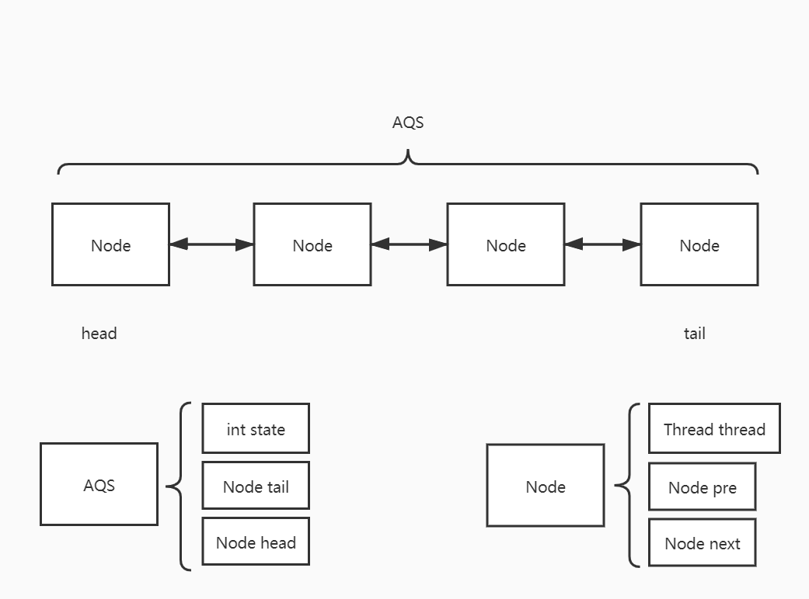

### ReentrantLock和synchronized的区别

### ReentrantReadWriteLock 读写锁

读写锁在ReentrantLock上进行了拓展使得该锁更适合读操作远远大于写操作对场景。

AQS中维护了一个state状态，读锁用高16位，表示持有读锁的线程数（sharedCount），写锁低16位，表示写锁的重入次数 （exclusiveCount）


#### 读写锁的实现

## 线程池

### 优点

1. 降低系统资源消耗，通过重用已存在的线程，降低线程创建和销毁造成的消耗；

2. 提高系统响应速度，当有任务到达时，通过复用已存在的线程，无需等待新线程的创建便能立即执行；

3. 方便线程并发数的管控。因为线程若是无限制的创建，可能会导致内存占用过多而产生OOM，并且会造成cpu过度切换。

   

### 工作流程


线程池的工作模型主要两部分组成，一部分是运行Runnable的Thread对象，另一部分就是阻塞队列。

由线程池创建的Thread对象其内部的run方法会通过阻塞队列的take方法获取一个Runnable对象，然后执行这个Runnable对象的run方法（即，在Thread的run方法中调用Runnable对象的run方法）。当Runnable对象的run方法执行完毕以后，Thread中的run方法又循环的从阻塞队列中获取下一个Runnable对象继续执行。这样就实现了Thread对象的重复利用，也就减少了创建线程和销毁线程所消耗的资源。

### 几种常见的线程池及使用场景

1、newSingleThreadExecutor
创建一个单线程化的线程池，它只会用唯一的工作线程来执行任务，保证所有任务按照指定顺序(FIFO, LIFO, 优先级)执行。

2、newFixedThreadPool
创建一个定长线程池，可控制线程最大并发数，超出的线程会在队列中等待。

3、newCachedThreadPool
创建一个可缓存线程池，如果线程池长度超过处理需要，可灵活回收空闲线程，若无可回收，则新建线程。

4、newScheduledThreadPool
创建一个定长线程池，支持定时及周期性任务执行。

**可能产生的问题：**

1）newFixedThreadPool和newSingleThreadExecutor:
  主要问题是堆积的请求处理队列可能会耗费非常大的内存，甚至OOM。
2）newCachedThreadPool和newScheduledThreadPool:
  主要问题是线程数最大数是Integer.MAX_VALUE，可能会创建数量非常多的线程，甚至OOM。

### 线程池的常见参数

（1）corePoolSize：线程池中常驻核心线程数如，果运行的线程等于或多于corePoolSize，则将任务加入BlockingQueue，如果无法将任务加入BlockingQueue（队列已满），则创建新的线程来处理任务。

（2）maximumPoolSize：线程池能够容纳同时执行的最大线程数，此值必须大于等于1

（3）keepAliveTime：多余的空闲线程存活时间。若当前线程池中的线程数量比核心线程数量多，并且是闲置状态，则这些闲置的线程所能存活的最大时间。

（4）TimeUnit：keepAliveTime的时间单位

（5）workQueue：用于保存等待执行的任务的阻塞队列

（6）threadFactory：表示生成线程池中的工作线程的线程工厂，用于创建线程，一般为默认线程工厂即可

（7）handler：拒绝策略，表示当队列满了并且工作线程大于等于线程池的最大线程数（maximumPoolSize）时采取的策略，如抛弃异常、摸摸丢弃


