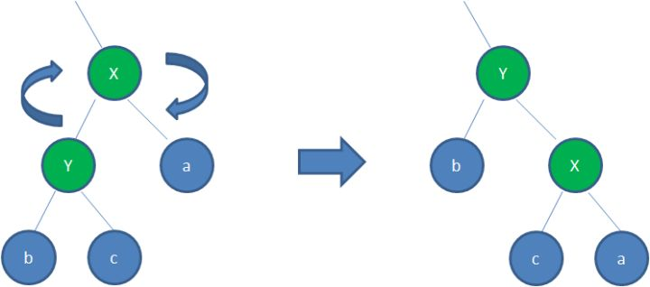
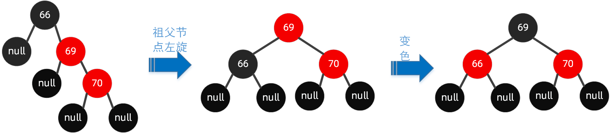
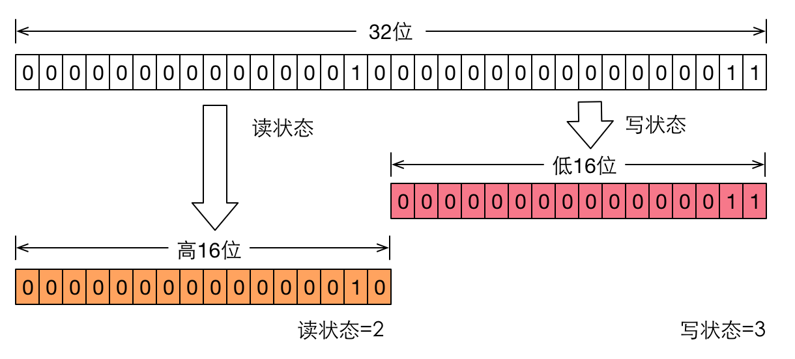

**迭代器**

迭代器是一种设计模式，他的工作方法是遍历并选择集合中的对象，只要拿到这个集合,使用迭代器就可以遍历这个集合，即我们无需关心该集合的底层结构是什么样子的。

Iterator接口：包含三个方法：hasNext，next，remove，remove一般很少用到

```java
public interface Iterator<E> {

    boolean hasNext();    //每次next之前，先调用此方法探测是否迭代到终点
    E next();            //返回当前迭代元素 ，同时，迭代游标后移
    void remove()
```


## List

### Arraylist 源码解析

**[https://www.jianshu.com/p/f863791e77fe]**

**扩容机制**

add操作时，判断当前size+1是否大于数组容量，若大于则grow扩容。

```java
    public boolean add(E e) {
        ensureCapacityInternal(size + 1);  // Increments modCount!!
        elementData[size++] = e;
        return true;
    }
```

```cpp
    private void ensureCapacityInternal(int minCapacity) {
        if (elementData == DEFAULTCAPACITY_EMPTY_ELEMENTDATA) {
            minCapacity = Math.max(DEFAULT_CAPACITY, minCapacity);
        }

        ensureExplicitCapacity(minCapacity);
    }
```

```cpp
    private void ensureExplicitCapacity(int minCapacity) {
        modCount++;

        // overflow-conscious code
        if (minCapacity - elementData.length > 0)
            grow(minCapacity);
    }
```

```cpp
    private void grow(int minCapacity) {
        // 1.首先获取到elementData数组的长度，作为原容量
        int oldCapacity = elementData.length;
        // 2.新容量 = 原容量 + 原容量/2；   1.5倍扩容
        int newCapacity = oldCapacity + (oldCapacity >> 1);
    
        if (newCapacity - minCapacity < 0)
            // 3.若1.5倍扩容后还不够，则将最小容量作为新容量
            newCapacity = minCapacity;
        if (newCapacity - MAX_ARRAY_SIZE > 0)
            // 4.限制最大容量
            newCapacity = hugeCapacity(minCapacity);
        // 5.进行原有数据元素copy处理
        elementData = Arrays.copyOf(elementData, newCapacity);
    }
```

### LinkedList源码解析

**[https://www.jianshu.com/p/6a9cb631b2ef]**

**[https://www.jianshu.com/p/6bda2c1e6ee0]**

增

```java
public boolean add(E e) {
    linkLast(e);
    return true;
}
//默认加在尾巴上
void linkLast(E e) {
    final Node<E> l = last;
    //新建节点 前节点为last 本身值为e 后节点为null
    final Node<E> newNode = new Node<>(l, e, null);
    last = newNode;
    //原本为空链表 加入第一个节点
    if (l == null)
        first = newNode;
    else
        l.next = newNode;
    size++;
    modCount++;
}
```

```java
//指定位置插入
public void add(int index, E element) {
    checkPositionIndex(index);

    if (index == size)
        linkLast(element);
    else
        linkBefore(element, node(index));
}
void linkBefore(E e, Node<E> succ) {
    // assert succ != null;
    final Node<E> pred = succ.prev;
    //新建节点 前节点为pre 本身值为e 后节点为succ
    final Node<E> newNode = new Node<>(pred, e, succ);
    succ.prev = newNode;
    if (pred == null)
        first = newNode;
    else
        pred.next = newNode;
    size++;
    modCount++;
}
```

查/改

```java
public E get(int index) {
    checkElementIndex(index);
    return node(index).item;
}
public E set(int index, E element) {
	checkElementIndex(index);
	Node<E> x = node(index);
	E oldVal = x.item;
	x.item = element;
	return oldVal;
}
Node<E> node(int index) {
    // index在链表的前边还是后边，size>>1 即取中点
    if (index < (size >> 1)) {
        Node<E> x = first;
        for (int i = 0; i < index; i++)
            x = x.next;
        return x;
    } else {
        Node<E> x = last;
        for (int i = size - 1; i > index; i--)
            x = x.prev;
        return x;
    }
}
```

删

```csharp
    public E remove(int index) {
        checkElementIndex(index);
        return unlink(node(index));
    }

    /**
     * Unlinks non-null node x.
     */
    E unlink(Node<E> x) {
        // assert x != null;
        // 1.获取到待删除结点的数据域和地址域
        final E element = x.item;
        final Node<E> next = x.next;
        final Node<E> prev = x.prev;

        // 2.判断prev 是否为null
        if (prev == null) {
            // prev == null，则说明当前待删除的结点为头结点，需要将next结点的内存地址赋值给first  删除完毕后，next结点作为头结点
            first = next;
        } else {
            // 将next结点的内存地址赋值给prev.next 并将删除结点的prev置为null          相当于“断开”双向链表的前一端
            prev.next = next;
            x.prev = null;
        }
   
        // 3.判断next是否为null
        if (next == null) {
            // next == null，则说明当前待删除的结点为尾结点，需要将prev结点的内存地址赋值给last  删除完毕后，prev结点作为尾结点
            last = prev;
        } else {
            // 将prev结点的内存地址赋值给next.prev 并将删除结点的next置为null          相当于“断开”双向链表的后一端
            next.prev = prev;
            x.next = null;
        }

        // 4.将删除结点的数据域置为null
        x.item = null;
        // 5.size自减1
        size--;
        modCount++;
        return element;
    }
```

### Arraylist 与 LinkedList 区别?

- **1. 是否保证线程安全：** `ArrayList` 和 `LinkedList` 都是不同步的，也就是不保证线程安全；

- **2. 底层数据结构：** `Arraylist` 底层使用的是 **`Object` 数组**；`LinkedList` 底层使用的是 **双向链表** 数据结构（JDK1.6之前为循环链表，JDK1.7取消了循环。注意双向链表和双向循环链表的区别，下面有介绍到！）

- **3. 插入和删除是否受元素位置的影响：** 

  ① `ArrayList` 采用数组存储，所以插入和删除元素的时间复杂度受元素位置的影响。 比如：执行`add(E e)`方法的时候， `ArrayList` 会默认在将指定的元素追加到此列表的末尾，这种情况时间复杂度就是O(1)。但是如果要在指定位置 i 插入和删除元素的话（`add(int index, E element)`）时间复杂度就为 O(n-i)。因为在进行上述操作的时候集合中第 i 和第 i 个元素之后的(n-i)个元素都要执行向后位/向前移一位的操作。 

  ② `LinkedList` 采用链表存储，所以对于`add(E e)`方法的插入，删除元素时间复杂度不受元素位置的影响，近似 O(1)(因其内部维护有存储表头表尾地址的变量)，如果是要在指定位置`i`插入和删除元素的话（`add(int index, E element`） 时间复杂度近似为O(n)因为需要先移动到指定位置再插入。

- **4. 是否支持快速随机访问：** `LinkedList` 不支持高效的随机元素访问，而 `ArrayList` 支持。快速随机访问就是通过元素的序号快速获取元素对象(对应于`get(int index)`方法)。

- **5. 内存空间占用：** ArrayList的空 间浪费主要体现在在list列表的结尾会预留一定的容量空间，而LinkedList的空间花费则体现在它的每一个元素都需要消耗比ArrayList更多的空间（因为要存放直接后继和直接前驱以及数据）。

  

  ==对于随机访问get和set，ArrayList优于LinkedList，因为LinkedList要移动指针。 
   对于新增和删除操作add和remove，LinedList比较占优势，因为ArrayList要移动数据。==

  虽然新增和删除操作下，LinkedList由于需要访问到index所以时间复杂度退化到O(n)，但实际操作下来，访问到index的速度还是比 Arraylist 元素向后位/向前移一位的操作 要快的。


## Map

### **HashMap 的数据结构**

HashMap的主干是一个Node数组。Node是HashMap的基本组成单元，每一个Node包含一个key-value键值对。

简单来说，**HashMap由数组+链表+红黑树组成的**，数组是HashMap的主体，链表则是主要为了解决哈希冲突而存在的，当链表长度等于8，则转化为红黑树

```java
static class Node<K,V> implements Map.Entry<K,V> {
   final int hash;
   final K key;
   V value;
   Node<K,V> next;
```


### JDK1.8后HashMap所做优化

|          | JDK1.7    | JDK1.8           |
| -------- | --------- | ---------------- |
| 数据结构 | 数组+链表 | 数组+链表+红黑树 |
| hash算法 |           |                  |
|          | 头插法    | 尾插法           |


### JDK1.8后的hash算法

**hash算法优化**

```java
//重新计算哈希值
static final int hash(Object key) {
	int h;
    //key如果是null,新hashcode是0,否则,新的hashcode为原hashcode无符号右移16位后与原hashcode做异或运算
	return (key == null) ? 0 : (h = key.hashCode()) ^ (h >>> 16);
}
```

*寻址算法*

```java
index = hash&(length-1) //key的hash值和数组长度-1的32位二进制数进行与运算
```

先有的寻址算法优化再有的hash算法优化。

==古老的寻址方法是hash对数组长度取模，优化后的寻址算法能达到同样的效果且性能更好。==

而为什么要hashcode高低16位进行异或呢？因为当node数组长度比较小，而hashcode的值比较大的时候，直接hashcode & (node数组长度 - 1）运算，hashcode的高16位是不会参加运算的，因为node数组长度 - 1的高16位都是0。所以hashcode的高低16位进行异或，就达到了高16位和低16位都参与运算的效果，让hash算法更加均匀。


==综合低16位与高16的影响，减少hash碰撞==

### 扩容机制（为什么扩容是2的n次幂）

hashmap默认长度是16，负载因子是 0.75f，threshold =0.75*16=12，也就是说，插入 12 个键值对就会扩容。

**hashmap维护的node数组的长度永远是2的n次方**，在扩容时，会扩大到原来的两倍，因为使用的是**2的次幂扩展**，==那么元素的位置要么保持不变，要么在原位置上偏移2的次幂==。这里用到寻址算法优化


上图可以看到，扩大2倍，相当于 n 左移一位，那么 n-1 在高位就多出了一个 1，此时与原散列值进行与运算，就多参与了一位，这个比特位要么是 0，要么是 1:

- 0 的话索引不变
- 1 的话索引就变成"原索引+oldCap"

==扩容时，利用 2 的次幂数值的二进制特点，既省去重新计算 hash 的时间，又把之前冲突的节点散列到了其他位置==

### hashmap的get/put过程

***知道hashmap中put元素的过程是什么样么?***

对key的hashCode()做hash运算，计算index; 如果没碰撞直接放到bucket里； 如果碰撞了，以链表的形式存在buckets后； 如果碰撞导致链表过长(大于等于TREEIFY_THRESHOLD)，就把链表转换成红黑树(JDK1.8中的改动)； 如果节点已经存在就替换old value(保证key的唯一性) 如果bucket满了(超过load factor*current capacity)，就要resize。

***知道hashmap中get元素的过程是什么样么?***

对key的hashCode()做hash运算，计算index; 如果在bucket里的第一个节点里直接命中，则直接返回； 如果有冲突，则通过key.equals(k)去查找对应的Node;

- 若为树，则在树中通过key.equals(k)查找，O(logn)；
- 若为链表，则在链表中通过key.equals(k)查找，O(n)。

***你还知道哪些hash算法？***

MD5 SHA-1

***说说String中hashcode的实现?(此题频率很高)***

```java
public int hashCode() {
    int h = hash;
    if (h == 0 && value.length > 0) {//value为将字符串截成的字符数组  
        char val[] = value;

        for (int i = 0; i < value.length; i++) {
            h = 31 * h + val[i];
        }
        hash = h;
    }
    return h;
}
```

String类中的hashCode计算方法还是比较简单的，就是以31为权，每一位为字符的ASCII值进行运算，用自然溢出来等效取模。

例如String msg = "abcd";  // 此时value[] = {'a','b','c','d'}  因此

for循环会执行4次

第一次：h = 31*0 + a = 97 

第二次：h = 31*97 + b = 3105 

第三次：h = 31*3105 + c = 96354 

第四次：h = 31*96354 + d = 2987074 

由以上代码计算可以算出 msg 的hashcode = 2987074  

哈希计算公式可以计为`s[0]*31^(n-1) + s[1]*31^(n-2) + ... + s[n-1]`

那为什么以31为质数呢?

主要是因为31是一个奇质数，所以`31*i=32*i-i=(i<<5)-i`，这种位移与减法结合的计算相比一般的运算快很多。

### 红黑树

***为什么在解决hash冲突的时候，不直接用红黑树?而选择先用链表，再转红黑树?***

 因为红黑树需要进行左旋，右旋，变色这些操作来保持平衡，而单链表不需要。 当元素小于8个当时候，此时做查询操作，链表结构已经能保证查询性能。如果一开始就用红黑树结构，无疑这是浪费性能的。

***我不用红黑树，用二叉查找树可以么?*** 

可以。但是二叉查找树在特殊情况下会变成一条线性结构，遍历查找会非常慢。

***红黑树和二叉平衡树（AVL）之间的区别***

二叉平衡树（AVL）要求严格平衡，所有结点的左右子树高度差不超过1。不管我们是执行插入还是删除操作，只要不满足上面的条件，就要通过旋转来保存平衡，可能发生大量旋转所以非常耗时，由此我们可以知道AVL树适合用于插入与删除次数比较少，但查找多的情况。AVL更平衡，树高度更低，查找效率更高。

红黑树确保没有一条路径会比其他路径长出两倍，相对于要求严格的AVL树来说，它的旋转次数少，插入最多两次旋转，删除最多三次旋转，所以对于插入，删除操作较多的情况下，我们就用红黑树。


**红黑树定义**

1. 根节点是黑色

2. 叶子节点都为黑色，且为null

3. 新加入到红黑树的节点为红色节点

4. 红黑树不会出现相邻的红色节点（红色节点的父节点和子节点都为黑色）

5. 从任意节点出发，到其每个叶子节点的路径中包含相同数量的黑色节点

   

**性质**

从根节点到叶子节点的最长路径不大于最短路径的2倍


变色

左旋转


右旋转




**直接插入：**

新插入的节点父节点是黑色

**仅变色：**

1. 新插入的节点是根节点，红变黑
2. 新插入的节点父节点是红色，叔节点也是红色，那么将父与叔节点标记为黑色，祖节点为红色（祖节点变色原因是保证每个叶子节点的路径中包含相同数量的黑色节点），然后把祖节点当作新插入的节点递归重复这一判断。

**变色加旋转：**

**[https://www.cnblogs.com/LiaHon/p/11203229.html]**

新插入的节点父节点是红色，叔节点也是黑色或者为null

1. 左左节点旋转(/)       这种情况下，父节点和插入的节点都是左节点


2. 右右节点旋转(\\)    这种情况下，父节点和插入的节点都是右节点



3 左右节点旋转(<)   这种情况下，父节点是左节点，插入的节点是右节点---最后插入节点坐中间


4 右左节点旋转(>)  这种情况下，父节点是右节点，插入的节点是左节点---最后插入节点坐中间


### HashMap 和 Hashtable 的区别

1. **线程是否安全：** HashMap 是非线程安全的，HashTable 是线程安全的；HashTable 内部的方法基本都经过`synchronized` 修饰。（如果你要保证线程安全的话就使用 ConcurrentHashMap 吧！）；

2. **效率：** 因为线程安全的问题，HashMap 要比 HashTable 效率高一点。另外，HashTable 基本被淘汰，不要在代码中使用它；

3. **对Null key 和Null value的支持：** HashMap 中，null 可以作为键，这样的键只有一个，可以有一个或多个键所对应的值为 null。但是在 HashTable 中 put 进的键值只要有一个 null，直接抛出 NullPointerException。

4. **初始容量大小和每次扩充容量大小的不同 ：** 

   ①创建时如果不指定容量初始值，Hashtable 默认的初始大小为11，之后每次扩充，容量变为原来的2n+1。HashMap 默认的初始化大小为16。之后每次扩充，容量变为原来的2倍。

   ②创建时如果给定了容量初始值，那么 Hashtable 会直接使用你给定的大小，而 HashMap 会将其扩充为2的幂次方大小（HashMap 中的`tableSizeFor()`方法保证）。也就是说 HashMap 总是使用2的幂作为哈希表的大小。

5. **底层数据结构：** JDK1.8 以后的 HashMap 在解决哈希冲突时有了较大的变化，当链表长度大于阈值（默认为8）（将链表转换成红黑树前会判断，如果当前数组的长度小于 64，那么会选择先进行数组扩容，而不是转换为红黑树）时，将链表转化为红黑树，以减少搜索时间。Hashtable 没有这样的机制。

### HashMap 高并发下导致死循环问题

死循环问题在JDK1.7**扩容时**发生

JDK1.7采用头插法 **[https://www.cnblogs.com/mr-wuxiansheng/p/12865080.html]**

链表头插法扩容时会颠倒原来一个散列桶里面链表的顺序。在并发的时候原来的顺序被另外一个线程a颠倒了，而被挂起线程b恢复后拿扩容前的节点和顺序继续完成第一次循环后，又遵循a线程扩容后的链表顺序重新排列链表中的顺序，最终形成了环。

JDK1.8以后采用尾插法，不会造成死循环问题，不过还是会有并发问题。原因在于其内部操作不是原子的，譬如++size之类的操作依然会产生并发问题。

### HashMap、LinkedHashMap和TreeMap使用场景

|               | 有序性     | 实现及效率                                           | 线程安全 |
| ------------- | ---------- | ---------------------------------------------------- | -------- |
| HashMap       | 无序       | 基于散列表，无冲突时间复杂度O(1)，冲突时间复杂度O(n) | 不安全   |
| LinkedHashMap | 按插入顺序 | 基于HashMap和双向链表，时间复杂度同上                | 不安全   |
| TreeMap       | 按key顺序  | 基于红黑树，时间复杂度O(log n)                       | 不安全   |

### LinkedHashMap

LinkedHashMap继承了HashMap

其节点Entry`继承自`HashMap.Node，通过before、after维护了一个按插入顺序的双向链表。这里要和next区分开，next是指发生hash碰撞时生成链表的下一个。

```java
static class Entry<K,V> extends HashMap.Node<K,V> {
    Entry<K,V> before, after;
    Entry(int hash, K key, V value, Node<K,V> next) {
        super(hash, key, value, next);
    }
}
```

put操作时，相比HashMap，多了一个操作，即将put的新节点加到双向链表的尾端（LinkedHashMap内部两个成员变量`head tail`,分别指向内部双向链表的表头、表尾。）

```java
private void linkNodeLast(LinkedHashMap.Entry<K,V> p) {
    LinkedHashMap.Entry<K,V> last = tail;
    tail = p;
    if (last == null)
        head = p;
    else {
        p.before = last;
        last.after = p;
    }
}
```


### ConcurrentHashMap 

不管是1.7的HashEntry 还是1.8的Node，对其中的共享变量（val、next）都使用`volatile`关键字，保证多线程操作时，变量的可见性。`volatile`不保证原子性，所以put 操作时仍然需要加锁处理。


**JDK1.8以前**：采用分段锁 （Segment+ReentrantLock）。ConcurrentHashMap 在存储方面是一个 Segment 数组，Segment 里维护了一个 HashEntry 数组，其中 Segment 继承自 ReentrantLock（可重入），Segment类本身就是一个锁。

put和 get **两次Hash**到达指定的HashEntry，第一次hash到达Segment,第二次hash到达Segment里面的HashEntry ,然后在遍历HashEntry 链表。

**put** 操作时，会进行第一次key的hash来定位Segment的位置。进行第二次hash操作时，会找到Segment中相应的HashEntry的位置，鱿鱼Segment 继承自 ReentrantLock，会调用tryLock（）方法尝试去获取锁。如果获取成功就直接插入相应的位置，如果已经有线程获取该Segment的锁，那当前线程会以自旋的方式去继续的调用tryLock（）方法去获取锁，超过指定次数就挂起，等待唤醒

**get** 方法就比较简单了，因为不涉及增、删、改操作，所以不存在并发故障问题。


**JDK1.8以后**：并发控制使用CAS和Synchronized来操作。

**put**方法若该位置第一次插入元素则使用CAS插入元素，如果存在hash冲突，则使用Synchronized对该Node加锁再进行链表元素的修改或添加。

**get** 方法就比较简单了，因为不涉及增、删、改操作，所以不存在并发故障问题。


**为什么用Synchronized取代ReentrantLock**

即为什么不让Node继承ReentrantLock，也可以把锁细化，使用node.lock()就可以把node单独锁住，why not？

原因是锁粒度这么小的情况下，出现并发争抢的可能性较低，且出现争抢时只要线程可以在30到50次自旋里拿到锁,那么Synchronized就不会升级为重量级锁,而等待的线程也就不用被挂起,我们也就少了挂起和唤醒这个上下文切换的过程开销.（**涉及Synchronized锁优化/升级**）


### ConcurrentHashMap 和 Hashtable 的区别

ConcurrentHashMap 和 Hashtable 的区别主要体现在实现线程安全的方式上不同。

- **底层数据结构：** 

  JDK1.7的 ConcurrentHashMap 底层采用 分段的数组+链表 实现，JDK1.8 采用的数据结构跟HashMap1.8的结构一样，数组+链表+红黑树。

  Hashtable 和 JDK1.8 之前的 HashMap 的底层数据结构类似都是采用 数组+链表 的形式。

- **实现线程安全的方式（重要）：**

  ① **在JDK1.7的时候，ConcurrentHashMap（分段锁）** 对整个桶数组进行了分割分段(Segment)，每一把锁只锁容器其中一部分数据，多线程访问容器里不同数据段的数据，就不会存在锁竞争，提高并发访问率。 **到了 JDK1.8 的时候已经摒弃了Segment的概念，而是直接用 Node 数组+链表+红黑树的数据结构来实现，并发控制使用 CAS 和synchronized 来操作。** 

  ② **Hashtable(同一把锁)** :使用 synchronized 来保证线程安全，效率非常低下。当一个线程访问同步方法时，其他线程也访问同步方法，可能会进入阻塞或轮询状态，如使用 put 添加元素，另一个线程不能使用 put 添加元素，也不能使用 get，竞争会越来越激烈效率越低。

  

## Set

### HashSet

底层由HashMap来实现。

构造方法

```java
private transient HashMap<E,Object> map;
//默认构造器
public HashSet() {
    map = new HashMap<>();
}
```

add方法通过HashMap的put方法实现，HashSet添加的元素是存放在HashMap的key位置上，而value取了默认常量PRESENT，是一个空对象。

```java
private static final Object PRESENT = new Object();

public boolean add(E e) {
    return map.put(e, PRESENT)==null;
}
```

contains方法

```java
public boolean contains(Object o) {
    return map.containsKey(o);
}
```

**HashSet要球集合对象重写equals方法和hashCode方法**

比如HashSet存储Student对象，规定当学生的姓名、年龄、性别相等时，认为学生对象是相等的。此时学生对象重写equal的同时也要重写hashcode，否则会导致集合中存储多个相等的对象。

### HashSet、LinkedHashSet和TreeSet使用场景

|               | 有序性     | 实现及效率                        | 线程安全 |
| ------------- | ---------- | --------------------------------- | -------- |
| HashSet       | 无序       | 基于HashMap，时间复杂度O(1)~O(n)  | 不安全   |
| LinkedHashSet | 按插入顺序 | 基于LinkedHashMap，时间复杂度同上 | 不安全   |
| TreeSet       | 按key顺序  | 基于红黑树，时间复杂度O(log n)    |          |

### LinkedHashSet

LinkedHashSet继承自HashSet

狗仔方法

```java
    // 使用默认容量16, 默认装载因子0.75
    public LinkedHashSet() {
        super(16, .75f, true);
    }
```

HashSet对应方法

```java
    // HashSet的构造方法
    HashSet(int initialCapacity, float loadFactor, boolean dummy) {
        map = new LinkedHashMap<>(initialCapacity, loadFactor);
    }
```

LinkedHashSet继承自HashSet，它的添加、删除、查询等方法都是直接用的HashSet的方法，和HashSet唯一的不同就是它使用LinkedHashMap存储元素。


# 并发

## 基本方法

### **Object.java**

==wait(), notify()和notifyAll()  需在上锁的方法/代码块中使用==

wait()：是让当前线程进入等待状态，同时**会让当前线程释放立刻它所持有的锁**。

notify()：唤醒在此对象锁上等待的单个线程，**等线程结束后再释放锁。**
notifyAll()：唤醒在此对象锁上等待的所有线程，**等线程结束后再释放锁。**

### **Thread.java**

==join(),sleep(),yield()==

join(): 把指定的线程添加到当前线程中，当前线程等待join线程结束后再执行。

sleep():让出cpu给其他线程, 在一定时间内不参与cpu调度，**不释放锁**。

yield(): 让出cpu给其他线程, 并处于就绪状态。

## 基本概念

### 线程的生命周期和状态


### 线程与进程的区别

**进程是操作系统资源分配的基本单位，而线程是CPU任务调度和执行的基本单位**

|          | 进程                           | 线程                                           |
| -------- | ------------------------------ | ---------------------------------------------- |
| 运行状态 | 操作系统中能同时运行多个进程   | CPU在每个时间片只能执行一个线程                |
| 资源占用 | 多进程所拥有的的资源都是独立的 | 多线程共享所在进程所拥有的的内存空间和系统资源 |
| 包含关系 | 一个进程可以包含多个线程       |                                                |

### 死锁

多个并发进程因争夺系统资源而产生相互等待的现象。

形成死锁的4个条件

1. 互斥条件：某种资源一次只允许一个进程访问，即该资源一旦分配给某个进程，其他进程就不能再访问，直到该进程访问结束。

2. 占有并等待：进程占有资源，并等待被其他进程所占有的资源。

3. 非抢占：进程已获得的资源在未使用完之前，不能被抢占，只能在使用完时由自己释放。

4. 循环等待：有一组等待进程 {P1，P2，P3}，P1 等待的资源为 P2 占有，P2 等待的资源为 P3 占有，P3 等待的资源为 P1 占有。


**避免死锁**只要破坏产生死锁的四个条件中的其中一个

1. 资源能共享使用
2. 进程在运行前一次申请完它所需要的全部资源
3. 资源可以被抢占
4. 将资源编号，申请资源时必须按照编号的顺序进行。

### 实现多线程的方法

1. 继承Thread类，重写run方法
2. 实现Runnable接口，重写run方法，将实现类的实例对象作为Thread构造函数的参数
3. 实现Callable接口，重写call方法，将实现类作为参数创建FutureTask对象，将FutureTask对象作为Thread构造函数的参数
4. 通过线程池创建线程 

### **Thread和Runnable区别**

`Thread` 和 `Runnable` 实际上是一种静态代理的实现方式，`thread.start()` 方法会调用native方法需要系统调用来控制时间分片。

```java
class Thread implements Runnable { //Thread实现了Runnable接口
    private Runnable target;
    
    public Thread(Runnable target) {//有参构造方法传入Runnable对象
        init(null, target, "Thread-" + nextThreadNum(), 0);
        ····
        this.target = target;
    }
    
    public void run() {//执行重写后的run方法
        if (target != null) {
            target.run();
        }
    }    
}

```

```java
@FunctionalInterface //函数式接口 使用Lambda 表达式
public interface Runnable {
    public abstract void run(); //只有这一个抽象方法
}
```

实现Runnable接口比继承Thread类所具有的优势：

1. 可以避免java中的单继承的限制

   如果你想写一个类C，但这个类C已经继承了一个类A，此时，你又想让C实现多线程。用继承Thread类的方式不行了。（因为单继承的局限性），此时，只能用Runnable接口，

2. 有利于程序的健壮性，代码能够被多个线程共享，代码与数据是独立的。

## Volatile

### 特性

被volatile修饰的共享变量，就会具有以下两个特性：

1. **保证了不同线程对该变量操作的内存可见性。**

   volatile关键字解决可见性问题，通俗来说就是线程A对变量的修改，会直接刷新到主内存，同时将其他线程的工作内存中变量缓存失效过期。线程B当中，在对变量进行读取的时候，发现变量已过期，将从主内存中读取。

2. **禁止指令重排序。**

   volatile的happen-before原则：对一个volatile变量的写操作happen-before对此变量的任意操作(当然也包括写操作了)。

具体见缓存一致性和指令重排序章节

### volatile和synchronized的区别

- volatile关键字是线程同步的轻量级实现，所以volatile性能肯定比synchronized关键字要好。但是volatile关键字只能用于变量而synchronized关键字可以修饰方法、类以及代码块。
- 多线程访问volatile关键字不会发生阻塞，而synchronized关键字可能会发生阻塞
- volatile关键字能保证数据的可见性，但不能保证数据的原子性。synchronized关键字两者都能保证。
- volatile关键字主要用于解决变量在多个线程之间的可见性，而 synchronized关键字解决的是多个线程之间访问资源的同步性。

## JMM-Java内存模型

​	Java内存模型规定了所有的变量都存储在主内存中，每条线程还有自己的工作内存，线程的工作内存中保存了该线程中使用到的变量的主内存副本拷贝，线程间通信必须要经过主内存。

​    Java内存模型是一种规范，目的是保证并发编程场景中的**原子性**、**可见性**和**有序性**。


方法中的基本类型本地变量将直接存储在工作内存的栈帧结构中；（虚拟机栈）

引用类型的本地变量：引用存储在工作内存（虚拟机栈），实际存储在主内存；（堆）

成员变量、静态变量、类信息均会被存储在主内存中；（堆）


 Java内存模型是围绕着并发编程中**原子性**、**可见性**、**有序性**这三个特征来建立的

### 内存模型三大特性

**原子性：**原子性是指一个操作或多个操作要么全部执行，且执行的过程不会被任何因素打断，要么就都不执行。被synchronized关键字或Lock包裹起来的操作也可以认为是原子的。

**可见性：**可见性是指当一个线程修改了共享变量后，其他线程能够立即得到修改的值。volatile关键字要求被修改之后的变量立即更新到主内存，当其它线程需要读取该变量时，会去主内存中读取新值。除了volatile以外，synchronized和Lock也能实现可见性。线程在释放锁之前，会把共享变量值都刷回主存，但是synchronized和Lock的开销都更大。

**有序性：**有序性是指程序按照代码的先后顺序执行。java会对一些指令进行重排序。volatile和synchronized可以保证程序的有序性，

==重排序过程不会影响到单线程程序的执行，却会影响到多线程并发执行的正确性==

### happens-before原则

https://www.jianshu.com/p/1508eedba54d/

当前一个操作按顺序排在第二个操作之前，且两个操作之间有happen-before关系， **并不意味着前一个操作必须要在后一个操作之前执行，仅仅要求前一个操作的执行结果对于后一个操作是可见的**

单线程happen-before原则：在同一个线程中，书写在前面的操作happen-before后面的操作。

锁的happen-before原则：同一个锁的unlock操作happen-before此锁的lock操作。

volatile的happen-before原则：对一个volatile变量的写操作happen-before对此变量读写操作。

happen-before的传递性原则：如果A操作 happen-before B操作，B操作happen-before C操作，那么A操作happen-before C操作。


## 缓存一致性

### CPU多级缓存

　高速缓存L1、L2、L3，级别越小的缓存，越接近CPU， 意味着速度越快且容量越少。


L3 Cache和L1，L2 Cache有着本质的区别。，L1和L2 Cache都是每个CPU core独立拥有一个，而L3 Cache是几个Cores共享的，可以认为是一个更小但是更快的内存。

### 伪共享

缓存内部是按行存储的，每一行成为一个缓存行（Cache Line），缓存行的大小通常是64字节。

当CPU访问某个变量时，首先会看Cache中是否有该变量，如果有则直接从中获取，否则则去主内存中获取该变量。然后把该变量所在主内存部分一个Cache Line大小的内存复制到Cache中。缓存行的大小通常是64字节，这意味着即使只操作1字节的数据，CPU最少也会读取这个数据所在的连续64字节数据。

**CPU缓存行能带来免费加载数据的好处，所以处理数组性能非常高；**

如果使用的数据结构中的项在内存中不是彼此相邻的，比如链表，那么将得不到免费缓存加载带来的好处。

**多线程修改互相独立的变量时，如果这些变量处在同一个缓存行，只有一个线程能获取到CPU缓存行的Share状态并修改。由于产生修改，其他CPU中相应缓存行转为Invalid 状态，变量需要重新加载。**

```java
volatile int a = 0;
int b = 0;
```

线程A、B分别使用到变量a、b，且a、b内存上相邻，则两变量位于同一缓存行被加载到CPU1 和 CPU2 缓存中。

此时线程A修改 volatile变量 a， 此时当前处理器缓存行的数据会写回到系统内存，这个写回内存的操作会引起在其他CPU里缓存了变量 a内存地址的缓存行无效。导致线程B对应的缓存行失效。

**避免伪共享**需要进行缓存行填充，周边填充一些空的变量，保证一个缓存行中只有一个volatile变量。

```java
public final static class VolatileLong {
    long p0, p1, p2, p3, p4, p5, p6;
    public volatile long value = 0;
    long q0, q1, q2, q3, q4, q5, q6;
}
```

在Java 8中，提供了@sun.misc.Contended注解来避免伪共享，原理是在使用此注解的对象或字段的前后各增加128字节大小的padding，使用2倍于大多数硬件缓存行的大小来避免相邻扇区预取导致的伪共享冲突。

### 缓存一致性协议（MESI）

https://albk.tech/%E8%81%8A%E8%81%8A%E7%BC%93%E5%AD%98%E4%B8%80%E8%87%B4%E6%80%A7%E5%8D%8F%E8%AE%AE.html

为了保证多核cpu各个缓存的数据的一致性。

CPU中每个**缓存行**使用四种状态进行标记。

M：Modified 修改：指的是该缓存行只被缓存在该CPU缓存中，并且是被修改过的，因此他与主存的数据是不一致的，该缓存行中的数据需要在未来的某个时间点（允许其他CPU读取主存相应的内容之前）写回主存，然后状态变成E（独享）。

E ：Exclusive 独享：缓存行只被缓存在该CPU的缓存中，是未被修改过的，与主存的数据是一致的，可以在任何时刻当有其他CPU读取该内存时，变成S（共享）状态，当CPU修改缓存行的内容时，变成M（修改）的状态。

S ：Share 共享：意味着该缓存行可能被多个CPU进行缓存，并且该缓存中的数据与主存数据是一致的，当有一个CPU修改该缓存行时，其他CPU是可以被作废的，变成I（无效的）。

I ：Invalid 无效的：代表这个缓存是无效的，可能是有其他CPU修改了该缓存行。


~~**对于M和E状态而言总是精确的，他们在和该缓存行的真正状态是一致的，而S状态可能是非一致的。**如果一个缓存将处于S状态的缓存行作废了，而另一个缓存实际上可能已经独享了该缓存行，但是该缓存却不会将该缓存行升迁为E状态，这是因为其它缓存不会广播他们作废掉该缓存行的通知~~

## 指令重排序

### 单线程的重排序（as-if-serial ）

as-if-serial 语义的意思指：不管怎么重排序（编译器和处理器为了提高并行度），（单线程）程序的执行结果不能被改变。

为了遵守 as-if-serial 语义，编译器和处理器不会对存在数据依赖关系的操作做重排序，因为这种重排序会改变执行结果。但是，如果操作之间不存在数据依赖关系，这些操作可能被编译器和处理器重排序。

a和b不依赖，c和a、b都依赖。

```cpp
double a  = 1;   
double b   = 2;    
double c = a * b; 
```

### 多线程的重排序

多线程的重排序会产生问题。

https://www.jianshu.com/p/c6f190018db1

使用Synchronized同步程序，保证程序的顺序一致性，可以避免重排序带来的问题。--《java并发编程的艺术 p34》


### 硬件的内存屏障


[内存屏障](https://www.cnblogs.com/yungyu16/p/13200620.html)

[写缓冲器、无效化队列](https://www.dazhuanlan.com/2019/11/20/5dd437409b744/?__cf_chl_jschl_tk__=19c39a66962e36b04aa9bf7272396c53b47a887e-1600091754-0-AdN1I-TJj-MmD9NWzk8rPBqVb2_5q2sL2MkfdSgcdJA19T0FE8w1NVlnP-l09vdaDeroPbdKwKWPKOT14XKOV0upxths3b2vRJ6R9LV12YdnugZu52UYk2jG493BvqTwvsFLZxn9BoaknPHZ3R_5pAl-Ojij5NN5qwqLHBgujmPIWaGOAfwnspcDbXS_U4I4ttqacPOaj3Lh0M2Yc4t9N2xNEIKTFd_QMqgVOR8zFFqQZ-e5zF_tOAmuMq0oAbcSWigiAGjR7BjYBIYEMS_VBXEnwds0-yQoggbT-zn1p6xd2v-jLAtfCXXxmQDqMEt1Dg)

[内存屏障](https://zhuanlan.zhihu.com/p/125737864)

[内存屏障](https://zhuanlan.zhihu.com/p/35386457)

在多核CPU的情况下，因为多核CPU上的指令同时执行，如果涉及到共享变量的修改，这种优化会影响多线程运行的正确性,而**内存屏障**是硬件层面提供的一系列特殊指令，当CPU处理到这些指定时，会做一些特殊的处理，可以使处理器内的内存状态对其它处理器可见，在不同的平台上支持的内存屏障也会有差异。


MESI协议解决了缓存一致性问题，一个Cache Line在Share状态发生了更改，通过总线通信去通知其他CPU作废掉对应Cache Line。在进行写数据的时候是处于一种阻塞的状态，只有等待写操作进行完毕，其他处理器存于高速缓存的数据被设置为 I (无效)的时侯，待其返回设置完毕的命令的时候，我们的执行处理器才能够继续执行。这个问题导致了延迟，为了避免减少写操作带来的性能问题，硬件层面引入了**写缓冲器**（store/write buffer）和**无效化队列**（invalidate queue)。本质上是一种**异步**操作。


引入写缓冲器，使得处理器在执行写操作的时候，写入写缓冲器中，则认为写操作已经完成。而实际上，当处理器收到其他所有处理器回应的Read Response、Invalidate Acknowledge消息后，处理器才会将写缓冲器中对应的写操作写入相应的缓存行，这个时候，写操作才算真正完成。

引入无效化队列，使得处理器在收到`Invalidate`消息之后，并不立马删除地址中对应的副本数据（其实是更新缓存行的状态为无效）,而是将消息存入无效化队列之后就直接响应`Invalidate Response`消息了，从而减少了写操作执行处理器的等待时间。

写缓冲器和无效化队列相当于又破坏了缓存一致性，从而**导致了表面上的指令重排序**。写缓冲器使得当CPU1对变量的写操作没有执行完时，CPU2对变量的读操作读到的是旧的值。无效化队列虽然收到到变量已更改的通知，但是却没有及时更改，导致使用的依然是未更新的变量。

CPU通常提供了内存屏障指令，来解决这样的问题。读屏障(Load Barrier)，清空本地的invalidate queue，保证之前的所有load都已经生效；写屏障(Store Barrier)，清空本地的store buffer，使得之前的所有store操作都生效。


### JMM的内存屏障

|      屏障类型      |            示例            |                             含义                             |
| :----------------: | :------------------------: | :----------------------------------------------------------: |
|  **LoadLoad屏障**  |   Load1; LoadLoad; Load2   | 在Load2加载代码读取数据前，保证Load1加载代码要从主内存里面读取的数据读取完毕。 |
| **StoreStore屏障** | Store1; StoreStore; Store2 | 在Store2存储代码进行写入操作执行前，保证Store1的写入操作已经把数据写入到主内存里面，确认Store1的写入操作对其它处理器可见。 |
| **LoadStore屏障**  |  Load1; LoadStore; Store2  | 在Store2存储代码进行写入操作执行前，保证Load1加载代码要从主内存里面读取的数据读取完毕。 |
| **StoreLoad屏障**  |  Store1; StoreLoad; Load2  | 在Load2加载代码在从主内存里面读取的数据之前，保证Store1的写入操作已经把数据写入到主内存里面，确认Store1的写入操作对其它处理器可见。 |


**volatile内存语义**

- 在每个 volatile 写操作的前面插入一个 StoreStore 屏障

  ​	让其他线程修改A变量后，把修改的值对当前线程可见

- 在每个 volatile 写操作的后面插入一个 StoreLoad 屏障

  ​	让其他线程获取A变量的时候，能够获取到已经被当前线程修改的值

- 在每个 volatile 读操作的后面插入一个 LoadLoad 屏障

  ​	让当前线程获取A变量的时候，保证其他线程也都能获取到相同的值

- 在每个 volatile 读操作的后面插入一个 LoadStore 屏障

  ​	让当前线程在其他线程修改A变量的值之前，获取到主内存里面A变量的的值


## Synchronized

### 使用

- **修饰实例方法:** 作用于当前对象实例加锁

- **修饰静态方法:** 也就是给当前类加锁，会作用于类的所有对象实例。所以如果一个线程 A 调用一个实例对象的非静态 synchronized 方法，而线程 B 需要调用这个实例对象所属类的静态 synchronized 方法，不会发生互斥现象，**因为访问静态 synchronized 方法占用的锁是当前类的锁，而访问非静态 synchronized 方法占用的锁是当前实例对象锁**。

- **修饰代码块:** 锁是synchronized括号里配置的对象

  **总结：** synchronized 关键字加到 static 静态方法和 synchronized(class)代码块上都是是给 Class 类上锁。synchronized 关键字加到实例方法上是给对象实例上锁。尽量不要使用 synchronized(String a) 因为JVM中，字符串常量池具有缓存功能！

**线程安全的单例模式（双重检查锁DLC方式）**

```java
public class Singleton {  
    private volatile static Singleton instance;  
    
    private Singleton (){}  
    
    public static Singleton getSingleton() {  
    if (instance == null) {  
        synchronized (Singleton.class) {  
        	if (instance == null) {  
           		instance = new Singleton();  
        	}  
        }  
    }  
    return instance;  
    }  
}

```

锁加到 getSingleton() 前也可以解决问题，但会导致很大的性能开销。

**为什么要进行第二次判断呢？**

如果多个线程**同时**通过了第一次检查，并且其中一个线程获得锁后首先实例化了对象。释放锁后，如果不进行二次判断，其他线程获取锁还是会创建对象，产生错误。

**为什么对实例加volatile呢？**

初始化对象分为以下三个步骤

1. 分配内存空间
2. 初始化对象（new）
3. 将对象指向刚分配的内存空间

但是有些编译器为了性能的原因，可能会将第二步和第三步进行重排序

例如，线程 A 执行了`分配内存空间`和 `将对象指向刚分配的内存空间`，此时 B 调用 getSingleton() 后发现 instance 不为空，因此返回 instance，从而返回一个未初始化的对象。

### JDK*1.6* 对 synchronized 的锁优化

**适应性自旋锁**、**锁消除**、**锁粗化**、**偏向锁和轻量级锁（锁升级）**


**适应性自旋锁**

~~自旋锁本身是有缺点的，它不能代替阻塞。自旋等待虽然避免了线程切换的开销，但它要占用处理器时间。如果锁被占用的时间很短，自旋等待的效果就会非常好。反之，如果锁被占用的时间很长，那么自旋的线程只会白浪费处理器资源。所以，自旋等待的时间必须要有一定的限度，如果自旋超过了限定次数（默认是10次，可以使用`-XX:PreBlockSpin`来更改）没有成功获得锁，就应当挂起线程。~~

自适应意味着自旋的时间（次数）不再固定。某个线程如果自旋成功了，那么下次自旋的次数会更加多，因为虚拟机认为既然上次成功了，那么此次自旋也可能成功。反之，如果对于某个锁，很少有自旋能成功的，那么以后等待这个锁的时候自旋的次数会减少甚至不自旋。 

**锁消除**

锁消除是指对检测到的不可能存在共享数据竞争的锁进行消除。

```java
@Override
public synchronized StringBuffer append(String str) {
    toStringCache = null;
    super.append(str);
    return this;
}

public static String createStringBuffer(String str1, String str2) {
    StringBuffer sBuf = new StringBuffer();
    sBuf.append(str1);// append方法是同步操作
    sBuf.append(str2);
    return sBuf.toString();
}

```

比如，StringBuffer类的append方法用了synchronized关键词，它是线程安全的。但当StringBuffer作为局部变量时，不同线程有不同的StringBuffer实例，不会发生数据竞争，此时的append操作若是使用synchronized加锁，就是白白浪费的系统资源。

 

**锁粗化**

代码中前后相邻的synchronized块的是同一锁对象,那么这几个synchronized块会被合并成一个较大的同步块, 就无需频繁申请与释放锁了,从而提升了性能。

```dart
    public String cancatString(String s1, String s2, String s3){
        StringBuffer sb = new StringBuffer();
        sb.append(s1);
        sb.append(s2);
        sb.append(s3);
        return sb.toString();
    }
```

上面代码中，连续的append方法就属于这种情况。这时虚拟机就会把锁同步的范围扩展（粗化）到整个操作序列的外部，即第一个append()操作之前直至最后一个append()操作之后，这样只需要加锁一次就可以了。


### 锁升级

级别由低到高依次为：**偏向锁状态**、**轻量级锁状态**、**重量级锁状态**。

==锁可以升级但不能降级。==


synchronized用的锁存在Java对象头里，Java对象头里的Mark Word默认存储对象的HashCode、分代年龄和锁标记位。


**偏向锁**：偏向锁是指当一段同步代码一直被同一个线程所访问时，即不存在多个线程的竞争时，那么该线程在后续访问时便会自动获得偏向锁，减少获取锁的资源消耗。

当一个线程访问同步块并尝试获取锁时，检测Mark Word的线程ID是否指向当前线程，若指向则直接执行同步代码。否则则CAS操作竞争锁，若CAS竞争成功，则将Mark Word中线程ID设置为当前线程ID，然后执行同步代码。

若CAS竞争失败，表示有竞争，偏向锁升级为轻量级锁。

**轻量级锁**：通过CAS获取锁，CAS获取锁失败，允许一定次数的自旋，当自旋超过一定的次数时，轻量级锁便会升级为重量级锁。

**重量级锁**：重量级锁依赖于底层操作系统实现，操作系统实现线程之间的切换需要从用户态切换到内核态，切换成本非常高。但若一直使用轻量级锁，等待线程的不断自旋也会消耗CPU资源，使用重量级锁后等待线程相当于被阻塞在队列中，不耗费资源。当轻量级锁耗费资源高过重量级锁时(大量自旋）使用重量级锁。


### 原理

**synchronized 关键字底层原理属于 JVM 层面。**

**① synchronized 同步语句块的情况**

synchronized 同步语句块的实现使用的是 monitorenter 和 monitorexit 指令， 当执行 monitorenter 指令时，线程试图获取锁也就是获取对象头中monitor的持有权。当计数器为0则可以成功获取，获取后将锁计数器设为1也就是加1。相应的在执行 monitorexit 指令后，将锁计数器设为0，表明锁被释放。如果获取对象锁失败，那当前线程就要阻塞等待，直到锁被另外一个线程释放为止。

**② synchronized 修饰方法的的情况**

synchronized 修饰的方法并没有 monitorenter 指令和 monitorexit 指令，取得代之的确实是 ACC_SYNCHRONIZED 标识，该标识指明了该方法是一个同步方法，进而执行count +1 count-1 操作

### synchronized和lock的区别

| 类别     | synchronized                                                 | lock                                                         |
| -------- | ------------------------------------------------------------ | ------------------------------------------------------------ |
| 存在层次 | java的关键字，在jvm层面上                                    | 是一个API/类/接口                                            |
| 锁的释放 | 1、以获取锁的线程执行完同步代码，释放锁  2、线程执行发生异常，jvm会让线程释放锁 | 在finally中必须释放锁，不然容易造成线程死锁                  |
| 锁的获取 | 假设A线程获得锁，B线程等待，如果A线程阻塞，B线程会一直等待   | 分情况而定，lock有多个锁获取的方法，可以尝试获得锁(tryLock)，线程可以不用一直等待 |
| 锁状态   | 无法判断                                                     | 可以判断                                                     |
| 锁类型   | 可重入   不可中断   非公平                                   | 可重入 可中断(lockInterruptibly)   可公平                    |
| 性能     | 少量同步                                                     | 大量同步                                                     |

## ThreadLocal

ThreadLocal 适用于多线程下变量不需要共享的情况，保证存储进去的数据，只能被当前线程读取到，并且线程之间不会相互影响。ThreadLocal为变量在每个线程中都创建了一个副本，那么每个线程可以访问自己内部的副本变量。 

​	ThreadLocal有哪些典型的应用场景： 

​	1.数据库事务。事务是和线程绑定起来的，Spring中通过AOP的方式，在事务开始时会给当前线程绑定一个Jdbc Connection,在整个事务过程都是使用该线程绑定的connection来执行数据库操作，实现了事务的隔离性。

​	2.web项目中，用户的登录信息通常保存在session中。做一个拦截器，把session放在ThreadLocal中，在任何用到用户信息的时候，只需要从TreadLocal中读取就可以了。

### 使用


ThreadLocal实例对象 作为全局的静态属性

线程可以引用到其实例对象并调用其方法

### 原理	


- `Thread` 类有维护了一个属性变量 `threadLocals` （ThreadLocal.ThreadLocalMap threadLocals = null），也就是说每个线程有都一个自己的 `ThreadLocalMap` ，所以每个线程往这个 `ThreadLocal` 中读写隔离的，并且是互相不会影响的 。
- `ThreadLocalMap` 类是 `ThreadLocal` 类的静态内部类
- `ThreadLocalMap` 维护了一个 `Entry` 数组，`Entry` 的 key 是 `ThreadLocal` 对象，value 是存入的对象，所以一个 `ThreadLocal` 只能对应一个Object对象
- `Entry` 的 key 引用 `ThreadLocal` 是弱引用


ThreadLocal类set()方法中，获得当前线程的 ThreadLocalMap ，设置 map 的 key 为 this 即 ThreadLocal 的实例，所以每个线程的 ThreadLocalMap 都有相同的key 只不过保存的 value 不同

```java
    public void set(T value) {
        Thread t = Thread.currentThread();
        ThreadLocal.ThreadLocalMap map = getMap(t);
        if (map != null)
            map.set(this, value);
        else
            createMap(t, value);
    }
    
    ThreadLocal.ThreadLocalMap getMap(Thread t) {
        return t.threadLocals;
    }

    void createMap(Thread t, T firstValue) {
        t.threadLocals = new ThreadLocal.ThreadLocalMap(this, firstValue);
    }
```

### ThreadLocal 内存泄露问题

`ThreadLocalMap` 中 `Entry` 使用的 key 为 `ThreadLocal`对象的弱引用,而 value 是强引用。

使用弱引用是为了防止Entry对象和ThreadLocal对象存在强引用关联，而导致ThreadLocal对象无法被GC回收，从而引发内存泄漏。然鹅阻止了一种内存泄漏，引起了另一种内存泄漏。

如果 `ThreadLocal` 没有被外部强引用的情况下，在垃圾回收的时候，key 会被清理掉，而 value 不会被清理掉。这样一来，`ThreadLocalMap` 中就会出现key为null的Entry。假如我们不做任何措施的话，value 永远无法被GC 回收，线程迟迟不结束的话就可能会产生内存泄露。ThreadLocalMap实现中已经考虑了这种情况，在调用 `set()`、`get()`、`remove()` 方法的时候，会清理掉 key 为 null 的记录。==使用完 `ThreadLocal`后 最好手动调用`remove()`方法==

## JUC-原子类与并发List

### CAS原理

CAS即compare and swap(比较与交换)，它涉及到三个操作数：内存值、预期值、新值。当且仅当预期值和内存值相等时才将内存值修改为新值，否则就什么都不做。整个比较并替换的操作是一个原子操作。

**ABA问题**

线程1准备用CAS将变量的值由A替换为C，在此之前，线程2将变量的值由A替换为B，又由B替换为A，然后线程1执行CAS时发现变量的值仍然为A，所以CAS成功。但实际上这时的现场已经和最初不同了，尽管CAS成功，但可能存在潜藏的问题。

解决：通过版本耗来保证CAS的正确性。每次在执行数据的修改操作时，都会带上一个版本号，一旦版本号和数据的版本号一致就可以执行修改操作并对版本号执行+1操作，否则就执行失败

**CAS实现自旋锁**

```java
 public class SpinLock {
        private AtomicReference<Thread> owner = new AtomicReference<>();

        public void lock() {
            //获取当前线程对象
            Thread current = Thread.currentThread();
            //当owner持有线程不为空时，循环等待
            while (!owner.compareAndSet(null, current)) {
                //当owner持有线程为空时，将owner持有线程设为当前线程，退出循环
            }
        }

        public void unlock() {
            Thread current = Thread.currentThread();
            //执行完成后，将owner持有线程重新置为空，相当于释放锁
            owner.compareAndSet(current, null);
        }
    }
//线程A先获取锁sleep一秒钟，这时候线程B尝试获取锁不断自旋 一秒钟后A释放锁 B获取锁后再释放 程序结束
public class test {
    public static void main(String[] args) {
        SpinLock mySpinLock = new SpinLock();
        
        new Thread(()->{
            mySpinLock.lock();
            try { 
                TimeUnit.SECONDS.sleep(1); 
            } 
            catch (InterruptedException e) {
                e.printStackTrace(); 
            }
            mySpinLock.unLock();
        },"A").start();

        new Thread(()->{
            mySpinLock.lock();
            mySpinLock.unLock();
        },"B").start();
    }
}
```


### Atomic 原子类

原子类都存放在`java.util.concurrent.atomic`下

下面以AtomicInteger为例

```java
public class AtomicInteger extends Number implements java.io.Serializable {
    private static final long serialVersionUID = 6214790243416807050L;
 
    private static final Unsafe unsafe = Unsafe.getUnsafe();
    private static final long valueOffset;
 
    static {
        try {
            //获取value在AtomicInteger中的偏移量
            valueOffset = unsafe.objectFieldOffset
                (AtomicInteger.class.getDeclaredField("value"));
        } catch (Exception ex) { throw new Error(ex); }
    }
 	//实际变量值value
    private volatile int value;
    

    public final int incrementAndGet() {
        return unsafe.getAndAddInt(this, valueOffset, 1) + 1;
	}
    
    public final int getAndAddInt(Object obj, long valueOffset, int delta) {
        int expect;
        //自旋
        do {
            //获取主存的值
            expect = this.getIntVolatile(obj, valueOffset);
        //CAS操作
        } while(!this.compareAndSwapInt(obj, valueOffset, expect, expect + delta));
 
        //返回旧值
        return expect;
    }
}
```


### CopyOnWriteArrayList

**写时复制**，适合**读多写少**的情况

读取的时候可以写入，保存数据的数组使用**volatile**修饰，保证读取时读取写入后的最新数据。

```java
private transient volatile Object[] array;
```

写入时需要**加锁**，避免多线程写的时候会 copy 出多个副本。

add(E) 的时候。容器会自动copy一份出来然后再尾部add(E)。

```java
    public boolean add(E e) {
    final ReentrantLock lock = this.lock;
    lock.lock();
    try {
        Object[] elements = getArray();
        int len = elements.length;
        Object[] newElements = Arrays.copyOf(elements, len + 1);
        newElements[len] = e;
        setArray(newElements);
        return true;
    } finally {
        lock.unlock();
    }
    }
```

**弱一致性迭代器**

返回迭代器后，其他线程对list的增删改时对迭代器不可见

**优点**

适合读多写少的情况，性能相对于Vector（增删改查全用synchronized ）会好很多

**缺点**

数据一致性问题：在添加到拷贝数据而还没进行替换的时候，读到的仍然是旧数据。

内存占用问题：如果对象比较大，频繁地进行替换会消耗内存，从而引发 Java 的 GC 问题。

## JUC-锁与同步器

### AQS原理

AQS全称为AbstractQueuedSynchronizer,即抽象同步队列。设计模式：**模板模式**

AQS是实现同步器的基础组件，并发包中各种锁也是由AQS所实现

AQS是一个FIFO的**双向队列**，队列中元素的类型为Node，每个Node中有一个thread变量用来存放进入AQS的线程。

AQS中维持了一个单一的状态信息state，**线程同步的关键是通过CAS对状态值state的操作**。对于不同的锁和同步器，state的含义不同。对ReentrantLock的实现，state表示可重入次数。

AQS有一个内部类ConditonObject，具有await() signal() signalAll() 3个方法，类似于wait(), notify()和notifyAll() 方法，只有获取到锁的线程才配使用ConditonObject中方法。**一个Lock对象可以创建多个ConditonObject对象，在每个ConditonObject对象中维护一个Node队列**，用来存放被await()方法阻塞的线程。

流程是获取到锁的线程A调用ConditonObject对象的await()方法，则该线程会释放锁，并转换为Node节点插入到ConditonObject对象的条件队列中。此时线程B获取到锁，调用ConditonObject对象的signal()/signalAll()方法，将条件队列里一个/全部节点移动到AQS队列中。


AQS方法不带踹的是自己实现的，带踹的是子类自己实现的


源码解析 **[https://www.jianshu.com/p/282bdb57e343]**

以下源码结合ReentrantLock看

加锁时：

lock---acquire---tryAcquire

​							失败后---acquire --------------- ←

解锁时：                                                               ↑

unlock---release---tryRelease---release() -------

一句话总结： 线程抢锁失败就被放到队列里，当锁被释放则通知队列中下一个节点去抢锁

#### acquire()

```java
public final void acquire(int arg) {
    if (!tryAcquire(arg) && //tryAcquire失败 
        acquireQueued(addWaiter(Node.EXCLUSIVE), arg))
        selfInterrupt();
}
```

**addWaiter(Node mode)**：

将当前线程封装为Node.EXCLUSIVE的Node节点并插入到AQS阻塞队列尾部

**acquireQueued(final Node node, int arg)**

```java
for(;;){

若node的前节点是head，进行tryAcquire(arg)，成功后将其在队列中移除

否则进入等待状态，线程被中断或者**前驱节点被释放时**再循环到上一步

}
```

#### release()

```java
public final boolean release(int arg) {
    if (tryRelease(arg)) {
        Node h = head;
        //若头结点有效则唤醒head的下一个节点
        if (h != null && h.waitStatus != 0)
            unparkSuccessor(h);
        return true;
    }
    return false;
}
```

鱿鱼tryRelease运行后 锁就可以被争夺。unparkSuccessor唤醒下一个节点后，acquireQueued循环得以运行，唤醒线程A进行tryAcquire(arg)判断，若在这之前有个线程B冲进来tryAcquire(arg)

对于非公平锁 线程B冲进来tryAcquire(arg)拿走了锁，则线程A tryAcquire(arg)还是会失败，体现了非公平。

对于公平锁 这个冲进来的线程B tryAcquire(arg)时，发现前面有人排队，就自觉的排队，按排队顺序获取锁，就很公平。

### ReentrantLock

#### lock()

```java
final void lock() {
    //CAS设置AQS中的state
    if (compareAndSetState(0, 1))
        setExclusiveOwnerThread(Thread.currentThread());
    else
        //若CAS失败 
        acquire(1);
}
```

**tryLock()**

```java
public boolean tryLock() {
    return nonfairTryAcquire(1);
}
```

**该方法不会引起阻塞**

没拿到锁时 线程不会被阻塞 非拿到锁不可，直接就返回false

因为根本没考虑获取锁失败后把当前线程放入队列中 

对比 lock() 获取锁失败后调用 acquire() ,tryAcquire()失败后会把线程变成node扔到队列里

#### tryAcquire()

```java
protected final boolean tryAcquire(int acquires) {
    //默认非公平锁
    return nonfairTryAcquire(acquires);
}
```

**非公平锁实现**

```java
final boolean nonfairTryAcquire(int acquires) {
    final Thread current = Thread.currentThread();
    int c = getState();
    //当前State为0 即锁空闲 CAS获取锁
    if (c == 0) {
        if (compareAndSetState(0, acquires)) {
            setExclusiveOwnerThread(current);
            return true;
        }
    }
    //当前线程是锁的持有者，State重入次数+1
    else if (current == getExclusiveOwnerThread()) {
        int nextc = c + acquires;
        if (nextc < 0) // overflow
            throw new Error("Maximum lock count exceeded");
        setState(nextc);
        return true;
    }
    //表示没有尝试成功获取当前锁 返回acquire()
    return false;
}
```

**公平锁实现**

```java
protected final boolean tryAcquire(int acquires) {
    final Thread current = Thread.currentThread();
    int c = getState();
    if (c == 0) {
        //区别在于通过hasQueuedPredecessors()判断若阻塞队列有其他元素
        //即前面有人排队 则返回true 跳出判断
        if (!hasQueuedPredecessors() &&
            compareAndSetState(0, acquires)) {
            setExclusiveOwnerThread(current);
            return true;
        }
    }
    //同非公平锁
    else if (current == getExclusiveOwnerThread()) {
        int nextc = c + acquires;
        if (nextc < 0)
            throw new Error("Maximum lock count exceeded");
        setState(nextc);
        return true;
    }
    return false;
}
```

#### unlock()

```java
public void unlock() {
    sync.release(1);
}
```

#### tryRelease()

```java
protected final boolean try tryRelease(int releases) {
    int c = getState() - releases;
    if (Thread.currentThread() != getExclusiveOwnerThread())
        throw new IllegalMonitorStateException();
    boolean free = false;
    //若State为0 则Release后锁空闲 free代表锁状态
    if (c == 0) {
        free = true;
        setExclusiveOwnerThread(null);
    }
    setState(c);
    return free;
}
```


### ReentrantReadWriteLock 

读写锁在ReentrantLock上进行了拓展使得该锁更适合读操作远远大于写操作对场景。

AQS中维护了一个state状态，读锁用高16位，表示持有读锁的线程数（sharedCount），写锁低16位，表示写锁的重入次数 （exclusiveCount）

|          | 插入读锁 | 插入写锁 |
| -------- | -------- | -------- |
| 已有读锁 | √        | ×        |
| 已有写锁 | ×        | ×        |




### CountDownLatch

**一个线程等待其他线程各自执行完毕后再执行。**

创建一个CountDownLatch对象并传入一个计数值count，当线程调用CountDownLatch.await()方法则进入AQS阻塞队列；当其他线程调用CountDownLatch.countDown()方法，计数值count-1；当count=0时，进入AQS阻塞队列里被阻塞的线程全部被释放，被阻塞的线程得以继续执行。

#### 构造函数

```java
public CountDownLatch(int count) {
    if (count < 0) throw new IllegalArgumentException("count < 0");
    this.sync = new Sync(count);
}
Sync(int count) {
	//通过state表示计数器值
    setState(count);
}
```

#### await()

```java
public void await() throws InterruptedException {
    sync.acquireSharedInterruptibly(1);
}
```

```java
public final void acquireSharedInterruptibly(int arg)
        throws InterruptedException {
    //可被中断
    if (Thread.interrupted())
        throw new InterruptedException();
    //若state=0 则返回1大于0 直接返回  state!=0 返回-1小于0 将当前线程阻塞
    if (tryAcquireShared(arg) < 0)
        doAcquireSharedInterruptibly(arg);
}
```

**tryAcquireShared(int acquires)**

```java
protected int tryAcquireShared(int acquires) {
     //若state=0 则返回1大于0 直接返回  state!=0 返回-1小于0 将当前线程阻塞
            return (getState() == 0) ? 1 : -1;
        }
```

**doAcquireSharedInterruptibly(int arg)**

将当前线程转为Node节点，加入AQS队列

#### countDown()

调用方法 state的值**递减** ，递减到0时 则将阻塞在AQS队列中的线程**全部唤醒**（因为是共享锁）


### CyclicBarrier 

**当所有线程到达屏障点后才能一块继续向下执行。**

创建一个CyclicBarrier 对象并传入一个计数值count。当线程调用await()方法，count-1，若减1后 count!=0 则当前线程被阻塞，若 count=0 则唤醒所有被阻塞的线程。

突破屏障后，重置成员变量为初始count，**CyclicBarrier可以复用**

### Semaphore

https://www.cnblogs.com/QullLee/p/12247743.html

创建一个Semaphore对象并传入一个初始值count。线程调用acquire(n)，判断count和n大小，若count<n说明现有的信号量不满足要求，将当前线程阻塞加入AQS队列。其他线程调用release()释放信号量，count+1 并唤醒AQS等待的**第一个**线程。被唤醒的线程据需判断count和n大小，count>=n时从阻塞队列中释放。

**支持公平/非公平 两种模式**

可用于**流量控制/资源限制**

## JUC-线程池 

### 优点

1. 降低系统资源消耗，通过重用已存在的线程，降低线程创建和销毁造成的消耗；

2. 提高系统响应速度，当有任务到达时，通过复用已存在的线程，无需等待新线程的创建便能立即执行；

3. 方便线程并发数的管控。因为线程若是无限制的创建，可能会导致内存占用过多而产生OOM，并且会造成cpu过度切换。

   

### 使用

```java
public class ThreadTest {
 
    ExecutorService fixedThreadPool = Executors.newFixedThreadPool(50);
   
    public void dothing(){
        for(int i=0;i<50;i++){
            fixedThreadPool.execute(new Runnable() {
                @Override
                public void run() {
                    //do something
                }
            });
        }
        fixedThreadPool.shutdown();//关闭线程池
    }
}
```


### 工作流程

**[https://www.cnblogs.com/qingquanzi/p/8146638.html]**


> 1、如果正在运行的线程数量小于 corePoolSize，那么马上创建线程运行这个任务
>
> 2、如果正在运行的线程数量大于或等于 corePoolSize，那么将这个任务放入队列
>
> 3、如果这时候队列满了，而且正在运行的线程数量小于 maximumPoolSize，那么还是要创建非核心线程立刻运行这个任务
>
> 4、如果队列满了，而且正在运行的线程数量大于或等于 maximumPoolSize，那么线程池会抛出异常RejectExecutionException

线程池中线程执行分为2种情况

1. 在execute（）方法创建一个线程时，让这个线程立即执行当前任务
2. 线程数量>=corePoolSize且任务队列未满，将任务放入队列


当线程被创建后，通过while循环调用getTask方法从workerQueue里读取任务，然后执行任务。只要getTask方法不返回null,此线程就不会退出。

### 几种常见的线程池及使用场景

1、newSingleThreadExecutor
创建一个单线程化的线程池，它只会用唯一的工作线程来执行任务，保证所有任务按照指定顺序(FIFO, LIFO, 优先级)执行。

2、newFixedThreadPool
创建一个定长线程池，可控制线程最大并发数，超出的线程会在队列中等待。

3、newCachedThreadPool
创建一个可缓存线程池，如果线程池长度超过处理需要，可灵活回收空闲线程，若无可回收，则新建线程。

4、newScheduledThreadPool
创建一个定长线程池，支持定时及周期性任务执行。

**可能产生的问题：**

1. newFixedThreadPool和newSingleThreadExecutor:
   主要问题是堆积的请求处理队列（LinkedBlockingQueue）可能会耗费非常大的内存，甚至OOM。
2. newCachedThreadPool和newScheduledThreadPool:
   主要问题是线程数最大数是Integer.MAX_VALUE，可能会创建数量非常多的线程，甚至OOM。

### 线程池的常见参数

1. corePoolSize：线程池中常驻核心线程数，如果运行的线程等于或多于corePoolSize，则将任务加入BlockingQueue，如果无法将任务加入BlockingQueue（队列已满），则创建新的线程来处理任务。
2. maximumPoolSize：线程池能够容纳同时执行的最大线程数，此值必须大于等于1
3. keepAliveTime：多余的空闲线程存活时间。若当前线程池中的线程数量比核心线程数量多，并且是闲置状态，则这些闲置的线程所能存活的最大时间。                            
4. workQueue：用于保存等待执行的任务的阻塞队列
5. threadFactory：表示生成线程池中的工作线程的线程工厂，用于创建线程，一般为默认线程工厂即可
6. rejectedHandler：拒绝策略，表示当队列满了并且工作线程大于等于线程池的最大线程数时采取的策略，如
   * 丢弃任务抛出异常、丢弃任务不抛异常
   * 丢弃队列最前面的任务，然后重新提交被拒绝的任务
   * 调用提交任务的线程直接执行此任务，

**corePoolSize的合理设置**

根据任务不同，设置策略也不同

1.cpu密集型：
 CPU密集的意思是该任务需要大量的运算，而没有阻塞，CPU一直全速运行。
 CPU密集任务只有在真正的多核CPU才可能得到加速（通过多线程）。
 /而在单核CPU上，无论你开几个模拟的多线程该任务都不可能得到加速，因为CPU总的运算能力就那些。（不过现在应该没有单核的CPU了吧）/
 CPU密集型的任务配置尽可能少的线程数量：
 一般公式：CPU核数+1个线程的线程池。

2.IO密集型：（分两种）：
 1.由于IO密集型任务的线程并不是一直在执行任务，则应配置尽可能多的线程，如CPU核数*2
 2.IO密集型，即任务需要大量的IO，即大量的阻塞。在单线程上运行IO密集型的任务会导致浪费大量的CPU运算能力浪费在等待。所以在IO密集型任务中使用多线程可以大大的加速程序运行。故需要·多配置线程数：
 参考公式：CPU核数/（1-阻塞系数 ） 阻塞系数在（0.8-0.9）之间
 比如8核CPU：8/（1-0.9） = 80个线程数


### WorkQueue(阻塞队列)

#### ArrayBlockingQueue

https://www.cnblogs.com/teach/p/10665199.html

```java
//底层采用数组
final Object[] items;
//全局锁对象
final ReentrantLock lock;
//通过有参构造函数确定容量

//put操作采用了加锁的方式保证并发安全。while() 判断 若队列满则阻塞，队列不满则入队
public void put(E e) throws InterruptedException {
    checkNotNull(e); // 非空判断
    final ReentrantLock lock = this.lock;
    lock.lockInterruptibly(); // 获取锁
    try {
        while (count == items.length) {
            // 一直阻塞，直到队列非满时，被唤醒
            notFull.await();
        }
        enqueue(e); // 进队
    } finally {
        lock.unlock();
    }
}
```

#### LinkedBlockingQueue

```java
//底层采用FIFO的单链表
//与ArrayBlockingQueue不同的是，LinkedBlockingQueue内部分别使用了takeLock 和 putLock 对并发进行控制，也就是说，添加和删除操作并不是互斥操作，可以同时进行，这样也就可以大大提高吞吐量。
//如果不指定队列的容量大小，则使用默认的Integer.MAX_VALUE 即无界阻塞队列 
```


#### SynchronousQueue

```java
//是一个内部只能包含一个元素的队列。插入元素到队列的线程被阻塞，直到另一个线程从队列中获取了队列中存储的元素。同样，如果线程尝试获取元素并且当前不存在任何元素，则该线程将被阻塞，直到线程将元素插入队列。
//将这个类称为队列有点夸大其词。这更像是一个点。

//使用SynchronousQueue的目的就是保证“对于提交的任务，如果有空闲线程，则使用空闲线程来处理；否则新建一个线程来处理任务。
```


#### PriorityBlockingQueue