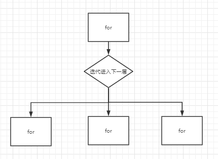

# leetcode题目

##  [69. x 的平方根](https://leetcode-cn.com/problems/sqrtx/)

二分法来说，方式一配合下取整，方式二配合上取整 不会造成鬼打墙。

但特定问题会有特殊情况。比如输入为8时，对8开方为2.8,  但是我们缩小边界范围时，步长是1，无法正确命中小数，造成最后比正确答案多1或者少1的情况。而且由于每道题里if判断内容都不同，也没什么好的解决办法。

反正方式1不对方式2就对，轮换着来吧。


## [113. 路径总和 II](https://leetcode-cn.com/problems/path-sum-ii/)

重点是array在每次递归return之前 把最近的一个元素移除，也是对父节点状态的回溯。

but有个他妈的深坑，list是个二维数组，添加的是**array的地址（？）**，并不是保存当下的array的元素。这样递归到最后array是他妈的空的。正确做法是list添加一个新new出来的ArrayList，这里用到ArrayList的有参构造，将array内元素复制到新的ArrayList中。

```java
class Solution {
    List<List<Integer>> list = new ArrayList<List<Integer>>();
    public List<List<Integer>> pathSum(TreeNode root, int sum) {
        ArrayList<Integer> array = new ArrayList<Integer>();
        pathSum(root,sum,array);
        return list;
    }
    public void pathSum(TreeNode node, int sum, ArrayList array) {       
        if(node==null) return;
        array.add(node.val);        
        sum = sum-node.val;
        //if(node.left==null&&node.right==null&&sum==0) list.add(array); 
        if(node.left==null&&node.right==null&&sum==0) list.add(new ArrayList(array)); 
        pathSum(node.left,sum,array);
        pathSum(node.right,sum,array);
        array.remove(array.size()-1);
    }    
}
```

## [二维数组中的查找](https://www.nowcoder.com/practice/abc3fe2ce8e146608e868a70efebf62e?tpId=13&tqId=11154&tPage=1&rp=1&ru=/ta/coding-interviews&qru=/ta/coding-interviews/question-ranking)

脑筋急转弯题，这里重点拿 if 当 else if 使用不当造成的问题 

```java
public class Solution {
    public boolean Find(int target, int [][] array) {
        if(array[0].length==0) return false;
        int row = array.length-1;
        int col = 0;
        while(row>=0&&col<array.length){
            if(array[row][col]==target) return true;
            //if(array[row][col]>target) row--; 边界情况时，row=-1
            //if(array[row][col]<target) col++; 为if则-1超过索引边界    
            else if(array[row][col]>target) row--;
            else if(array[row][col]<target) col++;    
        }
        return false;
    }
}
```

## [栈的压入、弹出序列](https://www.nowcoder.com/practice/d77d11405cc7470d82554cb392585106?tpId=13&tqId=11174&tPage=1&rp=1&ru=/ta/coding-interviews&qru=/ta/coding-interviews/question-ranking)

```java
public class Solution {
    public boolean IsPopOrder(int [] pushA,int [] popA) {
        if(pushA.length==0) return true;
        Stack<Integer> stack = new Stack<Integer>();
        int j=0;
        for(int i=0;i<pushA.length;i++){
          stack.push(pushA[i]);
            //while(stack.peek()==popA[j]&&!stack.empty())
            while(!stack.empty()&&stack.peek()==popA[j]){
                stack.pop();
                j++;
            }
      }
        return stack.empty();
    }
}
```

错误运行会报java.util.EmptyStackException，栈空了还pop，可是我已经做出了!stack.empty()的判断了鸭。

**判断语句中注意前后顺序**，先判断前面的条件，虽然有!stack.empty()保证不进入下一个while，但会先判断stack.peek()，此时栈已经空了，所以会报错。

# 题型总结

## 数字

考虑是否溢出

int整形 4字节 32位    [-2^31,2^31-1]

```java
Integer.MAX_VALUE
Integer.MIN_VALUE
Math.max(,)//max() 方法用于返回两个参数中的最大值。
Math.min(,)//min() 方法用于返回两个参数中的最小值。
Math.abs()//返回绝对值
-12 % 10 = -2 //负数的除法和取余和正数一样 就多个负号
-12 / 10 = -1
String s=Integer.toString(i); //整数转字符串
String s=String.valueOf(i);//整数转字符串
```

#### 整数反转

while循环中 使用%取余 求得每一位的值

while循环中 每循环一次对求余得到的值乘10 

```java
class Solution {
    public int reverse(int x) {
        int ans=0;
        while(x!=0){
            int pop = x % 10;
            x=x/10;
            ans=ans*10+pop;
        }
        return ans;
    }
}
```

#### 溢出情况

if(ans > (Integer.MAX_VALUE - digit) / 10)

​      ans = ans * 10 + digit;

#### ASCII码转化

```java
//char类型的数据和int类型的数据运算时是会自动转换char类型为属int类型的
//char 类型的0~9 ASCII码为48~57 
//char 转 int 即 c-48或 c-'0'  int i = c-'0'
//int 转 char 即 i + '0'		char c = i+'0'
```

#### 整数异或

位运算中异或的性质：**两个相同数字异或等于0**，**一个数和0异或还是它本身**。

```java
int c=a^b
    
```

## 字符串

转为字符数组

```java
char[] chars = str.toCharArray();
```

判断字符是否为整数，若为整数则提取出整数格式

```java
Character.isDigit(chars[i])
int digit = chars[i] - '0';
```


## 迭代法

详见21题，链表自底向下，迭代形成新链表

[21. 合并两个有序链表](https://leetcode-cn.com/problems/merge-two-sorted-lists/)

牛客：[从头到尾打印链表](https://www.nowcoder.com/practice/d0267f7f55b3412ba93bd35cfa8e8035?tpId=13&tqId=11156&tPage=1&rp=1&ru=/ta/coding-interviews&qru=/ta/coding-interviews/question-ranking)

## 双指针

当遇到**有序数组**时，应该优先想到`双指针`来解决问题，因两个指针的同时遍历会减少空间复杂度和时间复杂度

#### 快慢指针


## 二分查找


**1、确定left和right初值、确定边界条件下是否为特殊情况。**

**2、无条件写上 while (left < right)** ，表示退出循环的条件是 left == right，对于返回左右边界就不用思考了，因此此时它们的值相等；在循环的过程中 `left` 不断右移，`right` 不断左移。从形式上看，退出循环的时候一定有 `left == right` 成立。

**3、（待）确定mid的形式**
既 mid = left + （right - left ）/ 2 为下取整
　mid = left + （right - left ＋１）/ 2 为上取整

边界情况决定了怎样的取整方式，**默认为下取整**。

**４、确定 if else 表达式**

```java
if(不等式使mid不为解){
	缩小搜索空间使下一轮搜索不包含mid
}else{
	此时mid可能是解，缩小搜索空间时要让mid包含其中
}
```

if 语句判断了**哪些元素一定不是目标元素**，做题的经验告诉我们，“思考什么时候不是解”比较好想。生活中其实也是这样，我往往说不大清楚我想要什么，但是我很确定我不想要什么。

这里有两种情况
```java
//情况1
if(mid<target){
	left=mid+1;
}else{
	right=mid;
}

//情况2
if(mid>target){
	right=mid-1;
}else{
	left=mid;
}
```
**优先选择情况1**，因为情况1适用于下取整。

**5、根据 if else 里面写的情况，看看是否需要修改中间数下取整的行为。**

情况2的时候，才需要调整成为上取整，不然特定题目会进入死循环。
原因在于下取整时，mid无法取到最右边的值，如 [2 , 3]  mid = 2，若target=3 ，left = mid 无限循环，同理，情况1时若上取整一样会鬼打墙。

**6、后处理。** 退出循环的时候，一定有 left == right 成立。有些时候可以直接返回 left （或者 right，由于它们相等，后面都省略括弧）或者与 left 相关的数值，有些时候还须要再做一次判断，判断 left 与 right 是否是我们需要查找的元素，这一步叫“后处理”。

以上适用于一般的二分查找
 [35. 搜索插入位置](https://leetcode-cn.com/problems/search-insert-position/)
 [69. x 的平方根](https://leetcode-cn.com/problems/sqrtx/)


具体问题具体分析，以上问题是找到target的下标，若是问题是数组里有target则返回true，那该返回啥返回啥

对于寻找边界的二分查找
[34. 在排序数组中查找元素的第一个和最后一个位置](https://leetcode-cn.com/problems/find-first-and-last-position-of-element-in-sorted-array/)
则有些许不同。
透尼玛啥玩意啊 不做这个了

#### 新理解

一、寻找一个数（基本的二分搜索）
这个场景是最简单的，肯能也是大家最熟悉的，即搜索一个数，如果存在，返回其索引，否则返回 -1。

```java
int binarySearch(int[] nums, int target) {
    int left = 0; 
    int right = nums.length - 1; // 注意

    while(left <= right) {
        int mid = left + (right - left) / 2;
        if(nums[mid] == target)
            return mid; 
        else if (nums[mid] < target)
            left = mid + 1; // 注意
        else if (nums[mid] > target)
            right = mid - 1; // 注意
    }
    return -1;
}
/*
因为我们初始化 right = nums.length - 1
所以决定了我们的「搜索区间」是 [left, right]，且每次新的搜索区间都是左闭右闭
所以决定了 while (left <= right)，因为right在区间内真实存在，lift可以等于right
同时也决定了 left = mid+1 和 right = mid-1，因为左右都是闭区间

因为我们只需找到一个 target 的索引即可
所以当 nums[mid] == target 时可以立即返回
```

二、寻找左侧边界的二分搜索
以下是最常见的代码形式，其中的标记是需要注意的细节：

```java
int left_bound(int[] nums, int target) {
    if (nums.length == 0) return -1;
    int left = 0;
    int right = nums.length; // 注意
    
    while (left < right) { // 注意
        int mid = (left + right) / 2;
        if (nums[mid] == target) {
            right = mid;
        } else if (nums[mid] < target) {
            left = mid + 1;
        } else if (nums[mid] > target) {
            right = mid; // 注意
        }
    }
    // target 比所有数都大
	if (left == nums.length) return -1;
	// target 比所有数都小
	return nums[left] == target ? left : -1;

}
/*
因为我们初始化 right = nums.length
所以决定了我们的「搜索区间」是 [left, right),且每次新的搜索区间都是左闭右开
所以决定了 while (left < right),因为right在区间内虚假存在，lift不可以等于right
同时也决定了 left = mid + 1 和 right = mid，左闭右开，right取mid，区间内不包含mid

因为我们需找到 target 的最左侧索引
所以当 nums[mid] == target 时不要立即返回
而要收紧右侧边界以锁定左侧边界
```

三、寻找右侧边界的二分查找

类似寻找左侧边界的算法，这里也会提供两种写法，还是先写常见的左闭右开的写法，只有两处和搜索左侧边界不同，已标注：

```java
int right_bound(int[] nums, int target) {
    if (nums.length == 0) return -1;
    int left = 0, right = nums.length;
    
    while (left < right) {
        int mid = (left + right) / 2;
        if (nums[mid] == target) {
            left = mid + 1; // 注意
        } else if (nums[mid] < target) {
            left = mid + 1;
        } else if (nums[mid] > target) {
            right = mid;
        }
    }
    if (left == 0) return -1;
	return nums[left-1] == target ? (left-1) : -1;
}
/*
因为我们初始化 right = nums.length
所以决定了我们的「搜索区间」是 [left, right)
所以决定了 while (left < right)
同时也决定了 left = mid + 1 和 right = mid

因为我们需找到 target 的最右侧索引
所以当 nums[mid] == target 时不要立即返回
而要收紧左侧边界以锁定右侧边界

因为我们对 left 的更新必须是 left = mid + 1，就是说 while 循环结束时，nums[left] 一定不等于 target 了，而 nums[left-1] 可能是 target,所以最后无论返回 left 还是 right，必须减一。
```

统一方法，**将「搜索区间」全都统一成了两端都闭**

找左边界，移动right 返回left，越界考虑left

找右边界，移动left 返回right ，越界考虑right

```java
int binary_search(int[] nums, int target) {
    int left = 0, right = nums.length - 1; 
    while(left <= right) {
        int mid = left + (right - left) / 2;
        if (nums[mid] < target) {
            left = mid + 1;
        } else if (nums[mid] > target) {
            right = mid - 1; 
        } else if(nums[mid] == target) {
            // 直接返回
            return mid;
        }
    }
    // 直接返回
    return -1;
}

int left_bound(int[] nums, int target) {
    int left = 0, right = nums.length - 1;
    while (left <= right) {
        int mid = left + (right - left) / 2;
        if (nums[mid] < target) {
            left = mid + 1;
        } else if (nums[mid] > target) {
            right = mid - 1;
        } else if (nums[mid] == target) {
            // 别返回，收缩左侧边界
            right = mid - 1;
        }
    }
    // 所以当 target 比所有元素都大时，left会被加到nums.length
    if (left >= nums.length || nums[left] != target)
        return -1;
    //if (nums[mid] == target) right = mid - 1 跳出循环left=right+1 一来一回刚好补上
    return left;
    
}


int right_bound(int[] nums, int target) {
    int left = 0, right = nums.length - 1;
    while (left <= right) {
        int mid = left + (right - left) / 2;
        if (nums[mid] < target) {
            left = mid + 1;
        } else if (nums[mid] > target) {
            right = mid - 1;
        } else if (nums[mid] == target) {
            // 别返回，收缩右侧边界
            left = mid + 1;
        }
    }
    // 当 target 比所有元素都小时，right 会被减到 -1
    if (right < 0 || nums[right] != target)
        return -1;
    return right;
}
```


## 动态规划


1、思考大问题的最优解怎么由小问题的最优解得到。	即 `dp[i]` 如何与 `dp[i - 1]`、`dp[i - 2]`、...、`dp[0]` 建立联系

2、构建合适的dp数组

3、转移方程(等号右边要有子问题)

计数型：dp[n]=dp[n-1]+val;

最值型：dp[n]=Math.max(dp[n-2]+val,dp[n-1])

3、初始条件：即超参数，例如dp[0]=0.....

​	边界情况：鱿鱼复用子问题，若出现dp[n]=dp[n-2]+val的转移方程，则从i=1开始遍历，dp[1]就是边界，往往需要在for循环外提前声明。

4、计算顺序：自底向上 dp[1]、dp[2]、dp[3]..... 使用for循环遍历

## 回溯

DFS疯狂递归，重点是每次递归时传递的参数要正确。

~~一个方法就是每次传参都是new出来的新值~~

二个方法就是调用递归进入下一层 return出来后 紧跟代码将参数值复原 

```java
//不进行参数复原的话，假设初始sum=0 nums=[1,2,3] 

//第一层 sum=0+1=1

//			第二层 sum=1+···

//						第三层···

//             					····

//第一层 sum=1+2=3（第二次for循环初始的sum由0变为了1）
for(int i=0;i<numslength;i++){
	sum = sum + nums[i];
	进入下层(sum);
	sum = sum - nums[i];
}
```

**叶子结点出现add操作一定要新建对象**

```java
if(nums.size()==0) {//最后满足条件时，需要new一个新值，对象类型变量在传参的过程中，复制的都是变量的地址。若使用array 上一层数值复原会更改array
	list.add(new ArrayList(array));
	return;
}
```

### 排列



leetcode39、40、 46、 47、 60、 77········

```java
    public void helper(ArrayList nums, ArrayList array, int k, int j){
        if(array.size()==k){ //满足题目要求的返回
            list.add(new ArrayList(array));
            return;
        }
        for(int i=j;i<nums.size();i++){//i=j 缩小循环空间 
            array.add(nums.get(i));
            int temp = (int)nums.get(i);
            nums.remove(i);
            helper(nums,array,k,i);
            array.remove(array.size()-1);//复原现场
            nums.add(i,temp);//复原现场
        }
    }
```


题目有要求 数组中有重复元素需要避免重复时的剪枝

```java
if (i > 0 && nums[i] == nums[i - 1]) {
    continue;
}
```


## 树

#### 二叉树的前序、中序、后序遍历

递归使用DFS 迭代使用栈

#### 二叉树的层序遍历

递归引入一个参数level使用DFS 迭代使用队列BFS

#### 二叉树的深度

return 数字 最底层返回1 层层叠加


# 数据结构

## 位运算

```java
int c=a^b;// 两个相同数字异或等于0，一个数和0异或还是它本身
temp = temp>>1; //向右移一位
```


## 基本类型

```java
Integer.MAX_VALUE
Integer.MIN_VALUE
int a = Integer.valueOf(str); //string转int    
    
Character.isDigit()//判断字符是否为数字
Character.isLetter()//判断指定字符是否为字母 其中中文单个字也会被认为是字母！！！
Character.isLowerCase(char c)　|| Character.isUpperCase(char c)　　//判断c是否是字母字符，前面LowerCase是小写，后面UpperCase是大写，是返回True，否则返回False   
```

## Stack

```java
Stack<Character> stack = new Stack<Character> ();
stack.push('c');
stack.pop();
stack.peek()//取栈顶值（不出栈） 栈空时使用会报错
stack.empty()
stack.search()//返回对象在栈中的位置,栈顶为1
stack.size()

int i = Integer.parseInt( s ); //string转int    

```


## HashMap

key可重复，value不可重复

```java
HashMap<Integer,Integer> map =new HashMap<Integer,Integer>();

map.put( , )
map.get()
map.isEmpty()
map.containsKey()
map.containsValue()
map.remove()//删除key值下的value
map.values()//显示所有的value值
map.size()
```

## HashSet

```java
set.add()
set.contains()
set.clear()//清空集合
set.size()
set.isEmpty()
```

## Collections

```java
Collections.reverse(List<?> list)//需要参数为list 数组要想使用需要 Arrays.asList()
```


## Arrays

```java
//Arrays类位于 java.util 包中，主要包含了操纵数组的各种方法
Arrays.copyOf(T[], int)//返回从索引0开始n个长度的数组
Arrays.copyOfRange(T[], int, int)方法 // 返回范围内的的数组，左闭右开
Arrays.sort()//对数组进行排序
Arrays.asList()//将一个数组转化为一个List对象,使用方法如下
new ArrayList<Integer>(Arrays.asList(nums[k], nums[i], nums[j]))
```


## ArrayList

```java
List<List<Integer>> levels = new ArrayList<List<Integer>>();

//特殊的构造方法,实例包含从指定集合复制的元素并且具有与所复制的元素数相同的初始容量
ArrayList（Collection<? extends E> c）
ArrayList newlist = new ArrayList(arraylist);

//无reverse方法，使用爸爸方法
Collections.reverse(list)；

boolean add(Element e) //增加指定元素到链表尾部.
void add(int index, Element e) //增加指定元素到链表指定位置.
void clear() //从链表中删除所有元素.
E remove(int index) //删除链表中指定位置的元素.
E get(int index) //获取链表中指定位置处的元素.
E set(int index, E element) //将链表中指定位置上的元素替换成新元素。
boolean isEmpty() //返回true表示链表中没有任何元素. 判断逻辑是size == 0
int size() //返回链表长度（链表包含元素的个数）.
```

## LinkedList

```java
Queue<TreeNode> list = new LinkedList<TreeNode>();
list.isEmpty();
list.size()
list.poll() //查询并移除第一个元素  
list.add()
list.peek()//获取第一个元素，但是不移除
```


## String

字符串长度包括标点和空格

```java
s.length()
s.charAt() //获取指定索引处的字符 返回char类型 String s = String.valueOf('c') 实现char转string
s.indexOf("ak")//返回指定子字符串第一次出现在该字符串内的索引，没有返回-1
s.contains("g")//判断字符串中是否包含指定字符。
s.toLowerCase()//转小写
s.trim()//用于删除字符串的头尾空白符
s.substring(int beginIndex, int endIndex)//返回截取的新字符串，左闭右开
char[] chars = s.toCharArray();//将字符串转换为字符数组

StringBuilder sb = new StringBuilder();
sb.append(String str)/sb.append(StringBuilder sb)/sb.append(Char c)````//append一切
sb.toString();
sb.deleteCharAt()//删除指定index的值
sb.insert（,）//指定位置上插入各种类型的值  （不推荐使用，失去了算法题的意义）
sb.reverse()
sb.setLength()//设置大小，防止越界
sb.setCharAt(,)//设置指定位置的值
```

#### String、StringBuilder以及StringBuffer

==对String对象的任何改变都不影响到原对象，相关的任何change操作都会生成新的对象==

String是一个final类，不可被继承，类内使用 final 字符数组保存字符串 private final char value[]

和 String 类不同的是，StringBuffer 和 StringBuilder 类的对象能够被多次的修改，并且**不产生新的未使用对象**。

由于 StringBuilder 相较于 StringBuffer 有速度优势，所以多数情况下建议使用 StringBuilder 类。然而在应用程序要求**线程安全**的情况下，则必须使用 StringBuffer 类。

==用于String的“+”和“+=”是java中仅有的两个重载过的操作符==

字符串连接是通过 StringBuilder类及其append 方法实现的，对象转换为字符串是通过 toString 方法实现的

```java
String s1 = "aaa";
String s2 = "bbb";
String s3 = s1+s2;//s3="aaabbb"
//////"+"操作符中实际发生了如下变化/////
StringBuilder sb = new StringBuilder();
sb.append(s1);
sb.append(s2);
sb.toString();
```


# 奇怪的点

  ```java
return new int []{i,j}; //返回时new一个指定数组
int[] arrays = {1, 2, 3, 4, 5};
int[] arrays = new int[]{1, 2, 3, 4, 5};//数组初始化
int[] nums = new int[n];//n个元素的数组


throw new RuntimeException("?????");


char s = 'a';//单引号是char类型，双引号是String类型
String m = "a";

boolean[] array = new boolean[size];//boolean数组 默认为false


//在 java 中，其实只有一维数组，而二维数组是在一维数组中嵌套实现的。比如 int[][] a = {{},{},{},{}}  
//要取行数和某一行的列数可以 ：
int rowLen = a.length;
int colLen = a[0].length;

//for循环数组 String [] strs
for (String s : strs)


对于void方法，直接return 不需要加返回值
    
//避免新建变量temp时 对数组中两个数进行交换
public void exchange(int[] nums, int i, int j){
	nums[i] = nums[i] + nums[j];
	nums[j] = nums[i] - nums[j];
    nums[i] = nums[i] - nums[j];
	//int temp = nums[i];
	//nums[i]=nums[j];
	//nums[j]=nums[i];
}    

//对多层递归 找到要求值 想要直接跳出 使用异常
//方法中
if(Index>word.length()-1) throw new RuntimeException();
//主程序
try{
    调用方法
}
catch(RuntimeException e){
    return //可以直接return出去
}

//短路求值原理
作为"&&"和"||"操作符的操作数表达式，这些表达式在进行求值时，只要最终的结果已经可以确定是真或假，求值过程便告终止，这称之为短路求值（short-circuit evaluation）
  ```

​	


