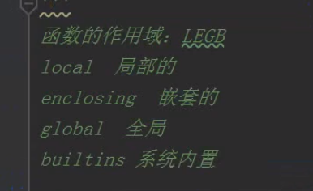
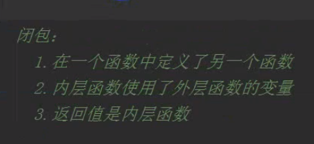
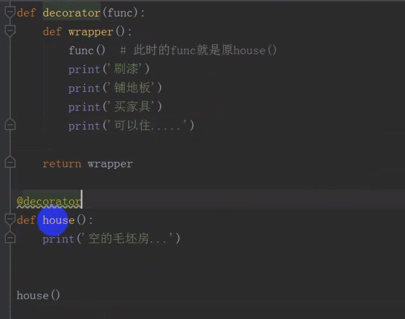
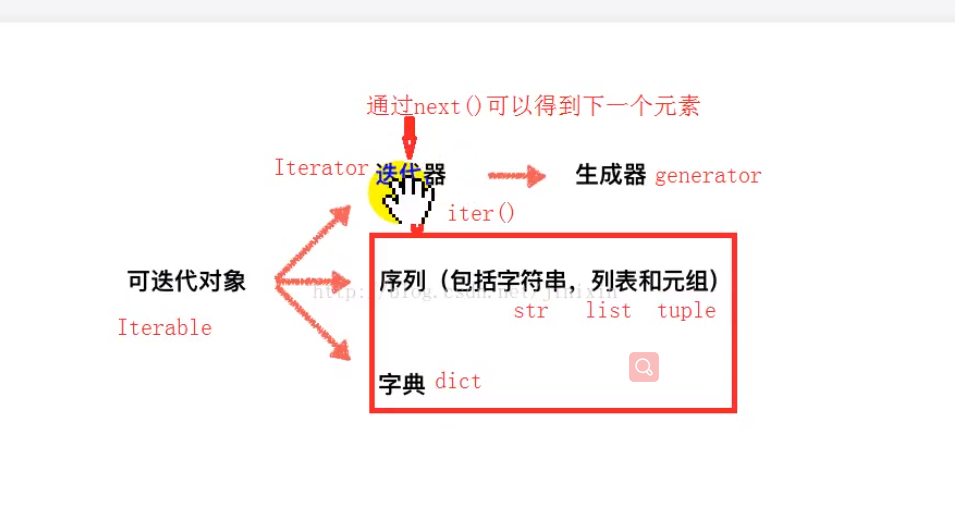

dict set 索引是无序的

字符串 列表元祖 是有序的 可以作为序列切片

`L[0:3]`表示，从索引`0`开始取，直到索引`3`为止，但不包括索引`3`。即索引`0`，`1`，`2`，正好是3个元素。


- **不可变数据（3 个）：**Number（数字）、String（字符串）、Tuple（元组）；
- **可变数据（3 个）：**List（列表）、Dictionary（字典）、Set（集合）。


### 浅拷贝   只是对另外一个变量的内存地址的拷贝，这两个变量指向同一个内存地址的变量值。

- **公用一个值；**
- **这两个变量的内存地址一样；**
- **对其中一个变量的值改变，另外一个变量的值也会改变；**


### 深拷贝 一个变量对另外一个变量的值拷贝。

- **两个变量的内存地址不同；**
- **两个变量各有自己的值，且互不影响；**
- **对其任意一个变量的值的改变不会影响另外一个；**


**可变参数**

当我们声明一个诸如 `*param` 的星号参数时，从此处开始直到结束的所有位置参数都将被收集并汇集成一个称为“param”的**元组**（Tuple）。

类似地，当我们声明一个诸如 `**param` 的双星号参数时，从此处开始直至结束的所有关键字参数都将被收集并汇集成一个名为 `param` 的**字典**（Dictionary）。



```python
# var1 是全局名称
var1 = 5
def some_func():
 
    # var2 是局部名称
    var2 = 6
    def some_inner_func():
 
        # var3 是内嵌的局部名称
        var3 = 7
```





装饰器 用到了闭包 类似于代理模式 类似于 AOP




匿名函数  

f = lambda n: n+1  

冒号前是参数 后是返回值


列表生成式

```python
>>> [x * x for x in range(1, 11)]
[1, 4, 9, 16, 25, 36, 49, 64, 81, 100]
```


生成器 一个列表生成式的`[]`改成`()`，就创建了一个generator

```python
>>> g = (x * x for x in range(10))
```

函数定义中包含`yield`关键字，那么这个函数就不再是一个普通函数，而是一个generator：

而变成generator的函数，在每次调用`next()`的时候执行，遇到`yield`语句返回，再次执行时从上次返回的`yield`语句处继续执行。yield 类似java的yield


r = range（5）  是可迭代的 但不是迭代器 也不是生成器


可迭代的 iterable

迭代器 iertator

生成器 generator



可迭代的不一定是迭代器

生成器是一个迭代器


iter（）函数将可迭代对象变为迭代器

list1 = iter（list1）


