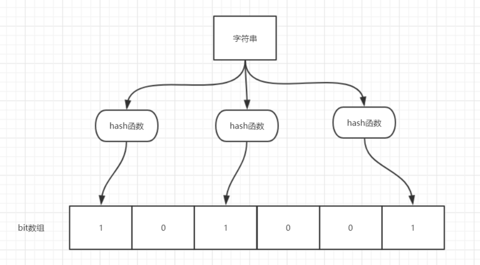

# MySQL

## 存储引擎

**两者的对比：**

1. **是否支持行级锁** : MyISAM 只有表级锁(table-level locking)，而InnoDB 支持行级锁(row-level locking)和表级锁,默认为行级锁。
2. **是否支持事务： MyISAM** 不提供事务支持。**InnoDB** 提供事务支持。
3. **是否支持外键：** MyISAM不支持，而InnoDB支持。
4. **是否支持MVCC** ：仅 InnoDB 支持。应对高并发事务, MVCC比单纯的加锁更高效;MVCC只在 `READ COMMITTED` 和 `REPEATABLE READ` 两个隔离级别下工作;MVCC可以使用 乐观(optimistic)锁 和 悲观(pessimistic)锁来实现;各数据库中MVCC实现并不统一。

## 事务

| 隔离级别                  | 脏读 | 不可重复读 | 幻读 |
| ------------------------- | ---- | ---------- | ---- |
| READ-UNCOMMITTED 读未提交 | √    | √          | √    |
| READ-COMMITTED 读已提交   | ×    | √          | √    |
| REPEATABLE-READ 可重复读  | ×    | ×          | √    |
| SERIALIZABLE 可串行化     | ×    | ×          | ×    |

MySQL InnoDB 存储引擎的默认支持的隔离级别是 **REPEATABLE-READ（可重读）**

MySQL InnoDB 存储引擎在 **REPEATABLE-READ（可重读）**事务隔离级别下使用的是Next-Key Lock 锁算法，因此==可以避免幻读的产生==，这与其他数据库系统(如 SQL Server)是不同的。

幻读和不可重复读有些相似之处 ，但是不可重复读的重点是修改，幻读的重点在于新增或者删除。


### MVCC机制（Multi-Version Concurrency Control，多版本并发控制）

常用的处理读写冲突的手段，**目的在于提高数据库高并发场景下的吞吐性能**。

不同的事务在并发过程中，`SELECT` 操作可以不加锁而是通过 `MVCC` 机制读取指定的**版本历史记录**，并通过一些手段保证保证读取的记录值符合事务所处的隔离级别，从而解决并发场景下的读写冲突。

MVCC 主要应用于 **Read Commited** 和 **Repeatable read** 两个事务隔离级别。


## 锁

表级锁和行级锁可以进一步划分为共享锁（S）和排他锁（X）。

**共享锁（Share Locks，简记为S）又被称为读锁**

**排它锁（(Exclusive lock,简记为X锁)）又称为写锁**

|      | S锁  | X锁  |
| ---- | ---- | ---- |
| S锁  | √    | ×    |
| X锁  | ×    | ×    |

### MVCC机制（Multi-Version Concurrency Control，多版本并发控制）

MVCC是通过保存数据在某个时间点的快照来实现的，**在大多数情况下代替行级锁,**使用MVCC,能降低其系统开销。

MVCC的意思用简单的话讲就是**对数据库的任何修改的提交都不会直接覆盖之前的数据，而是产生一个新的版本与老版本共存，使得读取时可以完全不加锁**。

MVCC只在**REPEATABLE READ**和**READ COMMITTED**两个隔离级别下工作。其他两个隔离级别都和MVCC不兼容，因为READ UNCOMMITTED总是读取最新的数据行，而不是符合当前事务版本的数据行，而SERIALIZABLE会对所有读取到的行都加锁。

这样，实现两个隔离级别就非常容易：

- Read Committed - 一个事务读取数据时总是读这个数据最近一次被commit的版本
- Repeatable Read - 一个事务读取数据时总是读取当前事务开始之前最后一次被commit的版本（所以底层实现时需要比较当前事务和数据被commit的版本号）。

举个简单的例子：

1. 一个事务A（txnId=100）修改了数据X，使得X=1，并且commit了
2. 另外一个事务B（txnId=101）开始尝试读取X，但是还X=1。但B没有提交。
3. 第三个事务C（txnId=102）修改了数据X，使得X=2。并且提交了
4. 事务B又一次读取了X。这时

- 如果事务B是Read Committed。那么就读取X的最新commit的版本，也就是X=2
- 如果事务B是Repeatable Read。那么读取的就是当前事务（txnId=101）之前X的最新版本，也就是X被txnId=100提交的版本，即X=1。


当我们创建表完成后，mysql会自动为每个表添加 数据版本号 db_trx_id（最后更新数据的事务id） 删除版本号 db_roll_pt （数据删除的事务id） 事务id由mysql数据库自动生成，且递增。

每个事务都有自己的事务ID，事务中使用`select`，

它会检索这样的数据→(数据版本号<当前事务ID) &&(删除版本号>当前事务ID)

`update` 相当于对新数据行执行insert 对旧数据行执行detete

| 当前事务执行操作 |          数据版本号 db_trx_id          |         删除版本号 db_roll_pt          |
| :--------------: | :------------------------------------: | :------------------------------------: |
|      insert      |               当前事务ID               |                  null                  |
|      delete      |                  不变                  |               当前事务ID               |
|      update      | 新数据行：当前事务ID    旧数据行：不变 | 新数据行：null    旧数据行：当前事务ID |
|      select      |                  不变                  |                  不变                  |


## 索引

Innodb使用的是聚簇索引，MyISam使用的是非聚簇索引

在Innodb下主键索引是聚集索引，在Myisam下主键索引是非聚集索引

>Innodb索引结构

**主键索引（聚簇索引）**

聚簇索引就是按照每张表的主键构造一颗B+树，同时==叶子节点中存放的就是整张表的行记录数据==，也将聚集索引的叶子节点称为数据页。这个特性决定了索引组织表中==数据也是索引的一部分==，==每张表只能拥有一个聚簇索引==。

Innodb通过主键聚集数据，如果没有定义主键，innodb会选择非空的唯一索引代替。如果没有这样的索引，innodb会隐式的定义一个主键来作为聚簇索引。

**辅助索引（非聚簇索引）**

先有聚簇索引再有辅助索引，辅助索引叶子节点存储的不再是行记录的全部数据，而是主键值。通过辅助索引首先找到的是主键值，然后用主键到主索引中检索获得记录，故也称之其为二级索引。一张表可以有多个辅助索引。

> MyISam索引结构

MyISAM索引文件和数据文件是分离的，索引文件仅保存数据记录的地址

**主键索引（非聚簇索引）**

MyISAM引擎使用B+Tree作为索引结构，叶节点的**data域存放的是数据记录的地址**

**辅助索引（非聚簇索引）**

在MyISAM中，主索引和辅助索引（Secondary key）在结构上没有任何区别，**只是主索引要求key是唯一的，而辅助索引的key可以重复**。


### InnoDB数据页（Page）

页是InnoDB管理存储空间的基本单位，一个页的大小默认是16KB。

**页之间双向链表连接，页内的User Record使用单向链表连接。**

在Page的主体部分，主要关注数据和索引的存储，他们都位于`User Records`部分，User Records占据Page的大部分空间，User Records由一条条的Record组成，每条记录代表索引树上的一个节点（非叶子节点和叶子节点）；在一个单链表的内部，单链表的头尾由两条记录来表示，字符串形式的“ Infimum”代表开头，“Supremum”表示结尾；


#### 如何定位一个Record：

1. 通过根节点开始遍历一个索引的B+树，通过各层非叶子节点达到底层的叶子节点的数据页（Page），这个Page内部存放的都是叶子节点
2. 在Page内部从“Infimum”节点开始遍历单链表（遍历一般会被优化），如果找到键则返回。如果遍历到了“Supremum”，说明当前Page里没有合适的键，这时借助Page页内部的next page指针，跳转到下一个page继续从“Infmum”开始逐个查找

### B树、B+树

索引存放在硬盘中，由于内存的读写速度比硬盘读写速度快很多，所以理想情况是将索引存放在内存中，然而索引与数据的比例约为1/10（maybe），如果要存满1T的硬盘，至少需要100G的内存，所以**大数据量时，索引无法全部装入内存**。

由于无法装入内存，则必然依赖磁盘（或SSD）存储。而内存的读写速度是磁盘的成千上万倍（与具体实现有关），所以减少磁盘IO的次数能很大程度的提高MySQL性能。因此，核心问题是“**如何减少磁盘读写次数**”。

首先不考虑页表机制，假设每次读、写都直接穿透到磁盘，那么：

- 线性结构：读/写平均O(n)次
- 二叉搜索树（BST）：读/写平均O(log2(n))次；如果树不平衡，则最差读/写O(n)次
- 自平衡二叉搜索树（AVL）：在BST的基础上加入了自平衡算法，读/写最大O(log2(n))次
- 红黑树（RBT）：另一种自平衡的查找树，读/写最大O(log2(n))次

B树与AVL的时间复杂度是相同的，但由于**B树的层数少，磁盘IO次数少**，实践中B树的性能要优于AVL等二叉树。

B树相对B+树，B树的各层节点要存储数据，导致每页能够容纳的节点就很少，直接导致树深度加大。**B+树比B树层数少，磁盘IO次数少**

#### **B树与B+树区别**

1）B树的每个结点都存储了key和data，B+树的data存储在叶子节点上。
 节点不存储data，这样一个节点就可以存储更多的key。可以使得树更矮，所以IO操作次数更少。
 2）树的所有叶结点构成一个有序链表，可以按照关键码排序的次序遍历全部记录
 由于数据顺序排列并且相连，所以便于区间查找和搜索。而B树则需要进行每一层的递归遍历。相邻的元素可能在内存中不相邻，所以缓存命中性没有B+树好。

**计算3层索引B+树能容纳的数据量**
 首先两个假设：

1. 主键id，我们采用bigint，8字节
2. 一条数据大小1KB

- 第一层
   一个页16K，每一个索引键的大小8字节（bigint）+6字节（指针大小），因此第一层可存储16*1024/14=1170个索引键。
- 第二层
   第二层只存储索引键，能存储多少个索引键呢？1170（这么多个页，有第一层延伸的指针）*1170(每页的索引键个数，跟第一步计算一致)=1368900
- 第三层
   直接看三层能存储多少数据？1170x1170x16=21902400，3次IO就可以查询到2千多万左右的数据，也就是这么大的数据量如果通过主键索引来查找是很快。

### 联合索引

对多个字段同时建立的索引，建立这样的索引相当于建立了索引a、ab、abc三个索引。一个索引顶三个索引当然是好事，毕竟每多一个索引，都会增加写操作的开销和磁盘空间的开销。

**最左匹配原则**

针对联合索引来讲，联合索引(a,b,c)为例 先以a的顺序建立索引，若a相等则以b的顺序建立，b还相等则以c的顺序。由此可见，对b和c而言，索引是无序的。无法比较（？,1,2）和（？,2,3）的大小，所以要想用到索引，必须a出面。把最常用的，筛选数据最多的字段放在左侧。详情请见文件夹外-----二、B 树索引实战。

# Redis

## 概念

### Redis为什么快

1. 基于内存；
2. 单线程，避免了不必要的上下文切换，不用去考虑各种锁的问题；
3. 采用了多路复用io阻塞机制；
4. 数据结构简单，操作节省时间；


## 五种数据结构及其使用场景


### String

**计数器**

[](http://blog-image-xiaoqiang.test.upcdn.net/201910/1020-2.jpg)

这个是微信公众号的文章阅读量数量的统计，可以通过redis的string数据结构来解决。使用incr原子操作命令，redis的key是article：readcount：{文章id}，当该文章被阅读时，调用incr命令，阅读数量加一，通过get该redis的key，实现文章阅读数量统计的功能。

```java
incr article：readcount：{文章id}
get article：readcount：{文章id}
```

### Hash 

Hash键可以将信息凝聚在一起，而不是直接分散存储在整个Redis中，这不仅方便了数据管理，还可以尽量避免一定的误操作

[](http://blog-image-xiaoqiang.test.upcdn.net/201910/1020-3.jpg)

这个是京东购物车的截图，可以看到很多功能都用redis的命令可来实现。在redis中保存对商品id、购物车id等等id的操作，在前端保存对于该商品的描述，在操作购物车的时候，底层其实就是操作redis的命令。

```
添加商品：hset cart:1001 1088 1
添加数量：hincrby cart:1001 1088 1
商品总数：hlen cart:1001
删除商品：hdel cart:1001 1008
获取购物车所有商品： hgetall cart:1001
```

### List

实现消息队列

微博 TimeLine

[](http://blog-image-xiaoqiang.test.upcdn.net/201910/1020-4.jpg)

这是我们经常使用的新浪微博，我们看在微博文章中如何使用redis的list数据结构。新浪微博是使用redis的大户，据在新浪工作的朋友说，新浪使用redis的总容量超过500T，可想而知几乎70%的功能都在redis中操作。

"小米手机"发微博，消息id为1001，使用的redis命令是：

```
LPUSH msg：{小强-id} 1001
```

"号外长沙"发微博，消息id为1002，使用的redis命令是：

```
LPUSH msg：{小强-id} 1002
```

小强查看最新10条的新浪微博消息：

```
LRANGE msg：{小强-id} 0 10
```

### Set

共同关注

两用户关注对象的交集

```java
sinter userfriends user:1:follows user:2:follows
```

好友推荐的时候，根据 tag 求交集，大于某个 threshold 就可以推荐

### Zset

排行榜

## 设置过期时间

Redis中有个设置时间过期的功能，即对存储在 redis 数据库中的值可以设置一个过期时间。作为一个缓存数据库，这是非常实用的。如我们一般项目中的 token 或者一些登录信息，尤其是短信验证码都是有时间限制的，按照传统的数据库处理方式，一般都是自己判断过期，这样无疑会严重影响项目性能。

我们 set key 的时候，都可以给一个 expire time，就是过期时间，通过过期时间我们可以指定这个 key 可以存活的时间。

如果假设你设置了一批 key 只能存活1个小时，那么接下来1小时后，redis是怎么对这批key进行删除的？

**定期删除+惰性删除。**

通过名字大概就能猜出这两个删除方式的意思了。

- **定期删除**：redis默认是每隔 100ms 就**随机抽取**一些设置了过期时间的key，检查其是否过期，如果过期就删除。注意这里是随机抽取的。为什么要随机呢？你想一想假如 redis 存了几十万个 key ，每隔100ms就遍历所有的设置过期时间的 key 的话，就会给 CPU 带来很大的负载！
- **惰性删除** ：定期删除可能会导致很多过期 key 到了时间并没有被删除掉。所以就有了惰性删除。假如你的过期 key，靠定期删除没有被删除掉，还停留在内存里，除非你的系统去查一下那个 key，才会被redis给删除掉。这就是所谓的惰性删除，也是够懒的哈！

但是仅仅通过设置过期时间还是有问题的。我们想一下：如果定期删除漏掉了很多过期 key，然后你也没及时去查，也就没走惰性删除，此时会怎么样？如果大量过期key堆积在内存里，导致redis内存块耗尽了。怎么解决这个问题呢？ **redis 内存淘汰机制。**

## 事务

## 缓存存在的问题

### 缓存穿透

- **缓存穿透**是指**查询一个一定不存在数据**,由于缓存没有命中,将去查询数据库,但是数据库也没有这条记录,并且处于容错的考虑,我们没有讲这次的查询写入到缓存中,这将导致这个不存在数据每次请求都要到存储层去查询,失去了缓存的意义.在**流量很大的时候**,可能DB就挂掉了,有人利用这个不存在的key频繁攻击我的应用,这就是漏洞.

> 解决: 空结果进行缓存,但是他的过期时间很短,最长不超过五分钟
>
> 解决: 使用布隆过滤器，查询的时候先去 BloomFilter 去查询 key 是否存在，如果不存在就直接返回，存在再走查缓存、查 DB。

#### 布隆过滤器

**当一个元素加入布隆过滤器中的时候，会进行如下操作：**

1. 使用布隆过滤器中的哈希函数对元素值进行计算，得到哈希值（有几个哈希函数得到几个哈希值）。
2. 根据得到的哈希值，在位数组中把对应下标的值置为 1。

**当我们需要判断一个元素是否存在于布隆过滤器的时候，会进行如下操作：**

1. 对给定元素再次进行相同的哈希计算；
2. 得到值之后判断位数组中的每个元素是否都为 1，如果值都为 1，那么说明这个值在布隆过滤器中，如果存在一个值不为 1，说明该元素不在布隆过滤器中。



如图所示，当字符串存储要加入到布隆过滤器中时，该字符串首先由多个哈希函数生成不同的哈希值，然后在对应的位数组的下表的元素设置为 1（当位数组初始化时 ，所有位置均为0）。当第二次存储相同字符串时，因为先前的对应位置已设置为1，所以很容易知道此值已经存在（去重非常方便）。

如果我们需要判断某个字符串是否在布隆过滤器中时，只需要对给定字符串再次进行相同的哈希计算，得到值之后判断位数组中的每个元素是否都为 1，如果值都为 1，那么说明这个值在布隆过滤器中，如果存在一个值不为 1，说明该元素不在布隆过滤器中。

**不同的字符串可能哈希出来的位置相同，这种情况我们可以适当增加位数组大小或者调整我们的哈希函数。**

综上，我们可以得出：==**布隆过滤器说某个元素存在，小概率会误判。布隆过滤器说某个元素不在，那么这个元素一定不在。**==

##### 使用

适用于数据量很大情况，且业务可以忍受小概率的误判。

1、大数据去重

例如新闻客户端的推送去重功能。

用户看到新闻则在布隆过滤器中更新。也就是说，推荐系统认为该用户浏览过某条新闻时，用户实际上可能有小概率并没有浏览过这条新闻，但系统认为该用户没有浏览过某条新闻，用户一定没有浏览过这条新闻。这样就能确保用户一定不会浏览重复的内容。

2、判断给定数据是否存在：解决缓存穿透、邮箱的垃圾邮件过滤、黑名单功能等等

### 缓存雪崩

- 缓存是指在我们设置缓存的时候采用了相同的过期时间,导致缓存在同一时刻失效了,请求全部转发到DB,DB瞬间压力过重雪崩.

> 解决: 原有的失效时间基础上增加一个随机值,比如1-5分钟随机值,这样一个缓存的过期时间的重复率会降低,很难引发群体失效的事件

### 缓存击穿

- 对于一些设置了过期时间的key,如果这些key可能会在某些时间点被超高并发地访问,是一种非常"热点"的数据.这个时候,如果这个key在大量请求进来的时候,正好失效,那么所有对这个key的数据查询都落到db,和缓存雪崩的区别是:
  - 击穿是一个热点key失效
  - 雪崩是很多key集体失效

> 解决: 分布式锁


## Redis分布式锁


- 成员变量 A 存在 JVM1、JVM2、JVM3 三个 JVM 内存中
- 成员变量 A 同时都会在 JVM 分配一块内存，三个请求发过来同时对这个变量操作，显然结果是不对的
- 不是同时发过来，三个请求分别操作三个不同 JVM 内存区域的数据，变量 A 之间不存在共享，也不具有可见性，处理的结果也是不对的
   注：该成员变量 A 是一个有状态的对象

如果我们业务中确实存在这个场景的话，我们就需要一种方法解决这个问题，**这就是分布式锁要解决的问题**

### 锁超时

假设现在我们有两台平行的服务 A B，其中 A 服务在 获取锁之后 由于未知神秘力量突然挂了，那么 B 服务就永远无法获取到锁了，所以我们需要额外**设置一个超时时间**，来保证服务的可用性。

### Redlock 算法


## 集群

### 主从复制

主从复制，是指将一台Redis服务器的数据，复制到其他的Redis服务器。前者称为主节点，后者称为从节点；**数据的复制是单向的，只能由主节点到从节点。**

**默认的情况下，每台服务器都是主机。**一般情况下只要配置从机即可。

如果是由命令行操作来配置的从机，一但从机重启，就会变成主机。建议在配置文件里配置。

==主机可以写+读，从机只能读。==

**主从复制的作用**

1、数据冗余：实现数据的热备份，是持久化意外的一种数据冗余方式。

2、故障恢复：当主节点出现问题时，可以由从节点提供服务，实现快速的故障恢复。

3、负载均衡：在主从复制的基础上，配合读写分离，可以由主节点提供写服务，由从节点提供读服务，分担服务器负载。

4、高可用基石：主从复制还是哨兵和集群能够实施的基础。


> slaveof命令

如图，想让6380节点成为6379的从节点，只需要执行 `slaveof` 命令即可，此复制命令是异步进行的，redis会自动进行后续数据复制的操作。
 注：一般生产环境不允许主从节点都在一台机器上，因为没有任何的价值。


### 哨兵模式

主从切换技术的方法是：当主服务器宕机后，需要手动把一台从服务器切换为主服务器，这就需要人工干预，费事费力，还会造成一段时间内服务不可用。这不是一种推荐的方式，更多时候，我们优先考虑哨兵模式。

哨兵模式是一种特殊的模式，首先Redis提供了哨兵的命令，**哨兵是一个独立的进程，作为进程，它会独立运行。**其原理是**哨兵通过发送命令，等待Redis服务器响应，从而监控运行的多个Redis实例。**


假设主服务器宕机，哨兵1先检测到这个结果，系统并不会马上进行failover过程，仅仅是哨兵1主观的认为主服务器不可用，这个现象成为**主观下线**。当后面的哨兵也检测到主服务器不可用，并且数量达到一定值时，那么哨兵之间就会进行一次投票，投票的结果由一个哨兵发起，进行failover操作。切换成功后，就会通过发布订阅模式，让各个哨兵把自己监控的从服务器实现切换主机，这个过程称为**客观下线**。