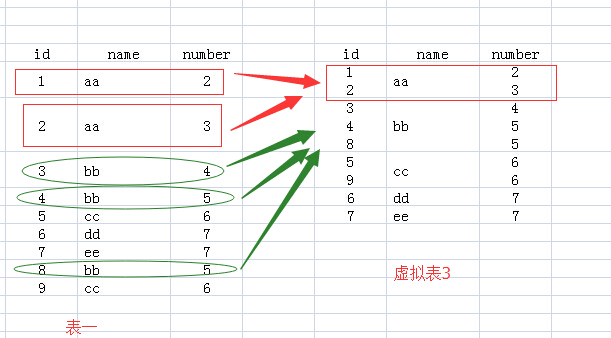
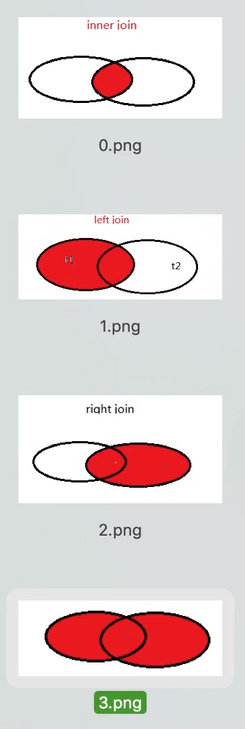

MySQL在Linux下数据库名、表名、列名、别名大小写规则是这样的：

　　 **1、数据库名与表名是严格区分大小写的；**
　　 **2、表的别名是严格区分大小写的；**
　　 **3、列名与列的别名在所有的情况下均是忽略大小写的；**
　　 **4、变量名也是严格区分大小写的；**

MySQL**在Windows下都不区分大小写**。


### GROUP BY 

https://blog.csdn.net/u014717572/article/details/80687042



GROUP BY  NAME

如果执行select *的话，那么返回的结果应该是虚拟表3，可是id和number中有的单元格里面的内容是多个值的，而关系数据库就是基于关系的，单元格中是不允许有多个值的，所以你看，执行select * 语句就报错了。

我们看name列，每个单元格只有一个数据，所以我们select name的话，没有问题。为什么name列每个单元格只有一个值呢，因为我们就是用name列来group by的。

那么对于id和number里面的单元格有多个数据的情况怎么办呢？答案就是用**聚合函数，聚合函数就用来输入多个数据，输出一个数据的。**如cout(id)，sum(number)，而每个聚合函数的输入就是每一个多数据的单元格。


### 内连接、左外连接、右外连接、全外连接




```mysql
 create table person(
     id int,
     name varchar(20),
     cardid int
 );
  create table card(
     id int,
     name varchar(20)
 );
  insert into person values (1,'张三',1);
 insert into person values (2,'李四',3);
 insert into person values (3,'王五',6);
 
 insert into card value(1,'饭卡');
 insert into card value(2,'建行卡');
 insert into card value(3,'农行卡');
  insert into card value(4,'工商卡');
  insert into card value(5,'邮政卡');
  
  mysql> select * from card;
+------+-----------+
| id   | name      |
+------+-----------+
|    1 | 饭卡      |
|    2 | 建行卡    |
|    3 | 农行卡    |
|    4 | 工商卡    |
|    5 | 邮政卡    |
+------+-----------+

mysql> select * from  person;
+------+--------+--------+
| id   | name   | cardid |
+------+--------+--------+
|    1 | 张三   |      1 |
|    2 | 李四   |      3 |
|    3 | 王五   |      6 |
+------+--------+--------+


```

内连接 两张表的数据通过某个字段相对，查询出相关记录

```mysql
mysql> select* from person inner join card on person.cardid = card.id;
+------+--------+--------+------+-----------+
| id   | name   | cardid | id   | name      |
+------+--------+--------+------+-----------+
|    1 | 张三   |      1 |    1 | 饭卡      |
|    2 | 李四   |      3 |    3 | 农行卡    |
+------+--------+--------+------+-----------+
```

左外链接  把左边表所有数据取出 右边表中的数据 如果有相等的 就显示 如果没有则补null

```mysql
mysql> select * from person left join card on person.cardid = card.id;
+------+--------+--------+------+-----------+
| id   | name   | cardid | id   | name      |
+------+--------+--------+------+-----------+
|    1 | 张三   |      1 |    1 | 饭卡      |
|    2 | 李四   |      3 |    3 | 农行卡    |
|    3 | 王五   |      6 | NULL | NULL      |
+------+--------+--------+------+-----------+
```

右外连接

```mysql
mysql> select * from person right join card on person.cardid = card.id;
+------+--------+--------+------+-----------+
| id   | name   | cardid | id   | name      |
+------+--------+--------+------+-----------+
|    1 | 张三   |      1 |    1 | 饭卡      |
|    2 | 李四   |      3 |    3 | 农行卡    |
| NULL | NULL   |   NULL |    2 | 建行卡    |
| NULL | NULL   |   NULL |    4 | 工商卡    |
| NULL | NULL   |   NULL |    5 | 邮政卡    |
+------+--------+--------+------+-----------+
```

全外连接  = 左外连接 union 右外连接

```mysql
mysql> select * from person left join card on person.cardid = card.id
    -> union
    -> select * from person right join card on person.cardid = card.id;
+------+--------+--------+------+-----------+
| id   | name   | cardid | id   | name      |
+------+--------+--------+------+-----------+
|    1 | 张三   |      1 |    1 | 饭卡      |
|    2 | 李四   |      3 |    3 | 农行卡    |
|    3 | 王五   |      6 | NULL | NULL      |
| NULL | NULL   |   NULL |    2 | 建行卡    |
| NULL | NULL   |   NULL |    4 | 工商卡    |
| NULL | NULL   |   NULL |    5 | 邮政卡    |
+------+--------+--------+------+-----------+
```


distinct 

ORDER BY XXX desc 降序

ORDER BY XXX  asc   默认升序

SELECT * FROM score ORDER BY c_no ASC,sc_degree DESC; 一个升序 一个降序


COUNT（）

MAX（）