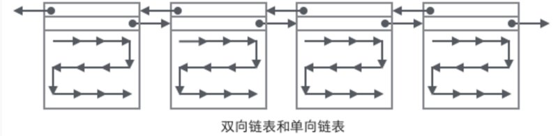
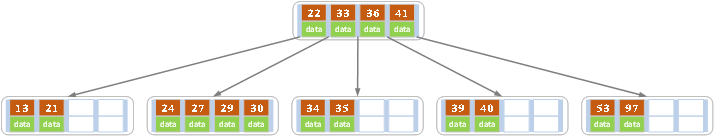
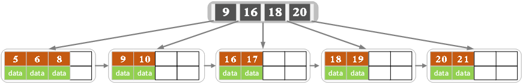
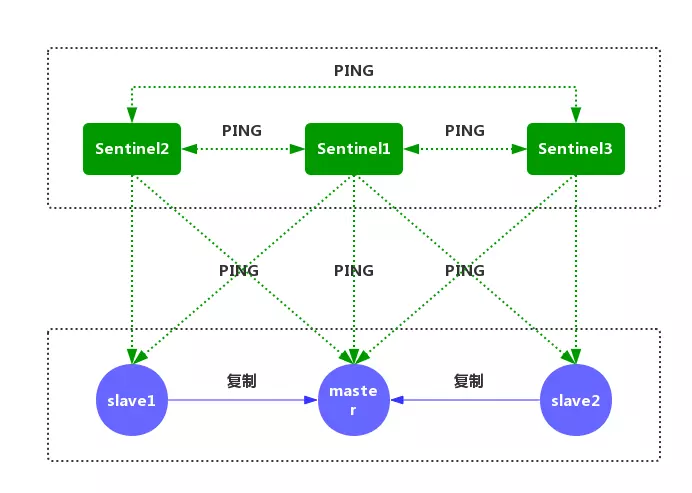

# MySQL

## 存储引擎

**两者的对比：**

1. **是否支持行级锁** : MyISAM 只有表级锁(table-level locking)，而InnoDB 支持行级锁(row-level locking)和表级锁,默认为行级锁。

2. **是否支持事务： MyISAM** 不提供事务支持。**InnoDB** 提供事务支持。

3. **是否支持外键：** MyISAM不支持，而InnoDB支持。

4. **是否支持MVCC** ：仅 InnoDB 支持。应对高并发事务, MVCC比单纯的加锁更高效;MVCC只在 `READ COMMITTED` 和 `REPEATABLE READ` 两个隔离级别下工作;MVCC可以使用 乐观(optimistic)锁 和 悲观(pessimistic)锁来实现;各数据库中MVCC实现并不统一。

5. **使用场景：**InnoDB--事务优先（行锁），适合高并发操作。

   ​					MyISAM--性能优先（表锁）

## 事务

1. **原子性（Atomic）：** 事务是最小的执行单位，不允许分割。事务的原子性确保动作要么什么都不做，要么做全套；
2. **一致性（Consistency）：** 事务的执行是从一个有效状态转移到另一个有效状态。具体实现方式是各种隔离级别。其他三个特性都是为了保证这一点
3. **隔离性（Isolation）：** 并发访问数据库时，一个用户的事务不被其他事务所干扰，各并发事务之间数据库是独立的；
4. **持久性（Durability）：** 一个事务被提交之后。它对数据库中数据的改变是持久的，即使数据库发生故障通过日志和同步备份重建数据


### 隔离级别

| 隔离级别                  | 脏读 | 不可重复读 | 幻读 |
| ------------------------- | ---- | ---------- | ---- |
| READ-UNCOMMITTED 读未提交 | √    | √          | √    |
| READ-COMMITTED 读已提交   | ×    | √          | √    |
| REPEATABLE-READ 可重复读  | ×    | ×          | √    |
| SERIALIZABLE 可串行化     | ×    | ×          | ×    |

MySQL InnoDB 存储引擎的默认支持的隔离级别是 **REPEATABLE-READ（可重读）**

MySQL InnoDB 存储引擎在 **REPEATABLE-READ（可重读）**事务隔离级别下使用的是Next-Key Lock 锁算法，因此==可以避免幻读的产生==，这与其他数据库系统(如 SQL Server)是不同的。

**脏读：**指当一个事务正在访问数据，并且对数据进行了修改，而这种修改还没有提交到数据库中，这时，另外一个事务也访问这个数据，然后使用了这个数据。

**不可重复读** ：是指在一个事务内，多次读同一数据。在这个事务还没有结束时，另外一个事务也访问该同一数据。那么，在第一个事务中的两次读数据之间，由于第二个事务的修改，那么第一个事务两次读到的的数据可能是不一样的。这样在一个事务内两次读到的数据是不一样的，因此称为是不可重复读。

**幻读：**一个事务在前后两次查询同一范围的时候，后一次查询看到了前一次查询没有看到的行。行锁只能锁住行，即使把所有的行记录都上锁，也阻止不了新插入的记录。

不可重复读针对的是值的不同，幻读指的是数据条数的不同。


## 锁

- MyISAM支持表锁，InnoDB支持表锁和行锁，默认为行锁

- 表级锁：开销小，加锁快，不会出现死锁。锁粒度大，发生锁冲突的概率最高，并发量最低

- 行级锁：开销大，加锁慢，会出现死锁。锁粒度小，发生锁冲突的概率小，并发度最高


表级锁和行级锁可以进一步划分为共享锁（S）和排他锁（X）。

**共享锁（Share Locks，简记为S）又被称为读锁**

**排它锁（(Exclusive lock,简记为X锁)）又称为写锁**

|      | S锁  | X锁  |
| ---- | ---- | ---- |
| S锁  | √    | ×    |
| X锁  | ×    | ×    |

**悲观锁**：认为数据被并发修改的概率比较大，所以需要在修改之前必须先加锁

**乐观锁**：采取了更加宽松的加锁机制，在数据进行提交更新的时候，才会正式对数据的冲突与否进行检测


### MVCC机制（Multi-Version Concurrency Control，多版本并发控制）

MVCC是通过保存数据在某个时间点的快照来实现的，**在大多数情况下代替行级锁,**使用MVCC,能降低其系统开销。

MVCC的意思用简单的话讲就是**对数据库的任何修改的提交都不会直接覆盖之前的数据，而是产生一个新的版本与老版本共存，使得读取时可以完全不加锁**。

MVCC只在**REPEATABLE READ**和**READ COMMITTED**两个隔离级别下工作。其他两个隔离级别都和MVCC不兼容，因为READ UNCOMMITTED总是读取最新的数据行，而不是符合当前事务版本的数据行，而SERIALIZABLE会对所有读取到的行都加锁。

这样，实现两个隔离级别就非常容易：

- Read Committed - 一个事务读取数据时总是读这个数据最近一次被commit的版本
- Repeatable Read - 一个事务读取数据时总是读取当前事务开始之前最后一次被commit的版本（所以底层实现时需要比较当前事务和数据被commit的版本号）。

举个简单的例子：

1. 一个事务A（txnId=100）修改了数据X，使得X=1，并且commit了
2. 另外一个事务B（txnId=101）开始尝试读取X，但是还X=1。但B没有提交。
3. 第三个事务C（txnId=102）修改了数据X，使得X=2。并且提交了
4. 事务B又一次读取了X。这时

- 如果事务B是Read Committed。那么就读取X的最新commit的版本，也就是X=2
- 如果事务B是Repeatable Read。那么读取的就是当前事务（txnId=101）之前X的最新版本，也就是X被txnId=100提交的版本，即X=1。


当我们创建表完成后，mysql会自动为每个表添加 数据版本号 db_trx_id（最后更新数据的事务id） 删除版本号 db_roll_pt （数据删除的事务id） 事务id由mysql数据库自动生成，且递增。

每个事务都有自己的事务ID，事务中使用`select`，

它会检索这样的数据→(数据版本号<当前事务ID) &&(删除版本号>当前事务ID)

`update` 相当于对新数据行执行insert 对旧数据行执行detete

| 当前事务执行操作 |          数据版本号 db_trx_id          |         删除版本号 db_roll_pt          |
| :--------------: | :------------------------------------: | :------------------------------------: |
|      insert      |               当前事务ID               |                  null                  |
|      delete      |                  不变                  |               当前事务ID               |
|      update      | 新数据行：当前事务ID    旧数据行：不变 | 新数据行：null    旧数据行：当前事务ID |
|      select      |                  不变                  |                  不变                  |


## 索引

索引，类似书籍的目录，可以根据目录的某个页码立即找到对应的内容。

Innodb使用的是聚簇索引，MyISam使用的是非聚簇索引

在Innodb下主键索引是聚集索引，在Myisam下主键索引是非聚集索引

>Innodb索引结构

**主键索引（聚簇索引）**

聚簇索引就是按照每张表的主键构造一颗B+树，同时==叶子节点中存放的就是整张表的行记录数据==，也将聚集索引的叶子节点称为数据页。这个特性决定了索引组织表中==数据也是索引的一部分==，==每张表只能拥有一个聚簇索引==。

Innodb通过主键聚集数据，如果没有定义主键，innodb会选择非空的唯一索引代替。如果没有这样的索引，innodb会隐式的定义一个主键来作为聚簇索引。

**辅助索引（非聚簇索引）**

先有聚簇索引再有辅助索引，辅助索引叶子节点存储的不再是行记录的全部数据，而是主键值。通过辅助索引首先找到的是主键值，然后用主键到主索引中检索获得记录，故也称之其为二级索引。一张表可以有多个辅助索引。

> MyISam索引结构

MyISAM索引文件和数据文件是分离的，索引文件仅保存数据记录的地址

**主键索引（非聚簇索引）**

MyISAM引擎使用B+Tree作为索引结构，叶节点的**data域存放的是数据记录的地址**

**辅助索引（非聚簇索引）**

在MyISAM中，主索引和辅助索引（Secondary key）在结构上没有任何区别，**只是主索引要求key是唯一的，而辅助索引的key可以重复**。


### 索引类型

方式一 `create  索引类型  索引名  on  表（字段）`

方式二 `alter table 表名  索引类型  索引名（字段）`

- 普通索引：仅加速查询

  `create  index  name_index  on  student（name）`

- 唯一索引：加速查询 + 列值唯一（可以有null）

  `create  unique index  name_index  on  student（name）`

- 主键索引：加速查询 + 列值唯一（不可以有null）+ 表中只有一个

- 组合索引：多列值组成一个索引，专门用于组合搜索，其效率大于索引合并

- 全文索引：对文本的内容进行分词，进行搜索

### InnoDB数据页（Page）

页是InnoDB管理存储空间的基本单位，一个页的大小默认是16KB。

**页之间双向链表连接，页内的User Record使用单向链表连接。**

在Page的主体部分，主要关注数据和索引的存储，他们都位于`User Records`部分，User Records占据Page的大部分空间，User Records由一条条的Record组成，每条记录代表索引树上的一个节点（非叶子节点和叶子节点）；在一个单链表的内部，单链表的头尾由两条记录来表示，字符串形式的“ Infimum”代表开头，“Supremum”表示结尾；



#### 如何定位一个Record：

1. 通过根节点开始遍历一个索引的B+树，通过各层非叶子节点达到底层的叶子节点的数据页（Page），这个Page内部存放的都是叶子节点
2. 在Page内部从“Infimum”节点开始遍历单链表（遍历一般会被优化），如果找到键则返回。如果遍历到了“Supremum”，说明当前Page里没有合适的键，这时借助Page页内部的next page指针，跳转到下一个page继续从“Infmum”开始逐个查找

### B树、B+树

索引存放在硬盘中，由于内存的读写速度比硬盘读写速度快很多，所以理想情况是将索引存放在内存中，然而索引与数据的比例约为1/10（maybe），如果要存满1T的硬盘，至少需要100G的内存，所以**大数据量时，索引无法全部装入内存**。由于无法装入内存，则必然依赖磁盘（或SSD）存储。而内存的读写速度是磁盘的成千上万倍（与具体实现有关），所以减少磁盘IO的次数能很大程度的提高MySQL性能。因此，核心问题是“**如何减少磁盘读写次数**”。

B树与AVL的时间复杂度是相同的，但由于**B树的层数少，磁盘IO次数少**，实践中B树的性能要优于AVL等二叉树。

B树相对B+树，B树的各层节点要存储数据，导致每页能够容纳的节点就很少，直接导致树深度加大。**B+树比B树层数少，磁盘IO次数少**





#### **B树与B+树区别**

1）B树的每个结点都存储了key和data，B+树的data存储在叶子节点上。 节点不存储data，这样一个节点就可以存储更多的key。可以使得树更矮，所以IO操作次数更少。
 2）B+树叶子节点之间通过指针相连，方便遍历。而B树相邻的元素可能在内存中不相邻，所以缓存命中性没有B+树好。

#### **采用自增字段做表的主键**

以B+Tree为索引，使用自增主键，那么每次插入新的记录，记录就会顺序添加到当前索引节点的后续位置 ，近似顺序填满。主键非自增，每次插入时需要移动已有数据，增加很多开销在维护索引上。


### Hash索引

https://blog.csdn.net/olizxq/article/details/82313489

InnoDB中采用除法散列函数，冲突机制采用链接法。

所以Hash索引的**查询效率要远高于B-Tree索引**。

对于Hash索引中的所有列，存储引擎都会为每一行计算一个Hash码，**Hash索引中key是Hash码，value是行指针而不存储字段值**，Hash索引中包含的只是Hash码与行指针，因此必须进行二次查找。

Hash索引只支持等值比较查询，包括=、IN()。也不支持任何范围查询，例如WHERE 。

Hash索**引中Hash码的计算可能存在Hash冲突**。

### 索引优化

#### 索引设计原则

**不要使用索引**

1. 频繁更新的字段不要使用索引。频繁变化导致索引也频繁变化，增大数据库工作量，降低效率。
2. 列中元素大量重复（性别：男/女），索引效果较差。

**推荐使用索引**

1. 为经常需要排序、分组的字段建立索引。排序操作会消耗很多cpu资源，如果为其建立索引，索引本身就是有序结构，可以有效地避免排序操作。
2. 为常作为查询条件的字段建立索引。

**其他**

1. 使用短索引。如果对长字符串列进行索引，应该指定一个前缀长度，这样能够节省大量索引空间；
2. 不要过度索引。索引需要额外的磁盘空间，并降低写操作的性能。所以只保持需要的索引有利于查询即可

#### 索引失效(全表扫描)

https://www.cnblogs.com/liehen2046/p/11052666.html

1. 有or;
2. 联合索引未用左列字段;
3. like以%开头;
4. 需要类型转换;
5. where中索引列有运算;
6. where中索引列使用了函数;
7. where中使用!=或者<>操作费

#### 索引覆盖

https://www.jianshu.com/p/8991cbca3854

一个索引包含(或覆盖)所有需要查询的字段的值，无需回表，速度更快。

常见的方法是：将被查询的字段，建立到**联合索引**里去。

```mysql
select id,name from user where name='zhangsan';
能够命中name索引，索引叶子节点存储了主键id，通过name的索引树即可获取id和name，无需回表，符合索引覆盖，效率较高。
```

```mysql
select id,name,sex from user where name='zhangsan';
能够命中name索引，索引叶子节点存储了主键id，但sex字段必须回表查询才能获取到，不符合索引覆盖，需要再次通过id值聚集索引获取sex字段，效率会降低。
```

如果把(name)单列索引升级为联合索引(name, sex)就能同时获得sex的信息。

#### 联合索引

对多个字段同时建立的索引，建立这样的索引相当于建立了索引a、ab、abc三个索引。

**最左匹配原则**

针对联合索引来讲，联合索引(a,b,c)为例 先以a的顺序建立索引，若a相等则以b的顺序建立，b还相等则以c的顺序。由此可见，对b和c而言，索引是无序的。无法比较（？,1,2）和（？,2,3）的大小，所以要想用到索引，必须a出面。把最常用的，筛选数据最多的字段放在左侧。详情请见文件夹外-----二、B 树索引实战。

```sql
(1)    select * from myTest  where a=3 and b=5 and c=4;   ----  abc顺序
abc三个索引都在where条件里面用到了，而且都发挥了作用

(2)    select * from myTest  where  c=4 and b=6 and a=3;
where里面的条件顺序在查询之前会被mysql自动优化，效果跟上一句一样

(3)    select * from myTest  where a=3 and c=7;
a用到索引，b没有用，所以c是没有用到索引效果的

(4)    select * from myTest  where a=3 and b>7 and c=3;     ---- b范围值，断点，阻塞了c的索引
a用到了，b也用到了，c没有用到，这个地方b是范围值，也算断点，只不过自身用到了索引

(5)    select * from myTest  where b=3 and c=4;   --- 联合索引必须按照顺序使用，并且需要全部使用
因为a索引没有使用，所以这里 bc都没有用上索引效果

(6)    select * from myTest  where a>4 and b=7 and c=9;
a用到了  b没有使用，c没有使用

(7)    select * from myTest  where a=3 order by b;
a用到了索引，b在结果排序中也用到了索引的效果，a下面任意一段的b是排好序的

(8)    select * from myTest  where a=3 order by c;
a用到了索引，但是这个地方c没有发挥排序效果，因为中间断点了，使用 explain 可以看到 filesort

(9)    select * from mytable where b=3 order by a;
b没有用到索引，排序中a也没有发挥索引效果

(10)   select * from mytable where a = 3 and b like 'k%kk%' and c = 4;
abc三个索引都在where条件里面用到了，而且都发挥了作用

(11)   select * from mytable where a = 3 and b like '%kk%' and c = 4;
a用到了索引,b使用like%导致后续整段垮掉
```


## 杂项

### 三大范式

**第一范式**：每一列中数据具有原子性，不可再分解

**第二范式**：满足第一范式后，非主键字段依赖主键，不能存在某个字段和主键无关。确保一个表只说明一个事物

**第三范式**：满足第二范式后，非主键字段不能相互依赖。 每列只与主键有直接关系，不存在传递的依赖。

### 查询SQL的执行过程

https://zhuanlan.zhihu.com/p/95082274


**连接器**

负责客户端和服务器端的连接，进行用户身份的验证。

**查询缓存**

查询缓存是一个哈希表，它将执行过的语句及其结果会以 key-value 对的形式，被直接缓存在内存中。

key是一个哈希值，是通过查询SQL、当前要查询的数据库、客户端协议版本等生成的一个哈希值，而它的value自然就是查询结果啦。

缺陷：

- 只要有对一个表的更新，这个表上所有的查询缓存都会被清空
- SQL任何字符上的不同,如空格,注释,都会导致缓存不命中

Mysql8.0后将其移除

**分析器**

分析器包括解析器和预处理器。

解析器进行词法分析、语法分析，生成一颗语法树。判断有无语法问题。


预处理器判断列名、表名有无错误，进行权限认证判断有无操作表的权限。

**优化器**

对SQL语句进行优化：表里面有多个索引的时候，决定使用哪个索引；一个语句有多表关联（join）的时候，决定个表的连接顺序。

**执行器**

根据指令，逐条调用底层存储引擎接口，逐步执行。

### SQL语句优化

**先讲索引优化即索引适合场景、不适合场景、避免索引失效这一堆东西**

**字段优化**

1. 尽量使用小的数据类型 TINYINT、SMALLINT、MEDIUM_INT，如果非负则加上UNSIGNED
2. 表字段避免null值出现，null值很难查询优化且占用额外的索引空间，推荐默认数字0代替null。
3. 单表不要有太多字段,建议在20以内.
4. 用整形来存ip
5. VARCHAR的长度只分配真正需要的空间

**索引优化**

**查询优化**

1. 避免使用`select * ` 
2. 避免 `%xxx`式查询
3. `OR`改写成`IN`:`OR`的效率是 n 级别,`IN`的效率是 log(2n)级别.`IN`的个数建议控制在200以内.

### CHAR和VARCHAR的区别

1. char(M)的长度是不可变的 取值可以为0～255之间，而varchar(M)的长度是可变的 取值可以为0~65535之间。若输入长度 小于M  **CHAR总是会补足空格后再存储** **VARCHAR不会先补足空格后再存储**
2. varchar比char节省空间，但是在效率上比char稍差些，char定长 是以空间换时间

### explain

```sql
select * from zje where math<60；
```


主要关注的是，type 和 key

type = ALL ：表示全表扫描

type = range：只检索给定范围的行，使用一个索引来选择行

type = const ：表示通过索引一次就找到了


key = NULL：表示没有使用索引

key一般=使用了主键/索引的名字

### drop与delete、TRUNCATE的区别

drop主要用于删除结构：删除数据库 drop database XX ；删除表 drop table XX ； 

​											删除字段 alter table 表名 drop 字段名

delete、TRUNCATE主要用于删除数据：DELETE是可以带WHERE的，所以支持条件删除；而TRUNCATE只能删除整个表的数据但保留表结构。

### 内连接和外连接的区别

内连接：内连接是把两张表相同的地方匹配出来
外连接：外连接是以左边或右边的表作为主表，把主表的内容显示出来，从表没有的内容置为空处理

### 外键约束

外键是表中的一个列，其值必须作为另一个表的主键。外键主要作用是保证数据引用的完整性，定义外键后，不允许删除在另一个表中具有关联行的行。


## 架构

### 读写分离（主从复制）

数据库集群采用一主多从，业务服务器把需要写的操作都写到主数据库中，读的操作都去从库查询。

写主库时，主库会把数据同步到从库上去。

在读多写少的情况下，减少了单一数据库的并发压力，提高了吞吐量。

**流程：**

1. 主库db的更新事件(update、insert、delete)被写到binlog
2. 主库创建一个binlog dump thread，把binlog的内容发送到从库
3. 从库启动并发起连接，连接到主库
4. 从库启动之后，创建一个I/O线程，读取主库传过来的binlog内容并写入到relay log
5. 从库启动之后，创建一个SQL线程，从relay log里面读取内容，将更新内容写入到slave的db


### 分库分表

#### 概念

**分库：**

1. 单机并发量过大会导致数据库崩溃。通过分库从单机到多鸡，承受的并发量增加。
2. 单机磁盘容量被占满的情况下，拆分为多个库，数据库服务器磁盘使用率大大降低。

**分表:**

1. 单表数据量过大会影响SQL的执行性能，通过分表优化SQL执行效率。

#### **垂直切分**

垂直分库就是根据业务耦合性，将关联度低的不同表存储在不同的数据库。


垂直分表将一个表按照字段分成多表，每个表存储其中一部分字段。


如果一个表中某些列常用，而另外一些列不常用，垂直分表可以使单表数据行变小，一个数据页就能存放更多的数据，在查询时就会减少I/O次数，提高热门数据的操作效率

#### **水平切分**

就是把一个表的数据给拆分到多个表里去，但是每个表结构都一样，所有表的数据加起来就是全部数据。

得单个表的数据量变小，提高检索性能。

切分方法有：

1. 范围路由：按id也就是范围路由，比如id 值1999万的放一张表，1000万1999放一张表，一次类推。
2. 哈希路由：就是取几列哈希一下看看属于哪个库，比如拿id来做哈希。

#### **全局主键避重问题**

在分库分表环境中，由于表中数据同时存在不同数据库中，主键值平时使用的自增长将无用武之地，某个分区数据库自生成的ID无法保证全局唯一。因此需要单独设计全局主键，以避免跨库主键重复问题。

1. UUID

   UUID是主键是最简单的方案，本地生成，性能高，没有网络耗时。但缺点也很明显，由于UUID非常长，会占用大量的存储空间；

2. 全局数据库

   生成主键ID的全局数据库A，每次都去数据库A里面得到主键ID，然后再去其他数据库insert 数据。缺点性能瓶颈限制在单台MySQL的读写性能，高并发下全局数据库A撑不太住。

3. Twitter的分布式自增ID算法Snowflake

### 一致性哈希

http://www.zsythink.net/archives/1182/

分布式系统中对象与节点的映射关系，传统方案是使用对象的哈希值，对节点个数取模，再映射到相应编号的节点，这种方案在节点个数变动时，绝大多数对象的映射关系会失效而需要迁移；而一致性哈希算法中，当节点个数变动时，映射关系失效的对象非常少，迁移成本也非常小。

以Redis集群为例，集群当中，通过Hash算法定位到特定的服务器，获取缓存。当缓存服务器增减一台时，通过原有信息无法定位到特定的服务器。当服务器数量发生改变时，所有缓存在一定时间内是失效的，

普通Hash是对服务器的数量进行取模，而一致性哈希算法是对2^32取模。

0到2^32-1共2^32个点组成的圆环称为hash环

假设我们有3台缓存服务器，服务器A、服务器B、服务器C，那么，在生产环境中，这三台服务器肯定有自己的IP地址，我们使用它们各自的IP地址进行哈希计算，使用哈希后的结果对2^32取模，

hash（服务器A的IP地址） %  2^32  算出的结果一定是一个0到2^32-1之间的一个整数，我们就用算出的这个整数，代表服务器A，服务器A就可以映射到这个环上


通过相同的方法，把对象也映射到环上。判断一个对象应该被缓存到哪台服务器上的，将缓存服务器与被缓存对象都映射到hash环上以后，从被缓存对象的位置出发，沿顺时针方向遇到的第一个服务器，就是当前对象将要缓存于的服务器，


当移除一个节点或增加一个节点，只有部分缓存会失效。这部分失效的缓存再去数据库中读，全部缓存失效引起的缓存雪崩。


#### hash环的偏斜

当多台服务器映射后在环上距离很近，那么被缓存的对象很有可能大部分集中缓存在某一台服务器上。需要引入虚**拟节点**。虚拟节点被平均分布到环上，一个实际节点可以对应多个虚拟节点，顺时针碰到虚拟节点时，就会向其对应的真实节点查找缓存。

# Redis

## 概念

### Redis为什么快

1. **纯内存操作**

   Redis 将所有数据放在内存中，内存的响应时长大约为 100 纳秒，这是 redis 的 QPS 过万的重要基础。

2. **核心是基于非阻塞的IO多路复用机制**

   采用多路 I/O 复用技术可以让单个线程高效的处理多个连接请求（尽量减少网络 IO 的时间消耗）

3. **单线程反而避免了多线程的频繁上下文切换带来的性能问题。**

### Redis线程模型

****

通过使用 I/O 多路复用程序**非阻塞**的来监听多个套接字，对监听到的套接字送入队列中，由文件事件分派器进行后续操作，后续操作虽然是阻塞的，但由于是在内存中进行，速度够快。

## 五种数据结构及其使用场景


### String

**计数器**

[](http://blog-image-xiaoqiang.test.upcdn.net/201910/1020-2.jpg)

这个是微信公众号的文章阅读量数量的统计，可以通过redis的string数据结构来解决。使用incr原子操作命令，redis的key是article：readcount：{文章id}，当该文章被阅读时，调用incr命令，阅读数量加一，通过get该redis的key，实现文章阅读数量统计的功能。

```java
incr article：readcount：{文章id}
get article：readcount：{文章id}
```

### Hash 

Hash键可以将信息凝聚在一起，而不是直接分散存储在整个Redis中，这不仅方便了数据管理，还可以尽量避免一定的误操作

[](http://blog-image-xiaoqiang.test.upcdn.net/201910/1020-3.jpg)

这个是京东购物车的截图，可以看到很多功能都用redis的命令可来实现。在redis中保存对商品id、购物车id等等id的操作，在前端保存对于该商品的描述，在操作购物车的时候，底层其实就是操作redis的命令。

```
添加商品：hset cart:1001 1088 1
添加数量：hincrby cart:1001 1088 1
商品总数：hlen cart:1001
删除商品：hdel cart:1001 1008
获取购物车所有商品： hgetall cart:1001
```

### List

实现消息队列

微博 TimeLine

[](http://blog-image-xiaoqiang.test.upcdn.net/201910/1020-4.jpg)

这是我们经常使用的新浪微博，我们看在微博文章中如何使用redis的list数据结构。新浪微博是使用redis的大户，据在新浪工作的朋友说，新浪使用redis的总容量超过500T，可想而知几乎70%的功能都在redis中操作。

"小米手机"发微博，消息id为1001，使用的redis命令是：

```
LPUSH msg：{小强-id} 1001
```

"号外长沙"发微博，消息id为1002，使用的redis命令是：

```
LPUSH msg：{小强-id} 1002
```

小强查看最新10条的新浪微博消息：

```
LRANGE msg：{小强-id} 0 10
```

### Set

共同关注

两用户关注对象的交集

```java
sinter userfriends user:1:follows user:2:follows
```

好友推荐的时候，根据 tag 求交集，大于某个 threshold 就可以推荐

### Zset

排行榜

## 设置过期时间

如果假设你设置了一批 key 只能存活1个小时，那么接下来1小时后，redis是怎么对这批key进行删除的？

**定期删除+惰性删除。**

通过名字大概就能猜出这两个删除方式的意思了。

- **定期删除**：redis默认是每隔 100ms 就**随机抽取**一些设置了过期时间的key，检查其是否过期，如果过期就删除。注意这里是随机抽取的。为什么要随机呢？你想一想假如 redis 存了几十万个 key ，每隔100ms就遍历所有的设置过期时间的 key 的话，就会给 CPU 带来很大的负载！
- **惰性删除** ：定期删除可能会导致很多过期 key 到了时间并没有被删除掉。所以就有了惰性删除。假如你的过期 key，靠定期删除没有被删除掉，还停留在内存里，除非你的系统去查一下那个 key，才会被redis给删除掉。

如果定期删除漏掉了很多过期 key，然后你也没及时去查，也就没走惰性删除，大量过期key堆积在内存里，导致redis内存块耗尽了。怎么解决这个问题呢？ 

**redis 内存淘汰机制。**

　　noeviction：新写入操作会报错，

　　allkeys-lru（Least Recently Used）：在键空间中，移除最近最少使用的key（这个是最常用的）

　　allkeys-random：在键空间中，随机移除某个key

　　volatile-lru：在设置了过期时间的键空间中，移除最近最少使用的key

　　volatile-random：在设置了过期时间的键空间中，随机移除某个key

　　volatile-ttl：在设置了过期时间的键空间中，有更早过期时间的key优先移除

## 事务

## 持久化

### RDB持久化 保存某个时间点的全量数据快照

RDB持久化是指在指定的时间间隔内将内存中的数据集快照写入磁盘，实际操作过程是fork一个子进程，先将数据集写入临时文件，当子进程完成对新 RDB 文件的写入时，Redis 用新 RDB 文件替换原来的 RDB 文件，


> 触发机制

1、满足save规则的条件

2、执行flushall命令

3、退出redis

**优点：**

1、适合大规模的数据恢复、数据备份

2、RDB对redis服务影响较小，可以让redis保持高性能。

3、RDB比AOF重启和恢复redis更加快速

**缺点**：

1、一般说来，RDB每隔5分钟定时持久化。系统一旦在定时持久化之前出现宕机现象，此前没有来得及写入磁盘的数据都将丢失。如果想要在Redis故障时，尽可能少的丢失数据，RDB没有AOF好。

2、由于RDB fork的子进程要定时将数据写入磁盘中，若数据文件特别大，会导致redis服务短时间暂停，要避免定时持久化时间间隔过长


|                    | RDB        | AOF                          |
| ------------------ | ---------- | ---------------------------- |
| 丢失数据           | 丢失数据多 | 依策略而定，丢失1s甚至不丢失 |
| 重启、恢复速度     | 快         | 慢                           |
| 对Redis服务影响    | 小         | 大                           |
| 持久化文件占用空间 | 小         | 大                           |


### AOF持久化 保存修改记录

AOF持久化以日志的形式记录服务器所处理的每一个写、删除操作，查询操作不会记录，不断地将命令追加到文件的末尾， 所以随着写入命令的不断增加， AOF 文件的体积也会变得越来越大，这时候需要重写。

默认不开启，需要在配置文件中打开。

默认同步策略 每秒钟同步一次（可能会丢失一秒的数据）


**优点**：

1、AOF默认每隔一秒进行同步操作，保证最多丢失1秒的数据

**缺点**：	

1、对于相同数量的数据集而言，AOF文件通常要大于RDB文件。

2、RDB 在恢复大数据集时的速度比 AOF 的恢复速度要快

3、根据同步策略的不同，Redis在AOF在运行效率上往往会慢于RDB。


## 缓存存在的问题

### 缓存穿透

- **缓存穿透**是指**查询一个一定不存在数据**,由于缓存没有命中,将去查询数据库,但是数据库也没有这条记录,并且处于容错的考虑,我们没有讲这次的查询写入到缓存中,这将导致这个不存在数据每次请求都要到存储层去查询,失去了缓存的意义.在**流量很大的时候**,可能DB就挂掉了,有人利用这个不存在的key频繁攻击我的应用,这就是漏洞.

> 解决: 空结果进行缓存,但是他的过期时间很短,最长不超过五分钟
>
> 解决: 使用布隆过滤器，查询的时候先去 BloomFilter 去查询 key 是否存在，如果不存在就直接返回，存在再走查缓存、查 DB。

#### 布隆过滤器

**当一个元素加入布隆过滤器中的时候，会进行如下操作：**

1. 使用布隆过滤器中的哈希函数对元素值进行计算，得到哈希值（有几个哈希函数得到几个哈希值）。
2. 根据得到的哈希值，在位数组中把对应下标的值置为 1。

**当我们需要判断一个元素是否存在于布隆过滤器的时候，会进行如下操作：**

1. 对给定元素再次进行相同的哈希计算；
2. 得到值之后判断位数组中的每个元素是否都为 1，如果值都为 1，那么说明这个值在布隆过滤器中，如果存在一个值不为 1，说明该元素不在布隆过滤器中。


如图所示，当字符串存储要加入到布隆过滤器中时，该字符串首先由多个哈希函数生成不同的哈希值，然后在对应的位数组的下表的元素设置为 1（当位数组初始化时 ，所有位置均为0）。当第二次存储相同字符串时，因为先前的对应位置已设置为1，所以很容易知道此值已经存在（去重非常方便）。

如果我们需要判断某个字符串是否在布隆过滤器中时，只需要对给定字符串再次进行相同的哈希计算，得到值之后判断位数组中的每个元素是否都为 1，如果值都为 1，那么说明这个值在布隆过滤器中，如果存在一个值不为 1，说明该元素不在布隆过滤器中。

**不同的字符串可能哈希出来的位置相同，这种情况我们可以适当增加位数组大小或者调整我们的哈希函数。**

综上，我们可以得出：==**布隆过滤器说某个元素存在，小概率会误判。布隆过滤器说某个元素不在，那么这个元素一定不在。**==

##### 使用

适用于数据量很大情况，且业务可以忍受小概率的误判。

1、大数据去重

例如新闻客户端的推送去重功能。

用户看到新闻则在布隆过滤器中更新。也就是说，推荐系统认为该用户浏览过某条新闻时，用户实际上可能有小概率并没有浏览过这条新闻，但系统认为该用户没有浏览过某条新闻，用户一定没有浏览过这条新闻。这样就能确保用户一定不会浏览重复的内容。

2、判断给定数据是否存在：解决缓存穿透、邮箱的垃圾邮件过滤、黑名单功能等等

### 缓存雪崩

- 缓存无法正常工作，所有请求全部转发到DB，DB瞬间压力过重雪崩。

  

原因1：**设置缓存的时候采用了相同的过期时间,导致缓存在同一时刻失效了。**

解决方法: 原有的失效时间基础上增加一个随机值,比如1-5分钟随机值,这样一个缓存的过期时间的重复率会降低,很难引发群体失效的事件

原因2：**Redis崩溃**

事前--做Redis集群保证高可用   

事中--通过限流、降级，保证DB不被重启一次打死一次，缓慢处理一部分请求

事后--通过Redis持久化文件，尽快恢复Redis集群

### 缓存击穿

- 对于一些设置了过期时间的key,如果这些key可能会在某些时间点被超高并发地访问,是一种非常"热点"的数据.这个时候,如果这个key在大量请求进来的时候,正好失效,那么所有对这个key的数据查询都落到db,和缓存雪崩的区别是:
  - 击穿是一个热点key失效
  - 雪崩是很多key集体失效


## Redis分布式锁


**加锁**

通过setNx() 若不存在keyLock（无锁），则设置锁；若存在keyLock 则抛弃请求

**解锁**

将keyLock删除，在finally中删除，且注意不能说客户端1的请求将客户端2的锁给删除掉。

keyLock的 value设置为 clientId 确保是随机值，删除时keyLock的 value要对的上clientId 

**不死锁**

有一个客户端在持有锁的期间崩溃而没有主动解锁，造成死锁。

所以要对keyLock设置失效时间 expire()，保证后续其他客户端能加锁。

### Redlock 算法


## 集群

### 主从复制

主从复制，是指将一台Redis服务器的数据，复制到其他的Redis服务器。前者称为主节点，后者称为从节点；**数据的复制是单向的，只能由主节点到从节点。**

**主机可以写+读，从机只能读。**

==主从复制提高了吞吐量，但不保证高可用==

从节点崩了无事发生，重新启动后自动加入主从架构，并完成增量复制。

主节点崩了就很麻烦，要手动将从节点升级为主节点。

**主从复制的作用**

1、数据冗余：实现数据的热备份，是持久化意外的一种数据冗余方式。

2、故障恢复：当主节点出现问题时，可以由从节点提供服务，实现快速的故障恢复。

3、负载均衡：在主从复制的基础上，配合**读写分离**，可以由主节点提供写服务，由从节点提供读服务，分担服务器负载。

4、高可用基石：主从复制还是哨兵和集群能够实施的基础。

### 哨兵模式

主从切换技术的方法是：当主服务器宕机后，需要手动把一台从服务器切换为主服务器，这就需要人工干预，费事费力，还会造成一段时间内服务不可用。这不是一种推荐的方式，更多时候，我们优先考虑哨兵模式。

==哨兵模式保证了高可用==

哨兵模式是一种特殊的模式，首先Redis提供了哨兵的命令，**哨兵是一个独立的进程，作为进程，它会独立运行。**其原理是**哨兵通过发送命令，等待Redis服务器响应，从而监控运行的多个Redis实例。**

每个哨兵以每秒钟一次的频率，向它所知的 主服务器、从服务器 以及其他 哨兵 实例发送一个PING 命令。



假设主服务器宕机，哨兵1先检测到这个结果，哨兵1主观的认为主服务器不可用，这个现象成为**主观下线**。当后面的哨兵也检测到主服务器不可用，并且数量达到一定值时，那么哨兵之间就会进行一次投票，投票选出新的主节点。切换成功后，就会通过发布订阅模式，让各个哨兵把自己监控的从服务器实现切换主机，这个过程称为**客观下线**。

# 消息队列

## 为什么使用消息队列

解耦 异步 削峰

**解耦**


**异步**


**削峰**


## 使用消息队列产生的问题

**系统可用性降低**

**系统复杂度提高**

**一致性问题**


## 如何保证消息队列高可用

RabbitMQ基于主从模式（非分布式）实现高可用。RabbitMQ有三种模式：单机模式，普通集群模式，镜像集群模式。
**单机模式**
 单机模式就是demo级别的，生产中不会有人使用。
**普通集群模式**
 普通集群模式就是在多台机器上启动多个rabbitmq实例，每个机器启动一个。但是Queue的具体信息只会放到master实例上面，其他的实例只同步了这个Queue的元数据。在你消费的时候，如果连接到了从实例，他会从master实例获取消息然后再返回给你。


而且如果master实例宕机了，会导致接下来其他实例都无法拉取数据；如果没有开启消息的持久化会丢失消息；就算开启了消息的持久化，消息不一定会丢，但是也要等这个实例恢复了，才可以继续拉取数据。
所以这个并没有提供高可用，这种方案只是提高了吞吐量，也就是让集群中多个节点来服务某个queue的读写操作。
 **镜像集群模式**
这种模式，才是rabbitmq提供是真正的高可用模式，跟普通集群不一样的是，你创建的queue，无论元数据还是queue里面是消息数据都存在多个实例当中，然后每次写消息到queue的时候，都会自动把消息到多个queue里进行消息同步。


这种模式的好处在于，任何一台机器宕机了，其他的机器还可以使用。
**坏处在于：**1、性能消耗太大，所有机器都要进行消息的同步，导致网络压力和消耗很大。2、没有扩展性可言，如果有一个queue负载很重，就算加了机器，新增的机器还是包含了这个queue的所有数据，并没有办法扩展queue。所以说是**非分布式**的。

## 如何保证消息消费时的幂等性（如何处理消息重复消费）

让生产者发送消息时，每条消息加一个全局的唯一id，然后消费时，将该id保存到redis里面。消费时先去redis里面查一下有么有，没有再消费。

## 如何保证消息的可靠性传输（如何处理消息丢失）


1. 生产者发了 MQ妹收到------------使用RabbitMQ的confirm机制

   可以开启confirm模式。在生产者哪里设置开启了confirm模式之后，每次写的消息都会分配一个唯一的id，然后如何写入了rabbitmq之中，rabbitmq会给你回传一个ack消息，告诉你这个消息发送OK了；如果rabbitmq没能处理这个消息，会回调你一个nack接口，告诉你这个消息失败了，你可以进行重试。而且你可以结合这个机制知道自己在内存里维护每个消息的id，如果超过一定时间还没接收到这个消息的回调，那么你可以进行重发。

```cpp
    //开启confirm
    channel.confirm();
    //发送成功回调
    public void ack(String messageId){
      
    }

    // 发送失败回调
    public void nack(String messageId){
        //重发该消息
    }
```

2. RabbitMQ把数据放到内存中后挂掉，自己把数据搞丢---------持久化

   设置消息持久化到磁盘。设置持久化有两个步骤：

   ​	①创建queue的时候将其设置为持久化的，这样就可以保证rabbitmq持久化queue的元数据，但是不会持久化queue里面的数据。

   ​	②发送消息的时候讲消息的deliveryMode设置为2，这样消息就会被设为持久化方式，此时rabbitmq就会将消息持久化到磁盘上。
    	必须要同时开启这两个才可以。

   而且持久化可以跟生产的confirm机制配合起来，只有消息持久化到了磁盘之后，才会通知生产者ack，这样就算是在持久化之前rabbitmq挂了，数据丢了，生产者收不到ack回调也会进行消息重发。

3. MQ发了，消费者妹收到-------------------消息手动确认

   使用rabbitmq提供的ack机制，首先关闭rabbitmq的自动ack，然后每次在确保处理完这个消息之后，在代码里手动调用ack。这样就可以避免消息还没有处理完就ack。

## 如何保证消息的顺序性


在 MQ 里面创建多个 queue，对相同的唯一标识（如订单id）进行 hash，有顺序的放入 MQ 的 queue 里面，每个queue一个consumer，这样执行的顺序是有序的。


## 如何解决消息积压在队列中

先分析问题出现在哪里，MQ本身出现问题，消息队列内存使用情况。

消费端出现问题，这种时候只能**临时扩容**，以更快的速度去消费数据。

1. 先修复consumer的问题，确保其恢复消费速度，然后将现有cnosumer都停掉
2. 新建MQ实例，临时建立好原先10倍或者20倍的queue数量
3. 然后写一个临时的分发数据的consumer程序，这个程序部署上去消费积压的数据，消费之后不做耗时的处理，直接均匀轮询写入临时建立好的10倍数量的queue。
4. 接着临时征用10倍的机器来部署consumer，每一批consumer消费一个临时queue的数据
5. 这种做法相当于是临时将queue资源和consumer资源扩大10倍，以正常的10倍速度来消费数据
6. 等快速消费完积压数据之后，得恢复原先部署架构，重新用原先的consumer机器来消费消息
