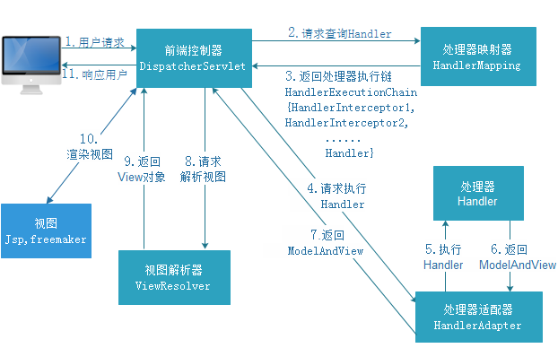

# Spring

## IOC(Inversion of Control) 


IOC 让Spring创建对象 避免程序员手动new对象 是一种设计思想，核心通过**反射**创造对象

DI 则实现了组件中完成另一个组件的调用（在ServiceImpl组件中调用DAO组件 ，这里的DAO相当于ServiceImpl的依赖，因为ServiceImpl要使用DAO中方法）


### Bean的作用域及线程安全

简单地讲，bean就是由IoC容器初始化、装配及管理的对象 .


默认单例模式也是最常用的模式。

 * prototype:多例的 ioc容器启动并不会去调用方法创建对象在容器中，而是每次获取时才会调用方法创建对象

 * singleton:单例的（默认值） ioc容器启动会调用方法创建对象放到ioc容器中，以后每次获取就是从容器中拿

   单实例还有懒加载模式：容器启动不创建对象，第一次获取Bean创建对象，并初始化

**Spring中Bean不是线程安全的**

单例模式下多线程同时执行一个Bean中的方法且修改了内容，线程不安全。

解决方法：通过ThreadLocal为每个线程保存线程私有的数据


### Bean的生命周期

[Bean的生命周期][https://www.jianshu.com/p/1dec08d290c1]

[Bean的生命周期][https://blog.csdn.net/u012385190/article/details/81368748]

[BeanFactory深入理解][https://blog.csdn.net/qq_36688143/article/details/84968036]


**a.实例化Bean**

容器通过获取BeanDefinition对象（封装了配置文件xml中bean的相关信息）中的信息进行实例化。并且这一步仅仅是简单的实例化，并未进行依赖注入。 

- BeanFactory可以理解为 HashMap，key为bean的名称 value为BeanDefinition对象 。

  对于BeanFactory容器，当客户向容器请求一个尚未初始化的bean时，或初始化bean的时候需要注入另一个尚未初始化的依赖时，容器就会调用createBean进行实例化。 

- 对于ApplicationContext容器，当容器启动结束后，便实例化所有的bean。 

实例化对象被包装在BeanWrapper对象中（可以认为是Bean的原生态），BeanWrapper提供了设置对象属性的接口，避免了使用反射机制设置属性。

这里提到了4个组件：**BeanFacotry\ApplicationContext\BeanDefinition\BeanWrapper**

**b.设置对象属性（依赖注入）**

实例化后的对象被封装在BeanWrapper对象中，并且此时对象仍然是一个原生的状态，并没有进行依赖注入。 

紧接着，Spring根据BeanDefinition中的信息进行依赖注入。 

并且通过BeanWrapper提供的设置属性的接口完成依赖注入。

**c.注入Aware接口(给bean增加某种能力，申明是某种特殊的bean)**

Aware接口用于增强Bean能力

容器需检测该对象是否实现了xxxAware接口，并将相关的xxxAware实例注入给bean。

常见的Aware接口有：**BeanNameAware\BeanFactoryAware\ApplicationContextAware**

至此，一个对象已经被正确构造。

**d.1.BeanPostProcessor(自定义处理，满足用户需求)**

经过上述几个步骤后，bean对象已经被正确构造，但如果你想要对象被使用前再进行一些自定义的处理，就可以通过**BeanPostProcessor**接口实现。 

该接口提供了两个函数：

- **postProcessBeforeInitialization**( Object bean, String beanName ) 

当前正在初始化的bean对象会被传递进来，我们就可以对这个bean作任何处理。 

这个函数会先于InitializingBean执行，因此称为前置处理。 所有Aware接口的注入就是在这一步完成的。

- **postProcessAfterInitialization**( Object bean, String beanName ) 

当前正在初始化的bean对象会被传递进来，我们就可以对这个bean作任何处理。 

这个函数会在InitialzationBean完成后执行，因此称为后置处理。


**d.2.InitializingBean与init-method**

当BeanPostProcessor的**前置处理**完成后就会进入本阶段。 

InitializingBean接口只有一个函数：

- **afterPropertiesSet**()

这一阶段也可以在bean正式构造完成前增加我们自定义的逻辑，但它与前置处理不同，由于该函数并不会把当前bean对象传进来，因此在这一步没办法处理对象本身，只能增加一些额外的逻辑。 

若要使用它，我们需要让bean实现该接口，并把要增加的逻辑写在该函数中。然后Spring会在前置处理完成后检测当前bean是否实现了该接口，并执行afterPropertiesSet函数。

当然，Spring为了降低对客户代码的侵入性，给bean的配置提供了init-method属性，该属性指定了在这一阶段需要执行的函数名。Spring便会在初始化阶段执行我们设置的函数。init-method本质上仍然使用了InitializingBean接口。

**e.DisposableBean和destroy-method**

和init-method一样，通过给destroy-method指定函数，就可以在bean销毁前执行指定的逻辑。

#### 2.关于Aware接口（Bean能力声明，是某种特殊的bean）

扩展点：

BeanNameAware

BeanFactoryAware

ApplicationContextAware

#### 3.依赖注入的几种方式

一般而言，依赖注入可以分为3种方式。

- **构造器注入。**
- **setter注入。**
- **接口注入。**

**构造器注入**

　　构造器注入依赖于构造方法实现，而构造方法可以是有参数的或者是无参数的。在大部分的情况下，我们都是通过类的构造方法来创建类对象，Spring也可以采用反射的方式，通过使用构造方法来完成注入，这就是构造器注入的原理

```java
public class Role { 
 private Long id;    
 private String roleName;    
 private String note;     
 public Role(String roleName, String note) {        
 this.roleName = roleName;        
 this.note = note;    
    }    
 /******** setter and getter *******/}
```

这个时候是没有办法利用无参数的构造方法去创建对象的，为了使Spring能够正确创建这个对象，可以像代码清单那样去做。

```xml
<bean id="role1" class="com.ssm.chapter9.pojo.Role">    
    <constructor-arg index="0" value="总经理"/>    
    <constructor-arg index="1" value="公司管理者"/>
</bean>
```

 constructorarg元素用于定义类构造方法的参数，其中index用于定义参数的位置，而value则是设置值，通过这样的定义Spring便知道使用Role(String,String)这样的构造方法去创建对象了。这样注入还是比较简单的，但是缺点也很明显，由于这里的参数比较少，所以可读性还是不错的，但是如果参数很多，那么这种构造方法就比较复杂了，这个时候应该考虑setter注入

**使用setter注入**

setter注入是容器中最主流的注入方式，它利用JavaBean规范所定义的setter方法来完成注入，灵活且可读性高。它消除了使用构造器注入时出现多个参数的可能性，首先可以把构造方法声明为无参数的，然后使用setter注入为其设置对应的值，其实也是通过Java反射技术得以现实的。这里假设先在代码清单中为Role类加入一个没有参数的构造方法，然后做代码清单的配置。

```text
<bean id="role2" class="com.ssm.chapter9.pojo.Role">   
    <property name="roleName" value="高级工程师"/>    
    <property name="note" value="重要人员"/>
</bean
```

这样Spring就会通过反射调用没有参数的构造方法生成对象，同时通过反射对应的setter注入配置的值了。这种方式是Spring最为主要的方式，在实际工作中使用广泛。

**接口注入**

　　有些时候资源并非来自于自身系统，而是来自于外界，比如数据库连接资源完全可以在Tomcat下配置，然后通过JNDI的形式去获取它，这样数据库连接资源是属于开发工程外的资源，这个时候我们可以采用接口注入的形式来获取它

### 解决循环依赖

https://www.jianshu.com/p/a77e64250a9e

```cpp
public class BeanB {
    private BeanA beanA;
}

public class BeanA {
    private BeanB beanB;
}
```

SpringIOC解决循环依赖的思路就是依靠**缓存**，同时还得引出个概念即**早期暴露引用**。我们知道在IOC容器里bean的初始化的过程分为三个步骤：创建实例、属性注入实例、回调实例实现的接口方法。解决思路就在这：当我们创建实例与属性注入实例这俩个步骤之间的时候，我们引入缓存，**将这些已经创建好但是并没有注入属性的实例放到缓存里**，而这些放在缓存里但是没有被注入属性的实例对象，就是解决循环依赖的方法，打个比方：A对象的创建需要引用到B对象，而B对象的创建也需要A对象，而此时当B对象创建的时候直接从缓存里引用A对象（虽然不是完全体A对象，毕竟没有赋值处理），当B对象完成创建以后再被A对象引用进去，则A对象也完成了创建。

**小问题**：*IOC能够解决的只能是属性之间的循环依赖，如果有bean之间的构造器相互依赖则就解决不了只能报错了。*


## AOP

### AOP（Aspect Oriented Programming）

面向切面编程（aop）在运行时，动态地将代码切入到类的指定方法、指定位置上。将通用业务代码和核心业务代码分离开，减少系统的重复代码，降低模块之间的耦合度，在不修改代码的情况下可以达到进行增强。

#### **AOP的底层机制：动态代理**

静态代理主要通过将真实类与代理类实现同一个接口，让代理类持有真实类对象，然后在代理类方法中调用真实类方法，在调用真实类方法的前后添加我们所需要的功能扩展代码来达到增强的目的，调用时通过·**代理类来创建代理对象**。

**缺点：**一个代理类只能为一个真实类服务，如果需要增强的真实类有很多，则需要编写大量的代理类。

```java
/**
 * 代理类与目标类的共同接口
 */
public interface Subject {
    void request();
    void response();
}
/**
 * 目标类
 */
public class RealSubject implements Subject {

    @Override
    public void request() {
        System.out.println("执行目标对象的request方法......");
    }

    @Override
    public void response() {
        System.out.println("执行目标对象的response方法......");
    }
}
/**
 * 代理类
 */
public class ProxySubject implements Subject {

    private Subject subject;

    public ProxySubject(Subject subject) {
        this.subject = subject;
    }

    @Override
    public void request() {
        System.out.println("before 前置增强");
        subject.request();
        System.out.println("after 后置增强");
    }

    @Override
    public void response() {
        System.out.println("before 前置增强");
        subject.response();
        System.out.println("after 后置增强");
    }
}

public class Main {

    public static void main(String[] args) {
        //目标对象
        Subject realSubject = new RealSubject();
        //代理对象 通过构造器注入目标对象
        Subject proxySubject = new ProxySubject(realSubject);

        proxySubject.request();
        proxySubject.response();
    }
}
```


与静态代理相比，动态代理的**代理类不需要程序员自己手动定义，而是在程序运行时动态生成**

动态代理分为两类 : 一类是基于接口动态代理 , 一类是基于类的动态代理

- 基于接口的动态代理----JDK动态代理
- 基于继承类的动态代理--CGLib

如果类是实现了某个接口的，则会使用JDK动态代理，生成一个实现同样接口的代理类，直接调用这个代理类。

如果类没有实现接口，则使用CGLib生成类的子类，可以动态生成字节码，覆盖你的一些方法，在方法中增强代码。这种通过继承类的实现方式，不能代理final修饰的类。

Spring AOP中的代理使用的默认策略是：
如果目标对象实现了接口，则默认采用JDK动态代理
如果目标对象没有实现接口，则采用CGLib进行动态代理
如果目标对象实现了接口，且强制CGLib代理，则采用CgLib进行动态代理

##### JDK动态代理

1. 实现java.lang.reflect.InvocationHandler接口，重写invoke方法
3. 通过调用java.lang.reflect.Proxy的newProxyInstance方法获得动态代理对象
4. 通过代理对象调用目标方法

重点就是两个方法 invoke() 和 newProxyInstance()

```java
Object invoke(Object proxy, Method method, Object[] args) throws Throwable
proxy:　 - 指代我们所代理的那个真实对象
method:　- 指代的是我们所要调用真实对象的某个方法的Method对象
args:　　- 指代的是调用真实对象某个方法时接受的参数
    
public static Object newProxyInstance(ClassLoader loader, Class<?>[] interfaces, InvocationHandler h) throws IllegalArgumentException
loader:　　    一个ClassLoader对象，定义了由哪个ClassLoader对象来对生成的代理对象进行加载
interfaces:　　一个Interface对象的数组，表示的是我将要给我需要代理的对象提供一组什么接口，如果我提供了一组接口给它，那么这个代理对象就宣称实现了该接口(多态)，这样我就能调用这组接口中的方法了
h:　　         一个InvocationHandler对象，表示的是当我这个动态代理对象在调用方法的时候，会关联到哪一个InvocationHandler对象上
```

**下面的Subject接口换到项目上就是 UserService接口**

```java
/**
 * 自定义InvocationHandler的实现类
 */
public class MyInvocationHandler implements InvocationHandler {

    private Subject subject;

    public MyInvocationHandler(Subject subject) {
        this.subject = subject;
    }

    @Override
    public Object invoke(Object proxy, Method method, Object[] args) throws Throwable {

        System.out.println("before 前置通知");
        Object result = null;

        try {
            System.out.println("当前执行的方法："+method.getName());
            System.out.println("当前执行的方法的参数："+args[0]);
            System.out.println("开启事务");
            //通过反射机制，调用真实类中方法
            result = method.invoke(subject, args);
            System.out.println("提交事务");
        }catch (Exception ex) {
            System.out.println("ex: " + ex.getMessage());
            System.out.println("回滚事务");
            throw ex;
        }finally {
            System.out.println("after 后置通知");
        }
        return result;
    }
}

public class Main {

    public static void main(String[] args) {

        //获取InvocationHandler对象 在构造方法中注入目标对象
        InvocationHandler handler = new MyInvocationHandler(new RealSubject());
        //获取代理类对象
		Subject proxySubject = (Subject)Proxy.newProxyInstance(Main.class.getClassLoader(), new Class[]{Subject.class}, handler);
        //调用目标方法时，实则调用InvocationHandler中的invoke方法，并将方法名和参数传给invoke
        proxySubject.request();
        proxySubject.response();
    }
}
```

##### CGLib动态代理

1. 实现MethodInterceptor接口，重写 intercept方法。
2. 获取cglib.Enhancer类的对象，通过setSuperclass方法设置父类
3. 通过Enhancer类的create方法生成代理对象

```java
/**
 * 自定义MethodInterceptor实现类
 */
public class MyMethodInterceptor implements MethodInterceptor {

    @Override
    public Object intercept(Object obj, Method method, Object[] args, MethodProxy methodProxy) throws Throwable {

        System.out.println("before 前置通知");
        Object result = null;

        try {
            result = methodProxy.invokeSuper(obj, args);
        }catch (Exception ex) {
            System.out.println("ex: " + ex.getMessage());
            throw ex;
        }finally {
            System.out.println("after 后置通知");
        }
        return result;
    }
}

public class Main {

    public static void main(String[] args) {
        //获取Enhancer 对象
        Enhancer enhancer = new Enhancer();
        //设置代理类的父类（目标类）
        enhancer.setSuperclass(RealSubject.class);
        //设置回调方法
        enhancer.setCallback(new MyMethodInterceptor());
        //获取代理对象
        Subject proxySubject = (Subject)enhancer.create();

        //调用目标方法
        proxySubject.request();
        proxySubject.response();
    }
}
```


#### 术语

joinPoint:连接点。在spring中只支持方法连接点，连接点指的是可以使用advice(增强)的地方，例如一个类中有5个方法，那么这5个方法，那么这5个方法都可以是连接点。

pointcut:切入点。可理解为实实在在的连接点，即切入advice(增强)的点。例如一个类中有5个方法，其中有3个方法（连接点）需要织入advice(增强)，那么这3个需要织入advice的连接点就是切入点。

advice:增强/通知。实际中想要添加的功能，如日志、权限校验。

aspect:切面。拦截器类，其中会定义切点以及通知。

#### 使用

创建两个类，这两个类封装核心业务，有相同的方法 `核心业务1` 我们想在其前后加入日志跟踪调试。

```java
public class Core1{
    public String 核心业务1(){
    		......
	}
    public String 核心业务2(){
    		......
	}
}
```

```java
public class Core2{
    public String 核心业务1(){
    		......
	}
    public String 核心业务3(){
    		......
	}
}
```

创建一个封装了日志功能的类，使用@Aspect注解 表示这是一个切面类

```java
@Aspect
public class UserAspect {
	
	//匹配所有ServiceImpl包下面的所有类的名为核心业务1的方法，以此为切入点
	@Pointcut("execution(* com.ctc.ServiceImpl.*.核心业务1(..))")
	public void addLog(){}  //将切入点的advice命名为addLog
	
	
    @Before("addLog()")//通过addLog()找到切入点，在其之前织入代码
    public void beforeLog(){
        //daima
    }
	
    @After("addLog()")
    public void afterLog(){
        //daima
    }
```


## Spring中的事务

编程式事务每次实现都要单独实现，但业务量大功能复杂时，使用编程式事务无疑是痛苦的，而声明式事务不同，声明式事务属于无侵入式，不会影响业务逻辑的实现，只需要在配置文件中做相关的事务规则声明或者通过**注解@Transactional**的方式，便可以将事务规则应用到业务逻辑中。

对于纯JDBC操作数据库，想要用到事务，可以按照以下步骤进行：

1. 获取连接 Connection con = DriverManager.getConnection()

2. 开启事务con.setAutoCommit(true/false);

3. 执行CRUD

4. 提交事务/回滚事务 con.commit() / con.rollback();

5. 关闭连接 conn.close()；

   使用Spring的事务管理功能后，我们可以不再写步骤 2 和 4 的代码，而是由Spirng 自动完成。
   
   https://www.cnblogs.com/wlwl/p/10092494.html

**声明式事务管理建立在AOP之上，其本质是对方法前后进行拦截，然后在目标方法开始之前创建或者加入一个事务，执行完目标方法之后根据执行的情况提交或者回滚。**

### 事务的传播机制

https://www.cnblogs.com/myseries/p/10800430.html

事务的传播性一般用在事务嵌套的场景，比如一个事务方法里面调用了另外一个事务方法，那么两个方法是各自作为独立的方法提交还是内层的事务合并到外层的事务一起提交，这就是需要事务传播机制的配置来确定怎么样执行。

```java
@Transaction(propagation=PROPAGATION_REQUIRED)
public void methodA{
    //do something
    methodB();
    //do something
}
@Transaction(propagation=PROPAGATION_REQUIRED)
public void methodB{
    //do something
}
```

- PROPAGATION_REQUIRED
  Spring默认的传播机制，能满足绝大部分业务需求，如果外层有事务，则当前事务加入到外层事务，一块提交，一块回滚。如果外层没有事务，外层新建一个事务执行

  开启一个事务

  执行methodA中代码；

  执行methodB中代码；

  提交或回滚事务。

- PROPAGATION_SUPPORT
  如果外层有事务，则加入外层事务，如果外层没有事务，则直接使用非事务方式执行。完全依赖外层的事务

- PROPAGATION_REQUIRES_NEW
  该事务传播机制是每次都会新开启一个事务，同时把外层事务挂起，当当前事务执行完毕，恢复上层事务的执行。如果外层没有事务，执行当前新开启的事务即可

  开启一个事务

  执行methodA中代码；

  开启一个事务

  执行methodB中代码；

  提交或回滚事务。

  执行methodA中代码；

  提交或回滚事务。

······

|                               | 外层存在事务                       | 外层不存在事务     |
| ----------------------------- | ---------------------------------- | ------------------ |
| **propagation_requierd**      | 加入外层事务中                     | 外层新建事务并加入 |
| **propagation_supports**      | 加入外层事务中                     | 以非事务方法执行   |
| **propagation_mandatory**     | 加入外层事务中                     | 抛出异常           |
| **propagation_required_new**  | 挂起外层事务，内层新建事务         | 内层新建事务       |
| **propagation_not_supported** | 挂起外层事务，内层以非事务方法执行 | 以非事务方法执行   |
| **propagation_never**         | 抛出异常                           | 以非事务方法执行   |

## Spring中使用的设计模式

**工厂模式**

Spring使用工厂模式可以通过 BeanFactory创建 bean 对象。

**单例模式** 

Spring依赖注入Bean实例默认是单例的。

**代理模式**

AOP底层，就是动态代理模式的实现

**模板模式**


# MyBatis

## #{}和${}区别

\#{}是预编译处理，MyBatis在处理#{ }时，它会将sql中的#{ }替换为？，然后调用PreparedStatement的set方法来赋值，传入字符串后，会在值两边加上单引号。

where username=#{username}，如果传入的值是111,那么解析成sql时的值为where username=‘111’


${}是字符串替换，在处理是字符串替换，*M**y**B**a**t**i**s*在处理时,它会将*s**q**l*中的{ }替换为变量的值，传入的数据不会加两边加上单引号。

where username=${username}，如果传入的值是111,那么解析成sql时的值为where username=111


$方式一般用于传入数据库对象，例如传入表名和列名，还有排序时使用order by动态参数时需要使用$ ，ORDER BY ${columnName}。**使用${ }会导致sql注入，不利于系统的安全性！一般能用#的就别用$.**

## 分页

### **借助Sql语句进行分页**

```xml
<select id="findByPager" resultType="com.xxx.mybatis.domain.User">
	select * from xx_user limit #{page},#{size}
</select>
```

```java
public Pager<User> findByPager(int page,int size){
	Map<String, Object> params = new HashMap<String, Object>();
	params.put("page", (page-1)*size);
	params.put("size", size);
	Pager<User> pager = new Pager<User>();
	List<User> list = userDao.findByPager(params);
	pager.setRows(list);
	pager.setTotal(userDao.count());
	return pager;
}
```


### 使用PageHelper实现分页

```xml
<dependency>
   <groupId>com.github.pagehelper</groupId>
   <artifactId>pagehelper-spring-boot-starter</artifactId>
   <version>1.2.10</version>
</dependency>
```

```yaml
# 分页配置
pagehelper:
  helper-dialect: mysql
  reasonable: true
  support-methods-arguments: true
  params: count=countSql
```

```java
 // controller

@RequestMapping("/manageMember")
public String manageMember(@RequestParam(defaultValue = "1") int pageNum,
                           @RequestParam(defaultValue = "10") int pageSize,
                           Model model){
    PageHelper.startPage(pageNum,pageSize);
    PageInfo pageInfo=new PageInfo(adminMemberService.selectAllUser());
    model.addAttribute("pageInfo",pageInfo);
    return "adminMemberManage";
}

```

# SpringMCV

## SpringMCV内部执行流程



**DispatcherServlet**本质上是Servlet，在doService()方法中，请求**handlerMapping**，得到**HandlerExecutionChain**对象，包含了拦截器和Handler本身，保证执行的顺序性。阿巴阿巴

# 注解

## @Resource和@Autowired的区别

1. @Autowired是由Spring提供，@Resource是由J2EE提供
2. @Autowired只按照byType 注入；@Resource默认按byName自动注入

