下载shh软件并安装后，打开软件
[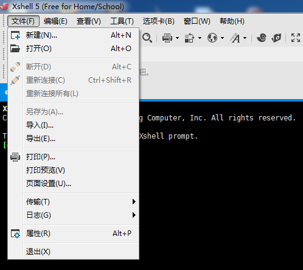](http://blog.qqiyu.cn/usr/uploads/2018/11/4221752657.png)

[xshell11.png](http://blog.qqiyu.cn/usr/uploads/2018/11/4221752657.png)


选择文件，新建!

[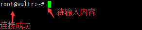](http://blog.qqiyu.cn/usr/uploads/2018/11/464403863.png)

[xshell2.png](http://blog.qqiyu.cn/usr/uploads/2018/11/464403863.png)


随便取个名字，然后把你的服务器ip填上
[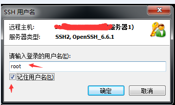](http://blog.qqiyu.cn/usr/uploads/2018/11/314308120.png)

[xshell13.png](http://blog.qqiyu.cn/usr/uploads/2018/11/314308120.png)


连接国外ip即服务器时，软件会先后提醒你输入用户名和密码，用户名默认都是root，密码是你购买的服务器系统的密码。
如果xshell连不上服务器，没有弹出让你输入用户名和密码的输入框，表明你开到的ip是一个被墙的ip，遇到这种情况，重新开新的服务器，直到能用xshell连上为止，耐心点哦！如果同一个地区开了多台服务器还是不行的话，可以换其它地区。
[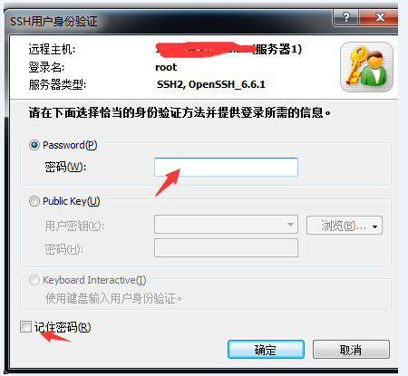](http://blog.qqiyu.cn/usr/uploads/2018/11/2206162376.png)

[xshell14.png](http://blog.qqiyu.cn/usr/uploads/2018/11/2206162376.png)


[](http://blog.qqiyu.cn/usr/uploads/2018/11/2055044851.png)

[xshell2.png](http://blog.qqiyu.cn/usr/uploads/2018/11/2055044851.png)


连接成功后，会出现如上图所示，之后就可以复制粘贴代码部署了。

CentOS6/Debian6/Ubuntu14 ShadowsocksR一键部署管理脚本：

```
yum -y install wget

wget -N --no-check-certificate https://softs.fun/Bash/ssr.sh && chmod +x ssr.sh && bash ssr.sh
```

备用脚本：

```
yum -y install wget

wget -N --no-check-certificate https://raw.githubusercontent.com/ToyoDAdoubi/doubi/master/ssr.sh && chmod +x ssr.sh 
&& bash ssr.sh
```

备份脚本

```
 yum -y install wget

wget -N --no-check-certificate https://cdn.qqiyu.cn/ssr.sh && chmod +x ssr.sh 
&& bash ssr.sh
```

以上脚本不可用请用下面脚本

```
wget -N --no-check-certificate https://raw.githubusercontent.com/ToyoDAdoubi/doubi/master/ssrmu.sh && chmod +x ssrmu.sh && bash ssrmu.sh
```

备用脚本

```
 wget -N --no-check-certificate http://cdn.qqiyu.cn/ssrmu.sh && chmod +x ssrmu.sh && bash ssrmu.sh
```

CentOS7 如果不能使用可能是因为防火墙firewall问题

```
#开放端口 比如你设置的SSR端口为1025
firewall-cmd --zone=public --add-port=1025/tcp --permanent
firewall-cmd --zone=public --add-port=1025/udp --permanent
#重新载入
firewall-cmd --reload
```


第二个脚本介绍

``

``

复制上面的代码到VPS服务器里，按回车键，脚本会自动安装，以后只需要运行这个快捷命令就可以出现下图的界面进行设置，快捷管理命令为：`bash ssr.sh`

[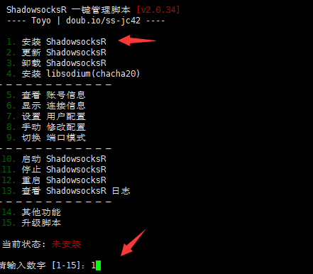](http://blog.qqiyu.cn/usr/uploads/2018/11/791375094.png)

[8.png](http://blog.qqiyu.cn/usr/uploads/2018/11/791375094.png)


如上图出现管理界面后，输入数字1来安装SSR服务端。如果输入1后不能进入下一步，那么请退出xshell，重新连接vps服务器，然后输入快捷管理命令bash ssr.sh 再尝试。
[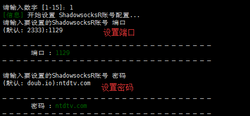](http://blog.qqiyu.cn/usr/uploads/2018/11/710086311.png)

[31.png](http://blog.qqiyu.cn/usr/uploads/2018/11/710086311.png)


根据上图提示，依次输入自己想设置的端口和密码 (密码建议用复杂点的字母组合，端口号为40-65535之间的数字)，回车键用于确认

注：关于端口的设置，总的网络总端口有6万多个，理论上可以任意设置。但是有的地区需要设置特殊的端口才有效，一些特殊的端口比如80、143、443、1433、3306、3389、8080。

[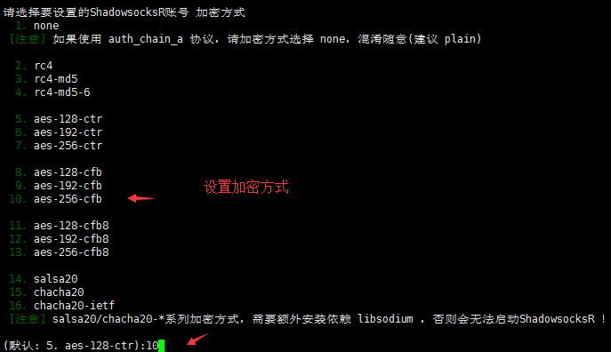](http://blog.qqiyu.cn/usr/uploads/2018/11/2972681172.png)

[32.png](http://blog.qqiyu.cn/usr/uploads/2018/11/2972681172.png)


如上图，选择想设置的加密方式，比如10，按回车键确认

接下来是选择协议插件，如下图：
[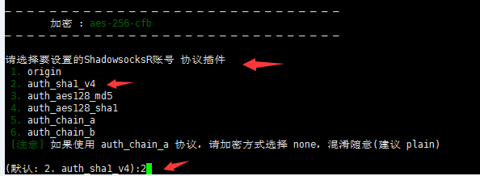](http://blog.qqiyu.cn/usr/uploads/2018/11/913630339.png)

[11.png](http://blog.qqiyu.cn/usr/uploads/2018/11/913630339.png)


[](http://blog.qqiyu.cn/usr/uploads/2018/11/4255754584.png)

[41.PNG](http://blog.qqiyu.cn/usr/uploads/2018/11/4255754584.png)


选择并确认后，会出现上图的界面，提示你是否选择兼容原版，这里的原版指的是SS客户端（SS客户端没有协议和混淆的选项），可以根据需求进行选择，演示选择y

之后进行混淆插件的设置。

**注意：如果协议是origin，那么混淆也必须是plain；如果协议不是origin，那么混淆可以是任意的。有的地区需要把混淆设置成plain才好用。因为混淆不总是有效果，要看各地区的策略，有时候不混淆（plain）让其看起来像随机数据更好。（特别注意：tls 1.2_ticket_auth容易受到干扰！请选择除tls开头以外的其它混淆！！！）**
[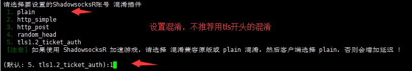](http://blog.qqiyu.cn/usr/uploads/2018/11/1367474437.png)

[33.png](http://blog.qqiyu.cn/usr/uploads/2018/11/1367474437.png)


进行混淆插件的设置后，会依次提示你对设备数、单线程限速和端口总限速进行设置，默认值是不进行限制，个人使用的话，选择默认即可，即直接敲回车键。

注意：关于限制设备数，这个协议必须是非原版且不兼容原版才有效，也就是必须使用SSR协议的情况下，才有效！
[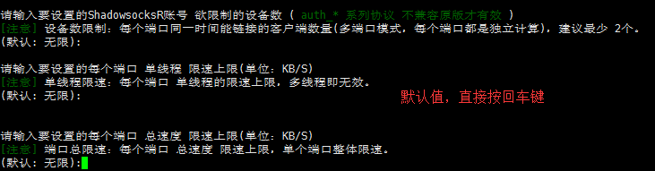](http://blog.qqiyu.cn/usr/uploads/2018/11/1983538858.png)

[14.png](http://blog.qqiyu.cn/usr/uploads/2018/11/1983538858.png)


之后代码就正式自动部署了，到下图所示的位置，提示你下载文件，输入：y
[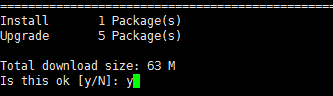](http://blog.qqiyu.cn/usr/uploads/2018/11/1798129277.png)

[15.png](http://blog.qqiyu.cn/usr/uploads/2018/11/1798129277.png)


耐心等待一会，出现下面的界面即部署完成：
[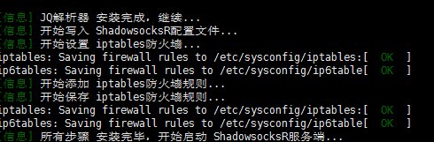](http://blog.qqiyu.cn/usr/uploads/2018/11/2752928424.png)

[16.png](http://blog.qqiyu.cn/usr/uploads/2018/11/2752928424.png)


[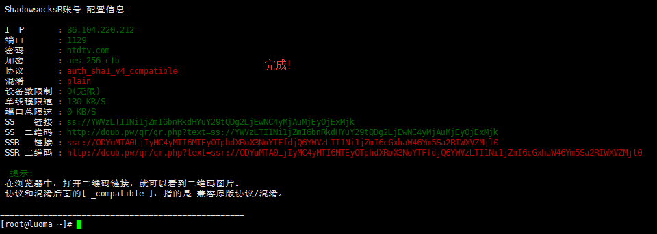](http://blog.qqiyu.cn/usr/uploads/2018/11/1956298778.png)

[34.png](http://blog.qqiyu.cn/usr/uploads/2018/11/1956298778.png)


根据上图就可以看到自己设置的SSR账号信息，包括IP、端口、密码、加密方式、协议插件、混淆插件，这些信息需要填入你的SSR客户端。如果之后想修改账号信息，直接输入快捷管理命令：bash ssr.sh 进入管理界面，选择相应的数字来进行一键修改。例如：

[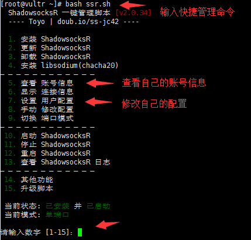](http://blog.qqiyu.cn/usr/uploads/2018/11/1778510223.png)

[22.png](http://blog.qqiyu.cn/usr/uploads/2018/11/1778510223.png)


[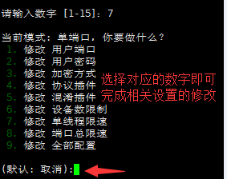](http://blog.qqiyu.cn/usr/uploads/2018/11/3294332892.png)

[23.png](http://blog.qqiyu.cn/usr/uploads/2018/11/3294332892.png)


**脚本演示结束。**
此脚本是开机自动启动，部署一次即可。最后可以重启服务器确保部署生效（一般情况不重启也可以）。重启需要在命令栏里输入reboot ，输入命令后稍微等待一会服务器就会自动重启，一般重启过程需要2～5分钟，重启过程中Xshell会自动断开连接，等VPS重启好后才可以用Xshell软件进行连接。如果部署过程中卡在某个位置超过10分钟，可以用xshell软件断开，然后重新连接你的ip，再复制代码进行部署。

------

**第三步：一键加速VPS服务器**
此加速教程为谷歌BBR加速,Vultr的服务器框架可以装BBR加速，加速后对速度的提升很明显，所以推荐部署加速脚本。该加速方法是开机自动启动，部署一次就可以了。

按照第二步的步骤，连接服务器ip，登录成功后，在命令栏里粘贴以下代码：

【谷歌BBR加速教程】

```
yum -y install wget

wget --no-check-certificate https://github.com/teddysun/across/raw/master/bbr.sh

chmod +x bbr.sh

./bbr.sh
```

把上面整个代码复制后粘贴进去，不动的时候按回车，然后耐心等待，最后重启vps服务器即可。

演示开始，如图：

复制并粘贴代码后，按回车键确认
[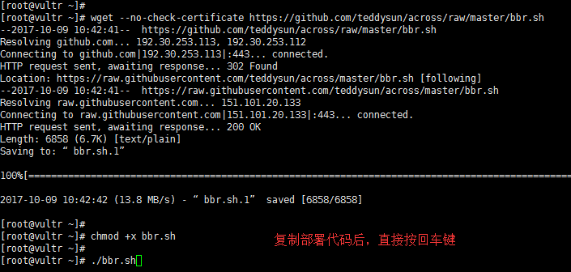](http://blog.qqiyu.cn/usr/uploads/2018/11/1249451794.png)

[18.png](http://blog.qqiyu.cn/usr/uploads/2018/11/1249451794.png)


如下图提示，按任意键继续部署
[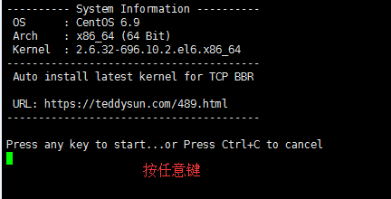](http://blog.qqiyu.cn/usr/uploads/2018/11/1091081117.png)

[19.png](http://blog.qqiyu.cn/usr/uploads/2018/11/1091081117.png)


[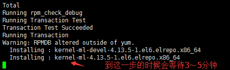](http://blog.qqiyu.cn/usr/uploads/2018/11/4007992071.png)

[20.png](http://blog.qqiyu.cn/usr/uploads/2018/11/4007992071.png)


部署到上图这个位置的时候，等待3～5分钟
[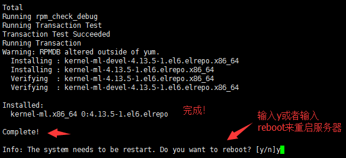](http://blog.qqiyu.cn/usr/uploads/2018/11/2741904605.png)

[21.png](http://blog.qqiyu.cn/usr/uploads/2018/11/2741904605.png)


最后输入y重启服务器，如果输入y提示command not found ，接着输入reboot来重启服务器，确保加速生效，bbr加速脚本是开机自动启动，装一次就可以了。

服务器重启成功并重新连接服务器后，输入命令lsmod | grep bbr 如果出现tcp_bbr字样表示bbr已安装并启动成功。如图：
[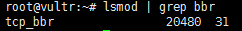](http://blog.qqiyu.cn/usr/uploads/2018/11/4080833756.png)

[tcp_bbr.PNG](http://blog.qqiyu.cn/usr/uploads/2018/11/4080833756.png)


购买vps服务器后，ip有了，通过部署，端口、密码、加密方式、协议和混淆也有了，最后将这些信息填入SSR客户端就可以翻墙啦。

**有了账号后，打开SSR客户端，填上信息，这里以windows版的SSR客户端为例子：**
[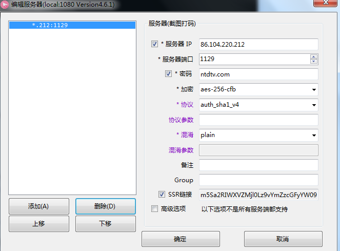](http://blog.qqiyu.cn/usr/uploads/2018/11/1699087258.png)

[42.PNG](http://blog.qqiyu.cn/usr/uploads/2018/11/1699087258.png)


在对应的位置，填上服务器ip、服务器端口、密码、加密方式、协议和混淆，最后将浏览器的代理设置为（http）127.0.0.1和1080即可。账号的端口号就是你自己设置的，而要上网的浏览器的端口号是1080，固定的，谷歌浏览器可以通过 SwitchyOmega 插件来设置。

启动SSR客户端后，右键SSR客户端图标，选择第一个“系统代理模式”，里面有3个子选项，选择"全局模式“，之后就可以用浏览器设置好了的代理模式（http）127.0.0.1和1080翻墙，此模式下所有的网站都会走SSR代理。（适合新手）
[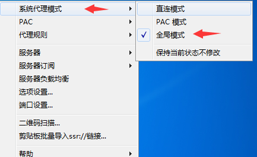](http://blog.qqiyu.cn/usr/uploads/2018/11/3472438485.png)

[32225069-cfe6195a-be7e-11e7-99e0-e2fa98f93b1f.png](http://blog.qqiyu.cn/usr/uploads/2018/11/3472438485.png)


**常见问题参考解决方法：**
1、用了一段时间发现ssr账号用不了了

首先ping一下自己的ip，看看能不能ping的通，ping不通那么就是ip被墙了，ip被墙时，xshell也会连接不上服务器，遇到这种情况重新部署一个新的服务器，新的服务器就是新的ip。关于怎么ping ip的方法，可以自行网上搜索，或者用xshell软件连接服务器来判断，连不上即是被墙了。vultr开通和删除服务器非常方便，新服务器即新ip，大多数vps服务商都没有这样的服务，一般的vps服务商可能会提供免费更换1次ip的服务。

2、刚搭建好的ssr账号，ip能ping通，但是还是用不了

首选排除杀毒软件的干扰，尤其是国产杀毒软件，比如360安全卫生、360杀毒软件、腾讯管家、金山卫生等。这些东西很容易干扰翻墙上网，如果你的电脑安装了这样的东西，建议至少翻墙时别用，最好卸载。其次，检查下SSR信息是否填写正确。浏览器的代理方式是否是ssr代理，即（HTTP）127.0.0.1 和1080。如果以上条件都排除，还是用不了，那么可以更换端口、加密方式、协议、混淆，或者更换服务器位置。另外，如果你的vps服务器配置的是SSR账号，即有协议和混淆且没有兼容原版(SS版），那么你必须使用SSSR客户端来使用账号，因为SS客户端没有填写协议和混淆的选项。

3、有的地区需要把混淆参数设置成plain才好用。因为混淆不总是有效果，要看各地区的策略，有时候不混淆（plain）让其看起来像随机数据更好。

4、电脑能用但手机用不了

如果你的手机用的是SS客户端，SS客户端没有填协议和混淆的地方，如果你部署的协议和混淆的时候没有选择兼容原版（SS版），因此手机是用不了的。这个时候你把协议弄成兼容原版、混淆也设置成兼容原版即可。或者直接将协议设置成origin且混淆设置成plain。

5、vps的服务器操作系统不要用的太高，太高可能会因为系统的防火墙问题导致搭建的SSR账号连不上，如果你用的centos系统，建议用centos6，不要用centos7。如果你前面不小心装了centos7系统，那么只能重装系统或者重新部署新的vps服务器。

6、vultr服务商提供的vps服务器是单向流量计算，有的vps服务商是双向流量计算，单向流量计算对于用户来说更实惠。因为我们是在vps服务器上部署SSR服务端后，再用SSR客户端翻墙，所以SSR服务端就相当于中转，比如我们看一个视频，必然会产生流量，假如消耗流量80M，那么VPS服务器会产生上传80M和下载80M流量，vultr服务商只计算单向的80M流量。如果是双向计算流量，那么会计算为160M流量。

7、如果你想把搭建的账号给多人使用，不用额外设置端口，因为一个账号就可以多人使用。一般5美元的服务器可以同时支持40人在线使用。

如果想实现支持每个用户(端口)不同的加密方式/协议/混淆等，并且管理流量使用，可以参考多用户配置脚本：`wget -N --no-check-certificate https://softs.fun/Bash/ssrmu.sh && chmod +x ssrmu.sh && bash ssrmu.sh 备用脚本：wget -N --no-check-certificate https://raw.githubusercontent.com/ToyoDAdoubi/doubi/master/ssrmu.sh && chmod +x ssrmu.sh && bash ssrmu.sh` 安装后管理命令为：`bash ssrmu.sh`
注意：这个多用户配置脚本和教程内容的脚本无法共存！要想用这个脚本，把之前的脚本卸载，输入管理命令`bash ssr.sh` ，选择3，卸载ShadowsocksR即可卸载原脚本。

8、vultr服务器每月有流量限制，超过限制后服务器不会被停止运行，但是超出的流量会被额外收费。北美和西欧地区的服务器超出流量后，多出的部分收费为0.01美元/G。新加坡和日本东京（日本）为0.025美元/G，悉尼（澳大利亚）为0.05美元/G。把vultr服务器删掉，开通新的服务器，流量会从0开始重新计算。

9、vultr怎样才能申请退款呢？

vultr和其他的国外商家一样，都是使用工单的形式与客服联系，如果需要退款，直接在后台点击support，选择open ticket新开一个工单，选择billing question财务问题，简单的在文本框输入你的退款理由。比如：Please refund all the balance in my account。工单提交以后一般很快就可以给你确认退款，若干个工作日后就会退回你的支付方式。（全额退款结束后，账号可能会被删除）

如果英语水平不好，但是想和客服进行交流，可以用百度在线翻译，自动中文转英文和英文转中文。

V2ray一键脚本附下方