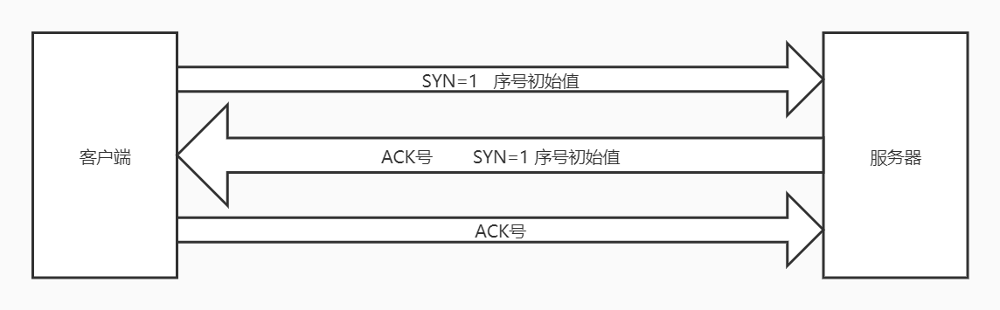
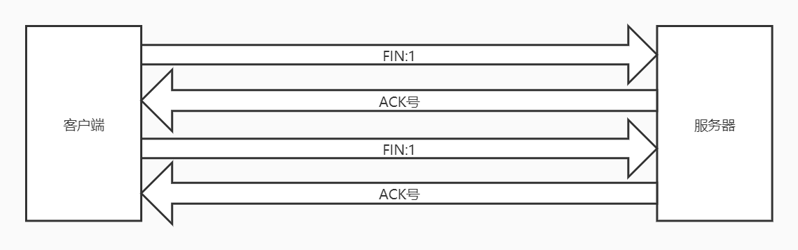

# 计算机网络

## 网络协议

### OSI七层模型TCP/IP五层模型

## HTTP

### HTTP 1.0、HTTP 1.1、HTTP 2.0的区别

HTTP 1.0默认**短连接**，浏览器的每次请求都需要与服务器建立一个TCP连接，服务器完成请求处理后立即断开TCP连接。

HTTP 1.1默认**长连接**，减少了TCP连接重复建立和断开所造成的额外开销，减轻了服务器负载。

与HTTP 1.X相比，HTTP 2.0

1. HTTP/2采用二进制格式而非文本格式
2. HTTP/2支持多路复用，一个连接并发处理多个请求
3. HTTP/2使用报头压缩，降低了开销
4. HTTP/2支持服务器推送，浏览器只发送一个请求，服务器把这个请求的配套资源也一起推送，提高了性能。

### HTTP 和 HTTPS 的区别

1. **端口** ：HTTP的URL由“http://”起始且默认使用端口80，而HTTPS的URL由“https://”起始且默认使用端口443。
2. **安全性和资源消耗：** HTTP协议运行在TCP之上，所有传输的内容都是明文，客户端和服务器端都无法验证对方的身份。HTTPS是运行在SSL/TLS之上的HTTP协议，SSL/TLS 运行在TCP之上。所有传输的内容都经过加密，加密采用对称加密，但对称加密的密钥用服务器方的证书进行了非对称加密。所以说，HTTP 安全性没有 HTTPS高，但是 HTTPS 比HTTP耗费更多服务器资源。

### Cookie和Session的区别

由于HTTP是无状态协议，对发送过的请求或响应不做持久化处理

**Cookie机制采用的是在客户端保持状态的方案，而Session机制采用的是在服务器端保持状态的方案。两者存储的都是用户登录信息，操作行为等等的数据。**

**session 是一个抽象概念，cookie 是一个实际存在的东西（http 协议中定义在 header 中的字段）**

session有不同的实现方式，比如在客户端的cookie里存放一个SessionID，然后用这个SessionID去匹配服务器端的Session，所以客户端只知道你的SessionID，其他信息都是服务器端才知道。

若Cookie被禁用还有一种方案就是通过URL来保存和传递session ID。

## TCP/IP

### TCP和UDP区别

- 

### TCP三次握手

- 客户端–发送带有 SYN 标志的数据包–一次握手–服务端
- 服务端–发送带有 SYN/ACK 标志的数据包–二次握手–客户端
- 客户端–发送带有带有 ACK 标志的数据包–三次握手–服务端

**三次握手的目的是建立可靠的通信信道，即双方确认自己与对方的发送与接收是正常的。**

第一次握手：客户端什么都不能确认；服务端确认了对方发送正常，自己接收正常

第二次握手：客户端确认了：自己发送、接收正常，对方发送、接收正常；服务端确认了：对方发送正常，自己接收正常

第三次握手：客户端确认了：自己发送、接收正常，对方发送、接收正常；服务端确认了：自己发送、接收正常，对方发送、接收正常

### TCP四次挥手

- 客户端-发送一个 FIN，用来关闭客户端到服务器的数据传送
- 服务器-收到这个 FIN，它发回一 个 ACK 
- 服务器-关闭与客户端的连接，发送一个FIN给客户端
- 客户端-发回 ACK 报文确认

任何一方都可以在数据传送结束后发出连接释放的通知，待对方确认后进入半关闭状态。当另一方也没有数据再发送的时候，则发出连接释放通知，对方确认后就完全关闭了TCP连接。

举个例子：A 和 B 打电话，通话即将结束后，A 说“我没啥要说的了”，B回答“我知道了”，但是 B 可能还会有要说的话，A 不能要求 B 跟着自己的节奏结束通话，于是 B 可能又巴拉巴拉说了一通，最后 B 说“我说完了”，A 回答“知道了”，这样通话才算结束。

### TCP 协议如何保证可靠传输

1. **序列号和确认应答：**发送方告知接收方该该网络包发送的数据相当于所有发送数据的第几个字节；接收方告知发送方已经收到了所有数据的第几个字节。
2. **校验和：**TCP校验和是一个端到端的校验和，由发送端计算，然后由接收端验证。其目的是为了发现TCP首部和数据在发送端到接收端之间发生的任何改动。如果接收方检测到校验和有差错，则TCP段会被直接丢弃。
3. TCP 的接收端会丢弃重复的数据。
4. **流量控制：** TCP 连接的每一方都有固定大小的缓冲空间，TCP的接收端只允许发送端发送接收端缓冲区能接纳的数据。防止缓冲区填满导致的丢包。
5. **拥塞控制：** 当网络拥塞时，减少数据的发送。
6. **超时重传：** 当 TCP 发出一个段后，它启动一个定时器，等待目的端确认收到这个报文段。如果不能及时收到一个确认，将重发这个报文段。