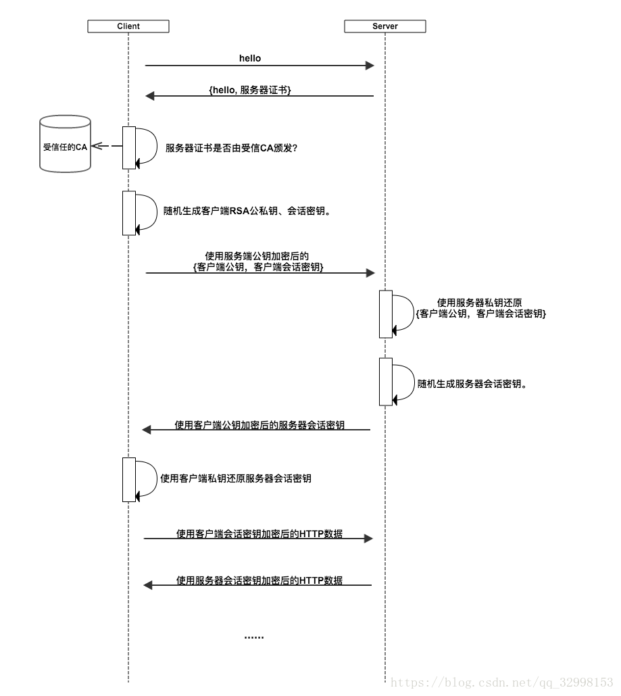
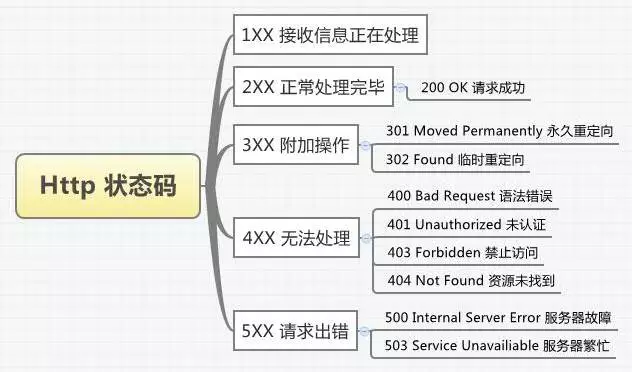
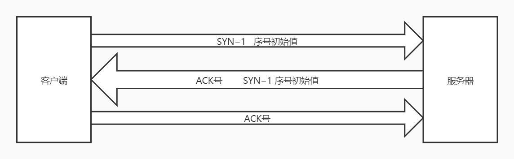
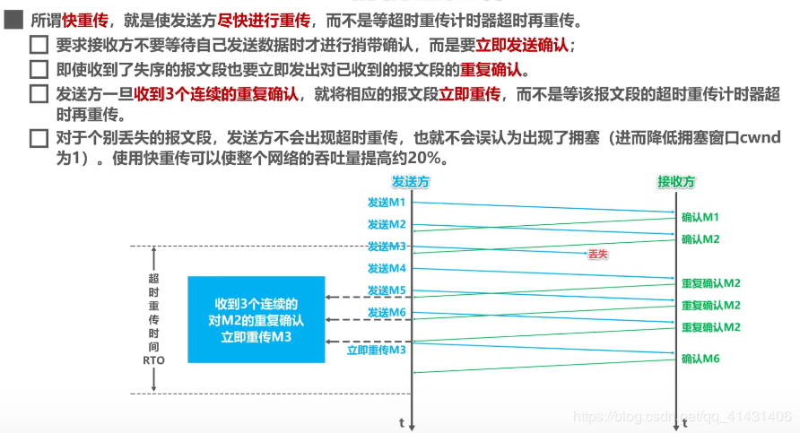
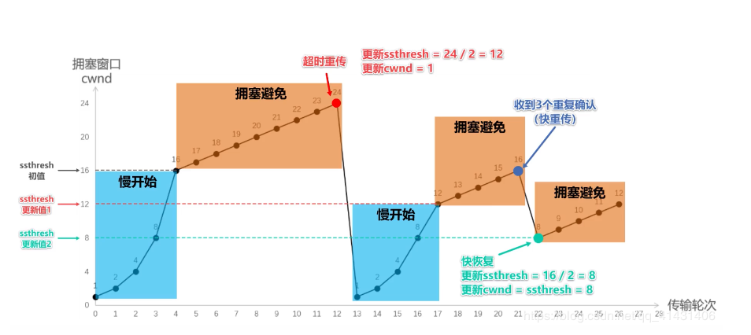

# 计算机网络

## 网络协议

### OSI七层模型TCP/IP五层模型

**物理层：**

可以通过光纤、电缆传送0,1这样的电信号，负责把两台计算机连起来

**数据链路层：**

需要制定一套规则来进行0，1的传送，包括以太网协议，MAC地址

**网络层：**

找到另一台计算机在哪里，建立主机到主机的通信，IP协议

**传输层：**

两台计算机建立好连接后，通过端口到端口进行通信， TCP 协议和 UDP 协议

**会话层：**

负责进程与进程之间会话的建立、管理以及终止的服务

**表示层：**

对应用层的数据进行一些格式转换，加解密或者进行压缩和解压缩的功能

**应用层：**

直接对应用程序提供服务。规定发送方和接收方必须使用固定长度的消息头。方便接收方能够解析发送方发送的数据。

## HTTP

### HTTP 1.0、HTTP 1.1、HTTP 2.0的区别

HTTP 1.0默认**短连接**，浏览器的每次请求都需要与服务器建立一个TCP连接，服务器完成请求处理后立即断开TCP连接。

HTTP 1.1默认**长连接**，减少了TCP连接重复建立和断开所造成的额外开销，减轻了服务器负载。

与HTTP 1.X相比，HTTP 2.0

1. HTTP/2采用二进制格式而非文本格式
2. HTTP/2支持多路复用，一个连接并发处理多个请求
3. HTTP/2使用报头压缩，降低了开销
4. HTTP/2支持服务器推送，浏览器只发送一个请求，服务器把这个请求的配套资源也一起推送，提高了性能。

### HTTP 和 HTTPS 的区别

1. **端口** ：HTTP的URL由“http://”起始且默认使用端口80，而HTTPS的URL由“https://”起始且默认使用端口443。

2. **安全性：** HTTP协议的数据传输是明文的，是不安全的，HTTPS使用了SSL协议进行了加密处理。

3. **缺点：**HTTPS 协议需要到 CA（Certificate Authority，数字证书认证机构） 申请证书，需要一定费用。HTTPS 比 HTTP 要更耗费服务器资源。

   

   SSL/TLS协议的基本思路是采用`公钥加密法`，也就是说，客户端先向服务器端索要公钥，然后用公钥加密信息，服务器收到密文后，用自己的私钥解密。

   1. 为了防止服务器端发送的信息被修改，服务器端对信息计算hash值并用私钥加密，将这段信息就是**数字签名**。客户端对数字签名使用公钥解密（公私钥可以互相解密解密）得到hash值，再对信息解密后计算hash值，对比两个hash值是否相等。

   2. 为了防止服务器向客户端传递公钥的过程中，公钥被篡改。服务器端向证书中心申请，证书中心用自己的私钥，对务器端的公钥加密，生成**数字证书**。将数字证书发送给客户端，客户端浏览器内置证书中心的公钥，对数字证书进行解密即可得服务器端的公钥。
   
   3. 鱿鱼非对称加密开销比较大，并且服务器发送的信息可以被任意客户端所解密（公钥都一样），所以在确认服务器身份后，客户端将对称加密的秘钥使用公钥加密，发送给客户端，在以后的交流过程，都只使用这一个对称加密的秘钥。
   
      

4. **流程：**

   1. 服务器把自己的公钥登录至数字证书认证机构。

   2. 数字证书认证机构用自己的私钥向服务器的公钥署数字签名并颁发公钥证书。

   3. 客户端发起连接请求后，服务器返回服务器的公钥证书。客户端拿到服务器的公钥证书后，使用数字签名认证机构的公开密钥，以确认服务器的公开密钥的真实性。

   4. 客户端发送客户端公钥和客户端会话秘钥，以服务器公钥加密。

   5. 服务器用私钥解密，得到客户端公钥和客户端会话秘钥。发送服务器会话秘钥，以客户端公钥加密。

   6. 客户端用私钥解密，得到服务器会话秘钥。这样客户端验证了服务器端的身份，双方拥有各自的会话秘钥，以后的交流使用会话秘钥加密。

      

### Cookie和Session的区别

由于HTTP是无状态协议，对发送过的请求或响应不做持久化处理

**Cookie机制采用的是在客户端保持状态的方案，而Session机制采用的是在服务器端保持状态的方案。两者存储的都是用户登录信息，操作行为等等的数据。**

**session 是一个抽象概念，cookie 是一个实际存在的东西（http 协议中定义在 header 中的字段）**

session有不同的实现方式，比如在客户端的cookie里存放一个SessionID，然后用这个SessionID去匹配服务器端的Session，所以客户端只知道你的SessionID，其他信息都是服务器端才知道。

若Cookie被禁用还有一种方案就是通过URL来保存和传递session ID。

### GET和POST区别

https://blog.csdn.net/ever_siyan/article/details/87935455

1. 是GET把参数包含在URL中，POST通过request body传递参数。

2. GET在浏览器回退时是无害的，而POST会再次提交请求。

3. GET产生一个TCP数据包；POST产生两个TCP数据包。对于GET方式的请求，浏览器会把http header和data一并发送出去，服务器响应200。而对于POST方式的请求，浏览器先发送header，服务器响应100 continue，浏览器再发送data，服务器响应200

### HTTP头部信息

cache-control connection date host language

### 常见响应码

| 状态码 | 说明                                           |
| ------ | ---------------------------------------------- |
| 1xx    | **响应中**——表示请求已经接受，继续处理         |
| 2xx    | **成功**——表示请求已经被成功接收、理解、接受。 |
| 3xx    | **重定向**——要完成请求必须进行更进一步的操作   |
| 4xx    | **客户端错误**——请求有语法错误或请求无法实现   |
| 5xx    | **服务器端错误**——服务器未能实现合法的请求。   |

### 浏览器输入一个网址后发生什么

**域名解析：**

1. 搜索浏览器缓存
2. 搜索系统缓存
3. 搜索路由器缓存
4. 将域名发送至 本地域名服务器（ISP）
5. 将域名发送至 根域名服务器开始进行递归搜索

**建立TCP连接**

**建立TCP连接后发起HTTP请求**

**服务器收到请求并响应HTTP请求**

**浏览器解析html代码,并请求html代码中的资源**

**断开TCP连接**

## TCP/IP

### TCP和UDP区别

- 

|              | UDP                                        | TCP                                    |
| :----------- | :----------------------------------------- | -------------------------------------- |
| 是否连接     | 无连接                                     | 面向连接                               |
| 是否可靠     | 不可靠传输，不使用流量控制和拥塞控制       | 可靠传输，使用流量控制和拥塞控制       |
| 连接对象个数 | 支持一对一，一对多，多对一和多对多交互通信 | 只能是一对一通信                       |
| 传输方式     | 面向报文                                   | 面向字节流                             |
| 首部开销     | 首部开销小，仅8字节                        | 首部最小20字节，最大60字节             |
| 适用场景     | 适用于实时应用（IP电话、视频会议、直播等） | 适用于要求可靠传输的应用，例如文件传输 |

### TCP三次握手

- 客户端–发送带有 SYN 标志的数据包–一次握手–服务端
- 服务端–发送带有 SYN/ACK 标志的数据包–二次握手–客户端
- 客户端–发送带有 ACK 标志的数据包–三次握手–服务端

**三次握手的目的是建立可靠的通信信道，即双方确认自己与对方的发送与接收是正常的。**

第一次握手：客户端什么都不能确认；服务端确认了对方发送正常，自己接收正常

第二次握手：客户端确认了：自己发送、接收正常，对方发送、接收正常；服务端确认了：对方发送正常，自己接收正常

第三次握手：客户端确认了：自己发送、接收正常，对方发送、接收正常；服务端确认了：自己发送、接收正常，对方发送、接收正常

### TCP四次挥手

- 客户端-发送一个 FIN，用来关闭客户端到服务器的数据传送
- 服务器-收到这个 FIN，它发回一 个 ACK 
- 服务器-关闭与客户端的连接，发送一个FIN给客户端
- 客户端-发回 ACK 报文确认

任何一方都可以在数据传送结束后发出连接释放的通知，待对方确认后进入半关闭状态。当另一方也没有数据再发送的时候，则发出连接释放通知，对方确认后就完全关闭了TCP连接。

举个例子：A 和 B 打电话，通话即将结束后，A 说“我没啥要说的了”，B回答“我知道了”，但是 B 可能还会有要说的话，A 不能要求 B 跟着自己的节奏结束通话，于是 B 可能又巴拉巴拉说了一通，最后 B 说“我说完了”，A 回答“知道了”，这样通话才算结束。

### TCP 协议如何保证可靠传输

**（校 序 重 流 拥）**

1. **序列号和确认应答：**

   通过序列号保证传送数据包的顺序

   发送方告知接收方该该网络包发送的数据相当于所有发送数据的第几个字节；接收方告知发送方已经收到了所有数据的第几个字节（ACK）。

2. **校验和：**

   发送方在发送数据之前计算检验和，接收方收到数据后对数据以同样的方式进行计算。校验和不同，则丢弃这个包。

3. **流量控制：**

    TCP 连接的每一方都有固定大小的缓冲空间，TCP的接收端只允许发送端发送接收端缓冲区能接纳的数据。防止缓冲区填满导致的丢包。

4. **拥塞控制：**

    当网络拥塞时，减少数据的发送。

5. **超时重传：**

   `发送方在发送完数据后等待一个时间，时间到达没有接收到ACK报文，那么对刚才发送的数据进行重新发送。`

   如果发送方发送完数据后，迟迟没有等到接收方的ACK报文。可能有以下两种情况

   a. 数据在传输过程中由于网络原因等直接全体丢包，接收方没有接收到。

   b. 接收方接收到了响应的数据，但是发送的ACK报文响应却由于网络原因丢包了。

   因此引入`超时重传`机制后

   a. 接收方收到二次重发的数据后，便进行ACK应答。

   b. 接收方发现接收的数据已存在（判断存在的根据就是序列号，所以上面说序列号还有去除重复数据的作用），丢弃重复数据，仍旧发送ACK应答。

### 拥塞控制

发送方维护一个叫做**拥塞窗口**的状态变量，其值取决于网络拥塞程度，且动态变化。

判断出现拥塞的依据是，没有按时收到确认报文（发生重传）。

拥塞窗口<**慢开始阈值**，使用慢开始算法；拥塞窗口>慢开始阈值，使用拥塞避免算法。这里慢开始阈值一般为不会发生拥塞的心理预期，慢开始阈值也会动态变化。

#### 慢开始

假设当前发送方拥塞窗口的初始值为1，每次发送成功，拥塞窗口变为原先的2倍。**拥塞窗口指数递增**，直至到达慢开始阈值后，使用拥塞避免算法。

#### **拥塞避免**

**拥塞窗口线性加1**，直到某次传输过程中，一部分报文发生丢狮，接受方收不到这部分报文的ack，发生超时重传，同时判定可能出现拥塞。**则将拥塞窗口置1，慢开始阈值更新为发生拥塞时拥塞窗口的二分之一，重新开始执行慢开始算法。**

#### 快重传

有时，个别报文段会在网络中丢失，但实际上网络并未发生拥塞。但是丢失的包只有通过超时重传来补救，但超时重传会被定义为网络拥塞，鸡儿错误的由**拥塞避免**切换到**慢开始**，降低了传输效率。

通过快重传，避免由超时重传引起的错误切换。

#### 快恢复

触发快虫船后，知道了现在只是丢失了个别报文段，于是不启动慢开始算法，启动快恢复算法。

快恢复**将拥塞窗口和慢开始阈值置为原先拥塞窗口的二分之一，重新开始执行拥塞避免算法。**

### 握手三次，挥手四次的原因

握手：当Server端收到Client端的SYN连接请求报文后，可以直接发送SYN+ACK报文。其中ACK报文是用来应答的，SYN报文是用来同步的。

挥手：当Server端收到Client端的FIN报文时，很可能Server端还有一些东西需要发送，并不会立即关闭SOCKET，所以只能先回复一个ACK报文。只有等到Server端所有的报文都发送完了，才能发送FIN报文。ACK报文和FIN报文分开发送。故需要四步握手。

### 挥手后套接字不会被立刻删除，等待2MSL

MSL（Maximum Segment Lifetime）最大报文生存时间。

最后一步，在Client发送出最后的ACK回复，但该ACK可能丢失。Server如果没有收到ACK，将不断重复发送FIN片段。若套接字立刻删除，新的套接字碰巧分配到旧的套接字同一端口，而接收到了Server重发的FIN，就会发生错误。所以client要在TIME_WAIT状态等待2倍的MSL，这样**保证本次连接的所有数据都从网络中消失**。

### 不能用两次握手进行连接

采用两次握手，那么若Client向Server发起的包A1如果在传输链路上遇到的故障，导致传输到Server的时间相当滞后，在这个时间段由于Client没有收到Server的对于包A1的确认，那么就会重传一个包A2，假设服务器正常收到了A2的包，然后返回确认B2包。由于没有第三次握手，这个时候Client和Server已经建立连接了。再假设A1包随后在链路中传到了Server，这个时候Server又会返回B1包确认，但是由于Client已经清除了A1包，所以Client会丢弃掉这个确认包，但是Server会认为新的连接已经建立，并一直等待Client发来数据。

所以采用两次握手，有可能会浪费Server的网络资源。

# 操作系统

## 进程线程

### 线程与进程的区别

**并发（Concurrent）：在操作系统中，是指一个时间段中有几个程序都处于已启动运行到运行完毕之间，且这几个程序都是在同一个处理机上运行。**

**并行（Parallel）：当系统有一个以上CPU时，当一个CPU执行一个进程时，另一个CPU可以执行另一个进程，两个进程互不抢占CPU资源，可以同时进行，这种方式我们称之为并行(Parallel)。**

**进程是操作系统资源分配的基本单位，而线程是CPU任务调度和执行的基本单位**

|          | 进程                           | 线程                                           |
| -------- | ------------------------------ | ---------------------------------------------- |
| 运行状态 | 操作系统中能同时运行多个进程   | CPU在每个时间片只能执行一个线程                |
| 资源占用 | 多进程所拥有的的资源都是独立的 | 多线程共享所在进程所拥有的的内存空间和系统资源 |
| 包含关系 | 一个进程可以包含多个线程       |                                                |

### 进程的几种状态

- 就绪状态（Ready）：进程已获得除处理机以外的所需资源，等待分配处理机资源；
- 运行状态（Running）：占用处理机资源运行，处于此状态的进程数小于等于CPU数；
- 阻塞状态（Waiting）： 进程等待某种条件，在条件满足之前无法执行；

### 线程的几种状态

### 进程通信的方式

SOCKET、

### 线程同步的方式

## 死锁

多个并发进程因争夺系统资源而产生相互等待的现象。

形成死锁的4个条件

1. 互斥条件：某种资源一次只允许一个进程访问，即该资源一旦分配给某个进程，其他进程就不能再访问，直到该进程访问结束。

2. 占有并等待：进程占有资源，并等待被其他进程所占有的资源。

3. 非抢占：进程已获得的资源在未使用完之前，不能被抢占，只能在使用完时由自己释放。

4. 循环等待：有一组等待进程 {P1，P2，P3}，P1 等待的资源为 P2 占有，P2 等待的资源为 P3 占有，P3 等待的资源为 P1 占有。

**避免死锁**只要破坏产生死锁的四个条件中的其中一个

1. 资源能共享使用
2. 进程在运行前一次申请完它所需要的全部资源
3. 资源可以被抢占
4. 将资源编号，申请资源时必须按照编号的顺序进行。

## 内存管理

**内碎片：** 内存分配必须整数倍分配（4/8/16），请求一个 43 字节的内存块时，因为没有适合大小的内存，所以它可能会获得 44字节、48字节等稍大一点的字节，获得的多余空间叫内碎片。

**外碎片：**大量的、连续且小的页面块夹杂在已分配的页面中间，同时又因为小于待分配内存的任务，迟迟得不到利用。

### 分段

程序通过分段(segmentation)划分为多个模块，每个段定义一组逻辑信息。如代码段（主程序段main，子程序段X）、数据段D、栈段S等。每段占据一块连续的内存。（即有离散的分段，又有连续的内存使用）各段大小不等。

每段赋予各段一个段号。**地址结构：段号 + 段内地址**

### 分页

内存划分成多个小单元，每个单元4K大小，称为物理块，作为物理划分。

程序也按4K大小划分成片，称为页面，作为逻辑划分。

页面大小要适中。  太大，（最后一页）内碎片增大，类似连续分配的问题。  太小的话，页面碎片总空间虽然小，提高了利用率，但每个进程的页面数量较多，页表过长，反而又增加了空间使用。

**为了提高内存的使用率，程序的页面被离散的放入未被使用的物理块中，记录每个程序各页映射到哪个物理块，形成的页面映射表，简称页表。**

### 区别

大小不同：分页机制会使用大小固定的内存块，而分段管理则使用了大小可变的块来管理内存。

目的不同：分页使用固定大小的块更为适合管理物理内存，分段机制使用大小可变的块更适合处理复杂系统的逻辑分区。

内存碎片：页式存储管理的优点是没有外碎片（因为页的大小固定），但会产生内碎片（一个页可能填充不满）；而段式管理的优点是没有内碎片（因为段大小可变，改变段大小来消除内碎片）。但段换入换出时，会产生外碎片（比如4k的段换5k的段，会产生1k的外碎片）。

### 虚拟内存

虚拟内存实际上可以比物理内存大。对于进程而言，逻辑上似乎有很大的内存空间，实际上其中一部分对应物理内存上的一块(称为帧、块，通常页和帧大小相等)，还有一些没加载在内存中的对应在硬盘上。

当访问虚拟内存时，会访问MMU（内存管理单元）去匹配对应的物理地址（比如图的0，1，2）。如果虚拟内存的页并不存在于物理内存中（如图的3,4），会产生缺页中断，从磁盘中取得缺的页放入内存，如果内存已满，还会根据页面置换算法将磁盘中的页换出。

**页面置换算法**：

1. FIFO（First-In First-Out，先进先出）算法

   置换出当前已经待在内存里时间最长的那个页，但由于没有考虑页面的重要性的问题，FIFO算法很容易将重要的页换出内存。

2. LRU（Least Recent Used, 最近最少使用）算法

