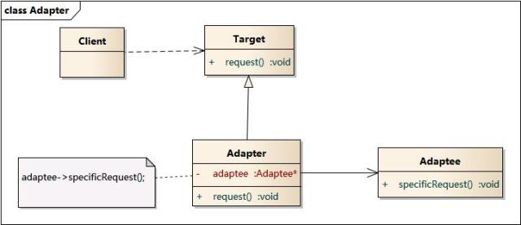

# 设计模式

## 工厂

### 简单工厂模式

产品抽象类

产品实现类

工厂类：创建产品类实例。

客户端：调用工厂类产生实例，并调用实例的方法进行相应工作。

### 工厂方法模式

产品抽象类

产品实现类

工厂抽象类

工厂实现类

客户端：调用工厂类产生实例，并调用实例的方法进行相应工作。

**一个抽象工厂对应一个抽象产品，一个具体工厂对应一个具体产品。**

**优点：**降低了耦合，增加新的产品实现时，只需添加一套对应的工厂实现和产品实现就可以了。在简单工厂中需要修改工厂类，需要修改源代码。

### 抽象工厂模式

https://www.runoob.com/design-pattern/abstract-factory-pattern.html

**抽象工厂模式是指当有多个抽象角色时，使用的一种工厂模式。**

产品抽象类：面条、包子

产品实现类：兰州拉面、泡面、叉烧包、豆沙包

工厂抽象类：面食厂（方法1：生产面条 方法2：生产包子）

工厂实现类：面食店1（方法1：兰州拉面 方法2：叉烧包）面食店2（方法1：泡面 方法2：豆沙包）

增加新类别的火锅，增加工厂接口中方法3：生产火锅


## 单例模式

**特点：**

- 类构造器私有
- 持有自己类型的属性
- 对外提供获取实例的静态方法

### 懒汉式

```java
public class Singleton {
    private static Singleton instance;  //单例对象    
    
    private Singleton() {}  //私有构造函数
    
    public static Singleton getInstance() {  //静态工厂方法
        if (instance == null) {
            instance = new Singleton();
        }
        return instance;
    }
}
```

### 饿汉式

```java
public class Singleton {  
    private static Singleton instance = new Singleton();  
    
    private Singleton (){}  
    
    public static Singleton getInstance() {  
    return instance;  
    }  
}
```

比较常用，类加载时就对实例初始化，浪费内存。

### 双重检查锁(double-checked locking, DCL)

```java
public class Singleton {  
    private volatile static Singleton instance;  
    
    private Singleton (){}  
    
    public static Singleton getSingleton() {  
    if (instance == null) {  
        synchronized (Singleton.class) {  
        	if (instance == null) {  
           		instance = new Singleton();  
        	}  
        }  
    }  
    return instance;  
    }  
}
```

锁加到 getSingleton() 前也可以解决问题，但会导致很大的性能开销。

**为什么要进行第二次判断呢？**

如果多个线程**同时**通过了第一次检查，并且其中一个线程获得锁后首先实例化了对象。释放锁后，如果不进行二次判断，其他线程获取锁还是会创建对象，产生错误。

**为什么对实例加volatile呢？**

初始化对象分为以下三个步骤

1. 分配内存空间
2. 初始化对象（new）
3. 将对象指向刚分配的内存空间

但是有些编译器为了性能的原因，可能会将第二步和第三步进行重排序

例如，线程 A 执行了`分配内存空间`和 `将对象指向刚分配的内存空间`，此时 B 调用 getSingleton() 后发现 instance 不为空，因此返回 instance，从而返回一个未初始化的对象。

## 策略模式

https://blog.csdn.net/lmx125254/article/details/86625960

和工厂模式很像

工厂模式包括 `产品抽象类` `产品实现类` `工厂类`

策略模式包括`产品抽象类` `产品实现类` `策略类`

工厂类和策略类区别在于 

工厂类只负责创造对象，怎么调用是客户端的事情，客户端调用产品实现类实例对象的方法。

策略类不仅仅创造对象，同时将功能也一并封装好，客户端调用的是策略类实例对象的方法

工厂模式中只管生产实例，具体怎么使用工厂实例由调用方决定，策略模式是将生成实例的使用策略放在策略类中配置后才提供调用方使用。 工厂模式调用方可以直接调用工厂实例的方法属性等，策略模式不能直接调用实例的方法属性，需要在策略类中封装策略后调用。

```java
//工厂类
public class PeopleFactory {
 
    public People getPeople(String name){
        if(name.equals("Xiaoming")){
            return new Xiaoming();
        }else if(name.equals("Xiaohong")){
            return new Xiaohong();
        }
        return null;
    }
}
//策略类
public class PeopleStrategy {
 
    private People people;
 
    public StrategySign(People people){
        this.people = people;
    }
 
    public StrategySign(String name){
        if(name.equals("Xiaoming")){
            this.people = new Xiaoming();
        }else if(name.equals("Xiaohong")){
            this.people = new Xiaohong();
        }
    }
 
    public void doSomething(){
        people.run();
        people.eat();
    }
}
```

```java
   //调用方
    public void test(){
        PeopleFactory peopleFactory = new PeopleFactory();
        People people = peopleFactory.getPeople("Xiaohong");
        System.out.print("工厂模式-------------"); people.run();//调用产品实现类方法
        StrategySign strategySign = new StrategySign("Xiaohong");
        System.out.print("策略模式-------------");strategySign.doSomething();//调用策略类方法
    }
```


## 适配器（包装器）模式



我们自己的代码我们可以理解为Client，我们要调用的接口，是图中的Adaptee，因为接口不匹配，我们不能够直接使用，所以，我们引入设配器模式，Adapter，Adapter实现了Client中需要的Target方法，但是里面使用组合，当我们调用Target的request方法的时候，Adapter会做一些参数的转化等工作，最后实际上调用的是Adaptee的specificRequest方法。

### 类适配器

类适配器通过继承来完成适配

```java
public class Adaptee {
    public void adapteeRequest() {
        System.out.println("被适配者的方法");
    }
}
```

```java
public interface Target {
    void request();
}
```

```java
public class Adapter extends Adaptee implements Target{
    @Override
    //重写target接口的方法，嵌套调用target的方法
    public void request() {  
        //...一些操作...进行参数类型的适配
        super.adapteeRequest();
        //...一些操作...进行参数类型的适配
    }
}

```

### 对象适配器

对象适配器通过关联来完成适配，即引用Adaptee对象

```java
public class Adapter implements Target{
    // 适配者是对象适配器的一个属性
    private Adaptee adaptee = new Adaptee();

    @Override
    public void request() {
        //...
        adaptee.adapteeRequest();
        //...
    }
}
```

## 观察者模式

当一个对象的状态发生改变时，所有观察它的对象都得到通知并被自动更新。

1. 抽象主题（Subject）角色：也叫抽象目标类，它提供了一个用于保存观察者对象的聚集类和增加、删除观察者对象的方法，以及通知所有观察者的抽象方法。

2. 具体主题（Concrete  Subject）角色：也叫具体目标类，它实现抽象目标中的通知方法，当具体主题的内部状态发生改变时，通知所有注册过的观察者对象。

3. 抽象观察者（Observer）角色：它是一个抽象类或接口，它包含了一个更新自己的抽象方法，当接到具体主题的更改通知时被调用。

4. 具体观察者（Concrete Observer）角色：实现抽象观察者中定义的抽象方法，以便在得到目标的更改通知时更新自身的状态。


```java
package observer;
import java.util.*;
public class ObserverPattern
{
    public static void main(String[] args)
    {
        Subject subject=new ConcreteSubject();
        Observer obs1=new ConcreteObserver1();
        Observer obs2=new ConcreteObserver2();
        subject.add(obs1);
        subject.add(obs2);
        subject.notifyObserver();
    }
}
//抽象目标
abstract class Subject
{
    protected List<Observer> observers=new ArrayList<Observer>();   
    //增加观察者方法
    public void add(Observer observer)
    {
        observers.add(observer);
    }    
    //删除观察者方法
    public void remove(Observer observer)
    {
        observers.remove(observer);
    }   
    public abstract void notifyObserver(); //通知观察者方法
}
//具体目标
class ConcreteSubject extends Subject
{
    public void notifyObserver()
    {
        System.out.println("具体目标发生改变...");
        System.out.println("--------------");       
       
        for(Object obs:observers)
        {
            ((Observer)obs).response();
        }
       
    }          
}
//抽象观察者
interface Observer
{
    void response(); //反应
}
//具体观察者1
class ConcreteObserver1 implements Observer
{
    public void response()
    {
        System.out.println("具体观察者1作出反应！");
    }
}
//具体观察者1
class ConcreteObserver2 implements Observer
{
    public void response()
    {
        System.out.println("具体观察者2作出反应！");
    }
}
```

# 场景问题

## 如何判断一个元素在亿级数据中是否存在？

[如何判断一个元素在亿级数据中是否存在？](https://mp.weixin.qq.com/s/aMp0xoGPlY0XmJORzTmUZw)

- 内存有限，数据量巨大时不能用如HashSet这样的容器，否则OOM
- BloomFilter，不存在就肯定不存在；存在时有一定误报率，可加大BloomFilter数组长度和Hash函数个数/Hash计算次数，但需要权衡CPU、内存、时间开销。

## 10亿中找到最大的1000个数（TOP K问题）

**最小堆**。首先读入前10000个数来创建大小为10000的最小堆，建堆的时间复杂度为O（**mlogm**）（m为数组的大小即为10000），然后遍历后续的数字，并于堆顶（最小）数字进行比较。如果比最小的数小，则继续读取后续数字；如果比堆顶数字大，则替换堆顶元素并重新调整堆为最小堆。整个过程直至1亿个数全部遍历完为止。然后按照中序遍历的方式输出当前堆中的所有10000个数字。该算法的时间复杂度为O（**nmlogm**），空间复杂度是**10000**（常数）。