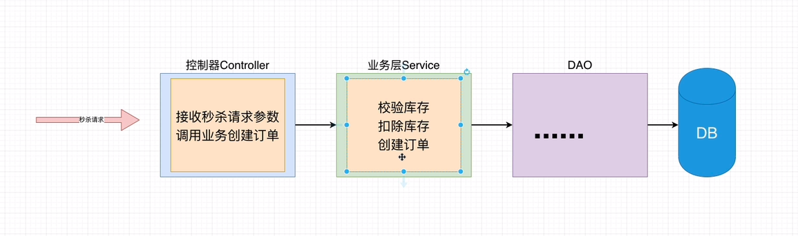

# 秒杀系统

- 作者  **小陈** 
- 微信 **chenxu521600**
- B站 **编程不良人**|**百知教育**
- 资料 http://www.baizhiedu.xin

## 1. 秒杀系统

### 1.1 秒杀场景

- 电商抢购限量商品
- 卖周董演唱会的门票
- 火车票抢座 12306
- ..........

### 1.2 为什么要做个系统

`如果你的项目流量非常小，完全不用担心有并发的购买请求，那么做这样一个系统意义不大。`但如果你的系统要像12306那样，接受高并发访问和下单的考验，那么你就需要一套完整的`流程保护措施`，来保证你系统在用户流量高峰期不会被搞挂了。

- 严格防止超卖：库存100件你卖了120件，等着辞职吧

- 防止黑产：防止不怀好意的人群通过各种技术手段把你本该下发给群众的利益全收入了囊中。

- 保证用户体验：高并发下，别网页打不开了，支付不成功了，购物车进不去了，地址改不了了。这个问题非常之大，涉及到各种技术，也不是一下子就能讲完的，甚至根本就没法讲完。

  

### 1.3 保护措施有哪些

- `乐观锁防止超卖`  ---核心基础
- `令牌桶限流`
- `Redis 缓存`
- `消息队列异步处理订单`
- ....


---

## 2. 防止超卖

毕竟，你网页可以卡住最多是大家没参与到活动，上网口吐芬芳，骂你一波。但是你要是卖多了，本该拿到商品的用户可就不乐意了，轻则投诉你，重则找漏洞起诉赔偿。让你吃不了兜着走。

### 2.1 数据库表

```sql
-- ----------------------------
-- Table structure for stock
-- ----------------------------
DROP TABLE IF EXISTS `stock`;
CREATE TABLE `stock` (
  `id` int(11) unsigned NOT NULL AUTO_INCREMENT,
  `name` varchar(50) NOT NULL DEFAULT '' COMMENT '名称',
  `count` int(11) NOT NULL COMMENT '库存',
  `sale` int(11) NOT NULL COMMENT '已售',
  `version` int(11) NOT NULL COMMENT '乐观锁，版本号',
  PRIMARY KEY (`id`)
) ENGINE=InnoDB DEFAULT CHARSET=utf8;

-- ----------------------------
-- Table structure for stock_order
-- ----------------------------
DROP TABLE IF EXISTS `stock_order`;
CREATE TABLE `stock_order` (
  `id` int(11) unsigned NOT NULL AUTO_INCREMENT,
  `sid` int(11) NOT NULL COMMENT '库存ID',
  `name` varchar(30) NOT NULL DEFAULT '' COMMENT '商品名称',
  `create_time` timestamp NOT NULL DEFAULT CURRENT_TIMESTAMP ON UPDATE CURRENT_TIMESTAMP COMMENT '创建时间',
  PRIMARY KEY (`id`)
) ENGINE=InnoDB DEFAULT CHARSET=utf8;
```

### 2.2 分析业务



### 2.3 开发代码

##### 1. DAO代码

```java
public interface StockDAO {
    Stock checkStock(Integer id);//校验库存
    void updateSale(Stock stock);//扣除库存
}

public interface OrderDAO {
    void createOrder(Order order);//创建订单
}

```

##### 2. Service 代码

```java
@Service
@Transactional
public class OrderServiceImpl implements OrderService {
    @Autowired
    private OrderDAO orderDAO;
    @Autowired
    private StockDAO stockDAO;
    @Override
    public Integer createOrder(Integer id) {
        //校验库存
        Stock stock = checkStock(id);
        //扣库存
        updateSale(stock);
        //下订单
        return createOrder(stock);
    }
    //校验库存
    private Stock checkStock(Integer id) {
        Stock stock = stockDAO.checkStock(id);
        if (stock.getSale().equals(stock.getCount())) {
            throw new RuntimeException("库存不足");
        }
        return stock;
    }
    //扣库存
    private void updateSale(Stock stock){
        stock.setSale(stock.getSale() + 1);
        stockDAO.updateSale(stock);
    }
    //下订单
    private Integer createOrder(Stock stock){
        Order order = new Order();
        order.setSid(stock.getId());
        order.setCreateDate(new Date());
        order.setName(stock.getName());
        orderDAO.createOrder(order);
        return order.getId();
    }
}
```

##### 5. Controller代码

```java
@RestController
@RequestMapping("stock")
public class StockController {
    @Autowired
    private OrderService orderService;
    //秒杀方法
    @GetMapping("sale")
    public String sale(Integer id){
        int orderId = 0;
        try{
            //根据商品id创建订单,返回创建订单的id
            orderId =  orderService.createOrder(id);
            System.out.println("orderId = " + orderId);
            return String.valueOf(orderId);
        }catch (Exception e){
            e.printStackTrace();
            return e.getMessage();
        }
    }
}
```

### 2.4 正常测试

`在正常测试下发现没有任何问题`

### 2.5 使用Jmeter进行压力测试

官网: https://jmeter.apache.org/   

#### 1. 介绍

`Apache JMeter是Apache组织开发的基于Java的压力测试工具`。用于对软件做压力测试，它最初被设计用于Web应用测试，但后来扩展到其他测试领域。 它可以用于测试静态和动态资源，例如静态文件、Java [小服务程序](https://baike.baidu.com/item/小服务程序/4148836)、CGI 脚本、Java 对象、数据库、FTP 服务器， 等等。JMeter 可以用于对服务器、网络或对象模拟巨大的负载，来自不同压力类别下测试它们的强度和分析整体性能。另外，JMeter能够对应用程序做功能/[回归测试](https://baike.baidu.com/item/回归测试/1925732)，通过创建带有断言的脚本来验证你的程序返回了你期望的结果

#### 2. 安装Jmeter

```markdown
# 1.下载jmeter
 	   https://jmeter.apache.org/download_jmeter.cgi
		 下载地址:https://mirror.bit.edu.cn/apache//jmeter/binaries/apache-jmeter-5.2.1.tgz
# 2.解压缩
		backups    ---用来对压力测试进行备份目录
    bin        ---Jmeter核心执行脚本文件
    docs	     ---官方文档和案例
    extras     ---额外的扩展
    lib        ---第三方依赖库
    licenses   ---说明
    printable_docs ---格式化文档

# 3.安装Jmeter
	  0.要求: 必须事先安装jdk环境
	  1.配置jmeter环境变量
	      export JMETER_HOME=/Users/chenyannan/dev/apache-jmeter-5.2
				export PATH=$SCALA_HOME/bin:$JAVA_HOME/bin:$GRADLE_HOME/bin:$PATH:$JMETER_HOME/bin
		2.是配置生效
			  source ~/.bash_profile
		3.测试jemeter
```

#### 3. Jmeter使用

Don't use GUI mode for load testing !, only for Test creation and Test debugging.

For load testing, use CLI Mode (was NON GUI):

​	`jmeter -n -t [jmx file] -l [results file] -e -o [Path to web report folder]`

& increase Java Heap to meet your test requirements:

Modify current env variable HEAP="-Xms1g -Xmx1g -XX:MaxMetaspaceSize=256m" in the jmeter batch file

Check : https://jmeter.apache.org/usermanual/best-practices.html

#### 4. Jmeter压力测试

```shell
jmeter -n -t [jmx file](jmx压力测试文件) -l [results file](结果输出的文件) -e -o [Path to web report folder](生成html版压力测试报告)
例如 jmeter -n -t kill.jmx -l kill.jtl -e -o kill
```

----

### 2.6 乐观锁解决商品超卖问题

鱿鱼悲观锁不太行，并发下效率太差

说明: 使用乐观锁解决商品的超卖问题,实际上是把主要防止超卖问题交给数据库解决,利用数据库中定义的`version字段`以及数据库中的`事务`实现在并发情况下商品的超卖问题。

#### 0.校验库存的方法(不变)

```java
//校验库存
private Stock checkStock(Integer id){
  Stock stock = stockDAO.checkStock(id);
  if(stock.getSale().equals(stock.getCount())){
    throw  new RuntimeException("库存不足!!!");
  }
  return stock;
}
```

```xml
<!--根据秒杀商品id查询库存-->
    <select id="checkStock" parameterType="int" resultType="Stock">
        select id,name,count,sale,version from stock
        where id = #{id}
    </select>
```

#### 1. 更新库存方法改造

```java
//更新库存
private void updateSale(Stock stock){
    //在sql层面完成销量的+1  和 版本号的+  并且根据商品id和版本号同时查询更新的商品
    //updateSale 返回类型为int 但是mapper又不是select mybatis默认返回修改了的行数
    int updateRows = stockDAO.updateSale(stock);
    if (updateRows==0){
        throw new RuntimeException("请购失败,请重试!!!");
    }
}
```

```xml
 <update id="updateSale" parameterType="Stock">
        update stock set 
            sale=sale+1,
            version=version+1
         where 
            id =#{id}
            and 
            version = #{version}
 </update>
```

#### 2. 创建订单(不变)

```java
//创建订单
private Integer createOrder(Stock stock){
  Order order = new Order();
  order.setSid(stock.getId()).setName(stock.getName()).setCreateDate(new Date());
  orderDAO.createOrder(order);
  return order.getId();
}
```

```xml
<!--创建订单-->
<insert id="createOrder" parameterType="Order" useGeneratedKeys="true" keyProperty="id" >
  insert into stock_order values(#{id},#{sid},#{name},#{createDate})
</insert>

```

#### 3. 完整的业务方法与Mapper.xml

- Service方法

  

- StockDAOMapper.xml

  

- OrderDAOMapper.xml

- 

----

## 3. 接口限流

`限流:是对某一时间窗口内的请求数进行限制，保持系统的可用性和稳定性，防止因流量暴增而导致的系统运行缓慢或宕机`

### 3.1 接口限流

在面临高并发的抢购请求时，我们如果不对接口进行限流，可能会对后台系统造成极大的压力。大量的请求抢购成功时需要调用下单的接口，过多的请求打到数据库会对系统的稳定性造成影响。

### 3.2 如何解决接口限流

常用的限流算法有`令牌桶`和和`漏桶(漏斗算法)`，而Google开源项目Guava中的RateLimiter使用的就是令牌桶控制算法。在开发高并发系统时有三把利器用来保护系统：`缓存`、`降级`和`限流`

- 缓存：缓存的目的是提升系统访问速度和增大系统处理容量
- 降级：降级是当服务器压力剧增的情况下，根据当前业务情况及流量对一些服务和页面有策略的降级，以此释放服务器资源以保证核心任务的正常运行
- 限流：限流的目的是通过对并发访问/请求进行限速，或者对一个时间窗口内的请求进行限速来保护系统，一旦达到限制速率则可以拒绝服务、排队或等待、降级等处理。

### 3.3 令牌桶和漏斗算法


- `漏斗算法:漏桶算法思路很简单，水（请求）先进入到漏桶里，漏桶以一定的速度出水，当水流入速度过大会直接溢出，可以看出漏桶算法能强行限制数据的传输速率。`

- `令牌桶算法:`最初来源于计算机网络。在网络传输数据时，为了防止网络拥塞，需限制流出网络的流量，使流量以比较均匀的速度向外发送。令牌桶算法就实现了这个功能，可控制发送到网络上数据的数目，**并允许突发数据的发送**。大小固定的令牌桶可自行以恒定的速率源源不断地产生令牌。如果令牌不被消耗，或者被消耗的速度小于产生的速度，令牌就会不断地增多，直到把桶填满。后面再产生的令牌就会从桶中溢出。最后桶中可以保存的最大令牌数永远不会超过桶的大小。这意味，面对瞬时大流量，该算法可以在短时间内请求拿到大量令牌，而且拿令牌的过程并不是消耗很大的事情。

  ==漏斗算法的特点是匀速，有突发请求时，即使性能允许也按固定的速率处理。==
  
  ==令牌桶算法允许突发数据的发送，支持一瞬间令牌桶中令牌被全部取空，任务同时执行==

### 3.4 令牌桶简单使用

##### 1. 项目中引入依赖

```xml
<dependency>
    <groupId>com.google.guava</groupId>
    <artifactId>guava</artifactId>
    <version>28.2-jre</version>
</dependency>
```

##### 2. 令牌桶算法的基本使用

```java
public class StockController {
    @Autowired
    private OrderService orderService;

    //创建令牌桶实例
    private RateLimiter rateLimiter =  RateLimiter.create(40);

    @GetMapping("sale")
    public String sale(Integer id){
        //1.没有获取到token请求一直知道获取到token 令牌
        //log.info("等待的时间: "+  rateLimiter.acquire());

        //2.设置一个等待时间,如果在等待的时间内获取到了token 令牌,则处理业务,如果在等待时间内没有获取到响应token则抛弃
        if(!rateLimiter.tryAcquire(2, TimeUnit.SECONDS)){
            System.out.println("当前请求被限流,直接抛弃,无法调用后续秒杀逻辑....");
            return "抢购失败!";
        }
        System.out.println("处理业务.....................");
        return "抢购成功";
    }
}
```

### 3.5使用令牌桶算法实现乐观锁+限流

##### 1. 使用令牌桶改造controller实现乐观锁+限流

```java
 //开发一个秒杀方法 乐观锁防止超卖+ 令牌桶算法限流
    @GetMapping("killtoken")
    public String killtoken(Integer id){
        System.out.println("秒杀商品的id = " + id);
        //加入令牌桶的限流措施
        if(!rateLimiter.tryAcquire(3, TimeUnit.SECONDS)){
            log.info("抛弃请求: 抢购失败,当前秒杀活动过于火爆,请重试");
            return "抢购失败,当前秒杀活动过于火爆,请重试!";
        }
        try {
            //根据秒杀商品id 去调用秒杀业务
            int orderId = orderService.kill(id);
            return "秒杀成功,订单id为: " + String.valueOf(orderId);
        }catch (Exception e){
            e.printStackTrace();
            return e.getMessage();
        }
    }
```


----

## 4. 隐藏秒杀接口

在前几次课程中，我们完成了防止超卖商品和抢购接口的限流，已经能够防止大流量把我们的服务器直接搞炸，这篇文章中，我们要开始关心一些细节问题。我们现在设计的系统还有一些问题: 

1. ` 我们应该在一定的时间内执行秒杀处理,不能再任意时间都接受秒杀请求。如何加入时间验证?`

2. `对于稍微懂点电脑的，又会动歪脑筋的人来说开始通过抓包方式获取我们的接口地址。然后通过脚本进行抢购怎么办?`

3. `秒杀开始之后如何限制单个用户的请求频率,即单位时间内限制访问次数?`

   

这个章节主要讲解秒杀系统中，关于抢购（下单）接口相关的单用户防刷措施，主要说几块内容：

- 限时抢购

- 抢购接口隐藏

- 单用户限制频率（单位时间内限制访问次数）

  

### 4.1 限时抢购的实现

使用Redis来记录秒杀商品的时间,对秒杀过期的请求进行拒绝处理!!

##### 	1. 启动redis服务


##### 2. 将秒杀商品放入Redis并设置超时

这里我们使用String类型 以kill + 商品id作为key 以商品id作为value,设置180秒超时(可随意设置时间)

```shell
127.0.0.1:6379> set kill1 1 EX 180
OK
```


##### 3. 抢购中加入时间控制

- 整合当前项目操作redis服务,这里使用spring-boot-starter-data-redis操作redis,引入依赖


```xml
<dependency>
  <groupId>org.springframework.boot</groupId>
  <artifactId>spring-boot-starter-data-redis</artifactId>
</dependency>
```

- 修改配置连接redis


```properties
spring.redis.port=6379
spring.redis.host=localhost
spring.redis.database=0
```

- 通过redis控制抢购超时的请求

  在service实现类中 导入RedisTemplate 完成redis的操作


```java
@Service
@Transactional
public class OrderServiceImpl implements OrderService {
  @Autowired
  private StringRedisTemplate stringRedisTemplate;
  
  @Override
    public Integer createOrder(Integer id) {
        //redis校验抢购时间
        if(!stringRedisTemplate.hasKey("kill" + id)){
            throw new RuntimeException("秒杀超时,活动已经结束啦!!!");
        }
        //校验库存
        Stock stock = checkStock(id);
        //扣库存
        updateSale(stock);
        //下订单
        return createOrder(stock);
    }
}
```

### 4.2 抢购接口隐藏

对于稍微懂点电脑的，又会动歪脑筋的人来说，点击F12打开浏览器的控制台，就能在点击抢购按钮后，获取我们抢购接口的链接。（手机APP等其他客户端可以抓包来拿到）一旦坏蛋拿到了抢购的链接，只要稍微写点爬虫代码，模拟一个抢购请求，就可以不通过点击下单按钮，直接在代码中请求我们的接口，完成下单。所以就有了成千上万的薅羊毛军团，写一些脚本抢购各种秒杀商品。

他们只需要在抢购时刻的000毫秒，开始不间断发起大量请求，觉得比大家在APP上点抢购按钮要快，毕竟人的速度又极限，更别说APP说不定还要经过几层前端验证才会真正发出请求。

所以我们需要将抢购接口进行隐藏，**抢购接口隐藏（接口加盐）的具体做法**：

- 每次点击秒杀按钮，先从服务器获取一个秒杀验证值（接口内判断是否到秒杀时间）。
- Redis以缓存用户ID和商品ID为Key，秒杀地址为Value缓存验证值
- 用户请求秒杀商品的时候，要带上秒杀验证值进行校验。
- 具体流程:


#### 1.库表结构


```sql
SET NAMES utf8mb4;
SET FOREIGN_KEY_CHECKS = 0;
-- ----------------------------
-- Table structure for user
-- ----------------------------
DROP TABLE IF EXISTS `user`;
CREATE TABLE `user` (
  `id` int(11) NOT NULL AUTO_INCREMENT COMMENT '主键',
  `name` varchar(80) DEFAULT NULL COMMENT '用户名',
  `password` varchar(40) DEFAULT NULL COMMENT '用户密码',
  PRIMARY KEY (`id`)
) ENGINE=InnoDB AUTO_INCREMENT=2 DEFAULT CHARSET=utf8;

SET FOREIGN_KEY_CHECKS = 1;
```


#### 2.控制器代码

```java
//生成md5值的方法
@RequestMapping("md5")
public String getMd5(Integer id, Integer userid) {
  String md5;
  try {
    md5 = orderService.getMd5(id, userid);
  }catch (Exception e){
    e.printStackTrace();
    return "获取md5失败: "+e.getMessage();
  }
  return "获取md5信息为: "+md5;
}
```


#### 3.业务层代码

```java
@Override
public String getMd5(Integer id, Integer userid) {
  //检验用户的合法性
  User user = userDAO.findById(userid);
  if(user==null)throw new RuntimeException("用户信息不存在!");
  log.info("用户信息:[{}]",user.toString());
  //检验商品的合法行
  Stock stock = stockDAO.checkStock(id);
  if(stock==null) throw new RuntimeException("商品信息不合法!");
  log.info("商品信息:[{}]",stock.toString());
  //生成hashkey
  String hashKey = "KEY_"+userid+"_"+id;
  //生成md5//这里!QS#是一个盐 随机生成
  String key = DigestUtils.md5DigestAsHex((userid+id+"!Q*jS#").getBytes());
  stringRedisTemplate.opsForValue().set(hashKey, key, 3600, TimeUnit.SECONDS);
  log.info("Redis写入：[{}] [{}]", hashKey, key);
  return key;
}
```


#### 4.DAO代码和Entity

```java
@Data
public class User {
    private Integer id;
    private String name;
    private String password;
}
```

```java
@Mapper
public interface UserDAO {
    User findById(Integer id);
}
```


```xml
<select id="findById" parameterType="Integer" resultType="User">
  select id,name,password from user where id=#{id}
</select>
```


#### 5.数据库添加用户记录


#### 6.查看商品信息


#### 7.启动项目访问生成md5接口


#### 8.携带验证值验证下单即可

##### 1.controller代码


```java
//开发一个秒杀方法 乐观锁防止超卖+ 令牌桶算法限流
    @GetMapping("killtokenmd5")
    public String killtoken(Integer id,Integer userid,String md5) {
        System.out.println("秒杀商品的id = " + id);
        //加入令牌桶的限流措施
        if (!rateLimiter.tryAcquire(3, TimeUnit.SECONDS)) {
            log.info("抛弃请求: 抢购失败,当前秒杀活动过于火爆,请重试");
            return "抢购失败,当前秒杀活动过于火爆,请重试!";
        }
        try {
            //根据秒杀商品id 去调用秒杀业务
            int orderId = orderService.kill(id,userid,md5);
            return "秒杀成功,订单id为: " + String.valueOf(orderId);
        } catch (Exception e) {
            e.printStackTrace();
            return e.getMessage();
        }
    }
```

##### 2.service代码

```java
@Override
public int kill(Integer id, Integer userid, String md5) {

  //校验redis中秒杀商品是否超时
  //        if(!stringRedisTemplate.hasKey("kill"+id))
  //            throw new RuntimeException("当前商品的抢购活动已经结束啦~~");

  //先验证签名
  String hashKey = "KEY_"+userid+"_"+id;
  String s = stringRedisTemplate.opsForValue().get(hashKey);
  if (s==null) throw  new RuntimeException("没有携带验证签名,请求不合法!");
  if (!s.equals(md5)) throw  new RuntimeException("当前请求数据不合法,请稍后再试!");

  //校验库存
  Stock stock = checkStock(id);
  //更新库存
  updateSale(stock);
  //创建订单
  return createOrder(stock);
}
```


### 4.3 单用户限制频率

假设我们做好了接口隐藏，但是像我上面说的，总有无聊的人会写一个复杂的脚本，先请求hash(md5)值，再立刻请求购买，如果你的app下单按钮做的很差，大家都要开抢后0.5秒才能请求成功，那可能会让脚本依然能够在大家前面抢购成功。

我们需要在做一个额外的措施，来限制单个用户的抢购频率。

其实很简单的就能想到用redis给每个用户做访问统计，甚至是带上商品id，对单个商品做访问统计，这都是可行的。

我们先实现一个对用户的访问频率限制，我们在用户申请下单时，检查用户的访问次数，超过访问次数，则不让他下单！

- 具体流程

  

#### 1.controller代码

```java
//开发一个秒杀方法 乐观锁防止超卖+ 令牌桶算法限流
@GetMapping("killtokenmd5limit")
public String killtokenlimit(Integer id,Integer userid,String md5) {
  //加入令牌桶的限流措施
  if (!rateLimiter.tryAcquire(3, TimeUnit.SECONDS)) {
    log.info("抛弃请求: 抢购失败,当前秒杀活动过于火爆,请重试");
    return "抢购失败,当前秒杀活动过于火爆,请重试!";
  }
  try {
    //加入单用户限制调用频率
    int count = userService.saveUserCount(userid);
    log.info("用户截至该次的访问次数为: [{}]", count);
    boolean isBanned = userService.getUserCount(userid);
    if (isBanned) {
      log.info("购买失败,超过频率限制!");
      return "购买失败，超过频率限制!";
    }
    //根据秒杀商品id 去调用秒杀业务
    int orderId = orderService.kill(id,userid,md5);
    return "秒杀成功,订单id为: " + String.valueOf(orderId);
  } catch (Exception e) {
    e.printStackTrace();
    return e.getMessage();
  }
}
```


#### 2.Service接口及实现

**接口**

```java
public interface UserService {
    //向redis中写入用户访问次数
    int saveUserCount(Integer userId);
    //判断单位时间调用次数
    boolean getUserCount(Integer userId);
}
```


**实现**

```java
@Service
@Transactional
@Slf4j
public class UserServiceImpl  implements UserService{

    @Autowired
    private StringRedisTemplate stringRedisTemplate;

    @Override
    public int saveUserCount(Integer userId) {
        //根据不同用户id生成调用次数的key
        String limitKey = "LIMIT" + "_" + userId;
        //获取redis中指定key的调用次数
        String limitNum = stringRedisTemplate.opsForValue().get(limitKey);
        int limit =-1;
        if (limitNum == null) {
            //第一次调用放入redis中设置为0
            stringRedisTemplate.opsForValue().set(limitKey, "0", 3600, TimeUnit.SECONDS);
        } else {
            //不是第一次调用每次+1
            limit = Integer.parseInt(limitNum) + 1;
            stringRedisTemplate.opsForValue().set(limitKey, String.valueOf(limit), 3600, TimeUnit.SECONDS);
        }
        return limit;//返回调用次数
    }

    @Override
    public boolean getUserCount(Integer userId) {
        String limitKey = "LIMIT"+ "_" + userId;
        //跟库用户调用次数的key获取redis中调用次数
        String limitNum = stringRedisTemplate.opsForValue().get(limitKey);
        if (limitNum == null) {
            //为空直接抛弃说明key出现异常
            log.error("该用户没有访问申请验证值记录，疑似异常");
            return true;
        }
        return Integer.parseInt(limitNum) > 10; //false代表没有超过 true代表超过
    }
}

```


#### 3.测试调用


# My秒杀

## 添加商品

### addstock

```java
//添加商品
@GetMapping("addstock")
public String addStock(String name, Integer count){
    try{
        int stockId = stockService.addStock(name,count);
        return "添加商品成功,商品id为"+stockId;
    } catch (Exception e){
        e.printStackTrace();
        return e.getMessage();
    }
}
```

插入数据后 在redis中添加对应的键值对

xml文件中   useGeneratedKeys="true" 主键自增  keyProperty="id"将数据库中数据赋值给对象的对应属性

```java
public int addStock(String name, Integer count) {
    Stock stock = new Stock();
    stock.setName(name).setCount(count).setSale(0).setVersion(0);
    stockDAO.addStock(stock);
    int stockId = stock.getId();//通过xml中keyProperty="id"获取数据库中信息
    stringRedisTemplate.opsForValue().set("stock:"+stock.getId(),stock.getCount()+"");
    return stockId; 
}
```

### addstockplus

将 stock:id 分组为 stock:id :组数   为以后的分段锁打下基础

```java
@Override
public int addStockPlus(String name, Integer count) {
    Stock stock = new Stock();
    stock.setName(name);
    stock.setSale(0);
    stock.setCount(count);
    stock.setVersion(0);
    stockDAO.addStock(stock);
    //分组数
    int stockRedisFrequency = stock.getCount()/REDIS_SINGLE_CAPACITY;
    stringRedisTemplate.opsForValue().set(StockUtil.STOCK+stock.getId(), stock.getCount()+"");
    for(int i = 0; i < stockRedisFrequency; i++){
        String stockId = StockUtil.STOCK+stock.getId()+":"+i;
        stringRedisTemplate.opsForValue().set(stockId, REDIS_SINGLE_CAPACITY+"");
    }
    if(stock.getCount()%REDIS_SINGLE_CAPACITY != 0) {
        stringRedisTemplate.opsForValue().set(StockUtil.STOCK+stock.getId()+":"+stockRedisFrequency, stock.getCount()%REDIS_SINGLE_CAPACITY+"");
        stockRedisFrequency++;
    }
    stringRedisTemplate.opsForValue().set(StockUtil.STOCK_FREQUENCY +stock.getId(), stockRedisFrequency+"");
    return stock.getId();
}
```


## Redis分布式锁

**加锁**

通过setIfAbsent 若不存在keyLock（无锁），则设置锁；若存在keyLock 则抛弃请求

**解锁**

将keyLock删除，在finally中删除，且注意不能说客户端1的请求将客户端2的锁给删除掉。

keyLock的 value设置为 clientId 确保是随机值，删除时keyLock的 value要对的上clientId 

**不死锁**

有一个客户端在持有锁的期间崩溃而没有主动解锁，造成死锁。

所以要对keyLock设置失效时间，保证后续其他客户端能加锁。

```java
@GetMapping("killredis")
public String killRedis(Integer id) {
    System.out.println("秒杀商品的id = " + id);
    try {
        orderService.killRedis(id);
        return "秒杀成功";
    } catch (Exception e) {
        e.printStackTrace();
        return e.getMessage();
    }
}
```

使用redis的分布式锁 锁的失效时间若为1s 则会有大量请求拿不到锁而被丢弃，最终下单数远小于请求数（200请求下单188），把失效时间改小一点会有点用（2000请求下单331）。

```java
@Override
public void killRedis(Integer id) {
    Stock stock = checkStockInRedis(id);
    //更新库存
    updateSale(stock);
    //创建订单
    createOrder(stock);
}


public Stock checkStockInRedis(Integer id){
    String clientId = UUID.randomUUID().toString();
    String stockId = "stock:"+id;
    //分布式锁
    String lockKey = "stock:lock:"+id;
    if(!stringRedisTemplate.hasKey(stockId)){
        throw new RuntimeException("库存中无该类商品");
    }
    if(Integer.valueOf(stringRedisTemplate.opsForValue().get(stockId))<=0){
        throw new RuntimeException("库存不足");
    }
    //若不存在lockKey则添加lockKey（上锁），若存在则返回false
    if(!stringRedisTemplate.opsForValue().setIfAbsent(lockKey,clientId,50,TimeUnit.MILLISECONDS)){
        throw new RuntimeException("抢购失败，请重试");
    }

    try{
        stringRedisTemplate.opsForValue().increment(stockId,-1);
        log.info("当前redis库存："+stringRedisTemplate.opsForValue().get(stockId));

        Stock stock = stockDAO.checkStock(id);
        log.info("查询MYSQL次数：[{}]", ++visitMysql);
        if(stock.getSale().equals(stock.getCount())){
            throw  new RuntimeException("库存不足!!!");
        }
        return stock;

    }catch (Exception e){
        throw e;
    }finally {
        if(clientId.equals(stringRedisTemplate.opsForValue().get(lockKey))){
            stringRedisTemplate.delete(lockKey);
        }
    }
}
```

### **分段锁**

https://mp.weixin.qq.com/s/RLeujAj5rwZGNYMD0uLbrg

把 stock:id 拆分为 stock:id :n的形式，将锁也分开，分段锁减小了锁的粒度，减少了锁冲突（2000请求下单469，但是redis中库存置0了，上面的两次测试都剩了好多，所以这次是在更新库存时由于乐观锁产生冲突）

哇不过既然有redis分布锁了，就不需要MySQL乐观锁了？去掉乐观后（2000请求，1000下单完全消费，无超卖现象），虽然第二次判断分组后库存时，仍有一部分数据被抛弃，但是在2000的请求下 会把每一组都消费掉。

```java
public Stock checkStockInRedis(Integer id){
    String clientId = UUID.randomUUID().toString();
    //分组数
    int groupNum = Integer.parseInt(stringRedisTemplate.opsForValue().get(StockUtil.STOCK_FREQUENCY + id));
    //生成[0,groupNum)的随机整数
    int randomId = new Random().nextInt(groupNum);

    String stockId = StockUtil.STOCK + id;
    String groupId = stockId+":"+randomId;
    //分布式锁
    String lockKey =  StockUtil.STOCKLOCK + id + ":" + randomId;

    if(!stringRedisTemplate.hasKey(stockId)){
        throw new RuntimeException("库存中无该类商品");
    }
    if(Integer.valueOf(stringRedisTemplate.opsForValue().get(stockId))<=0){
        throw new RuntimeException("库存不足");
    }
    //若不存在lockKey则添加lockKey（上锁），若存在则返回false
    if(!stringRedisTemplate.opsForValue().setIfAbsent(lockKey,clientId,50,TimeUnit.MILLISECONDS)){
        throw new RuntimeException("抢购失败，请重试");
    }

    try{
        //上面判断的是整体的库存，这里判断的是分组后的库存
        int num =  Integer.valueOf(stringRedisTemplate.opsForValue().get(groupId));
        if(num<=0){
            throw new RuntimeException("库存不足！！！");
        }
        stringRedisTemplate.opsForValue().increment(stockId,-1);
        stringRedisTemplate.opsForValue().increment(groupId,-1);
        log.info("当前redis库存："+stringRedisTemplate.opsForValue().get(stockId));

        Stock stock = stockDAO.checkStock(id);
        log.info("查询MYSQL次数：[{}]", ++visitMysql);
        if(stock.getSale().equals(stock.getCount())){
            throw  new RuntimeException("库存不足!!!");
        }
        return stock;

    }catch (Exception e){
        throw e;
    }finally {
        if(clientId.equals(stringRedisTemplate.opsForValue().get(lockKey))){
            stringRedisTemplate.delete(lockKey);
        }
    }
}
```

## Redis分布式锁+RabbitMQ

添加RabbitMQ依赖

```xml
<!-- 引入与rabbitmq集成依赖 -->
<dependency>
    <groupId>org.springframework.boot</groupId>
    <artifactId>spring-boot-starter-amqp</artifactId>
</dependency>
<!-- 这玩意是啥？ -->
<dependency>
    <groupId>org.apache.commons</groupId>
    <artifactId>commons-lang3</artifactId>
    <version>3.8</version>
</dependency>
```

```properties
spring.rabbitmq.listener.simple.acknowledge-mode=manual #手动确认消息消费
spring.rabbitmq.listener.simple.prefetch=1
```


```java
//开发秒杀方法  使用redis分布式锁+乐观锁+rabbitmq防止超卖
@GetMapping("killredismq")
public String killRedisMq(Integer id){
    try {
        orderService.killRedisMq(id);
        return "秒杀成功";
    } catch (Exception e) {
        e.printStackTrace();
        return e.getMessage();
    }
}
```

```java
@Override
public void killRedisMq(Integer id) throws JsonProcessingException{
    checkStockInRedisRabbitmq(id);
}
```


先对redis分布式锁进行校验，若校验成功则扣除redis库存，并将消息送入MQ中

**确保redis和mysql的数据一致性（分布式事务）**

要保证只要扣除了redis库存，mysql必须也扣除库存。

通过RabbitMQ的消息确认机制，若mysql库存扣除了，才确认消息被消费。若确认失败则重新入队，等待下一次消费。保证了redis扣除一个库存，产生一个消息，mysql扣除库存，MQ消费一个消息。

**确保mysql和消息确认的数据一致性（分布式事务） 消息的幂等性**

若mysql库存扣除了，想要进行消息确认时，因为网络问题导致消息未被确认，消息重新入队，导致消息重复消费，一个消息修改两次mysql库存。

所以对每个消息设置一个messageId，当mysql库存扣除后，将当前消息的messageId写入redis。当消息重复消费时，判断redis中是否存在当前消息的messageId，若存在说明这是个重复消费的消息，直接确认消费即可。

```java
public void checkStockInRedisRabbitmq(Integer id) throws JsonProcessingException {

    String clientId = UUID.randomUUID().toString();
    //分组数
    int groupNum = Integer.parseInt(stringRedisTemplate.opsForValue().get(StockUtil.STOCK_FREQUENCY + id));
    //生成[0,groupNum)的随机整数
    int randomId = new Random().nextInt(groupNum);

    String stockId = StockUtil.STOCK + id;
    String groupId = stockId+":"+randomId;
    //分布式锁
    String lockKey =  StockUtil.STOCKLOCK + id + ":" + randomId;

    if(!stringRedisTemplate.hasKey(stockId)){
        throw new RuntimeException("库存中无该类商品");
    }
    if(Integer.valueOf(stringRedisTemplate.opsForValue().get(stockId))<=0){
        throw new RuntimeException("库存不足");
    }
    //若不存在lockKey则添加lockKey（上锁），若存在则返回false
    if(!stringRedisTemplate.opsForValue().setIfAbsent(lockKey,clientId,50,TimeUnit.MILLISECONDS)){
        throw new RuntimeException("抢购失败，请重试");
    }

    try{
        //上面判断的是整体的库存，这里判断的是分组后的库存
        int num =  Integer.valueOf(stringRedisTemplate.opsForValue().get(groupId));
        if(num<=0){
            throw new RuntimeException("库存不足！！！");
        }
        stringRedisTemplate.opsForValue().increment(stockId,-1);
        stringRedisTemplate.opsForValue().increment(groupId,-1);
        log.info("当前redis库存："+stringRedisTemplate.opsForValue().get(stockId));

        String msgJson = objectMapper.writeValueAsString(id);
        Message message = MessageBuilder
                .withBody(msgJson.getBytes())
                .setContentType(MessageProperties.CONTENT_TYPE_JSON)
                .setMessageId(UUID.randomUUID().toString())
                .build();
        rabbitTemplate.convertAndSend("deletestock",message);
    }catch (Exception e){
        throw e;
    }finally {
        if(clientId.equals(stringRedisTemplate.opsForValue().get(lockKey))){
            stringRedisTemplate.delete(lockKey);
        }
    }
}
```


```java
@RabbitListener(queuesToDeclare = @Queue("deletestock"))
public void deleteStockReceive1(Channel channel, Message message) throws IOException {
    try{
        String msgId = message.getMessageProperties().getMessageId();
        Integer id = objectMapper.readValue(message.getBody(),Integer.class);


        if(stringRedisTemplate.hasKey("msgIds")&&stringRedisTemplate.opsForSet().isMember("msgIds", msgId)){
            // 消息即将重复消费，直接确认消费并返回。实现写入数据库和消息被成功消费 的分布式事务
            channel.basicAck(message.getMessageProperties().getDeliveryTag(), false);
            return;
        }

        Stock stock = checkStock(id);
        updateSale(stock);
        createOrder(stock);
        stringRedisTemplate.opsForSet().add("msgIds",msgId);
        stringRedisTemplate.expire("msgIds",2,TimeUnit.MINUTES);
        channel.basicAck(message.getMessageProperties().getDeliveryTag(), false);
    }catch (IOException e){
        channel.basicNack(message.getMessageProperties().getDeliveryTag(),false, true);
        e.printStackTrace();
    }
}
```

### 使用Redisson的分布式锁

**配置**

https://blog.csdn.net/lms1719/article/details/83652578

1.在项目的pom.xml文件下，引入Redis和Redisson在Spring Boot 下的相关Jar包依赖。

```xml
<!--spring boot stater data redis-->
<dependency>
    <groupId>org.springframework.boot</groupId>
    <artifactId>spring-boot-starter-data-redis</artifactId>
</dependency>

<!--redisson实现分布式锁-->
<dependency>
    <groupId>org.redisson</groupId>
    <artifactId>redisson</artifactId>
    <version>3.8.2</version>
    <optional>true</optional>
</dependency>
<dependency>
    <groupId>org.redisson</groupId>
    <artifactId>redisson-spring-boot-starter</artifactId>
    <version>3.8.2</version>
</dependency>
```

2.在项目的resources目录下，添加redisson的配置文件（这里使用yaml格式的配置文件redisson-config.yml，文件名可自己定， 文件的示例配置如下）。

```yml
#Redisson配置
singleServerConfig:
  address: "redis://39.107.143.192:6379"
  password: 123456
  clientName: null
  database: 0 #选择使用哪个数据库0~15
  idleConnectionTimeout: 10000
  pingTimeout: 1000
  connectTimeout: 10000
  timeout: 3000
  retryAttempts: 3
  retryInterval: 1500
  reconnectionTimeout: 3000
  failedAttempts: 3
  subscriptionsPerConnection: 5
  subscriptionConnectionMinimumIdleSize: 1
  subscriptionConnectionPoolSize: 50
  connectionMinimumIdleSize: 32
  connectionPoolSize: 64
  dnsMonitoringInterval: 5000
  #dnsMonitoring: false

threads: 0
nettyThreads: 0
codec:
  class: "org.redisson.codec.JsonJacksonCodec"
transportMode: "NIO"

```

3.添加Redisson的配置参数读取类RedissonConfig

```java
package com.dbfor.redis.config;

import org.redisson.Redisson;
import org.redisson.api.RedissonClient;
import org.redisson.config.Config;
import org.springframework.context.annotation.Bean;
import org.springframework.context.annotation.Configuration;

import java.io.IOException;

@Configuration
public class RedissonConfig {

    @Bean
    public RedissonClient redisson() throws IOException {
        // 本例子使用的是yaml格式的配置文件，读取使用Config.fromYAML，如果是Json文件，则使用Config.fromJSON
        Config config = Config.fromYAML(RedissonConfig.class.getClassLoader().getResource("redisson-config.yml"));
        return Redisson.create(config);
    }
}
```

4.测试

```java
@Autowired
private RedissonClient redissonClient;

@GetMapping("redisson")
public String redisson(){
    RBucket<String> keyObj = redissonClient.getBucket("k1");
    keyObj.set("v1236");
    return "redisson ok";
}
```


**使用**

原本分布式锁遇到锁冲突时会返回“抢购失败，请重试”，抛弃这个请求

使用redisson的tryLock方法，锁冲突时允许一定时间的自旋，使请求遇到锁冲突时不会被直接抛弃

```java
    public void checkStockInRedisRabbitmq(Integer id) throws JsonProcessingException, InterruptedException {

        String clientId = UUID.randomUUID().toString();
        //分组数
        int groupNum = Integer.parseInt(stringRedisTemplate.opsForValue().get(StockUtil.STOCK_FREQUENCY + id));
        //生成[0,groupNum)的随机整数
        int randomId = new Random().nextInt(groupNum);

        String stockId = StockUtil.STOCK + id;
        String groupId = stockId+":"+randomId;
        //分布式锁
        String lockKey =  StockUtil.STOCKLOCK + id + ":" + randomId;
        RLock lock = redissonClient.getLock(lockKey);


        if(!stringRedisTemplate.hasKey(stockId)){
            throw new RuntimeException("库存中无该类商品");
        }
        if(Integer.valueOf(stringRedisTemplate.opsForValue().get(stockId))<=0){
            throw new RuntimeException("库存不足");
        }
//        //若不存在lockKey则添加lockKey（上锁），若存在则返回false
//        if(!stringRedisTemplate.opsForValue().setIfAbsent(lockKey,clientId,50,TimeUnit.MILLISECONDS)){
//            throw new RuntimeException("抢购失败，请重试");
//        }

        try{
            //参数1：获取锁的自旋时间 参数2：锁失效时间
            boolean res = lock.tryLock(1,2,TimeUnit.SECONDS);
            if(res){
                //上面判断的是整体的库存，这里判断的是分组后的库存
                int num =  Integer.valueOf(stringRedisTemplate.opsForValue().get(groupId));
                if(num<=0){
                    throw new RuntimeException("库存不足！！！");
                }
                stringRedisTemplate.opsForValue().increment(stockId,-1);
                stringRedisTemplate.opsForValue().increment(groupId,-1);
                log.info("当前redis库存："+stringRedisTemplate.opsForValue().get(stockId));

                String msgJson = objectMapper.writeValueAsString(id);
                Message message = MessageBuilder
                        .withBody(msgJson.getBytes())
                        .setContentType(MessageProperties.CONTENT_TYPE_JSON)
                        .setMessageId(UUID.randomUUID().toString())
                        .build();
                rabbitTemplate.convertAndSend("deletestock",message);
            }
        }catch (Exception e){
            throw e;
        }finally {
            lock.unlock();
        }
    }
```

## 订单30分钟不支付自动取消

**实体类**

作为DelayedQueue的元素，需要实现Delayed接口，重写getDelay()和compareTo()方法，前者获取剩余时间，后者作为队列的排序，剩余时间少的在队头。

expireTime 为 30分钟+系统当前秒数

状态0为未支付，状态1为已取消，状态2为已支付

```java
package com.baizhi.entity;

import lombok.AllArgsConstructor;
import lombok.Data;
import lombok.NoArgsConstructor;
import lombok.ToString;
import lombok.experimental.Accessors;

import java.util.Date;
import java.util.concurrent.Delayed;
import java.util.concurrent.TimeUnit;

@Data
@AllArgsConstructor
@NoArgsConstructor
@ToString
@Accessors(chain=true)
public class Order implements java.util.concurrent.Delayed{
    private Integer id;
    private Integer sid;
    private String name;
    private Date createDate;
    private Long expireTime;
    private Integer sataus;
    
    @Override
    public long getDelay(TimeUnit unit) {
        return expireTime - System.currentTimeMillis();
    }

    @Override
    public int compareTo(java.util.concurrent.Delayed o) {
        return Long.valueOf(this.expireTime).compareTo(Long.valueOf(((Order) o).expireTime));
    }
}

```

**Controller+Impl**

createOrderRelease()  将order设置过期时间，并加载到队列中  

`static DelayQueue<Order> queue = new DelayQueue<Order>();`

redis 中 使用hash数据格式 key为 DELAY-ORDERS   hashkey为orderid  value为过期时间

```java
@GetMapping("killrelease")
public String killRelease(Integer id){
    try {
        orderService.killrelease(id);
        return "秒杀成功";
    } catch (Exception e) {
        e.printStackTrace();
        return e.getMessage();
    }
}
```

```java
public void killrelease(Integer id) {
    Stock stock = checkStock(id);
    //更新库存
    updateSale(stock);
    //创建订单
    createOrderRelease(stock);
}
```

```java
private Integer createOrderRelease(Stock stock){
    Order order = new Order();
    order.setSid(stock.getId()).setName(stock.getName()).setCreateDate(new Date()).setSataus(0).setExpireTime(System.currentTimeMillis()+10000L);
    queue.add(order);
    orderDAO.createOrder(order);
    stringRedisTemplate.opsForHash().put("DELAY-ORDERS",order.getId().toString(),order.getExpireTime().toString());
    log.info("delayQueue、redis插入order："+order.getId());
    return order.getId();
}
```


**实现InitializingBean**

作为bean的生命周期一部分，bean初始化结束后，重写afterPropertiesSet方法，对其DIY

首先加载因服务器崩溃，滞留在redis中的数据，将其重新加入到delayedQueue中。

再开启一个线程 只要delayedQueue中元素超时，即可通过take获取到，判断他的状态。

若已支付则无事发生，因为支付操作时已经将redis中对应orderId删除。

若未支付，则将状态码置1，写入数据库，表示该订单已超时取消。同时删除redis中对应orderId

```java
public class OrderServiceImpl implements OrderService , InitializingBean {
    ·····
   @Override
    public void afterPropertiesSet() throws Exception {
        Map<Object,Object> map = stringRedisTemplate.opsForHash().entries("DELAY-ORDERS");
        log.info("服务器崩溃加载redis中数据");
        for (Object key : map.keySet()) {
            Integer orderId = Integer.parseInt(String.valueOf(key));
            Long expireTime = Long.valueOf(String.valueOf(map.get(key)));
            //注意实体类和数据库字段匹配问题
            Order order = orderDAO.findOrderById(orderId);
            order.setExpireTime(expireTime);
            queue.add(order);
            log.info("服务器崩溃加载redis中数据:"+orderId);
        }
        new Thread(()->{
            log.info("开启自动取消订单");
            while (true){
                try {
                    Order order = queue.take();
                    int orderId = order.getId();
                    Integer status = orderDAO.findStatusById(orderId);
                    log.info("orderId："+order.getId()+"当前status："+status);
                    //如果status为2 即已支付，不需后续操作
                    if(status==2){continue;}
                    //更待status为1
                    orderDAO.updateStatus(orderId);
                    //删除redis中订单id
                    //stringRedisTemplate.opsForSet().remove("DELAY-ORDERS",orderId+"");
                    stringRedisTemplate.opsForHash().delete("DELAY-ORDERS",orderId+"");
                    log.info("订单：" + order.getId() + "超时取消");
                } catch (InterruptedException e) {
                    e.printStackTrace();
                }
            }
        }).start();
    }
   ···
}
```

**支付过程**

记得支付时，将redis中orderid删除

```java
@GetMapping("pay")
public String pay(Integer orderid){
    try {
        orderService.pay(orderid);
        return "支付成功";
    } catch (Exception e) {
        e.printStackTrace();
        return e.getMessage();
    }
}
```

```java
@Override
public void pay(Integer orderId) {
    stringRedisTemplate.opsForHash().delete("DELAY-ORDERS",orderId+"");
    log.info("支付成功");
    orderDAO.pay(orderId);
}
```

**mapper**

findOrderById 中 注意当实体类属性和数据库字段不一致时，利用别名as，可以把查找到的数据库中字段映射到实体类属性上。

```xml
<!--创建订单-->
<insert id="createOrder" parameterType="Order" useGeneratedKeys="true" keyProperty="id" >
    insert into stock_order values(#{id},#{sid},#{name},#{createDate},#{sataus})
</insert>

<select id="findStatusById" parameterType="Integer" resultType="Integer">
    select status from stock_order where id = #{id}
</select>

<update id="updateStatus" parameterType="Integer">
    update stock_order set status=1 where id = #{id}
</update>

<update id="pay" parameterType="Integer">
    update stock_order set status=2 where id = #{id}
</update>

<select id="findOrderById" parameterType="Integer" resultType="Order">
    select id,sid,name,create_time as createDate,status from stock_order where id = #{id}
</select>
```

## 问题

并发下单时，Redis不加锁+MySQL乐观锁 是否也满足要求？

1000个请求 100库存条件下

使用killredis方法，若不加锁 会先数到100（不加锁会多鼠几个）对后面的请求直接抛弃，若我们对mysql扣除库存时，使用乐观锁 对失败的请求直接抛弃，会造成进来100个请求  乐观锁抛弃50个请求，东西肯定卖不完。

使用kill方法，会进来1000个请求 东西卖的完

